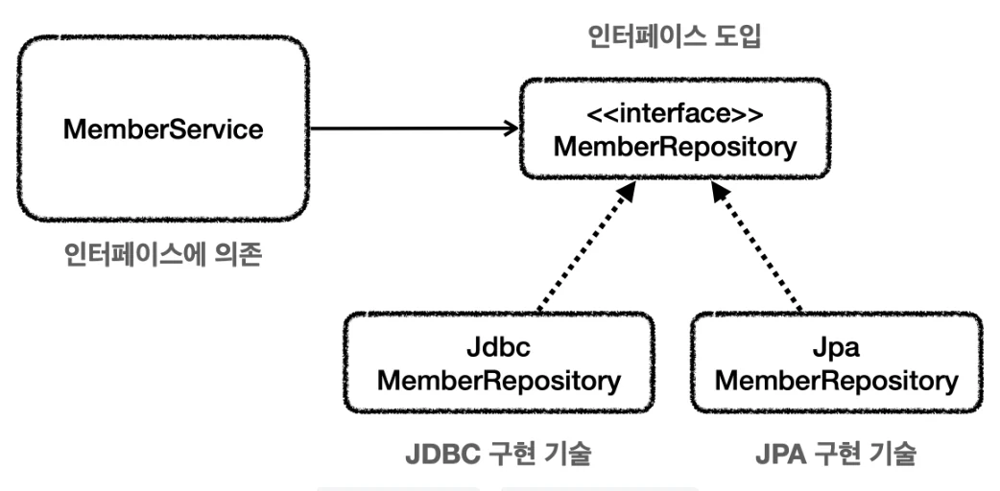
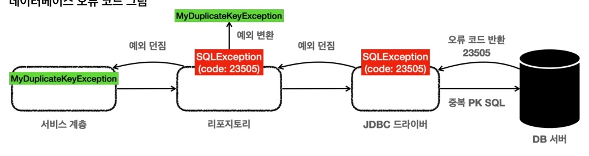
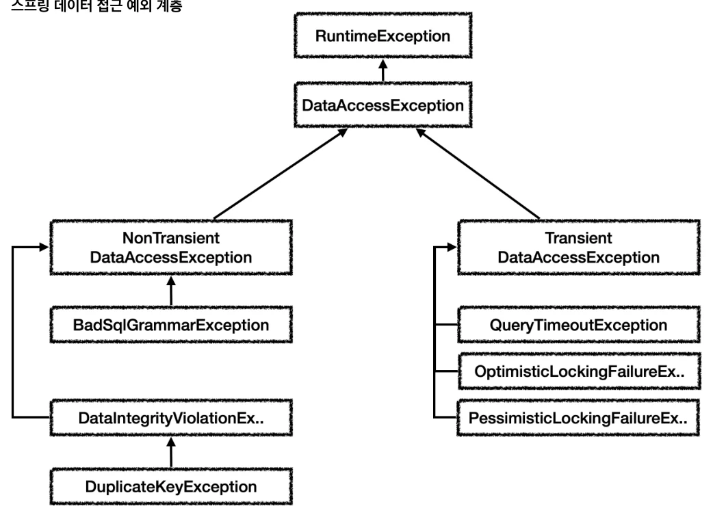

# [스프링 DB 1편 - 데이터 접근 핵심 원리] 6. 스프링과 문제 해결 - 예외 처리, 반복

## 원문

https://ch010104.tistory.com/299

## 노트 유형

`tutorial`

## 학습 목표 및 맥락

이전 강의에서 트랜잭션 추상화와 트랜잭션 AOP를 적용해 서비스 계층의 순수성을 지켰다. 이번에는 예외 처리와 JDBC 반복 코드까지 정리해, 구현 기술이 바뀌어도 서비스 계층을 최대한 변경 없이 유지하는 방법을 학습한다.

SQLException을 런타임 예외로 전환해 예외 누수를 막는다.

## 원문 기반 학습 정리

### 1. 학습 목표

이전 강의에서 트랜잭션 추상화와 트랜잭션 AOP를 적용해 서비스 계층의 순수성을 지켰다. 이번에는 예외 처리와 JDBC 반복 코드까지 정리해, 구현 기술이 바뀌어도 서비스 계층을 최대한 변경 없이 유지하는 방법을 학습한다.

핵심 흐름은 다음과 같다.

체크 예외가 인터페이스를 오염시키는 문제를 확인한다.

SQLException을 런타임 예외로 전환해 예외 누수를 막는다.

복구 가능한 DB 오류는 의미 있는 사용자 정의 예외로 구분한다.

스프링의 DataAccessException 예외 추상화와 변환기를 사용한다.

JdbcTemplate으로 JDBC 반복 코드를 제거한다.

### 2. 체크 예외와 인터페이스

서비스 계층은 특정 구현 기술에 의존하지 않고 순수하게 유지하는 것이 좋다. 이를 위해 MemberRepository 인터페이스를 도입하고, 구현체는 DI로 교체할 수 있게 만든다.

### 인터페이스 도입

MemberRepository 인터페이스 도입

```text
package hello.jdbc.repository;

import hello.jdbc.domain.Member;

public interface MemberRepository {
    Member save(Member member);
    Member findById(String memberId);
    void update(String memberId, int money);
    void delete(String memberId);
}
```

MemberService는 이 순수 인터페이스에만 의존한다. 따라서 JDBC 구현체를 JPA, MyBatis 등 다른 구현체로 교체해도 서비스 코드를 바꾸지 않는 것이 목표다.

### 체크 예외가 만드는 문제

문제는 JDBC의 SQLException이 체크 예외라는 점이다. 구현체가 체크 예외를 던지려면 인터페이스 메서드에도 먼저 해당 예외를 선언해야 한다.

```text
package hello.jdbc.repository;

import hello.jdbc.domain.Member;
import java.sql.SQLException;

public interface MemberRepositoryEx {
    Member save(Member member) throws SQLException;
    Member findById(String memberId) throws SQLException;
    void update(String memberId, int money) throws SQLException;
    void delete(String memberId) throws SQLException;
}
```

MemberRepositoryV3 구현체가 SQLException을 던지려면, 부모 인터페이스인 MemberRepositoryEx에도 먼저 throws SQLException 선언이 있어야 한다.

### 왜 문제가 되는가?

구현체 메서드가 throws SQLException을 선언하려면 부모 인터페이스도 throws SQLException을 선언해야 한다.

구현 클래스가 선언할 수 있는 예외는 부모 타입이 던지는 예외와 같거나 하위 타입이어야 한다.

결국 구현 기술인 JDBC의 SQLException이 인터페이스까지 전파된다.

이후 JDBC를 JPA 같은 다른 기술로 변경하면 인터페이스 자체도 변경해야 한다.

구현 클래스의 메서드에 선언할 수 있는 예외는 부모 타입에서 던진 예외와 같거나 하위 타입이어야 한다. 예를 들어 인터페이스 메서드가 throws Exception을 선언하면 구현체의 throws SQLException은 가능하다.

⚠️ 인터페이스의 목적은 구현체 교체인데, SQLException 같은 구현 기술 종속 체크 예외가 인터페이스에 노출되면 인터페이스도 JDBC에 종속된다.

### 런타임 예외는 자유롭다

런타임 예외는 인터페이스에 별도로 선언하지 않아도 된다. 따라서 인터페이스를 특정 기술에 종속시키지 않고, 서비스 계층은 예외를 처리할 필요가 있을 때만 선택적으로 처리할 수 있다.

### 3. 런타임 예외 적용

체크 예외인 SQLException을 리포지토리 내부에서 런타임 예외로 변환한다. 그러면 서비스 계층으로 SQLException이 누수되지 않는다.

### MyDbException 만들기

```java
package hello.jdbc.repository.ex;

public class MyDbException extends RuntimeException {

    public MyDbException() {
    }

    public MyDbException(String message) {
        super(message);
    }

    public MyDbException(String message, Throwable cause) {
        super(message, cause);
    }

    public MyDbException(Throwable cause) {
        super(cause);
    }
}
```

RuntimeException을 상속했으므로 MyDbException은 언체크 예외다. 호출자는 throws MyDbException을 강제로 선언하지 않아도 된다.

### MemberRepositoryV4_1 - 단순 예외 전환

```java
package hello.jdbc.repository;

import hello.jdbc.domain.Member;
import hello.jdbc.repository.ex.MyDbException;
import lombok.extern.slf4j.Slf4j;
import org.springframework.jdbc.datasource.DataSourceUtils;
import org.springframework.jdbc.support.JdbcUtils;

import javax.sql.DataSource;
import java.sql.*;
import java.util.NoSuchElementException;

/**
 * 예외 누수 문제 해결
 * 체크 예외를 런타임 예외로 변경
 * MemberRepository 인터페이스 사용
 * throws SQLException 제거
 */
@Slf4j
public class MemberRepositoryV4_1 implements MemberRepository {

    private final DataSource dataSource;

    public MemberRepositoryV4_1(DataSource dataSource) {
        this.dataSource = dataSource;
    }

    @Override
    public Member save(Member member) {
        String sql = "insert into member(member_id, money) values(?, ?)";
        Connection con = null;
        PreparedStatement pstmt = null;
        try {
            con = getConnection();
            pstmt = con.prepareStatement(sql);
            pstmt.setString(1, member.getMemberId());
            pstmt.setInt(2, member.getMoney());
            pstmt.executeUpdate();
            return member;
        } catch (SQLException e) {
            throw new MyDbException(e);
        } finally {
            close(con, pstmt, null);
        }
    }

    @Override
    public Member findById(String memberId) {
        String sql = "select * from member where member_id = ?";
        Connection con = null;
        PreparedStatement pstmt = null;
        ResultSet rs = null;
        try {
            con = getConnection();
            pstmt = con.prepareStatement(sql);
            pstmt.setString(1, memberId);
            rs = pstmt.executeQuery();
            if (rs.next()) {
                Member member = new Member();
                member.setMemberId(rs.getString("member_id"));
                member.setMoney(rs.getInt("money"));
                return member;
            } else {
                throw new NoSuchElementException("member not found memberId=" + memberId);
            }
        } catch (SQLException e) {
            throw new MyDbException(e);
        } finally {
            close(con, pstmt, rs);
        }
    }

    @Override
    public void update(String memberId, int money) {
        String sql = "update member set money=? where member_id=?";
        Connection con = null;
        PreparedStatement pstmt = null;
        try {
            con = getConnection();
            pstmt = con.prepareStatement(sql);
            pstmt.setInt(1, money);
            pstmt.setString(2, memberId);
            pstmt.executeUpdate();
        } catch (SQLException e) {
            throw new MyDbException(e);
        } finally {
            close(con, pstmt, null);
        }
    }

    @Override
    public void delete(String memberId) {
        String sql = "delete from member where member_id=?";
        Connection con = null;
        PreparedStatement pstmt = null;
        try {
            con = getConnection();
            pstmt = con.prepareStatement(sql);
            pstmt.setString(1, memberId);
            pstmt.executeUpdate();
        } catch (SQLException e) {
            throw new MyDbException(e);
        } finally {
            close(con, pstmt, null);
        }
    }

    private void close(Connection con, Statement stmt, ResultSet rs) {
        JdbcUtils.closeResultSet(rs);
        JdbcUtils.closeStatement(stmt);
        DataSourceUtils.releaseConnection(con, dataSource);
    }

    private Connection getConnection() {
        Connection con = DataSourceUtils.getConnection(dataSource);
        log.info("get connection={} class={}", con, con.getClass());
        return con;
    }
}
```

update(), delete()도 같은 방식으로 JDBC 처리 구간에서 SQLException을 잡고 MyDbException으로 전환한다.

### 예외 전환의 핵심

```text
catch (SQLException e) {
    throw new MyDbException(e);
}
```

기존 예외 e를 생성자에 전달해야 한다. 예외 객체는 원인이 되는 예외를 내부에 cause로 보관할 수 있고, 이 정보가 있어야 스택 트레이스에서 실제 DB 오류 위치를 확인할 수 있다.

```text
catch (SQLException e) {
    throw new MyDbException();
}
```

원인 예외를 포함하지 않으면 SQL 문법 오류, DB 연결 오류 등 진짜 장애 원인을 로그에서 찾을 수 없다.

### 순수 서비스 계층 완성

```java
package hello.jdbc.service;

import hello.jdbc.domain.Member;
import hello.jdbc.repository.MemberRepository;
import lombok.RequiredArgsConstructor;
import lombok.extern.slf4j.Slf4j;
import org.springframework.transaction.annotation.Transactional;

/**
 * 예외 누수 문제 해결
 * SQLException 제거
 *
 * MemberRepository 인터페이스 의존
 */
@Slf4j
@RequiredArgsConstructor
public class MemberServiceV4 {

    private final MemberRepository memberRepository;

    @Transactional
    public void accountTransfer(String fromId, String toId, int money) {
        bizLogic(fromId, toId, money);
    }

    private void bizLogic(String fromId, String toId, int money) {
        Member fromMember = memberRepository.findById(fromId);
        Member toMember = memberRepository.findById(toId);

        memberRepository.update(fromId, fromMember.getMoney() - money);
        validation(toMember);
        memberRepository.update(toId, toMember.getMoney() + money);
    }

    private void validation(Member toMember) {
        if (toMember.getMemberId().equals("ex")) {
            throw new IllegalStateException("이체중 예외 발생");
        }
    }
}
```

서비스는 MemberRepository 인터페이스에만 의존한다.

throws SQLException이 제거되었다.

@Transactional에 의해 이체 도중 IllegalStateException이 발생하면 롤백된다.

JDBC 구현체를 다른 구현체로 교체해도 서비스 계층은 유지할 수 있다.

### MemberServiceV4Test

```java
package hello.jdbc.service;

import hello.jdbc.domain.Member;
import hello.jdbc.repository.MemberRepository;
import hello.jdbc.repository.MemberRepositoryV4_1;
import lombok.extern.slf4j.Slf4j;
import org.assertj.core.api.Assertions;
import org.junit.jupiter.api.AfterEach;
import org.junit.jupiter.api.DisplayName;
import org.junit.jupiter.api.Test;
import org.springframework.aop.support.AopUtils;
import org.springframework.beans.factory.annotation.Autowired;
import org.springframework.boot.test.context.SpringBootTest;
import org.springframework.boot.test.context.TestConfiguration;
import org.springframework.context.annotation.Bean;
import org.springframework.jdbc.datasource.DataSourceTransactionManager;
import org.springframework.jdbc.datasource.DriverManagerDataSource;
import org.springframework.transaction.PlatformTransactionManager;

import javax.sql.DataSource;

import static hello.jdbc.connection.ConnectionConst.*;
import static org.assertj.core.api.Assertions.assertThat;
import static org.assertj.core.api.Assertions.assertThatThrownBy;

/**
 * 예외 누수 문제 해결
 * SQLException 제거
 *
 * MemberRepository 인터페이스 의존
 */
@Slf4j
@SpringBootTest
class MemberServiceV4Test {

    public static final String MEMBER_A = "memberA";
    public static final String MEMBER_B = "memberB";
    public static final String MEMBER_EX = "ex";

    @Autowired
    MemberRepository memberRepository;

    @Autowired
    MemberServiceV4 memberService;

    @AfterEach
    void after() {
        memberRepository.delete(MEMBER_A);
        memberRepository.delete(MEMBER_B);
        memberRepository.delete(MEMBER_EX);
    }

    @TestConfiguration
    static class TestConfig {

        private final DataSource dataSource;

        public TestConfig(DataSource dataSource) {
            this.dataSource = dataSource;
        }

        @Bean
        MemberRepository memberRepository() {
            return new MemberRepositoryV4_1(dataSource); //단순 예외 변환
        }

        @Bean
        MemberServiceV4 memberServiceV4() {
            return new MemberServiceV4(memberRepository());
        }
    }

    @Test
    void AopCheck() {
        log.info("memberService class={}", memberService.getClass());
        log.info("memberRepository class={}", memberRepository.getClass());
        Assertions.assertThat(AopUtils.isAopProxy(memberService)).isTrue();
        Assertions.assertThat(AopUtils.isAopProxy(memberRepository)).isFalse();
    }

    @Test
    @DisplayName("정상 이체")
    void accountTransfer() {
        //given
        Member memberA = new Member(MEMBER_A, 10000);
        Member memberB = new Member(MEMBER_B, 10000);
        memberRepository.save(memberA);
        memberRepository.save(memberB);

        //when
        memberService.accountTransfer(memberA.getMemberId(), memberB.getMemberId(), 2000);

        //then
        Member findMemberA = memberRepository.findById(memberA.getMemberId());
        Member findMemberB = memberRepository.findById(memberB.getMemberId());
        assertThat(findMemberA.getMoney()).isEqualTo(8000);
        assertThat(findMemberB.getMoney()).isEqualTo(12000);
    }

    @Test
    @DisplayName("이체중 예외 발생")
    void accountTransferEx() {
        //given
        Member memberA = new Member(MEMBER_A, 10000);
        Member memberEx = new Member(MEMBER_EX, 10000);
        memberRepository.save(memberA);
        memberRepository.save(memberEx);

        //when
        assertThatThrownBy(() ->
                memberService.accountTransfer(memberA.getMemberId(), memberEx.getMemberId(), 2000))
                .isInstanceOf(IllegalStateException.class);

        //then
        Member findMemberA = memberRepository.findById(memberA.getMemberId());
        Member findMemberEx = memberRepository.findById(memberEx.getMemberId());
        //memberA의 돈이 롤백 되어야함
        assertThat(findMemberA.getMoney()).isEqualTo(10000);
        assertThat(findMemberEx.getMoney()).isEqualTo(10000);
    }
}
```

테스트는 정상 이체 시 8000/12000을, 이체 도중 예외가 발생하면 두 회원 모두 10000으로 롤백되는지를 검증한다.

### 4. 데이터 접근 예외 직접 만들기

단순히 모든 SQLException을 MyDbException으로 바꾸면 서비스 계층은 기술 독립성을 얻지만, 복구 가능한 상황을 구별할 수 없다.

예를 들어 회원 가입에서 ID가 이미 존재하면 hello 대신 hello1234처럼 새로운 ID를 만들어 재시도할 수 있다. 이때는 키 중복 오류를 일반 DB 오류와 구분해야 한다.

### DB 오류 코드

SQLException의 getErrorCode()로 DB가 제공하는 오류 코드를 확인할 수 있다.

```text
e.getErrorCode() == 23505
```

같은 의미의 오류라도 DB마다 코드가 다르므로 실제 사용 전에는 해당 DB의 매뉴얼을 확인해야 한다.

### 의미 있는 예외 계층 만들기

```java
package hello.jdbc.repository.ex;

public class MyDuplicateKeyException extends MyDbException {

    public MyDuplicateKeyException() {
    }

    public MyDuplicateKeyException(String message) {
        super(message);
    }

    public MyDuplicateKeyException(String message, Throwable cause) {
        super(message, cause);
    }

    public MyDuplicateKeyException(Throwable cause) {
        super(cause);
    }
}
```

MyDbException을 상속해 “데이터베이스 관련 예외” 계층을 유지한다.

MyDuplicateKeyException은 “키 중복”이라는 비즈니스적으로 처리 가능한 의미를 표현한다.

직접 만든 예외이므로 JDBC/JPA 같은 구현 기술에 종속되지 않는다.

### ExTranslatorV1Test

```java
package hello.jdbc.exception.translator;

import hello.jdbc.domain.Member;
import hello.jdbc.repository.ex.MyDbException;
import hello.jdbc.repository.ex.MyDuplicateKeyException;
import lombok.RequiredArgsConstructor;
import lombok.extern.slf4j.Slf4j;
import org.junit.jupiter.api.BeforeEach;
import org.junit.jupiter.api.Test;
import org.springframework.jdbc.datasource.DriverManagerDataSource;

import javax.sql.DataSource;
import java.sql.Connection;
import java.sql.PreparedStatement;
import java.sql.SQLException;
import java.util.Random;

import static hello.jdbc.connection.ConnectionConst.*;
import static org.springframework.jdbc.support.JdbcUtils.closeConnection;
import static org.springframework.jdbc.support.JdbcUtils.closeStatement;

public class ExTranslatorV1Test {

    Repository repository;
    Service service;

    @BeforeEach
    void init() {
        DriverManagerDataSource dataSource = new DriverManagerDataSource(URL, USERNAME, PASSWORD);
        repository = new Repository(dataSource);
        service = new Service(repository);
    }

    @Test
    void duplicateKeySave() {
        service.create("myId");
        service.create("myId");//같은 ID 저장 시도
    }

    @Slf4j
    @RequiredArgsConstructor
    static class Service {
        private final Repository repository;

        public void create(String memberId) {
            try {
                repository.save(new Member(memberId, 0));
                log.info("saveId={}", memberId);
            } catch (MyDuplicateKeyException e) {
                log.info("키 중복, 복구 시도");
                String retryId = generateNewId(memberId);
                log.info("retryId={}", retryId);
                repository.save(new Member(retryId, 0));
            } catch (MyDbException e) {
                log.info("데이터 접근 계층 예외", e);
                throw e;
            }
        }

        private String generateNewId(String memberId) {
            return memberId + new Random().nextInt(10000);
        }
    }

    @RequiredArgsConstructor
    static class Repository {
        private final DataSource dataSource;

        public Member save(Member member) {
            String sql = "insert into member(member_id, money) values(?, ?)";
            Connection con = null;
            PreparedStatement pstmt = null;
            try {
                con = dataSource.getConnection();
                pstmt = con.prepareStatement(sql);
                pstmt.setString(1, member.getMemberId());
                pstmt.setInt(2, member.getMoney());
                pstmt.executeUpdate();
                return member;
            } catch (SQLException e) {
                //h2 db
                if (e.getErrorCode() == 23505) {
                    throw new MyDuplicateKeyException(e);
                }
                throw new MyDbException(e);
            } finally {
                closeStatement(pstmt);
                closeConnection(con);
            }
        }
    }
}
```

키 중복 오류는 MyDuplicateKeyException으로 변환해 새 ID 생성 후 재시도하고, 그 외 데이터 접근 오류는 MyDbException으로 다시 던진다.

### PDF 코드 흐름 해설

위 Service#create()의 catch (MyDuplicateKeyException e) 블록이 예외를 잡아 generateNewId(memberId)로 새 ID를 만들고 다시 저장하는 복구 지점이다. MyDbException은 복구하지 않고 공통 예외 처리 지점까지 전파한다.

💡복구할 수 없는 예외의 로그는 보통 서비스에서 반복해서 남기기보다, 공통 예외 처리 지점에서 한 번 남기는 편이 좋다. 여기서는 예외별 처리 흐름을 보여주기 위해 서비스에도 로그를 둔 예제다.

### 직접 변환 방식의 한계

DB마다 키 중복 오류 코드가 다르다. H2는 23505, MySQL은 1062다.

키 중복, 락, 타임아웃, SQL 문법 오류 등 수많은 오류 코드를 직접 관리해야 한다.

DB를 변경하면 변환 로직도 함께 변경해야 한다.

이 문제를 해결하기 위해 스프링은 데이터 접근 예외 추상화와 예외 변환기를 제공한다.

### 5. 스프링 예외 추상화 이해

스프링은 데이터 접근 계층에서 발생할 수 있는 수십 가지 예외를 일관된 계층으로 정리해 제공한다. 최상위 타입은 다음과 같다.

```java
org.springframework.dao.DataAccessException
```

DataAccessException은 RuntimeException을 상속한다. 즉, 스프링 데이터 접근 예외는 모두 런타임 예외다.

### Transient와 NonTransient

구분 의미 예시 재시도 가능성

JDBC, JPA 등 어떤 데이터 접근 기술을 쓰더라도 서비스 계층은 SQLException 대신 스프링의 DataAccessException 계층을 기준으로 예외를 처리할 수 있다.

### 6. 스프링 예외 변환기

스프링은 DB별 오류 코드를 확인해 적절한 DataAccessException 하위 예외로 변환하는 SQLExceptionTranslator를 제공한다.

### SpringExceptionTranslatorTest

```java
package hello.jdbc.exception.translator;

import lombok.extern.slf4j.Slf4j;
import org.junit.jupiter.api.BeforeEach;
import org.junit.jupiter.api.Test;
import org.springframework.dao.DataAccessException;
import org.springframework.jdbc.BadSqlGrammarException;
import org.springframework.jdbc.datasource.DriverManagerDataSource;
import org.springframework.jdbc.support.SQLErrorCodeSQLExceptionTranslator;
import org.springframework.jdbc.support.SQLExceptionTranslator;

import javax.sql.DataSource;
import java.sql.Connection;
import java.sql.PreparedStatement;
import java.sql.SQLException;

import static hello.jdbc.connection.ConnectionConst.*;
import static org.assertj.core.api.Assertions.assertThat;

@Slf4j
public class SpringExceptionTranslatorTest {

    DataSource dataSource;

    @BeforeEach
    void init() {
        dataSource = new DriverManagerDataSource(URL, USERNAME, PASSWORD);
    }

    @Test
    void sqlExceptionErrorCode() {
        String sql = "select bad grammar";
        try {
            Connection con = dataSource.getConnection();
            PreparedStatement stmt = con.prepareStatement(sql);
            stmt.executeQuery();
        } catch (SQLException e) {
            assertThat(e.getErrorCode()).isEqualTo(42122);
            int errorCode = e.getErrorCode();
            log.info("errorCode={}", errorCode);
            //org.h2.jdbc.JdbcSQLSyntaxErrorException
            log.info("error", e);
        }
    }

    @Test
    void exceptionTranslator() {
        String sql = "select bad grammar";
        try {
            Connection con = dataSource.getConnection();
            PreparedStatement stmt = con.prepareStatement(sql);
            stmt.executeQuery();
        } catch (SQLException e) {
            assertThat(e.getErrorCode()).isEqualTo(42122);
            //org.springframework.jdbc.support.sql-error-codes.xml
            SQLExceptionTranslator exTranslator = new SQLErrorCodeSQLExceptionTranslator(dataSource);
            //org.springframework.jdbc.BadSqlGrammarException
            DataAccessException resultEx = exTranslator.translate("select", sql, e);
            log.info("resultEx", resultEx);
            assertThat(resultEx.getClass()).isEqualTo(BadSqlGrammarException.class);
        }
    }
}
```

잘못된 SQL은 H2에서 오류 코드 42122를 발생시키고, 스프링 변환기는 이를 BadSqlGrammarException으로 변환한다.

### DB별 코드 매핑은 어디에 있는가?

스프링 내부의 org.springframework.jdbc.support.sql-error-codes.xml 파일이 DB별 오류 코드를 관리한다.

```java
<bean id="H2" class="org.springframework.jdbc.support.SQLErrorCodes">
    <property name="badSqlGrammarCodes">
        <value>42000,42001,42101,42102,42111,42112,42121,42122,42132</value>
    </property>
    <property name="duplicateKeyCodes">
        <value>23001,23505</value>
    </property>
</bean>

<bean id="MySQL" class="org.springframework.jdbc.support.SQLErrorCodes">
    <property name="badSqlGrammarCodes">
        <value>1054,1064,1146</value>
    </property>
    <property name="duplicateKeyCodes">
        <value>1062</value>
    </property>
</bean>
```

예를 들어 H2의 42122는 badSqlGrammarCodes에 포함되어 있으므로 BadSqlGrammarException으로 전환된다. 스프링은 여러 관계형 DB의 코드 차이를 흡수해준다.

### 7. 스프링 예외 추상화 적용

MemberRepositoryV4_2는 직접 만든 예외 변환 대신 스프링 예외 변환기를 사용한다.

```java
package hello.jdbc.repository;

import hello.jdbc.domain.Member;
import lombok.extern.slf4j.Slf4j;
import org.springframework.jdbc.datasource.DataSourceUtils;
import org.springframework.jdbc.support.JdbcUtils;
import org.springframework.jdbc.support.SQLErrorCodeSQLExceptionTranslator;
import org.springframework.jdbc.support.SQLExceptionTranslator;

import javax.sql.DataSource;
import java.sql.*;
import java.util.NoSuchElementException;

/**
 * SQLExceptionTranslator 추가
 */
@Slf4j
public class MemberRepositoryV4_2 implements MemberRepository {

    private final DataSource dataSource;
    private final SQLExceptionTranslator exTranslator;

    public MemberRepositoryV4_2(DataSource dataSource) {
        this.dataSource = dataSource;
        this.exTranslator = new SQLErrorCodeSQLExceptionTranslator(dataSource);
    }

    @Override
    public Member save(Member member) {
        String sql = "insert into member(member_id, money) values(?, ?)";
        Connection con = null;
        PreparedStatement pstmt = null;
        try {
            con = getConnection();
            pstmt = con.prepareStatement(sql);
            pstmt.setString(1, member.getMemberId());
            pstmt.setInt(2, member.getMoney());
            pstmt.executeUpdate();
            return member;
        } catch (SQLException e) {
            throw exTranslator.translate("save", sql, e);
        } finally {
            close(con, pstmt, null);
        }
    }

    @Override
    public Member findById(String memberId) {
        String sql = "select * from member where member_id = ?";
        Connection con = null;
        PreparedStatement pstmt = null;
        ResultSet rs = null;
        try {
            con = getConnection();
            pstmt = con.prepareStatement(sql);
            pstmt.setString(1, memberId);
            rs = pstmt.executeQuery();
            if (rs.next()) {
                Member member = new Member();
                member.setMemberId(rs.getString("member_id"));
                member.setMoney(rs.getInt("money"));
                return member;
            } else {
                throw new NoSuchElementException("member not found memberId=" + memberId);
            }
        } catch (SQLException e) {
            throw exTranslator.translate("findById", sql, e);
        } finally {
            close(con, pstmt, rs);
        }
    }

    @Override
    public void update(String memberId, int money) {
        String sql = "update member set money=? where member_id=?";
        Connection con = null;
        PreparedStatement pstmt = null;
        try {
            con = getConnection();
            pstmt = con.prepareStatement(sql);
            pstmt.setInt(1, money);
            pstmt.setString(2, memberId);
            pstmt.executeUpdate();
        } catch (SQLException e) {
            throw exTranslator.translate("update", sql, e);
        } finally {
            close(con, pstmt, null);
        }
    }

    @Override
    public void delete(String memberId) {
        String sql = "delete from member where member_id=?";
        Connection con = null;
        PreparedStatement pstmt = null;
        try {
            con = getConnection();
            pstmt = con.prepareStatement(sql);
            pstmt.setString(1, memberId);
            pstmt.executeUpdate();
        } catch (SQLException e) {
            throw exTranslator.translate("delete", sql, e);
        } finally {
            close(con, pstmt, null);
        }
    }

    private void close(Connection con, Statement stmt, ResultSet rs) {
        JdbcUtils.closeResultSet(rs);
        JdbcUtils.closeStatement(stmt);
        DataSourceUtils.releaseConnection(con, dataSource);
    }

    private Connection getConnection() {
        Connection con = DataSourceUtils.getConnection(dataSource);
        log.info("get connection={} class={}", con, con.getClass());
        return con;
    }
}
```

findById, update, delete도 동일하게 아래 형식으로 변환한다.

```text
catch (SQLException e) {
    throw exTranslator.translate("findById", sql, e);
}
```

### 구현체만 교체하기

```text
@Bean
MemberRepository memberRepository() {
    // return new MemberRepositoryV4_1(dataSource); // 단순 예외 변환
    return new MemberRepositoryV4_2(dataSource);    // 스프링 예외 변환
}
```

서비스는 MemberRepository 인터페이스에 의존하므로 스프링 빈 등록만 교체하면 된다. 서비스 코드는 JDBC 예외나 스프링 변환기의 존재를 알 필요가 없다.

### 스프링 예외 추상화의 현실적 선택

스프링 DataAccessException을 사용하면 스프링 기술 의존성은 생긴다. 하지만 모든 예외와 DB별 변환을 직접 구현하는 것보다 훨씬 실용적이다. 또한 JDBC에서 JPA로 바꾸더라도 스프링이 각 기술의 예외를 일관된 데이터 접근 예외로 변환해준다.

### 8. JDBC 반복 문제와 JdbcTemplate

리포지토리의 각 메서드에는 다음 코드가 반복된다.

커넥션 조회 및 트랜잭션 동기화

PreparedStatement 생성과 파라미터 바인딩

쿼리 실행

결과 객체 바인딩

예외 발생 시 스프링 예외 변환

리소스 종료

이 반복을 해결하는 방식이 템플릿 콜백 패턴이며, 스프링은 JDBC용 템플릿으로 JdbcTemplate을 제공한다.

### MemberRepositoryV5

```java
package hello.jdbc.repository;

import hello.jdbc.domain.Member;
import lombok.extern.slf4j.Slf4j;
import org.springframework.jdbc.core.JdbcTemplate;
import org.springframework.jdbc.core.RowMapper;

import javax.sql.DataSource;

/**
 * JdbcTemplate 사용
 */
@Slf4j
public class MemberRepositoryV5 implements MemberRepository {

    private final JdbcTemplate template;

    public MemberRepositoryV5(DataSource dataSource) {
        template = new JdbcTemplate(dataSource);
    }

    @Override
    public Member save(Member member) {
        String sql = "insert into member(member_id, money) values(?, ?)";
        template.update(sql, member.getMemberId(), member.getMoney());
        return member;
    }

    @Override
    public Member findById(String memberId) {
        String sql = "select * from member where member_id = ?";
        return template.queryForObject(sql, memberRowMapper(), memberId);
    }

    @Override
    public void update(String memberId, int money) {
        String sql = "update member set money=? where member_id=?";
        template.update(sql, money, memberId);
    }

    @Override
    public void delete(String memberId) {
        String sql = "delete from member where member_id=?";
        template.update(sql, memberId);
    }

    private RowMapper<Member> memberRowMapper() {
        return (rs, rowNum) -> {
            Member member = new Member();
            member.setMemberId(rs.getString("member_id"));
            member.setMoney(rs.getInt("money"));
            return member;
        };
    }
}
```

### 각 메서드 해석

template.update(...): INSERT, UPDATE, DELETE처럼 결과 행 매핑이 필요 없는 변경 쿼리를 실행한다.

template.queryForObject(...): 단건 조회 결과를 RowMapper를 통해 객체로 변환한다.

memberRowMapper(): ResultSet의 한 행을 Member 객체로 매핑한다.

### JdbcTemplate이 자동으로 처리하는 것

트랜잭션을 위한 커넥션 동기화

JDBC 리소스 정리

JDBC 반복 코드 실행 흐름

SQLException 발생 시 스프링 예외 변환

```java
@Bean
MemberRepository memberRepository() {
    // return new MemberRepositoryV4_1(dataSource);
    // return new MemberRepositoryV4_2(dataSource);
    return new MemberRepositoryV5(dataSource); // JdbcTemplate
}
```

인터페이스 덕분에 빈 등록만 MemberRepositoryV5로 변경하면 구현체를 교체할 수 있다.

### 9. 최종 요약 정리

### 실무 관점 핵심

서비스 계층은 리포지토리 인터페이스에 의존하게 한다.

시스템 예외는 리포지토리에서 런타임 예외로 전환해 상위 계층에 구현 기술 예외가 새지 않게 한다.

복구 가능한 예외만 의미 있는 예외 타입으로 구분해서 서비스에서 처리한다.

일반적인 데이터 접근 예외 변환은 직접 구현하기보다 스프링의 DataAccessException과 JdbcTemplate을 활용하는 것이 효율적이다.

## 핵심 이미지







## 관련 글

- [[blog/INFLEARN/index|INFLEARN]]
- [[blog/INFLEARN/스프링 DB 1편 - 데이터 접근 핵심 원리- 5. 자바 예외 이해|[스프링 DB 1편 - 데이터 접근 핵심 원리] 5. 자바 예외 이해]]
- [[blog/INFLEARN/스프링 DB 2편 - 데이터 접근 활용 기술- 1. 데이터 접근 기술 - 시작|[스프링 DB 2편 - 데이터 접근 활용 기술] 1. 데이터 접근 기술 - 시작]]
- [[blog/INFLEARN/스프링 DB 1편 - 데이터 접근 핵심 원리- 4. 스프링과 문제 해결 - 트랜잭션|[스프링 DB 1편 - 데이터 접근 핵심 원리] 4. 스프링과 문제 해결 - 트랜잭션]]
