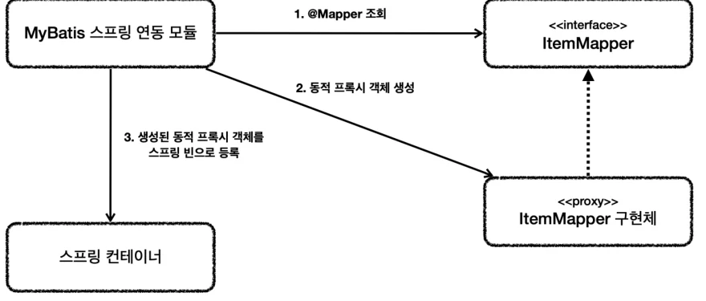

# [스프링 DB 2편 - 데이터 접근 활용 기술] 4. 데이터 접근 기술 - MyBatis

## 원문

https://ch010104.tistory.com/303

## 노트 유형

`concept`

## 핵심 개념과 선택 맥락

MyBatis는 JdbcTemplate보다 많은 기능을 제공하는 SQL Mapper다. JDBC 반복 작업을 줄이고 SQL 결과를 객체로 매핑한다는 점은 JdbcTemplate과 비슷하지만, SQL을 자바 문자열이 아니라 XML에 작성하고 동적 쿼리를 편리하게 다룰 수 있다는 점이 핵심이다.

XML에 SQL을 작성하므로 SQL이 길어져도 문자열 연결이 필요하지 않다. SQL 구조가 코드 바깥에 드러나 가독성이 좋고, SQL을 자주 다루는 프로젝트에서 특히 유리하다.

## 원문 기반 개념 정리

### 1. MyBatis 소개

MyBatis는 JdbcTemplate보다 많은 기능을 제공하는 SQL Mapper다. JDBC 반복 작업을 줄이고 SQL 결과를 객체로 매핑한다는 점은 JdbcTemplate과 비슷하지만, SQL을 자바 문자열이 아니라 XML에 작성하고 동적 쿼리를 편리하게 다룰 수 있다는 점이 핵심이다.

### 여러 줄 SQL 비교

### JdbcTemplate

```text
String sql = "update item " +
        "set item_name=:itemName, price=:price, quantity=:quantity " +
        "where id=:id";
```

### MyBatis

```text
<update id="update">
    update item
    set item_name=#{itemName},
        price=#{price},
        quantity=#{quantity}
    where id = #{id}
</update>
```

XML에 SQL을 작성하므로 SQL이 길어져도 문자열 연결이 필요하지 않다. SQL 구조가 코드 바깥에 드러나 가독성이 좋고, SQL을 자주 다루는 프로젝트에서 특히 유리하다.

### 동적 쿼리 비교

JdbcTemplate은 조건에 따라 where, and, 파라미터 순서를 자바 코드에서 직접 조립해야 한다.

```sql
String sql = "select id, item_name, price, quantity from item";

//동적 쿼리
if (StringUtils.hasText(itemName) || maxPrice != null) {
    sql += " where";
}

boolean andFlag = false;
if (StringUtils.hasText(itemName)) {
    sql += " item_name like concat('%',:itemName,'%')";
    andFlag = true;
}

if (maxPrice != null) {
    if (andFlag) {
        sql += " and";
    }
    sql += " price <= :maxPrice";
}

log.info("sql={}", sql);
return template.query(sql, param, itemRowMapper());
```

MyBatis는 XML의 <where>, <if>로 같은 문제를 해결한다.

```sql
<select id="findAll" resultType="Item">
    select id, item_name, price, quantity
    from item
    <where>
        <if test="itemName != null and itemName != ''">
            and item_name like concat('%',#{itemName},'%')
        </if>
        <if test="maxPrice != null">
            and price &lt;= #{maxPrice}
        </if>
    </where>
</select>
```

프로젝트에 복잡한 동적 SQL이 많으면 MyBatis가 적합하고, 단순 SQL이 대부분이면 JdbcTemplate도 좋은 선택이다. 두 기술을 함께 쓸 수 있지만, MyBatis를 선택했다면 일반적인 SQL Mapper 요구사항은 충분히 처리할 수 있다.

MyBatis 공식 사이트: https://mybatis.org/mybatis-3/ko/index.html

### 2. MyBatis 설정

mybatis-spring-boot-starter를 사용하면 MyBatis와 스프링을 간단히 통합할 수 있다.

### build.gradle

```text
//MyBatis 추가
implementation 'org.mybatis.spring.boot:mybatis-spring-boot-starter:2.2.0'
```

강의 기준 스프링 부트 2.x에서는 버전을 명시한다. 스프링 부트가 관리하는 공식 의존성이 아니기 때문이다.

```text
//MyBatis 스프링 부트 3.0 추가
implementation 'org.mybatis.spring.boot:mybatis-spring-boot-starter:3.0.3'

//MyBatis 스프링 부트 4.0 추가
implementation 'org.mybatis.spring.boot:mybatis-spring-boot-starter:4.0.1'
```

스프링 부트 3.x 이상은 3.0.3, 스프링 부트 4.x 이상은 4.0.1을 사용한다.

### build.gradle - 의존관계 전체

```java
dependencies {
    implementation 'org.springframework.boot:spring-boot-starter-thymeleaf'
    implementation 'org.springframework.boot:spring-boot-starter-web'

    //JdbcTemplate 추가
    implementation 'org.springframework.boot:spring-boot-starter-jdbc'

    //MyBatis 추가
    implementation 'org.mybatis.spring.boot:mybatis-spring-boot-starter:2.2.0'

    //H2 데이터베이스 추가
    runtimeOnly 'com.h2database:h2'

    compileOnly 'org.projectlombok:lombok'
    annotationProcessor 'org.projectlombok:lombok'
    testImplementation 'org.springframework.boot:spring-boot-starter-test'

    //테스트에서 lombok 사용
    testCompileOnly 'org.projectlombok:lombok'
    testAnnotationProcessor 'org.projectlombok:lombok'
}
```

추가되는 구성은 다음과 같다.

### application.properties

웹 실행용 main 설정과 테스트용 test 설정을 모두 바꿔야 한다. 한쪽만 수정하면 테스트나 애플리케이션 중 하나가 설정을 읽지 못한다.

### main - src/main/resources/application.properties

```java
spring.profiles.active=local
spring.datasource.url=jdbc:h2:tcp://localhost/~/test
spring.datasource.username=sa
logging.level.org.springframework.jdbc=debug

#MyBatis
mybatis.type-aliases-package=hello.itemservice.domain
mybatis.configuration.map-underscore-to-camel-case=true
logging.level.hello.itemservice.repository.mybatis=trace
```

### test - src/test/resources/application.properties

```java
spring.profiles.active=test
#spring.datasource.url=jdbc:h2:tcp://localhost/~/testcase
#spring.datasource.username=sa
logging.level.org.springframework.jdbc=debug

#MyBatis
mybatis.type-aliases-package=hello.itemservice.domain
mybatis.configuration.map-underscore-to-camel-case=true
logging.level.hello.itemservice.repository.mybatis=trace
```

mybatis.type-aliases-package: 지정 패키지와 하위 패키지의 타입을 자동 인식한다. XML에서 긴 패키지명을 생략할 수 있고, 여러 경로는 , 또는 ;로 구분한다.

mybatis.configuration.map-underscore-to-camel-case=true: DB의 snake_case를 자바의 camelCase로 자동 변환한다. 예를 들어 item_name은 itemName과 매핑된다.

logging.level.hello.itemservice.repository.mybatis=trace: MyBatis가 실행한 SQL을 로그로 확인한다.

DB 컬럼과 자바 속성의 의미가 완전히 다르면 자동 변환에 맡기지 않고 SQL 별칭을 사용한다.

```sql
select item_name as name
```

### 3. MyBatis 적용 1 - 기본

MyBatis는 매퍼 인터페이스와 XML 매핑 파일을 연결한다. 자바 코드가 아닌 XML이므로 매핑 파일은 src/main/resources 아래에 두되, 인터페이스 패키지 경로와 일치시킨다.

### ItemMapper

```text
package hello.itemservice.repository.mybatis;

import hello.itemservice.domain.Item;
import hello.itemservice.repository.ItemSearchCond;
import hello.itemservice.repository.ItemUpdateDto;
import org.apache.ibatis.annotations.Mapper;
import org.apache.ibatis.annotations.Param;

import java.util.List;
import java.util.Optional;

@Mapper
public interface ItemMapper {

    void save(Item item);

    void update(@Param("id") Long id, @Param("updateParam") ItemUpdateDto updateParam);

    Optional<Item> findById(Long id);

    List<Item> findAll(ItemSearchCond itemSearch);
}
```

@Mapper가 붙은 인터페이스는 MyBatis가 인식한다. 메서드를 호출하면 같은 이름의 XML id에 있는 SQL을 실행하고 결과를 반환한다.

### ItemMapper.xml

위치: src/main/resources/hello/itemservice/repository/mybatis/ItemMapper.xml

```sql
<?xml version="1.0" encoding="UTF-8"?>
<!DOCTYPE mapper PUBLIC "-//mybatis.org//DTD Mapper 3.0//EN"
        "http://mybatis.org/dtd/mybatis-3-mapper.dtd">
<mapper namespace="hello.itemservice.repository.mybatis.ItemMapper">

    <insert id="save" useGeneratedKeys="true" keyProperty="id">
        insert into item (item_name, price, quantity)
        values (#{itemName}, #{price}, #{quantity})
    </insert>

    <update id="update">
        update item
        set item_name=#{updateParam.itemName},
            price=#{updateParam.price},
            quantity=#{updateParam.quantity}
        where id = #{id}
    </update>

    <select id="findById" resultType="Item">
        select id, item_name, price, quantity
        from item
        where id = #{id}
    </select>

    <select id="findAll" resultType="Item">
        select id, item_name, price, quantity
        from item
        <where>
            <if test="itemName != null and itemName != ''">
                and item_name like concat('%',#{itemName},'%')
            </if>
            <if test="maxPrice != null">
                and price &lt;= #{maxPrice}
            </if>
        </where>
    </select>
</mapper>
```

namespace: 매퍼 인터페이스의 전체 이름을 지정한다.

id: 인터페이스 메서드 이름과 연결한다.

#{...}: PreparedStatement의 ? 자리에 값을 바인딩한다.

resultType="Item": 조회 행을 Item으로 매핑한다. type-alias 패키지 설정 덕분에 전체 패키지명을 쓰지 않아도 된다.

XML 경로를 별도로 지정하고 싶다면 다음 옵션을 main·test 설정에 모두 추가한다.

```text
mybatis.mapper-locations=classpath:mapper/**/*.xml
```

### INSERT, UPDATE, SELECT

앞의 전체 ItemMapper와 ItemMapper.xml 코드에서 save, update, findById, findAll의 인터페이스 선언과 XML 매핑을 모두 확인할 수 있다. 여기서는 일부 메서드만 다시 발췌하지 않고 각 매핑의 동작만 정리한다.

<insert id="save">: useGeneratedKeys="true", keyProperty="id"로 DB가 생성한 identity 키를 item.id에 채운다.

<update id="update">: 파라미터가 둘 이상이므로 @Param("id"), @Param("updateParam") 이름을 XML의 #{...} 표현식에서 사용한다.

<select id="findById">: resultType="Item"으로 한 행을 Item 또는 Optional<Item>으로 매핑한다.

<select id="findAll">: <if>와 <where>로 검색 조건에 따라 SQL을 완성한다.

### 동적 검색 쿼리

```text
List<Item> findAll(ItemSearchCond itemSearch);
```

```sql
<select id="findAll" resultType="Item">
    select id, item_name, price, quantity
    from item
    <where>
        <if test="itemName != null and itemName != ''">
            and item_name like concat('%',#{itemName},'%')
        </if>
        <if test="maxPrice != null">
            and price &lt;= #{maxPrice}
        </if>
    </where>
</select>
```

<if>는 조건이 참일 때만 SQL 조각을 추가한다. <where>는 조건이 하나도 없으면 where를 만들지 않고, 조건이 있으면 처음의 and를 제거한 뒤 where를 추가한다.

XML에서는 <를 그대로 쓸 수 없으므로 &lt;=를 사용한다.

```text
< : &lt;
> : &gt;
& : &amp;
```

CDATA 안에서는 특수문자를 그대로 쓸 수 있지만, CDATA 안의 <if>, <where>는 XML 태그가 아닌 문자로 처리된다.

```sql
<select id="findAll" resultType="Item">
    select id, item_name, price, quantity
    from item
    <where>
        <if test="itemName != null and itemName != ''">
            and item_name like concat('%',#{itemName},'%')
        </if>
        <if test="maxPrice != null">
            <![CDATA[
            and price <= #{maxPrice}
            ]]>
        </if>
    </where>
</select>
```

### 4. MyBatis 적용 2 - 설정과 실행

ItemRepository 구현체는 XML을 직접 다루지 않고 ItemMapper에 기능을 위임한다.

### MyBatisItemRepository

```java
package hello.itemservice.repository.mybatis;

import hello.itemservice.domain.Item;
import hello.itemservice.repository.ItemRepository;
import hello.itemservice.repository.ItemSearchCond;
import hello.itemservice.repository.ItemUpdateDto;
import lombok.RequiredArgsConstructor;
import org.springframework.stereotype.Repository;

import java.util.List;
import java.util.Optional;

@Repository
@RequiredArgsConstructor
public class MyBatisItemRepository implements ItemRepository {

    private final ItemMapper itemMapper;

    @Override
    public Item save(Item item) {
        itemMapper.save(item);
        return item;
    }

    @Override
    public void update(Long itemId, ItemUpdateDto updateParam) {
        itemMapper.update(itemId, updateParam);
    }

    @Override
    public Optional<Item> findById(Long id) {
        return itemMapper.findById(id);
    }

    @Override
    public List<Item> findAll(ItemSearchCond cond) {
        return itemMapper.findAll(cond);
    }
}
```

### MyBatisConfig

```java
package hello.itemservice.config;

import hello.itemservice.repository.ItemRepository;
import hello.itemservice.repository.mybatis.ItemMapper;
import hello.itemservice.repository.mybatis.MyBatisItemRepository;
import hello.itemservice.service.ItemService;
import hello.itemservice.service.ItemServiceV1;
import lombok.RequiredArgsConstructor;
import org.springframework.context.annotation.Bean;
import org.springframework.context.annotation.Configuration;

@Configuration
@RequiredArgsConstructor
public class MyBatisConfig {

    private final ItemMapper itemMapper;

    @Bean
    public ItemService itemService() {
        return new ItemServiceV1(itemRepository());
    }

    @Bean
    public ItemRepository itemRepository() {
        return new MyBatisItemRepository(itemMapper);
    }
}
```

기존 ItemServiceV1은 ItemRepository 인터페이스에만 의존한다. 따라서 설정에서 어떤 구현체를 주입하는지만 바꾸면 서비스·컨트롤러는 수정하지 않아도 된다.

@Import(MyBatisConfig.class)로 전체 ItemServiceApplication 클래스의 설정을 MyBatis 구현체로 교체한다. 해당 클래스의 다른 구성은 변경하지 않으므로, 여기에는 변경 줄만 별도 코드 블록으로 반복하지 않는다.

### 5. MyBatis 적용 3 - 매퍼 구현체 분석



ItemMapper는 인터페이스뿐이고 구현 클래스가 없다. MyBatis 스프링 연동 모듈이 애플리케이션 로딩 시 다음 과정을 자동 처리한다.

@Mapper가 붙은 인터페이스를 찾는다.

JDK 동적 프록시로 인터페이스 구현체를 만든다.

생성한 구현체를 스프링 빈으로 등록한다.

MyBatis 스프링 연동 모듈이 @Mapper 인터페이스를 찾고, 그 인터페이스를 구현하는 동적 프록시를 만든 다음 스프링 컨테이너에 빈으로 등록하는 관계를 보여 준다.

```java
package hello.itemservice.repository.mybatis;

import hello.itemservice.domain.Item;
import hello.itemservice.repository.ItemRepository;
import hello.itemservice.repository.ItemSearchCond;
import hello.itemservice.repository.ItemUpdateDto;
import lombok.RequiredArgsConstructor;
import lombok.extern.slf4j.Slf4j;
import org.springframework.stereotype.Repository;

import java.util.List;
import java.util.Optional;

@Slf4j
@Repository
@RequiredArgsConstructor
public class MyBatisItemRepository implements ItemRepository {

    private final ItemMapper itemMapper;

    @Override
    public Item save(Item item) {
        log.info("itemMapper class={}", itemMapper.getClass());
        itemMapper.save(item);
        return item;
    }

    @Override
    public void update(Long itemId, ItemUpdateDto updateParam) {
        itemMapper.update(itemId, updateParam);
    }

    @Override
    public Optional<Item> findById(Long id) {
        return itemMapper.findById(id);
    }

    @Override
    public List<Item> findAll(ItemSearchCond cond) {
        return itemMapper.findAll(cond);
    }
}
```

```text
itemMapper class=class com.sun.proxy.$Proxy66
```

프록시 구현체는 인터페이스 메서드 호출을 XML의 SQL과 연결하고, MyBatis 예외를 스프링 예외 추상화인 DataAccessException으로 변환한다. 데이터베이스 커넥션·트랜잭션 동기화도 MyBatis 스프링 연동 모듈이 처리한다.

### 6. MyBatis 기능 정리 1 - 동적 쿼리

MyBatis를 선택하는 가장 큰 이유는 동적 SQL이다. 자주 쓰는 태그는 if, choose (when, otherwise), trim (where, set), foreach다.

### if

```sql
<select id="findActiveBlogWithTitleLike"
     resultType="Blog">
  SELECT * FROM BLOG
  WHERE state = ‘ACTIVE’
  <if test="title != null">
    AND title like #{title}
  </if>
</select>
```

test 조건이 참일 때만 SQL을 추가한다. 내부 표현식은 OGNL을 사용한다.

### choose, when, otherwise

```sql
<select id="findActiveBlogLike"
     resultType="Blog">
  SELECT * FROM BLOG WHERE state = ‘ACTIVE’
  <choose>
    <when test="title != null">
      AND title like #{title}
    </when>
    <when test="author != null and author.name != null">
      AND author_name like #{author.name}
    </when>
    <otherwise>
      AND featured = 1
    </otherwise>
  </choose>
</select>
```

자바의 switch처럼 여러 조건 중 하나를 선택한다.

### where, trim

다음처럼 조건 없이 WHERE만 남거나 WHERE AND가 만들어지는 문제를 <where>가 해결한다.

```sql
<select id="findActiveBlogLike"
     resultType="Blog">
  SELECT * FROM BLOG
  <where>
    <if test="state != null">
         state = #{state}
    </if>
    <if test="title != null">
        AND title like #{title}
    </if>
    <if test="author != null and author.name != null">
        AND author_name like #{author.name}
    </if>
  </where>
</select>
```

같은 기능은 trim으로 직접 정의할 수 있다. 다만 PDF의 예시는 생략 부호(...)가 포함된 조각이므로 코드 블록으로 옮기지 않는다. prefix="WHERE", prefixOverrides="AND |OR "를 사용하면 <where>와 같은 역할을 한다.

### foreach

```sql
<select id="selectPostIn" resultType="domain.blog.Post">
  SELECT *
  FROM POST P
  <where>
    <foreach item="item" index="index" collection="list"
        open="ID in (" separator="," close=")" nullable="true">
          #{item}
    </foreach>
  </where>
</select>
```

컬렉션을 반복해 where in (1,2,3,4,5,6) 같은 구문을 만든다. List를 전달할 때 유용하다.

동적 SQL 공식 문서: https://mybatis.org/mybatis-3/ko/dynamic-sql.html

### 7. MyBatis 기능 정리 2 - 기타 기능

### 애너테이션으로 SQL 작성

간단한 SQL은 XML 대신 매퍼 인터페이스에 직접 작성할 수 있다.

```sql
@Select("select id, item_name, price, quantity from item where id=#{id}")
Optional<Item> findById(Long id);
```

@Insert, @Update, @Delete, @Select를 제공한다. 같은 메서드의 XML SQL은 제거해야 하며, 동적 SQL의 복잡성을 해결하지 못하므로 간단한 경우에만 사용한다.

### 문자열 대체 - ${} 주의

#{}는 PreparedStatement로 값을 바인딩한다. ${}는 파라미터 값을 SQL 문자열에 그대로 넣는다.

```sql
@Select("select * from user where ${column} = #{value}")
User findByColumn(@Param("column") String column, @Param("value") String value);
```

```text
ORDER BY ${columnName}
```

${}는 SQL 인젝션 공격에 취약하므로 가능한 사용하지 않는다. 불가피한 경우 허용된 컬럼 목록 같은 화이트리스트로 값의 범위를 제한해야 한다.

### 재사용 가능한 SQL 조각

```sql
<sql id="userColumns"> ${alias}.id,${alias}.username,${alias}.password </sql>

<select id="selectUsers" resultType="map">
  select
    <include refid="userColumns"><property name="alias" value="t1"/></include>,
    <include refid="userColumns"><property name="alias" value="t2"/></include>
  from some_table t1
    cross join some_table t2
</select>
```

<sql>에 조각을 정의하고 <include>로 재사용한다. <property>로 조각에 값을 전달할 수도 있다.

```sql
<sql id="sometable">
  ${prefix}Table
</sql>

<sql id="someinclude">
  from
    <include refid="${include_target}"/>
</sql>
<select id="select" resultType="map">
  select
    field1, field2, field3
  <include refid="someinclude">
    <property name="prefix" value="Some"/>
    <property name="include_target" value="sometable"/>
  </include>
</select>
```

<property> 값을 전달할 수 있고, 해당 값은 내부에서 사용할 수 있다.

### 결과 매핑

컬럼명과 객체 속성명이 다르면 SQL 별칭으로 처리할 수 있다.

```sql
<select id="selectUsers" resultType="User">
  select
    user_id             as "id",
    user_name           as "userName",
    hashed_password     as "hashedPassword"
  from some_table
  where id = #{id}
</select>
```

반복되는 복잡한 매핑은 resultMap으로 명시한다.

```sql
<!-- 위에서 as로 별칠 설정을 한 것은 resultMap 으로 한 번에 선언 가능 -->
<resultMap id="userResultMap" type="User">
  <id property="id" column="user_id" />
  <result property="username" column="user_name"/>
  <result property="password" column="hashed_password"/>
</resultMap>

<select id="selectUsers" resultMap="userResultMap">
  select user_id, user_name, hashed_password
  from some_table
  where id = #{id}
</select>
```

<association>, <collection>으로 객체 연관관계도 매핑할 수 있지만, MyBatis에서 복잡한 결과 매핑은 작성량과 성능 최적화 비용이 크다. 객체 관계를 자연스럽게 중심으로 다뤄야 하는 경우에는 JPA가 더 적합할 수 있으므로 신중하게 사용한다.

결과 매핑 공식 문서: https://mybatis.org/mybatis-3/ko/sqlmap-xml.html#Result_Maps

### 8. 최종 요약 정리

## 관련 글

- [[blog/INFLEARN/index|INFLEARN]]
- [[blog/INFLEARN/스프링 DB 2편 - 데이터 접근 활용 기술- 3. 데이터 접근 기술 - 테스트|[스프링 DB 2편 - 데이터 접근 활용 기술] 3. 데이터 접근 기술 - 테스트]]
- [[blog/INFLEARN/스프링 DB 2편 - 데이터 접근 활용 기술- 2. 데이터 접근 기술 - 스프링 JdbcTemplate|[스프링 DB 2편 - 데이터 접근 활용 기술] 2. 데이터 접근 기술 - 스프링 JdbcTemplate]]
- [[blog/INFLEARN/스프링 DB 2편 - 데이터 접근 활용 기술- 1. 데이터 접근 기술 - 시작|[스프링 DB 2편 - 데이터 접근 활용 기술] 1. 데이터 접근 기술 - 시작]]
