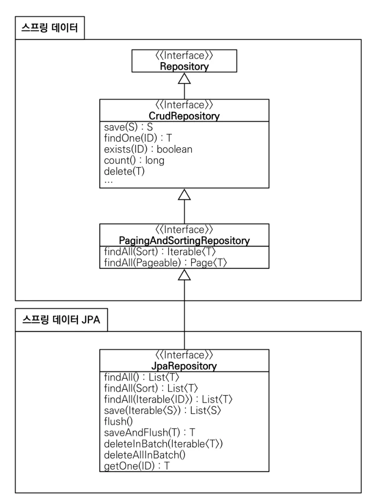
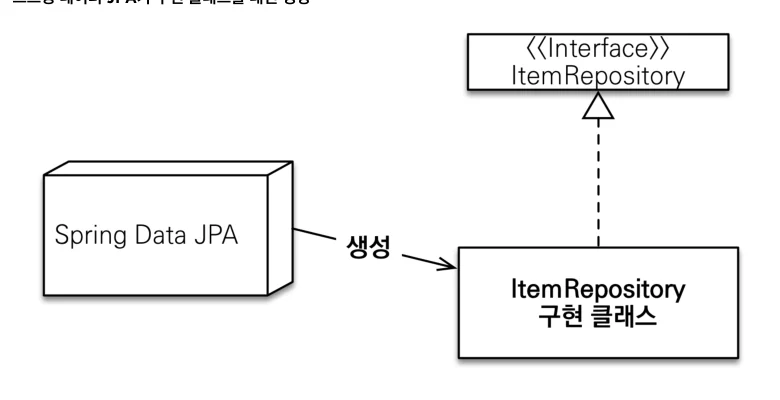
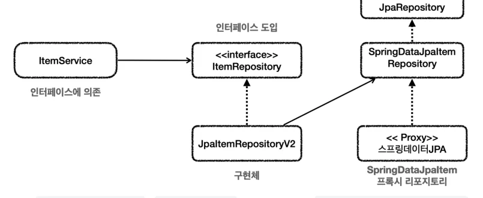

# [스프링 DB 2편 - 데이터 접근 활용 기술] 6. 데이터 접근 기술 - 스프링 데이터 JPA

## 원문

https://ch010104.tistory.com/305

## 노트 유형

`tutorial`

## 학습 목표 및 맥락

스프링 데이터 JPA는 JPA를 더 편리하게 사용하도록 돕는 라이브러리다. 핵심은 JPA를 대체하는 기술이 아니라 JPA 위에서 반복되는 리포지토리 코드를 줄이는 도구라는 점이다. 따라서 JPA의 엔티티 매핑·영속성 컨텍스트·JPQL을 이해하는 것이 우선이다.

JpaRepository 기반 공통 인터페이스: 기본 CRUD, 페이징·정렬 기능을 제공한다.

## 원문 기반 학습 정리

### 1. 스프링 데이터 JPA 소개

스프링 데이터 JPA는 JPA를 더 편리하게 사용하도록 돕는 라이브러리다. 핵심은 JPA를 대체하는 기술이 아니라 JPA 위에서 반복되는 리포지토리 코드를 줄이는 도구라는 점이다. 따라서 JPA의 엔티티 매핑·영속성 컨텍스트·JPQL을 이해하는 것이 우선이다.

대표 기능은 다음 두 가지다.

JpaRepository 기반 공통 인터페이스: 기본 CRUD, 페이징·정렬 기능을 제공한다.

쿼리 메서드: 인터페이스 메서드 이름을 분석해 JPQL을 만들고 실행한다.

### 2. 공통 인터페이스 - JpaRepository

JpaRepository는 Repository → CrudRepository → PagingAndSortingRepository를 확장한다. CRUD뿐 아니라 페이지·정렬, JPA에 특화된 flush·batch 기능도 제공한다.

상위 CrudRepository의 기본 CRUD 기능에 PagingAndSortingRepository의 페이지·정렬 기능, JpaRepository의 JPA 특화 기능이 순차적으로 더해지는 계층 구조다.

### JpaRepository 사용법

```text
public interface ItemRepository extends JpaRepository<Item, Long> {
}
```

관리할 엔티티와 엔티티 ID 타입을 제네릭으로 지정하면 공통 CRUD 기능을 상속한다. findOne()은 현재 findById()로 변경되었다.

### 3. 프록시 구현체 자동 생성

개발자가 JpaRepository를 상속한 인터페이스만 선언하면 스프링 데이터 JPA가 프록시 기술로 구현 클래스를 생성하고 스프링 빈으로 등록한다. 구현 클래스를 직접 작성하지 않아도 기본 CRUD를 사용할 수 있다.

스프링 데이터 JPA가 ItemRepository 인터페이스를 분석해 구현 클래스를 만들고 빈으로 등록하므로, 애플리케이션은 인터페이스만 주입받아 사용한다.

### 4. 쿼리 메서드와 @Query

순수 JPA는 JPQL과 파라미터 바인딩을 직접 작성해야 한다. 스프링 데이터 JPA는 findByUsernameAndAgeGreaterThan처럼 규칙에 맞는 메서드 이름을 분석해 JPQL을 생성한다.

조회: find…By, read…By, query…By, get…By

개수: count…By → long

존재 확인: exists…By → boolean

삭제: delete…By, remove…By → long

중복 제거: findDistinct, findMemberDistinctBy

제한: findFirst, findFirst3, findTop, findTop3

메서드 이름이 길어지거나 조인처럼 복잡한 조건이 필요하면 @Query로 JPQL을 직접 작성한다. @Query를 사용하면 메서드 이름 규칙은 적용하지 않으며, @Param으로 이름 기반 파라미터를 명시적으로 바인딩한다.

### 5. 스프링 데이터 JPA 적용 1 - 리포지토리

이전 JPA 장에서 이미 spring-boot-starter-data-jpa를 추가했으므로 별도 의존성 설정은 필요 없다. 이 starter에는 JPA, Hibernate, Spring Data JPA, 스프링 JDBC 관련 기능이 함께 포함된다.

### SpringDataJpaItemRepository

```java
package hello.itemservice.repository.jpa;

import hello.itemservice.domain.Item;
import org.springframework.data.jpa.repository.JpaRepository;
import org.springframework.data.jpa.repository.Query;
import org.springframework.data.repository.query.Param;

import java.util.List;

public interface SpringDataJpaItemRepository extends JpaRepository<Item, Long>
{

    List<Item> findByItemNameLike(String itemName);

    List<Item> findByPriceLessThanEqual(Integer price);

    //쿼리 메서드 (아래 메서드와 같은 기능 수행)
    List<Item> findByItemNameLikeAndPriceLessThanEqual(String itemName,
Integer price);

    //쿼리 직접 실행
    @Query("select i from Item i where i.itemName like :itemName and i.price
<= :price")
    List<Item> findItems(@Param("itemName") String itemName, @Param("price")
Integer price);
}
```

> 원문 코드가 길어 이 노트에서는 앞부분만 보존했습니다. 전체는 원문에서 확인합니다.

findAll()은 공통 인터페이스가 제공한다. 조건 검색은 다음 네 가지 경우로 나뉜다.

조건 사용 메서드

스프링 데이터 JPA는 동적 쿼리 지원이 약하다. 조건이 늘면 메서드 이름이 길어지고, 상황별 메서드를 선택하는 코드도 비효율적이므로 실무에서는 Querydsl을 함께 사용한다.

### 6. 스프링 데이터 JPA 적용 2 - 어댑터 리포지토리

ItemService는 기존 ItemRepository에 의존한다. SpringDataJpaItemRepository를 서비스가 직접 사용하게 바꾸지 않고, 두 인터페이스 사이에 JpaItemRepositoryV2를 어댑터로 둔다.

### JpaItemRepositoryV2

```java
package hello.itemservice.repository.jpa;

import hello.itemservice.domain.Item;
import hello.itemservice.repository.ItemRepository;
import hello.itemservice.repository.ItemSearchCond;
import hello.itemservice.repository.ItemUpdateDto;
import lombok.RequiredArgsConstructor;
import org.springframework.stereotype.Repository;
import org.springframework.transaction.annotation.Transactional;
import org.springframework.util.StringUtils;

import java.util.List;
import java.util.Optional;

@Repository
@Transactional
@RequiredArgsConstructor
public class JpaItemRepositoryV2 implements ItemRepository {

    private final SpringDataJpaItemRepository repository;

    @Override
    public Item save(Item item) {
        return repository.save(item);
    }

    @Override
    public void update(Long itemId, ItemUpdateDto updateParam) {
        Item findItem = repository.findById(itemId).orElseThrow();
        findItem.setItemName(updateParam.getItemName());
        findItem.setPrice(updateParam.getPrice());
        findItem.setQuantity(updateParam.getQuantity());
    }

    @Override
    public Optional<Item> findById(Long id) {
        return repository.findById(id);
    }

    @Override
    public List<Item> findAll(ItemSearchCond cond) {
        String itemName = cond.getItemName();
        Integer maxPrice = cond.getMaxPrice();

        if (StringUtils.hasText(itemName) && maxPrice != null) {
//return repository.findByItemNameLikeAndPriceLessThanEqual("%" + itemName + "%", maxPrice);
            return repository.findItems("%" + itemName + "%", maxPrice);
        } else if (StringUtils.hasText(itemName)) {
            return repository.findByItemNameLike("%" + itemName + "%");
        } else if (maxPrice != null) {
            return repository.findByPriceLessThanEqual(maxPrice);
        } else {
            return repository.findAll();
        }
    }
}
```

### 클래스 의존 관계

*ItemService는 기존 ItemRepository 계약을 유지한다. JpaItemRepositoryV2가 그 계약을 구현하고 스프링 데이터 JPA 리포지토리에 위임하는 어댑터 역할을 한다.*

### 런타임 객체 의존 관계

실행 시 itemService → jpaItemRepositoryV2 → springDataJpaItemRepository(프록시) 순서로 호출된다. 서비스 코드를 변경하지 않고 구현 기술을 교체할 수 있는 이유다.

### 7. 설정과 실행

### SpringDataJpaConfig

```java
package hello.itemservice.config;

import hello.itemservice.repository.ItemRepository;
import hello.itemservice.repository.jpa.JpaItemRepositoryV2;
import hello.itemservice.repository.jpa.SpringDataJpaItemRepository;
import hello.itemservice.service.ItemService;
import hello.itemservice.service.ItemServiceV1;
import lombok.RequiredArgsConstructor;
import org.springframework.context.annotation.Bean;
import org.springframework.context.annotation.Configuration;

@Configuration
@RequiredArgsConstructor
public class SpringDataJpaConfig {

    private final SpringDataJpaItemRepository springDataJpaItemRepository;

    @Bean
    public ItemService itemService() {
        return new ItemServiceV1(itemRepository());
    }

    @Bean
    public ItemRepository itemRepository() {
        return new JpaItemRepositoryV2(springDataJpaItemRepository);
    }
}
```

SpringDataJpaItemRepository는 스프링 데이터 JPA가 프록시로 만들고 빈으로 등록한다. 애플리케이션 시작 설정에서는 SpringDataJpaConfig를 사용하도록 바꾼 뒤 ItemRepositoryTest와 웹 애플리케이션을 실행한다.

### 8. 예외 변환과 Hibernate 버전 주의(2026-07-19 기준으로는 7.4.1 버전이기 때문에 해당사항 X)

스프링 데이터 JPA 프록시는 이미 스프링 예외 추상화로 변환하는 기능을 포함한다. 따라서 @Repository 여부와 관계없이 JPA 예외를 스프링의 데이터 접근 예외 계층으로 변환한다.

Hibernate 5.6.6~5.6.7에서는 Like 문 사용 시 다음 오류가 발생할 수 있다.

```text
java.lang.IllegalArgumentException: Parameter value [\] did not match expected
type [java.lang.String (n/a)]
```

스프링 부트 2.6.5가 사용하는 Hibernate 5.6.7에서 문제가 발생하면 다음처럼 5.6.5.Final로 고정한다.

```text
ext["hibernate.version"] = "5.6.5.Final"
```

### 9. 최종 요약 정리

## 핵심 이미지







## 관련 글

- [[blog/INFLEARN/index|INFLEARN]]
