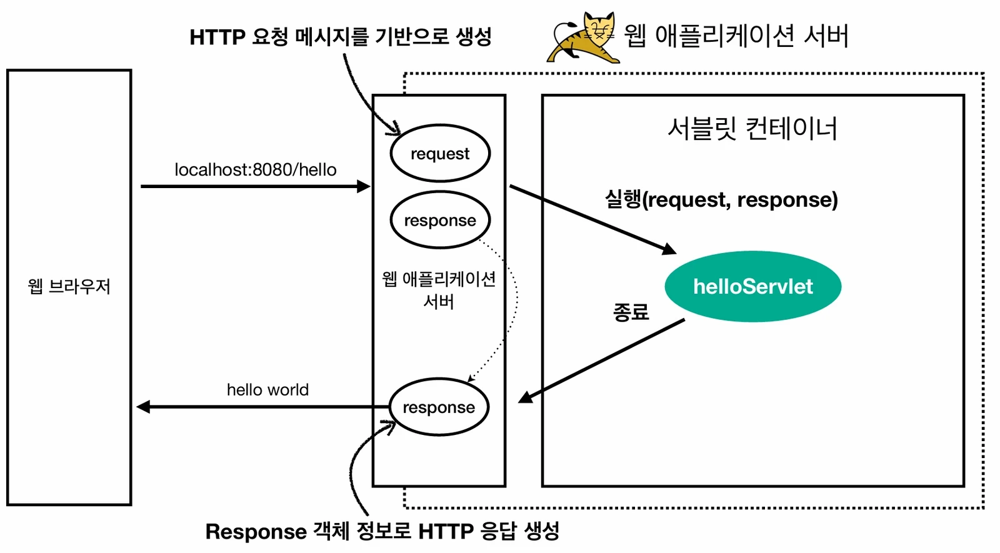
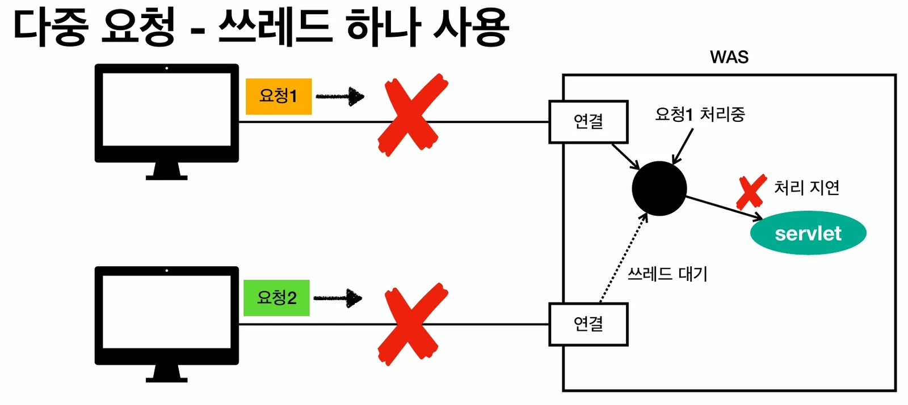
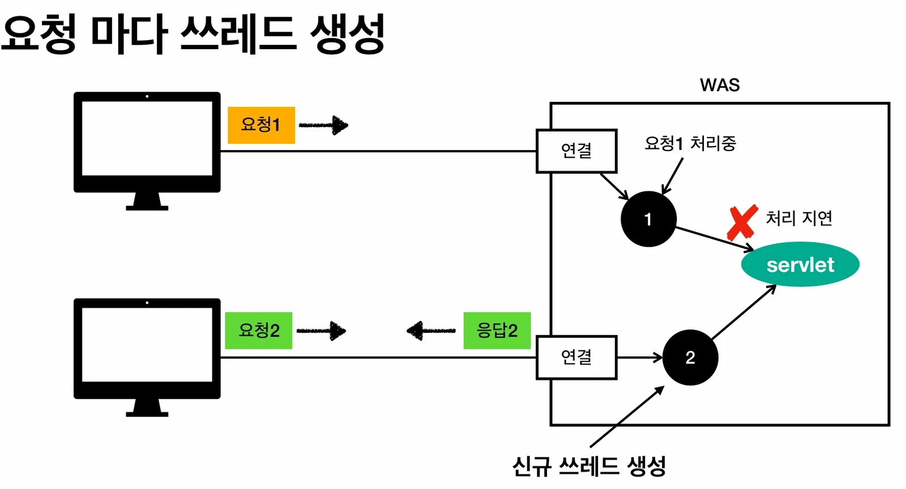

# [스프링 MVC 1편 - 백엔드 웹 개발 핵심 기술] 1. 웹 애플리케이션의 이해 - 서블릿(Servlet)과 쓰레드(Thread)

## 원문

https://ch010104.tistory.com/252

## 노트 유형

`tutorial`

## 학습 목표 및 맥락

서블릿은 자바를 사용하여 웹 페이지를 동적으로 생성하는 서버측 프로그램 사양을 의미합니다. 웹 애플리케이션 서버(WAS) 내에서 HTTP 요청을 처리하고 응답을 생성하는 역할을 수행합니다.

URL 매핑: @WebServlet 어노테이션의 urlPatterns에 지정된 URL(예: /hello)이 호출되면 해당 서블릿 코드가 실행됩니다.

## 원문 기반 학습 정리

### 서블릿(Servlet) 개념 및 동작 원리 정리

서블릿은 자바를 사용하여 웹 페이지를 동적으로 생성하는 서버측 프로그램 사양을 의미합니다. 웹 애플리케이션 서버(WAS) 내에서 HTTP 요청을 처리하고 응답을 생성하는 역할을 수행합니다.

### 1. 서블릿의 주요 특징

### 코드 구조 분석

```java
@WebServlet(name = "helloServlet", urlPatterns = "/hello")
public class HelloServlet extends HttpServlet {
    @Override
    protected void service(HttpServletRequest request, HttpServletResponse response) {
        // 애플리케이션 로직 작성 위치
    }
}
```

URL 매핑: @WebServlet 어노테이션의 urlPatterns에 지정된 URL(예: /hello)이 호출되면 해당 서블릿 코드가 실행됩니다.

객체 기반 처리:

HttpServletRequest: HTTP 요청 정보를 편리하게 사용할 수 있도록 제공되는 객체입니다.

HttpServletResponse: HTTP 응답 정보를 편리하게 제공할 수 있도록 돕는 객체입니다.

추상화: 개발자는 복잡한 HTTP 스펙을 직접 구현할 필요 없이, 서블릿이 제공하는 객체와 메서드를 통해 매우 편리하게 HTTP 통신을 처리할 수 있습니다.

### 서블릿(Servlet) 개념 및 동작 원리 정리

```java
@WebServlet(name = "helloServlet", urlPatterns = "/hello")
public class HelloServlet extends HttpServlet {
    @Override
    protected void service(HttpServletRequest request, HttpServletResponse response) {
        // 애플리케이션 로직 작성 위치
    }
}
```

URL 매핑: @WebServlet 어노테이션의 urlPatterns에 지정된 URL(예: /hello)이 호출되면 해당 서블릿 코드가 실행됩니다.

객체 기반 처리:

HttpServletRequest: HTTP 요청 정보를 편리하게 사용할 수 있도록 제공되는 객체입니다.

HttpServletResponse: HTTP 응답 정보를 편리하게 제공할 수 있도록 돕는 객체입니다.

추상화: 개발자는 복잡한 HTTP 스펙을 직접 구현할 필요 없이, 서블릿이 제공하는 객체와 메서드를 통해 매우 편리하게 HTTP 통신을 처리할 수 있습니다.

### 2. 서블릿 컨테이너 (Servlet Container)

톰캣(Tomcat)처럼 서블릿을 지원하는 WAS를 서블릿 컨테이너라고 부릅니다.

생명주기 관리: 서블릿 객체의 생성, 초기화(init), 호출(service), 종료(destroy)까지의 전 과정을 관리합니다.

싱글톤(Singleton) 관리: 최초 로딩 시점에 서블릿 객체를 미리 하나만 만들어두고 이를 재활용합니다.

주의사항 (공유 변수): 객체가 하나뿐이므로 멤버 변수 사용 시 무상태(stateless) 설계가 필수입니다.

멀티 쓰레드 처리 지원: 동시 요청 처리를 위한 쓰레드 관리 로직을 WAS가 자동으로 처리해 줍니다.

### 3. 쓰레드(Thread)와 요청 처리

### 쓰레드란?

애플리케이션 코드를 하나하나 순차적으로 실행하는 주체입니다.

자바 실행 시 main 쓰레드가 기본으로 실행되며, 쓰레드가 없으면 자바 애플리케이션 실행이 불가능합니다.

동시 처리가 필요하면 쓰레드를 추가로 생성해야 합니다.

### 요청 처리 모델

단일 요청 - 쓰레드 하나 사용: 요청이 오면 쓰레드를 할당하여 서블릿을 실행하고 응답을 보냅니다.

다중 요청 - 쓰레드 하나 사용 시 문제: 요청1이 처리 중에 지연되면, 대기 중인 요청2는 응답을 받지 못하고 함께 지연됩니다.

요청 마다 쓰레드 생성 (Thread per Request):

장점: 동시 처리 가능, 리소스가 허용될 때까지 처리 가능, 하나의 쓰레드 지연이 다른 쓰레드에 영향을 주지 않음.

단점: 쓰레드 생성 비용이 매우 비쌈(응답 속도 저하), 컨텍스트 스위칭 비용 발생, 요청이 폭주하면 CPU/메모리 한계 초과로 서버가 다운될 수 있음.

### 4. 쓰레드 풀 (Thread Pool)

쓰레드 생성의 단점을 보완하기 위해 사용하는 방식입니다.

특징: 필요한 쓰레드를 미리 만들어 풀(Pool)에 보관하고 관리합니다. (톰캣 기본 설정은 최대 200개)

동작 방식:

요청이 오면 쓰레드 풀에서 놀고 있는 쓰레드를 꺼내서 사용합니다.

처리가 종료되면 쓰레드를 종료하지 않고 다시 풀에 반납합니다.

모든 쓰레드가 사용 중이면 요청을 대기시키거나 거절합니다.

몇개까지는 대기를 하고, 그 이후에는 거절을 하는지 등을 설정 가능함

장점: 쓰레드 생성/종료 비용(CPU) 절약, 응답 시간 향상, 최대 쓰레드 수가 제한되어 있어 서버 다운 방지.

### 실무 팁: 적정 숫자 찾기

튜닝 포인트: max thread(최대 쓰레드) 수 설정이 가장 중요합니다.

해결책: 애플리케이션 로직의 복잡도와 리소스 상황에 따라 다르므로 반드시 성능 테스트를 거쳐야 합니다. (툴: nGrinder, JMeter, Apache ab 등)

### 5. WAS의 멀티 쓰레드 지원 핵심

멀티 쓰레드 환경에서 개발자가 비즈니스 로직에만 집중할 수 있는 이유는 WAS의 강력한 지원 덕분입니다.

복잡성 위임: 멀티 쓰레드에 관한 복잡한 처리는 모두 WAS가 담당합니다.

개발 편의성: 개발자는 마치 싱글 쓰레드 프로그래밍을 하듯이 편리하게 소스 코드를 개발할 수 있으며, 멀티 쓰레드 관련 코드를 직접 작성할 필요가 없습니다.

주의사항: WAS가 멀티 쓰레드 환경을 제공하므로, 여러 쓰레드가 동시에 접근하는 싱글톤 객체(서블릿, 스프링 빈 등)는 반드시 상태를 가지지 않도록(Stateless) 주의해서 사용해야 합니다.

## 핵심 이미지







## 관련 글

- [[blog/INFLEARN/index|INFLEARN]]
- [[blog/INFLEARN/스프링 MVC 1편 - 백엔드 웹 개발 핵심 기술- 4. 서블릿, JSP, MVC 패턴|[스프링 MVC 1편 - 백엔드 웹 개발 핵심 기술] 4. 서블릿, JSP, MVC 패턴]]
- [[blog/INFLEARN/스프링 MVC 1편 - 백엔드 웹 개발 핵심 기술- 5. MVC 프레임워크 만들기|[스프링 MVC 1편 - 백엔드 웹 개발 핵심 기술] 5. MVC 프레임워크 만들기]]
- [[blog/INFLEARN/스프링 MVC 1편 - 백엔드 웹 개발 핵심 기술- 6. 스프링 MVC - 구조 이해|[스프링 MVC 1편 - 백엔드 웹 개발 핵심 기술] 6. 스프링 MVC - 구조 이해]]
