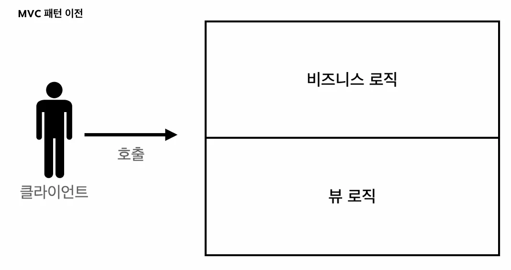
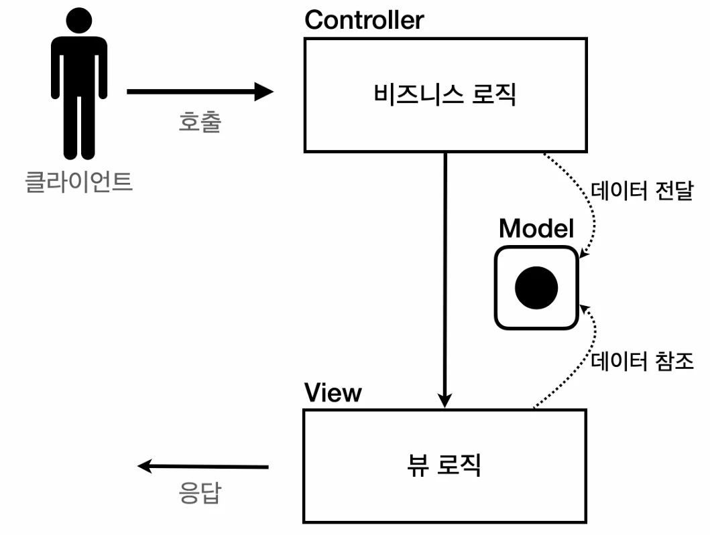

# [스프링 MVC 1편 - 백엔드 웹 개발 핵심 기술] 4. 서블릿, JSP, MVC 패턴

## 원문

https://ch010104.tistory.com/258

## 노트 유형

`tutorial`

## 학습 목표 및 맥락

파일명: src/main/java/hello/servlet/web/servlet/MemberFormServlet.java

단순하게 회원 정보를 입력할 수 있는 HTML Form을 만들어서 응답합니다.

## 원문 기반 학습 정리

### 1. 회원 관리 웹 애플리케이션 요구사항 및 도메인 모델

### 회원 정보 및 기능

회원 정보: 이름(username), 나이(age)

기능 요구사항: 회원 저장, 회원 목록 조회

### Member.java (회원 도메인 모델)

```java
package com.example.spring_mvc_study1_servlet.domain.Member;

import lombok.Getter;
import lombok.Setter;

@Getter
@Setter
public class Member {

    private Long id;
    private String username;
    private int age;

    public Member() {
    }

    public Member(String username, int age) {
        this.username = username;
        this.age = age;
    }
}
```

### MemberRepository.java (회원 저장소 - 싱글톤)

```java
package com.example.spring_mvc_study1_servlet.domain.Member;

import java.util.ArrayList;
import java.util.HashMap;
import java.util.List;
import java.util.Map;

public class MemberRepository {

    private static Map<Long, Member> store = new HashMap<>();
    private static long sequence = 0L;

    private static final MemberRepository instance = new MemberRepository();

    public static MemberRepository getInstance() {
        return instance;
    }

    // private으로 생성자를 아무나 호출하지 못하게 막음
    private MemberRepository() {
    }

    public Member save(Member member) {
        member.setId(++sequence);
        store.put(member.getId(), member);
        return member;
    }

    public Member findById(Long id) {
        return store.get(id);
    }

    public List<Member> findAll() {
        return new ArrayList<>(store.values()); // store에 있는 모든 값을 꺼내서, 새로운 ArrayList에 담아서 넣어줌
    }

    public void clearStore() {
        store.clear();
    }
}
```

### MemberRepositoryTest.java (회원 저장소 테스트)

```text
package com.example.spring_mvc_study1_servlet.domain.Member;

import org.junit.jupiter.api.AfterEach;
import org.junit.jupiter.api.Test;

import java.util.List;

import static org.assertj.core.api.Assertions.*;
import static org.junit.jupiter.api.Assertions.*;

class MemberRepositoryTest {

    MemberRepository memberRepository = MemberRepository.getInstance();

    @AfterEach
    void afterEach() {
        memberRepository.clearStore();
    }

    @Test
    void save(){
        //given
        Member member = new Member("hello", 20);

        // when
        Member savedMember = memberRepository.save(member);

        // then
        Member findMember = memberRepository.findById(savedMember.getId());
        assertThat(findMember).isEqualTo(member);
    }

    @Test
    void findAll(){
        // given
        Member member1 = new Member("member1", 20);
        Member member2 = new Member("member2", 30);

        memberRepository.save(member1);
        memberRepository.save(member2);

        // when
        List<Member> result = memberRepository.findAll();

        // then
        assertThat(result.size()).isEqualTo(2);
        assertThat(result).contains(member1,member2);

    }

}
```

> 원문 코드가 길어 이 노트에서는 앞부분만 보존했습니다. 전체는 원문에서 확인합니다.

### 2. 서블릿으로 회원 관리 웹 애플리케이션 만들기

서블릿과 자바 코드만으로 HTML을 생성하는 방식입니다.

### MemberFormServlet.java (회원 등록 폼)

파일명: src/main/java/hello/servlet/web/servlet/MemberFormServlet.java

단순하게 회원 정보를 입력할 수 있는 HTML Form을 만들어서 응답합니다.

```java
package com.example.spring_mvc_study1_servlet.web.servlet;

import com.example.spring_mvc_study1_servlet.domain.Member.MemberRepository;
import jakarta.servlet.ServletException;
import jakarta.servlet.annotation.WebServlet;
import jakarta.servlet.http.HttpServlet;
import jakarta.servlet.http.HttpServletRequest;
import jakarta.servlet.http.HttpServletResponse;

import java.io.IOException;
import java.io.PrintWriter;

@WebServlet(name = "memberFromServlet", urlPatterns = "/servlet/members/new-form")
public class MemberFromServlet extends HttpServlet {

    private MemberRepository memberRepository = MemberRepository.getInstance();

    @Override
    protected void service(HttpServletRequest request, HttpServletResponse response) throws ServletException, IOException {
        response.setContentType("text/html");
        response.setCharacterEncoding("UTF-8");

        // 서블릿으로 할 경우, 아래와 같이 자바 코드로 html을 작성해야하기 때문에 불편함
        PrintWriter w = response.getWriter();
        w.write("<!DOCTYPE html>\\n" +
                "<html>\\n" +
                "<head>\\n" +
                "    <meta charset=\\"UTF-8\\">\\n" +
                "    <title>Title</title>\\n" +
                "</head>\\n" +
                "<body>\\n" +
                "<form action=\\"/servlet/members/save\\" method=\\"post\\">\\n" +
                "    username: <input type=\\"text\\" name=\\"username\\" />\\n" +
                "    age:      <input type=\\"text\\" name=\\"age\\" />\\n" +
                "    <button type=\\"submit\\">전송</button>\\n" +
                "</form>\\n" +
                "</body>\\n" +
                "</html>\\n");
    }
}
```

### MemberSaveServlet.java (회원 저장)

파일명: src/main/java/hello/servlet/web/servlet/MemberSaveServlet.java

파라미터를 조회해서 Member 객체를 만들고 저장소에 저장한 뒤, 결과 화면을 동적으로 생성합니다.

```java
package com.example.spring_mvc_study1_servlet.web.servlet;

import com.example.spring_mvc_study1_servlet.domain.Member.Member;
import com.example.spring_mvc_study1_servlet.domain.Member.MemberRepository;
import jakarta.servlet.ServletException;
import jakarta.servlet.annotation.WebServlet;
import jakarta.servlet.http.HttpServlet;
import jakarta.servlet.http.HttpServletRequest;
import jakarta.servlet.http.HttpServletResponse;

import java.io.IOException;
import java.io.PrintWriter;

@WebServlet(name = "memberSaveServlet", urlPatterns = "/servlet/members/save")
public class MemberSaveServlet extends HttpServlet {

    private MemberRepository memberRepository = MemberRepository.getInstance();

    @Override
    protected void service(HttpServletRequest request, HttpServletResponse response) throws ServletException, IOException {
        System.out.println("MemberSaveServlet.service");
        String username = request.getParameter("username");
        int age = Integer.parseInt(request.getParameter("age")); // request.getParameter()의 반환값은 항상 문자이기 때문에 int 변환 필요

        Member member = new Member(username, age);
        memberRepository.save(member);

        response.setContentType("text/html");
        response.setCharacterEncoding("UTF-8");
        PrintWriter w = response.getWriter();
        w.write("<html>\\n" +
                "<head>\\n" +
                "    <meta charset=\\"UTF-8\\">\\n" +
                "</head>\\n" +
                "<body>\\n" +
                "성공\\n" +
                "<ul>\\n" +
                "    <li>id="+member.getId()+"</li>\\n" +
                "    <li>username="+member.getUsername()+"</li>\\n" +
                "    <li>age="+member.getAge()+"</li>\\n" +
                "</ul>\\n" +
                "<a href=\\"/index.html\\">메인</a>\\n" +
                "</body>\\n" +
                "</html>");
    }
}
```

### MemberListServlet.java (회원 목록)

파일명: src/main/java/hello/servlet/web/servlet/MemberListServlet.java

모든 회원을 조회한 뒤 for 루프를 통해 회원 수만큼 HTML 테이블 행을 동적으로 생성합니다.

```java
package com.example.spring_mvc_study1_servlet.web.servlet;

import com.example.spring_mvc_study1_servlet.domain.Member.Member;
import com.example.spring_mvc_study1_servlet.domain.Member.MemberRepository;
import jakarta.servlet.ServletException;
import jakarta.servlet.annotation.WebServlet;
import jakarta.servlet.http.HttpServlet;
import jakarta.servlet.http.HttpServletRequest;
import jakarta.servlet.http.HttpServletResponse;

import java.io.IOException;
import java.io.PrintWriter;
import java.util.List;

@WebServlet(name = "memberListServlet", urlPatterns = "/servlet/members")
public class MemberListServlet extends HttpServlet {

    private MemberRepository memberRepository = MemberRepository.getInstance();

    @Override
    protected void service(HttpServletRequest request, HttpServletResponse response) throws ServletException, IOException {
        List<Member> members = memberRepository.findAll();

        response.setContentType("text/html");
        response.setCharacterEncoding("utf-8");

        PrintWriter w = response.getWriter();
        w.write("<html>");
        w.write("<head>");
        w.write("    <meta charset=\\"UTF-8\\">");
        w.write("    <title>Title</title>");
        w.write("</head>");
        w.write("<body>");
        w.write("<a href=\\"/index.html\\">메인</a>");
        w.write("<table>");
        w.write("    <thead>");
        w.write("    <th>id</th>");
        w.write("    <th>username</th>");
        w.write("    <th>age</th>");
        w.write("    </thead>");
        w.write("    <tbody>");

        /*
        w.write("    <tr>");
        w.write("        <td>1</td>");
        w.write("        <td>userA</td>");
        w.write("        <td>10</td>");
        w.write("    </tr>");
        */

        for (Member member : members) {
            w.write("    <tr>");
            w.write("        <td>" + member.getId() + "</td>");
            w.write("        <td>" + member.getUsername() + "</td>");
            w.write("        <td>" + member.getAge() + "</td>");
            w.write("    </tr>");
        }

        w.write("    </tbody>");
        w.write("</table>");
        w.write("</body>");
        w.write("</html>");

    }
}
```

### 서블릿의 한계

자바 코드로 HTML을 만드는 것은 매우 복잡하고 비효율적입니다.

해결책: HTML 문서에 동적으로 변경해야 하는 부분만 자바 코드를 넣는 템플릿 엔진(JSP, Thymeleaf 등)을 사용합니다.

### 3. 템플릿 엔진 - JSP로 만들기

### 라이브러리 추가 (build.gradle)

```text
// 스프링 부트 3.0 이상 기준
implementation 'org.apache.tomcat.embed:tomcat-embed-jasper'
implementation 'jakarta.servlet:jakarta.servlet-api'
implementation 'jakarta.servlet.jsp.jstl:jakarta.servlet.jsp.jstl-api'
implementation 'org.glassfish.web:jakarta.servlet.jsp.jstl'
```

### new-form.jsp (회원 등록 폼)

파일명: src/main/webapp/jsp/members/new-form.jsp

```html
<%@ page contentType="text/html;charset=UTF-8" language="java" %>
<html>
<head>
    <title>Title</title>
</head>
<body>
<form action="/jsp/members/save.jsp" method="post">
    username: <input type="text" name="username" />
    age:      <input type="text" name="age" />
    <button type="submit">전송</button>
</form>
</body>
```

### save.jsp (회원 저장)

파일명: src/main/webapp/jsp/members/save.jsp

<% ... %> (스크립틀릿): 자바 코드 입력

<%= ... %> (표현식): 자바 코드 출력

```text
<%@ page import="com.example.spring_mvc_study1_servlet.domain.Member.MemberRepository" %>
<%@ page import="com.example.spring_mvc_study1_servlet.domain.Member.Member" %>
<%@ page contentType="text/html;charset=UTF-8" language="java" %>
<%
  // 여기에는 자바 코드를 넣을 수 있음 -> 비지니스 로직 작성
  MemberRepository memberRepository = MemberRepository.getInstance(); // MemberRepository는 import 해줘야함

  System.out.println("MemberSaveServlet.service");
  String username = request.getParameter("username"); // request, response는 import 없이 그냥 사용 가능
  int age = Integer.parseInt(request.getParameter("age"));

  Member member = new Member(username, age);
  memberRepository.save(member);
%>
<html>
<head>
    <meta charset="UTF-8">
</head>
<body>
성공
<ul>
  <li>id=<%=member.getId()%></li>
  <li>username=<%=member.getUsername()%></li>
  <li>age=<%=member.getAge()%></li>
</ul>
<a href="/index.html">메인</a>
</body>
</html>
```

### members.jsp (회원 목록)

파일명: src/main/webapp/jsp/members.jsp

```text
<%@ page import="java.util.List" %>
<%@ page import="com.example.spring_mvc_study1_servlet.domain.Member.MemberRepository" %>
<%@ page import="com.example.spring_mvc_study1_servlet.domain.Member.Member" %>
<%@ page contentType="text/html;charset=UTF-8" language="java" %>
<%
    MemberRepository memberRepository = MemberRepository.getInstance();
    List<Member> members = memberRepository.findAll();
%>
<html>
<head>
    <meta charset="UTF-8">
    <title>Title</title>
</head>
<body>
<a href="/index.html">메인</a>
<table>
    <thead>
    <th>id</th>
    <th>username</th>
    <th>age</th>
    </thead>
    <tbody>
    <%
        for (Member member : members) {
            out.write("    <tr>");
            out.write("        <td>" + member.getId() + "</td>");
            out.write("        <td>" + member.getUsername() + "</td>");
            out.write("        <td>" + member.getAge() + "</td>");
            out.write("    </tr>");
        }
    %>

    </tbody>
</table>
</body>
</html>
```

### 서블릿과 JSP의 한계



JSP가 비즈니스 로직(저장, 조회)과 뷰 렌더링 역할을 모두 수행하여 너무 많은 역할을 담당합니다.

해결책: 비즈니스 로직은 서블릿(컨트롤러)에서 처리하고, JSP(뷰)는 화면을 그리는 일에만 집중하는 MVC 패턴을 도입합니다.

### 4. MVC 패턴 적용

### MVC 패턴 개요




컨트롤러(Controller): HTTP 요청 수신, 파라미터 검증, 비즈니스 로직 실행, 모델에 데이터 전달.

모델(Model): 뷰에 출력할 데이터를 보관 (request.setAttribute() 사용).

뷰(View): 모델의 데이터를 사용하여 화면(HTML) 렌더링.

### MvcMemberFormServlet.java (컨트롤러 - 등록 폼)

파일명: src/main/java/hello/servlet/web/servletmvc/MvcMemberFormServlet.java

```java
package com.example.spring_mvc_study1_servlet.web.servletmvc;

import jakarta.servlet.RequestDispatcher;
import jakarta.servlet.ServletException;
import jakarta.servlet.annotation.WebServlet;
import jakarta.servlet.http.HttpServlet;
import jakarta.servlet.http.HttpServletRequest;
import jakarta.servlet.http.HttpServletResponse;

import java.io.IOException;

@WebServlet(name = "mvcMemberFormServlet", urlPatterns = "/servlet-mvc/members/new-form")
public class MvcMemberFormServlet extends HttpServlet {

    @Override
    protected void service(HttpServletRequest reqest, HttpServletResponse response) throws ServletException, IOException {
        String viewPath = "/WEB-INF/views/new-form.jsp"; // WEB-INF 경로 안에 JSP가 있으면 외부에서 직접 JSP를 호출할 수 없음 -> 항상 컨트롤러를 통해서 JSP를 호출
        // dispatcher.forward(reqest, response)에서 MvcMemberFormServlet라는 컨트롤러를 통해 WEB-INF 안의 JSP에 접근

        RequestDispatcher dispatcher = reqest.getRequestDispatcher(viewPath); // controller에서 view로 이동할 때 사용
        dispatcher.forward(reqest, response); // 서블릿에서 JSP를 호출 -> 다른 서블릿이나 JSP로 이동할 수 있는 기능, 서버 내부에서 다시 호출이 발생
    }
}
```

dispatcher.forward(): 다른 서블릿이나 JSP로 이동할 수 있는 기능입니다. 서버 내부에서 다시 호출이 발생합니다.

/WEB-INF: 이 경로 안에 JSP가 있으면 외부에서 직접 JSP를 호출할 수 없습니다. 항상 컨트롤러를 통해서 JSP를 호출해야 합니다.

### redirect vs forward

리다이렉트(Redirect): 실제 클라이언트(웹 브라우저)에 응답이 나갔다가, 클라이언트가 redirect 경로로 다시 요청합니다. 따라서 클라이언트가 인지할 수 있고, URL 경로도 실제로 변경됩니다.

포워드(Forward): 서버 내부에서 일어나는 호출이기 때문에 클라이언트가 전혀 인지하지 못합니다. URL도 변경되지 않습니다.

### new-form.jsp (뷰 - 등록 폼)

파일명: src/main/webapp/WEB-INF/views/new-form.jsp

```html
<%@ page contentType="text/html;charset=UTF-8" language="java" %>
<html>
<head>
    <meta charset="UTF-8">
    <title>Title</title>
</head>
<body>
<!-- 상대경로 사용, [현재 URL이 속한 계층 경로 + /save] -->
<form action="save" method="post">
    username: <input type="text" name="username" />
    age:      <input type="text" name="age" />
    <button type="submit">전송</button>
</form>
</body>
</html>
```

### MvcMemberSaveServlet.java (컨트롤러 - 저장)

파일명: src/main/java/hello/servlet/web/servletmvc/MvcMemberSaveServlet.java

```java
package com.example.spring_mvc_study1_servlet.web.servletmvc;

import com.example.spring_mvc_study1_servlet.domain.Member.Member;
import com.example.spring_mvc_study1_servlet.domain.Member.MemberRepository;
import jakarta.servlet.RequestDispatcher;
import jakarta.servlet.ServletException;
import jakarta.servlet.annotation.WebServlet;
import jakarta.servlet.http.HttpServlet;
import jakarta.servlet.http.HttpServletRequest;
import jakarta.servlet.http.HttpServletResponse;

import java.io.IOException;

@WebServlet(name = "mvcMemberSaveServlet", urlPatterns = "/servlet-mvc/members/save")
public class MvcMemberSaveServlet extends HttpServlet {

    private MemberRepository memberRepository = MemberRepository.getInstance();

    @Override
    protected void service(HttpServletRequest request, HttpServletResponse response) throws ServletException, IOException {

        String username = request.getParameter("username");
        int age = Integer.parseInt(request.getParameter("age"));

        Member member = new Member(username, age);
        System.out.println("member = " + member);
        memberRepository.save(member);

        //Model에 데이터를 보관한다.
        request.setAttribute("member", member); // request 객체 안의 내부 저장소에 member가 map 형식으로 저장됨
        String viewPath = "/WEB-INF/views/save-result.jsp";
        RequestDispatcher dispatcher = request.getRequestDispatcher(viewPath);
        dispatcher.forward(request, response); // /WEB-INF/views/save-result.jsp" 에서 request.setAttribute()로 넣은 member를 key로 해서 값을 사용 가능
    }
}
```

### save-result.jsp (뷰 - 저장 결과)

파일명: src/main/webapp/WEB-INF/views/save-result.jsp

```text
<%@ page contentType="text/html;charset=UTF-8" language="java" %>
<html>
<head>
    <meta charset="UTF-8">
</head>
<body>
성공
<ul>
    <li>id=${member.id}</li>
    <li>username=${member.username}</li>
    <li>age=${member.age}</li>
</ul>
<a href="/index.html">메인</a>
</body>
</html>
```

### MvcMemberListServlet.java (컨트롤러 - 목록 조회)

파일명: src/main/java/hello/servlet/web/servletmvc/MvcMemberListServlet.java

```java
package com.example.spring_mvc_study1_servlet.web.servletmvc;

import com.example.spring_mvc_study1_servlet.domain.Member.Member;
import com.example.spring_mvc_study1_servlet.domain.Member.MemberRepository;
import jakarta.servlet.RequestDispatcher;
import jakarta.servlet.ServletException;
import jakarta.servlet.annotation.WebServlet;
import jakarta.servlet.http.HttpServlet;
import jakarta.servlet.http.HttpServletRequest;
import jakarta.servlet.http.HttpServletResponse;

import java.io.IOException;
import java.util.List;

@WebServlet(name = "mvcMemberListServlet", urlPatterns = "/servlet-mvc/members")
public class MvcMemberListServlet extends HttpServlet {

    private MemberRepository memberRepository = MemberRepository.getInstance();

    @Override
    protected void service(HttpServletRequest request, HttpServletResponse response) throws ServletException, IOException {

        System.out.println("MvcMemberListServlet.service");
        List<Member> members = memberRepository.findAll();

        request.setAttribute("members", members);

        String viewPath = "/WEB-INF/views/members.jsp";
        RequestDispatcher dispatcher = request.getRequestDispatcher(viewPath);
        dispatcher.forward(request, response); // /WEB-INF/views/members.jsp" 에서 request.setAttribute()로 넣은 members를 key로 해서 값을 사용 가능
    }
}
```

### members.jsp (뷰 - 목록 조회)

파일명: src/main/webapp/WEB-INF/views/members.jsp

JSTL(<c:forEach>)을 사용하여 리스트를 반복 출력합니다.

```text
<%@ page contentType="text/html;charset=UTF-8" language="java" %>
<%@ taglib prefix="c" uri="<http://java.sun.com/jsp/jstl/core>"%>


메인
```

> 원문 코드가 길어 이 노트에서는 앞부분만 보존했습니다. 전체는 원문에서 확인합니다.

### 5. MVC 패턴의 한계 및 정리

### MVC 컨트롤러의 단점

포워드 중복: dispatcher.forward()를 호출하는 코드가 항상 중복됩니다.

```text
RequestDispatcher dispatcher = request.getRequestDispatcher(viewPath);
dispatcher.forward(request, response);
```

ViewPath 중복: /WEB-INF/views/와 .jsp라는 경로명이 중복됩니다. 만약 뷰 폴더 이름이 바뀌면 모든 컨트롤러를 수정해야 합니다.

사용하지 않는 코드: HttpServletResponse response 등 현재 로직에서 사용되지 않는 파라미터가 강제됩니다.

공통 처리의 어려움: 컨트롤러에서 공통으로 처리해야 하는 부분(로그, 권한 등)이 늘어나면 중복 코드가 발생합니다.

### 최종 정리

위 문제들을 해결하기 위해 컨트롤러 호출 전에 먼저 공통 기능을 처리하는 프론트 컨트롤러(Front Controller) 패턴이 필요합니다.

스프링 MVC의 핵심도 바로 이 프론트 컨트롤러(입구를 하나로!)에 있습니다.

## 관련 글

- [[blog/INFLEARN/index|INFLEARN]]
- [[blog/INFLEARN/스프링 MVC 1편 - 백엔드 웹 개발 핵심 기술- 5. MVC 프레임워크 만들기|[스프링 MVC 1편 - 백엔드 웹 개발 핵심 기술] 5. MVC 프레임워크 만들기]]
- [[blog/INFLEARN/스프링 MVC 1편 - 백엔드 웹 개발 핵심 기술- 6. 스프링 MVC - 구조 이해|[스프링 MVC 1편 - 백엔드 웹 개발 핵심 기술] 6. 스프링 MVC - 구조 이해]]
- [[blog/INFLEARN/스프링 MVC 1편 - 백엔드 웹 개발 핵심 기술- 1. 웹 애플리케이션의 이해 - 서블릿(Servlet)과 쓰레드(Thread)|[스프링 MVC 1편 - 백엔드 웹 개발 핵심 기술] 1. 웹 애플리케이션의 이해 - 서블릿(Servlet)과 쓰레드(Thread)]]
