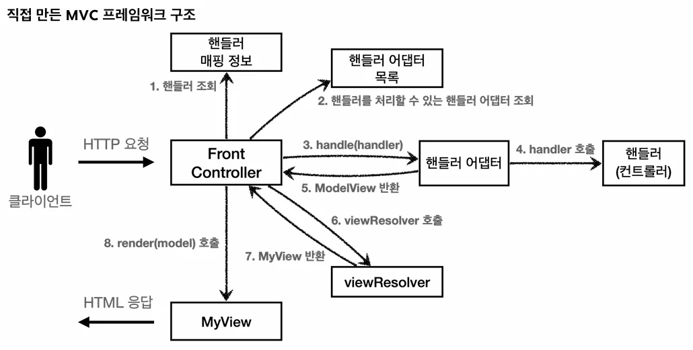
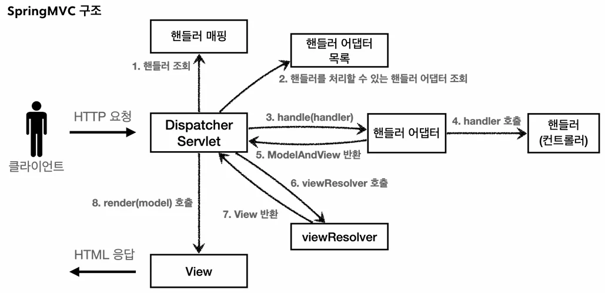

# [스프링 MVC 1편 - 백엔드 웹 개발 핵심 기술] 6. 스프링 MVC - 구조 이해

## 원문

https://ch010104.tistory.com/261

## 노트 유형

`tutorial`

## 학습 목표 및 맥락

스프링 MVC는 프론트 컨트롤러 패턴으로 구현되어 있으며, 그 핵심은 DispatcherServlet입니다.

FrontController → DispatcherServlet

## 원문 기반 학습 정리

### 1. 스프링 MVC 전체 구조

스프링 MVC는 프론트 컨트롤러 패턴으로 구현되어 있으며, 그 핵심은 DispatcherServlet입니다.

### 1.1 직접 만든 프레임워크 vs 스프링 MVC 비교

FrontController → DispatcherServlet

handlerMapping Map → HandlerMapping (인터페이스)

MyHandlerAdapter → HandlerAdapter (인터페이스)

ModelView → ModelAndView

viewResolver → ViewResolver (인터페이스)

MyView → View (인터페이스)

### 1.2 DispatcherServlet 구조

org.springframework.web.servlet.DispatcherServlet

부모 클래스에서 HttpServlet을 상속받아 서블릿으로 동작합니다. (DispatcherServlet → FrameworkServlet → HttpServletBean → HttpServlet)

스프링 부트는 DispatcherServlet을 서블릿으로 자동 등록하며 모든 경로(urlPatterns="/")에 대해 매핑합니다.

### 1.3 동작 순서 (중요)

핸들러 조회: 핸들러 매핑을 통해 URL에 매핑된 핸들러(컨트롤러)를 조회한다.

핸들러 어댑터 조회: 핸들러를 실행할 수 있는 핸들러 어댑터를 조회한다.

핸들러 어댑터 실행: 디스패처 서블릿이 어댑터를 실행한다.

핸들러 실행: 어댑가 실제 핸들러(컨트롤러)를 호출한다.

ModelAndView 반환: 어댑터는 핸들러의 반환 정보를 ModelAndView로 변환하여 반환한다.

viewResolver 호출: 뷰 리졸버를 찾아 실행한다.

View 반환: 뷰 리졸버는 뷰의 논리 이름을 물리 이름으로 바꾸고, 렌더링 역할을 담당하는 뷰 객체를 반환한다.

뷰 렌더링: 뷰 객체를 통해 뷰를 렌더링한다.

### 2. 핸들러 매핑과 핸들러 어댑터

### 2.1 과거의 컨트롤러 인터페이스와 구현 예시

스프링 부트가 자동 등록하는 핸들러 매핑과 어댑터의 동작을 이해하기 위한 예시 코드입니다.

### 1) Controller 인터페이스 기반 (OldController)

BeanNameUrlHandlerMapping과 SimpleControllerHandlerAdapter가 사용됩니다.

```java
package com.example.spring_mvc_study1_servlet.web.springmvc.old;

import jakarta.servlet.http.HttpServletRequest;
import jakarta.servlet.http.HttpServletResponse;
import org.springframework.stereotype.Component;
import org.springframework.web.servlet.ModelAndView;
import org.springframework.web.servlet.mvc.Controller;

@Component("/springmvc/old-controller")
public class OldController implements Controller {

    @Override
    public ModelAndView handleRequest(HttpServletRequest request, HttpServletResponse response) throws Exception {
        System.out.println("OldController.handleRequest");
        return new ModelAndView("new-form");
    }

}
```

### 2) HttpRequestHandler 기반 (MyHttpRequestHandler)

BeanNameUrlHandlerMapping과 HttpRequestHandlerAdapter가 사용됩니다. 서블릿과 가장 유사한 형태입니다.

```java
package com.example.spring_mvc_study1_servlet.web.springmvc.old;

import jakarta.servlet.ServletException;
import jakarta.servlet.http.HttpServletRequest;
import jakarta.servlet.http.HttpServletResponse;
import org.springframework.stereotype.Component;
import org.springframework.web.HttpRequestHandler;

import java.io.IOException;

@Component("/springmvc/request-handler")
public class MyHttpRequestHandler implements HttpRequestHandler {
    @Override
    public void handleRequest(HttpServletRequest request, HttpServletResponse response) throws ServletException, IOException {
        System.out.println("MyHttpRequestHandler.handleRequest");
    }
}
```

### 2.2 스프링 부트가 자동 등록하는 주요 빈 (우선순위 순)

HandlerMapping

RequestMappingHandlerMapping: 애노테이션 기반(@RequestMapping)

BeanNameUrlHandlerMapping: 스프링 빈의 이름으로 핸들러 검색 (위의 예시 코드에서 사용됨)

HandlerAdapter

RequestMappingHandlerAdapter: 애노테이션 기반

HttpRequestHandlerAdapter: HttpRequestHandler 인터페이스 처리 (2번 예시)

SimpleControllerHandlerAdapter: Controller 인터페이스 처리 (1번 예시)

### 3. 뷰 리졸버 (ViewResolver)

스프링 부트는 InternalResourceViewResolver를 자동으로 등록하며, application.properties의 설정 정보를 사용합니다.

```text
spring.mvc.view.prefix=/WEB-INF/views/
spring.mvc.view.suffix=.jsp
```

### 4. 스프링 MVC 시작하기 (V1 ~ V3)

### 4.1 V1: 애노테이션 기반 컨트롤러 (@Controller)

```java
package com.example.spring_mvc_study1_servlet.web.springmvc.v1;

import org.springframework.stereotype.Controller;
import org.springframework.web.bind.annotation.RequestMapping;
import org.springframework.web.servlet.ModelAndView;

@Controller
public class SpringMemberFormControllerV1 {
    @RequestMapping("/springmvc/v1/members/new-form")
    public ModelAndView process() {
        return new ModelAndView("new-form"); // viewreSolver가 /WEB-INF/views/new-form.jsp의 물리 주소로 바꾸어서 찾아줌
    }
}
```

```java
package com.example.spring_mvc_study1_servlet.web.springmvc.v1;

import com.example.spring_mvc_study1_servlet.domain.Member.Member;
import com.example.spring_mvc_study1_servlet.domain.Member.MemberRepository;
import jakarta.servlet.http.HttpServletRequest;
import jakarta.servlet.http.HttpServletResponse;
import org.springframework.stereotype.Controller;
import org.springframework.web.bind.annotation.RequestMapping;
import org.springframework.web.servlet.ModelAndView;

@Controller
public class SpringMemberSaveControllerV1 {

    private MemberRepository memberRepository = MemberRepository.getInstance();

    @RequestMapping("/springmvc/v1/members/save")
    public ModelAndView process(HttpServletRequest request, HttpServletResponse response) {
        String username = request.getParameter("username");
        int age = Integer.parseInt(request.getParameter("age"));

        Member member = new Member(username, age);
        System.out.println("member = " + member);
        memberRepository.save(member);

        ModelAndView mv = new ModelAndView("save-result");
        mv.addObject("member", member);

        return mv;
    }

}
```

```java
package com.example.spring_mvc_study1_servlet.web.springmvc.v1;

import com.example.spring_mvc_study1_servlet.domain.Member.Member;
import com.example.spring_mvc_study1_servlet.domain.Member.MemberRepository;
import org.springframework.stereotype.Controller;
import org.springframework.web.bind.annotation.RequestMapping;
import org.springframework.web.servlet.ModelAndView;

import java.util.List;

@Controller
public class SpringMemberListControllerV1 {

    private MemberRepository memberRepository = MemberRepository.getInstance();

    @RequestMapping("/springmvc/v1/members")
    public ModelAndView process() {
        List<Member> members = memberRepository.findAll();

        ModelAndView mv = new ModelAndView("members");
        mv.addObject("members", members);

        return mv;
    }
}
```

> 원문 코드가 길어 이 노트에서는 앞부분만 보존했습니다. 전체는 원문에서 확인합니다.

### 4.2 V2: 컨트롤러 통합 (클래스 레벨 매핑)

```java
package com.example.spring_mvc_study1_servlet.web.springmvc.v2;

import com.example.spring_mvc_study1_servlet.domain.Member.Member;
import com.example.spring_mvc_study1_servlet.domain.Member.MemberRepository;
import jakarta.servlet.http.HttpServletRequest;
import jakarta.servlet.http.HttpServletResponse;
import org.springframework.stereotype.Controller;
import org.springframework.web.bind.annotation.RequestMapping;
import org.springframework.web.servlet.ModelAndView;

import java.util.List;

/**
 * 클래스 단위 -> 메서드 단위
 * @RequestMapping 클래스 레벨과 메서드 레벨 조합
 */
@Controller
@RequestMapping("/springmvc/v2/members")
public class SpringMemberControllerV2 {
    private MemberRepository memberRepository = MemberRepository.getInstance();

    @RequestMapping("/new-form")
    public ModelAndView newForm() {
        return new ModelAndView("new-form");
    }

    @RequestMapping("/save")
    public ModelAndView save(HttpServletRequest request, HttpServletResponse response) {
        String username = request.getParameter("username");
        int age = Integer.parseInt(request.getParameter("age"));

        Member member = new Member(username, age);
        memberRepository.save(member);

        ModelAndView mav = new ModelAndView("save-result");
        mav.addObject("member", member);

        return mav;
    }

    @RequestMapping
    public ModelAndView members() {
        List<Member> members = memberRepository.findAll();

        ModelAndView mav = new ModelAndView("members");
        mav.addObject("members", members);

        return mav;
    }

}
```

### 4.3 V3: 실용적인 방식 (실무 주 사용)

```java
package com.example.spring_mvc_study1_servlet.web.springmvc.v3;

import com.example.spring_mvc_study1_servlet.domain.Member.Member;
import com.example.spring_mvc_study1_servlet.domain.Member.MemberRepository;
import jakarta.servlet.http.HttpServletRequest;
import jakarta.servlet.http.HttpServletResponse;
import org.springframework.stereotype.Controller;
import org.springframework.ui.Model;
import org.springframework.web.bind.annotation.*;
import org.springframework.web.servlet.ModelAndView;

import java.util.List;

@Controller
@RequestMapping("/springmvc/v3/members")
public class SpringMemberControllerV3 {
    private MemberRepository memberRepository = MemberRepository.getInstance();

    // @RequestMapping(value = "/new-form", method = RequestMethod.GET)
    // method를 지정해주면서, 이 함수는 GET 요청인 경우에만 호출
    // 이전에는 value만 맞으면 GET, POST 등 어떤 요청이어서 호출되었음
    @GetMapping("/new-form") // 위의 코드와 완전 동일한 기능
    public String newForm() {
        return "new-form";
    }

    // @RequestMapping(value = "/save", method = RequestMethod.POST)
    @PostMapping("/save") // 위의 코드와 완전 동일한 기능
    // requset, response 없이 "username" 자체를 Param으로 String 변수로 받을 수 있음
    public String save(
            @RequestParam("username") String username,
            @RequestParam("age") int age,
            Model model) {

        // String username = request.getParameter("username");
        // int age = Integer.parseInt(request.getParameter("age"));

        Member member = new Member(username, age);
        memberRepository.save(member);

        model.addAttribute("member", member);
        // ModelAndView mav = new ModelAndView("save-result");
        // mav.addObject("member", member);

        return "save-result";
    }

    // @RequestMapping(method = RequestMethod.GET)
    @GetMapping // 위의 코드와 완전 동일한 기능
    public String members(Model model) {
        List<Member> members = memberRepository.findAll();

        // ModelAndView mav = new ModelAndView("members");
        // mav.addObject("members", members);

        model.addAttribute("members", members);

        return "members";
    }

}
```

### 5. 정리

DispatcherServlet이 핵심이며, 유연한 확장을 위해 인터페이스(Mapping, Adapter, ViewResolver)를 제공합니다.

실무에서는 99.9% RequestMappingHandlerMapping/Adapter를 사용하는 V3 방식을 택합니다.

## 핵심 이미지





## 관련 글

- [[blog/INFLEARN/index|INFLEARN]]
- [[blog/INFLEARN/스프링 MVC 1편 - 백엔드 웹 개발 핵심 기술- 5. MVC 프레임워크 만들기|[스프링 MVC 1편 - 백엔드 웹 개발 핵심 기술] 5. MVC 프레임워크 만들기]]
- [[blog/INFLEARN/스프링 MVC 1편 - 백엔드 웹 개발 핵심 기술- 4. 서블릿, JSP, MVC 패턴|[스프링 MVC 1편 - 백엔드 웹 개발 핵심 기술] 4. 서블릿, JSP, MVC 패턴]]
- [[blog/INFLEARN/스프링 MVC 1편 - 백엔드 웹 개발 핵심 기술- 1. 웹 애플리케이션의 이해 - 서블릿(Servlet)과 쓰레드(Thread)|[스프링 MVC 1편 - 백엔드 웹 개발 핵심 기술] 1. 웹 애플리케이션의 이해 - 서블릿(Servlet)과 쓰레드(Thread)]]
