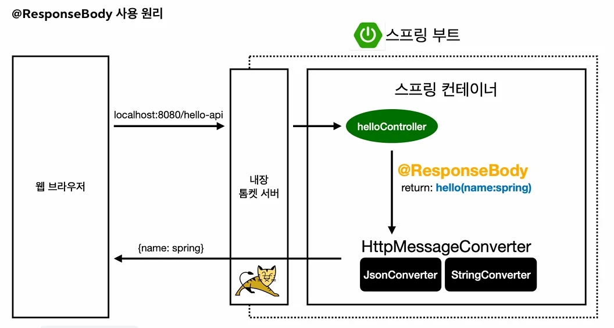
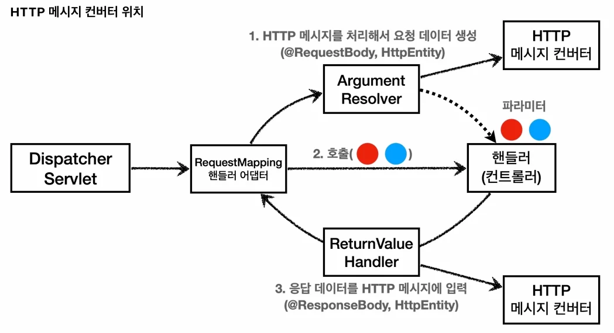
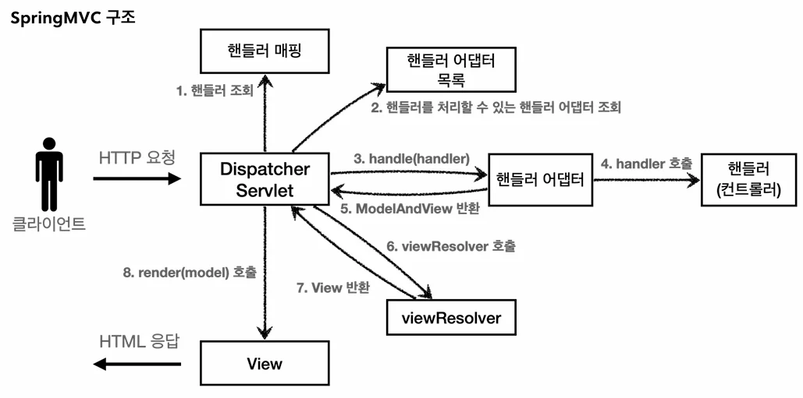

# [스프링 MVC 1편 - 백엔드 웹 개발 핵심 기술] 7. 스프링 MVC - 기본 기능

## 원문

https://ch010104.tistory.com/263

## 노트 유형

`tutorial`

## 학습 목표 및 맥락

실무 운영 시스템에서는 System.out.println()을 사용하여 콘솔에 정보를 출력하지 않고, 별도의 로깅 라이브러리를 사용합니다.

스프링 부트 로깅 라이브러리(spring-boot-starter-logging)는 기본적으로 다음을 사용합니다.

## 원문 기반 학습 정리

### 1. 로깅 (Logging)

실무 운영 시스템에서는 System.out.println()을 사용하여 콘솔에 정보를 출력하지 않고, 별도의 로깅 라이브러리를 사용합니다.

### 1.1 로깅 라이브러리 구조

스프링 부트 로깅 라이브러리(spring-boot-starter-logging)는 기본적으로 다음을 사용합니다.

SLF4J: 로그 라이브러리들을 통합하여 제공하는 인터페이스입니다.

Logback: SLF4J의 구현체로, 실무에서 가장 많이 사용되는 로그 라이브러리 중 하나입니다. (그 외 Log4J, Log4J2 등이 있음)

### 1.2 LogTestController.java

```java
package com.example.spring_mvc_study1_mvc.basic;

import lombok.extern.slf4j.Slf4j;
import org.slf4j.Logger ;
import org.slf4j.LoggerFactory;
import org.springframework.web.bind.annotation.RequestMapping;
import org.springframework.web.bind.annotation.RestController;

@Slf4j
@RestController
// @Controller + @ResponseBody 임
// 메서드가 반환하는 객체(객체, 리스트, 문자열 등)를 자동으로 JSON 형식으로 변환하여 HTTP 응답 본문(Response Body)에 담아 보냅
public class LogTestController {

    // org.slf4j.Logger, org.slf4j.LoggerFactory 사용 -> @Slf4j 어노태이션과 같은 기능
    // private final Logger log = LoggerFactory.getLogger(getClass());

    @RequestMapping("/log-test")
    public String logTest() {
        String name = "Spring";

        // {} 안에 name이 치환되는 것
        log.trace("trace log={}", name);
        log.debug("debug log={}", name);

        log.info("info log={}", name);
        log.warn("warn log={}", name);
        log.error("error log={}", name);

        // 해당 단계의 로그를 사용하지 않아도 a+b 계산 로직이 먼저 실행 및 계산되어 메모리에 가지고 있음
        // 로그 단계가 debuf로 설정되어 있어서, trace 로그는 계산할 필요가 없는데, JAVA 언어에서 "+" 연산의 경우, 먼저 계산해서 메모리에 가지고 있음
        // 쓰지도 않는데, 계산해서 메모리에 공간을 자치하기 때문에, 메모리 낭비
        // 이런 방식으로 사용하면 X
        // log.trace("String concat log=" + name);
        return "ok";

    }
}
```

### 1.3 로그 사용의 장점

쓰레드 정보, 클래스 이름 등 부가 정보를 함께 확인할 수 있습니다.

로그 레벨에 따라 출력 여부를 동적으로 조절할 수 있습니다 (개발 서버는 debug, 운영 서버는 info).

콘솔뿐만 아니라 파일, 네트워크 등 별도의 위치에 로그를 남길 수 있습니다 (일별, 용량별 분할 가능).

성능 면에서 System.out보다 월등히 좋습니다 (내부 버퍼링, 멀티 쓰레드 지원 등).

### 2. 요청 매핑 (Request Mapping)

### 2.1 매핑 기초 및 스프링 부트 3.0 변화

MappingController.java를 통해 다양한 매핑 방식을 확인합니다.

```java
package com.example.spring_mvc_study1_mvc.basic.requestmapping;

import lombok.extern.slf4j.Slf4j;
import org.springframework.web.bind.annotation.*;

@Slf4j
@RestController
// RestController는 return 결과를 ViewResolver를 거치지 않고, HttpMessageConverter가 동작해서 문자열 그대로를 response body에 전송함
public class MappingController {

    /**
     * 기본 요청
     * 둘다 허용 /hello-basic, /hello-basic/
     * HTTP 메서드 모두 허용 GET, HEAD, POST, PUT, PATCH, DELETE
     */
    @RequestMapping("/hello-basic")
    public String helloBasic() {
        log.info("hello-basic");
        return "ok";
    }

    /**
     * method 특정 HTTP 메서드 요청만 허용
     * GET, HEAD, POST, PUT, PATCH, DELETE
     */
    @RequestMapping(value = "/mapping-get-v1", method = RequestMethod.GET)
    public String mappingGetV1() {
        log.info("mappingGetV1");
        return "ok";
    }

    /**
     * 편리한 축약 애노테이션 (코드보기)
     * @GetMapping
     * @PostMapping
     * @PutMapping
     * @DeleteMapping
     * @PatchMapping
     */
    @GetMapping(value = "/mapping-get-v2")
    public String mappingGetV2() {
        log.info("mapping-get-v2");
        return "ok";
    }

    /**
     * PathVariable 사용 - Path Parameter 방식
     * 변수명이 같으면 생략 가능
     * @PathVariable("userId") String userId -> @PathVariable String userId
     */
    @GetMapping("/mapping/{userId}")
    public String mappingPath(@PathVariable("userId") String data) {
        log.info("mappingPath userId={}", data);
        return "ok";
    }

    /**
     * PathVariable 사용 다중
     */
    @GetMapping("/mapping/users/{userId}/orders/{orderId}")
    public String mappingPath(@PathVariable String userId, @PathVariable Long orderId) {
        log.info("mappingPath userId={}, orderId={}", userId, orderId);
        return "ok";
    }

    /**
     * 파라미터로 추가 매핑
     * params="mode",
     * params="!mode"
     * params="mode=debug"
     * params="mode!=debug" (! = )
     * params = {"mode=debug","data=good"}
     */
    @GetMapping(value = "/mapping-param", params = "mode=debug") // && 조건으로 value와 params가 붙기 때문에 두 조건을 모두 만족해야 해당 함수가 호출됨
    // /mapping-param?mode=debug 와 같은 형식의 요청일 때 매핑
    public String mappingParam() {
        log.info("mappingParam");
        return "ok";
    }

    /**
     * 특정 헤더로 추가 매핑
     * headers="mode",
     * headers="!mode"
     * headers="mode=debug"
     * headers="mode!=debug" (! = )
     */
    @GetMapping(value = "/mapping-header", headers = "mode=debug")
    // /mapping-header" 와 같은 형식의 요청 + 요청 header에 (key, value) -> (mode, debug)가 있어야만 매핑
    public String mappingHeader() {
        log.info("mappingHeader");
        return "ok";
    }

    /**
     * Content-Type 헤더 기반 추가 매핑 Media Type
     * consumes="application/json"
     * consumes="!application/json"
     * consumes="application/*"
     * consumes="*\\/*"
     * MediaType.APPLICATION_JSON_VALUE
     */
    @PostMapping(value = "/mapping-consume", consumes = "application/json")
    // /mapping-consume" 과 같은 형식의 요청 + 요청 header의 Content-Type이 "application/json"일 경우 매핑
    // Content-Type : 전송하는 body에 담긴 데이터의 형식이 어떤 형식인지
    public String mappingConsumes() {
        log.info("mappingConsumes");
        return "ok";
    }

    /**
     * Accept 헤더 기반 Media Type
     * produces = "text/html"
     * produces = "!text/html"
     * produces = "text/*"
     * produces = "*\\/*"
     */
    @PostMapping(value = "/mapping-produce", produces = "text/html")
    // /mapping-produce" 과 같은 형식의 요청 + 요청 header의 Accept가 "text/html"일 경우 매핑
    // Accept : 클라이언트가 서버에게 나는 이런 형식의 데이터를 이해할 수 있으니, 결과물을 어떤 형식으로 받을지
    public String mappingProduces() {
        log.info("mappingProduces");
        return "ok";
    }
}
```

### 2.2 API 예시: MappingClassController.java

클래스 레벨에 매핑 정보를 두어 메서드 레벨과 조합하여 사용합니다.

```java
package com.example.spring_mvc_study1_mvc.basic.requestmapping;

import lombok.extern.slf4j.Slf4j;
import org.springframework.web.bind.annotation.*;

@RestController
@RequestMapping("/mapping/users")
public class MappingClassController {

    /**
     * GET /mapping/users
     */
    @GetMapping
    public String users() {
        return "get users";
    }

    /**
     * POST /mapping/users
     */
    @PostMapping
    public String addUser() {
        return "post user";
    }

    /**
     * GET /mapping/users/{userId}
     */
    @GetMapping("/{userId}")
    public String findUser(@PathVariable String userId) {
        return "get userId=" + userId;
    }

    /**
     * PATCH /mapping/users/{userId}
     */
    @PatchMapping("/{userId}")
    public String updateUser(@PathVariable String userId) {
        return "update userId=" + userId;
    }

    /**
     * DELETE /mapping/users/{userId}
     */
    @DeleteMapping("/{userId}")
    public String deleteUser(@PathVariable String userId) {
        return "delete userId=" + userId;
    }

}
```

### 3. HTTP 요청 조회 - 파라미터 및 헤더

### 3.1 헤더 정보 조회: RequestHeaderController.java

```java
package com.example.spring_mvc_study1_mvc.basic.request;

import jakarta.servlet.http.HttpServletRequest;
import jakarta.servlet.http.HttpServletResponse;
import lombok.extern.slf4j.Slf4j;
import org.springframework.http.HttpMethod;
import org.springframework.util.MultiValueMap;
import org.springframework.web.bind.annotation.CookieValue;
import org.springframework.web.bind.annotation.RequestHeader;
import org.springframework.web.bind.annotation.RequestMapping;
import org.springframework.web.bind.annotation.RestController;

import java.util.Locale;

@Slf4j
@RestController
public class RequestHeaderController {

    @RequestMapping("/headers")
    public String headers(HttpServletRequest request,
                          HttpServletResponse response,
                          HttpMethod httpMethod,
                          Locale locale, // 언어 정보(ko_KR)
                          // MultiValueMap 는 하나의 key에 여러 value를 받을 수 있음. 배열이 반환됨
                          @RequestHeader MultiValueMap<String, String> headerMap, // 헤더를 여러개 한번에 받음
                          @RequestHeader("host") String host, // 헤더 중에서 "host"를 받음
                          @CookieValue(value = "myCookie", required = false) String cookie) { // "myCookie"라는 value의 쿠키를 받음

        log.info("request={}", request);
        log.info("response={}", response);
        log.info("httpMethod={}", httpMethod);
        log.info("locale={}", locale);
        log.info("headerMap={}", headerMap);
        log.info("header host={}", host);
        log.info("myCookie={}", cookie);
        return "ok";
    }

}
```

MultiValueMap: 하나의 키에 여러 값을 받을 때 사용합니다. (예: keyA=value1&keyA=value2)

### 3.2 요청 파라미터 조회: RequestParamController.java

GET 쿼리 파라미터 방식과 POST HTML Form 방식은 둘 다 요청 파라미터 형식으로 조회 가능합니다.

```java
package com.example.spring_mvc_study1_mvc.basic.request;

import com.example.spring_mvc_study1_mvc.basic.HelloData;
import jakarta.servlet.http.HttpServletRequest;
import jakarta.servlet.http.HttpServletResponse;
import lombok.extern.slf4j.Slf4j;
import org.springframework.stereotype.Controller;
import org.springframework.web.bind.annotation.ModelAttribute;
import org.springframework.web.bind.annotation.RequestMapping;
import org.springframework.web.bind.annotation.RequestParam;
import org.springframework.web.bind.annotation.ResponseBody;

import java.io.IOException;
import java.util.Map;

@Slf4j
@Controller
public class RequestParamController {

    /**
     *
     반환 타입이 없으면서 이렇게 응답에 값을 직접 집어넣으면, view 조회X
     */
    @RequestMapping("/request-param-v1")
    public void requestParamV1(HttpServletRequest request, HttpServletResponse response) throws IOException {
        String username = request.getParameter("username");
        int age = Integer.parseInt(request.getParameter("age"));

        log.info("username={}, age={}", username, age);
        response.getWriter().write("ok");
    }

    /**
     * * @RequestParam 사용
     * - 파라미터 이름으로 바인딩
     * @ResponseBody 추가("ok"라는 문자열을 HTTP 응답 메시지에 넣어서 반환)
     * - View 조회를 무시하고, HTTP message body에 직접 해당 내용 입력
     */
    @ResponseBody
    @RequestMapping("/request-param-v2")
    public String requestParamV2(@RequestParam("username") String memberName, @RequestParam("age") int memberAge) {
        log.info("username={}, age={}", memberName, memberAge);
        return "ok";
    }

    /**
     * @RequestParam 사용
     * HTTP 파라미터 이름이 변수 이름과 같으면 @RequestParam(name="xx") 생략 가능
     */
    @ResponseBody
    @RequestMapping("/request-param-v3")
    public String requestParamV3(@RequestParam String username, @RequestParam int age) {
        log.info("username={}, age={}", username, age);
        return "ok";
    }

    /**
     * @RequestParam 사용
     * String, int, Integer 등의 단순 타입이면 @RequestParam 도 생략 가능
     */
    @ResponseBody
    @RequestMapping("/request-param-v4")
    public String requestParamV4(String username, int age) {
        log.info("username={}, age={}", username, age);
        return "ok";
    }

    /**
     * @RequestParam.required
     * /request-param-required -> username이 없으므로 예외
     *
     * 주의!
     * /request-param-required?username= -> 빈문자로 통과
     *
     * 주의!
     * /request-param-required
     * int age -> null을 int에 입력하는 것은 불가능, 따라서 Integer 변경해야 함(또는 다음에 나오는 defaultValue 사용)
     */
    @ResponseBody
    @RequestMapping("/request-param-required")
    public String requestParamRequired(@RequestParam(required = true) String username, @RequestParam(required = false) Integer age) {
        log.info("username={}, age={}", username, age);
        return "ok";
    }

    /**
     * @RequestParam
     * - defaultValue 사용
     *
     * 참고: defaultValue는 빈 문자의 경우에도 적용
     * /request-param-default?username= -> username=guest 로 들어옴
     */
    @ResponseBody
    @RequestMapping("/request-param-default")
    public String requestParamDefault(@RequestParam(required = true, defaultValue = "guest") String username, @RequestParam(required = false, defaultValue = "-1") int age) {
        log.info("username={}, age={}", username, age);
        return "ok";
    }

    /**
     * @RequestParam Map, MultiValueMap -> 둘다 사용 가능하다
     * Map(key=value)
     * MultiValueMap(key=[value1, value2, ...]) ex) (key=userIds, value=[id1, id2]) -> /request-param-map?userIds=id1&userIds=id2 와 같은 형식일 경우
     */
    @ResponseBody
    @RequestMapping("/request-param-map")
    public String requestParamMap(@RequestParam Map<String, Object> paramMap) { // 어떤 형태의 value가 들어올지 모르기 때문에 Object
        log.info("username={}, age={}", paramMap.get("username"), paramMap.get("age"));
        return "ok";
    }

    /**
     * @ModelAttribute 사용
     * 참고: model.addAttribute(helloData) 코드도 함께 자동 적용됨, 뒤에 model을 설명할 때 자세히 설명
     * 요청 파라미터 이름으로 'HelloData' 객체의 속성을 찾음 -> 그 후, 해당 속성의 setter를 호출해서 값을 넣음(즉, HelloData 객체에 setter가 있어야함)
     */
    @ResponseBody
    @RequestMapping("/model-attribute-v1")
    public String modelAttributeV1(@ModelAttribute HelloData helloData) { // (@RequestParam String username, @RequestParam int age) 와 같은 기능
//        HelloData helloData = new HelloData();
//        helloData.setUsername(username);
//        helloData.setAge(age);

        log.info("username={}, age={}", helloData.getUsername(), helloData.getAge());
        return "ok";
    }

    /**
     * @ModelAttribute 생략 가능
     * String, int 같은 단순 타입 = @RequestParam
     * argument resolver 로 지정해둔 타입 외 = @ModelAttribute
     */
    @ResponseBody
    @RequestMapping("/model-attribute-v2")
    public String modelAttributeV2(HelloData helloData) {
        log.info("username={}, age={}", helloData.getUsername(), helloData.getAge());
        return "ok";
    }
}
```

### 주의! 스프링 부트 3.2 파라미터 이름 인식 문제

스프링 부트 3.2부터 자바 컴파일러에 -parameters 옵션을 넣어야 애노테이션의 이름을 생략할 수 있습니다. 이름이 생략되어 예외가 발생하면 애노테이션에 이름을 명시(@RequestParam("username"))하는 것이 가장 권장되는 해결 방안입니다.

### 3.3 @ModelAttribute - 객체 바인딩

요청 파라미터를 받아 객체를 생성하고 값을 넣어주는 과정을 자동화합니다.

```java
@Data // @Getter, @Setter, @ToString, @EqualsAndHashCode 등을 자동 적용
public class HelloData {
    private String username;
    private int age;
}

@ResponseBody
@RequestMapping("/model-attribute-v1")
public String modelAttributeV1(@ModelAttribute HelloData helloData) {
    log.info("username={}, age={}", helloData.getUsername(), helloData.getAge());
    return "ok";
}
```

동작 방식: HelloData 객체 생성 -> 파라미터 이름으로 프로퍼티(getter/setter)를 찾아 호출하여 값을 바인딩합니다.

생략 규칙: 스프링은 단순 타입(String, int 등)은 @RequestParam으로, 나머지는 @ModelAttribute로 생략 시 자동 처리합니다 (Argument Resolver로 등록된 타입 제외).

### 4. HTTP 요청 메시지 - Body 데이터 조회 (JSON/Text)

HTTP 메시지 바디를 통해 데이터가 직접 넘어오는 경우(JSON, XML, Text)는 @RequestParam 등을 사용할 수 없습니다.

### 4.1 단순 텍스트 조회: RequestBodyStringController.java

```java
package com.example.spring_mvc_study1_mvc.basic.request;

import jakarta.servlet.ServletInputStream;
import jakarta.servlet.http.HttpServletRequest;
import jakarta.servlet.http.HttpServletResponse;
import lombok.extern.slf4j.Slf4j;
import org.springframework.http.HttpEntity;
import org.springframework.stereotype.Controller;
import org.springframework.util.StreamUtils;
import org.springframework.web.bind.annotation.PostMapping;
import org.springframework.web.bind.annotation.RequestBody;
import org.springframework.web.bind.annotation.ResponseBody;

import java.io.IOException;
import java.io.InputStream;
import java.io.Writer;
import java.nio.charset.StandardCharsets;

@Slf4j
@Controller
public class RequsetBodyStringController {

    @PostMapping("/request-body-string-v1")
    public void requestBodyString(HttpServletRequest request, HttpServletResponse response) throws IOException {

        ServletInputStream inputStream = request.getInputStream();
        String messageBody = StreamUtils.copyToString(inputStream, StandardCharsets.UTF_8);

        log.info("messageBody={}", messageBody);
        response.getWriter().write("ok");
    }

    /**
     * InputStream(Reader): HTTP 요청 메시지 바디의 내용을 직접 조회
     * OutputStream(Writer): HTTP 응답 메시지의 바디에 직접 결과 출력
     */
    @PostMapping("/request-body-string-v2")
    public void requestBodyStringV2(InputStream inputStream, Writer responseWriter) throws IOException {

        String messageBody = StreamUtils.copyToString(inputStream, StandardCharsets.UTF_8);

        log.info("messageBody={}", messageBody);
        responseWriter.write("ok");
    }

    /**
     * HttpEntity: HTTP header, body 정보를 편리하게 조회
     * - 메시지 바디 정보를 직접 조회(@RequestParam X, @ModelAttribute X)
     * - HttpMessageConverter 사용 -> StringHttpMessageConverter 적용
     *
     * 응답에서도 HttpEntity 사용 가능
     * - 메시지 바디 정보 직접 반환(view 조회X)
     * - HttpMessageConverter 사용 -> StringHttpMessageConverter 적용
     */
    @PostMapping("/request-body-string-v3")
    public HttpEntity<String> requestBodyStringV3(HttpEntity<String> httpEntity) {

        String messageBody = httpEntity.getBody(); // HttpMessageConverter가 알아서 변환해줌

        log.info("messageBody={}", messageBody);
        return new HttpEntity<>("ok");
    }

    /**
     * @RequestBody
     * - 메시지 바디 정보를 직접 조회(@RequestParam X, @ModelAttribute X)
     * - HttpMessageConverter 사용 -> StringHttpMessageConverter 적용
     *
     * @ResponseBody
     * - 메시지 바디 정보 직접 반환(view 조회X)
     * - HttpMessageConverter 사용 -> StringHttpMessageConverter 적용
     */
    @ResponseBody
    @PostMapping("/request-body-string-v4")
    public String requestBodyStringV4(@RequestBody String messageBody) {

        log.info("messageBody={}", messageBody);
        return "ok";
    }

}
```

> 원문 코드가 길어 이 노트에서는 앞부분만 보존했습니다. 전체는 원문에서 확인합니다.

### 4.2 JSON 데이터 조회: RequestBodyJsonController.java

```java
package com.example.spring_mvc_study1_mvc.basic.request;

import com.example.spring_mvc_study1_mvc.basic.HelloData;
import com.fasterxml.jackson.databind.ObjectMapper;
import jakarta.servlet.ServletInputStream;
import jakarta.servlet.http.HttpServletRequest;
import jakarta.servlet.http.HttpServletResponse;
import lombok.extern.slf4j.Slf4j;
import org.springframework.http.HttpEntity;
import org.springframework.stereotype.Controller;
import org.springframework.util.StreamUtils;
import org.springframework.web.bind.annotation.PostMapping;
import org.springframework.web.bind.annotation.RequestBody;
import org.springframework.web.bind.annotation.ResponseBody;

import java.io.IOException;
import java.nio.charset.StandardCharsets;

/**
 * {"username":"hello", "age":20}
 * content-type: application/json
 */
@Slf4j
@Controller
public class RequestBodyJsonController {

    private ObjectMapper objectMapper = new ObjectMapper();

    @PostMapping("/request-body-json-v1")
    public void requestBodyJsonV1(HttpServletRequest request, HttpServletResponse response) throws IOException {

        ServletInputStream inputStream = request.getInputStream();

        String messageBody = StreamUtils.copyToString(inputStream, StandardCharsets.UTF_8);
        log.info("messageBody={}", messageBody);

        HelloData data = objectMapper.readValue(messageBody, HelloData.class); // 텍스트를 ObjectMapper를 사용해서 HelloData에 맞게 넣어줌
        log.info("username={}, age={}", data.getUsername(), data.getAge());

        response.getWriter().write("ok");
    }

    /**
     * @RequestBody
     * HttpMessageConverter 사용 -> StringHttpMessageConverter 적용
     *
     * @ResponseBody
     * - 모든 메서드에 @ResponseBody 적용
     * - 메시지 바디 정보 직접 반환(view 조회X)
     * - HttpMessageConverter 사용 -> StringHttpMessageConverter 적용
     */
    @ResponseBody
    @PostMapping("/request-body-json-v2")
    public String requestBodyJsonV2(@RequestBody String messageBody) throws IOException {

        HelloData data = objectMapper.readValue(messageBody, HelloData.class);

        log.info("username={}, age={}", data.getUsername(), data.getAge());

        return "ok";
    }

    /**
     * @RequestBody 생략 불가능(@ModelAttribute 가 적용되어 버림 - 요청 파라미터를 꺼내려고 함)
     * HttpMessageConverter 사용 -> MappingJackson2HttpMessageConverter (content-type:application/json)
     *
     */
    @ResponseBody
    @PostMapping("/request-body-json-v3")
    public String requestBodyJsonV3(@RequestBody HelloData data) {

        log.info("username={}, age={}", data.getUsername(), data.getAge());

        return "ok";
    }

    @ResponseBody
    @PostMapping("/request-body-json-v4")
    public String requestBodyJsonV4(HttpEntity<HelloData> httpEntity) {

        HelloData data = httpEntity.getBody();

        log.info("username={}, age={}", data.getUsername(), data.getAge());
        return "ok";
    }

    /**
     * @RequestBody 생략 불가능(@ModelAttribute 가 적용되어 버림)
     * HttpMessageConverter 사용 -> MappingJackson2HttpMessageConverter (content-type:application/json)
     * JSON 요청 -> HTTP 메시지 컨버터 -> 객체
     *
     * @ResponseBody 적용
     * - 메시지 바디 정보 직접 반환(view 조회X)
     * - HttpMessageConverter 사용 -> MappingJackson2HttpMessageConverter 적용(Accept:application/json)
     *  객체 -> HTTP 메시지 컨버터 -> JSON 응답
     */
    @ResponseBody
    @PostMapping("/request-body-json-v5")
    public HelloData requestBodyJsonV5(@RequestBody HelloData data) { // 반환값도 String이 아닌 HelloData 객체로 반환함

        log.info("username={}, age={}", data.getUsername(), data.getAge());

        return data; // {"username":"hello", "age":20} 의 형태로 응답이 옴
    }

}
```

### 5. HTTP 응답 처리

### 5.1 응답의 3가지 방식

정적 리소스: 변경 없이 파일 그대로 서비스 (/static, /public 등).

뷰 템플릿: 동적인 HTML 생성 제공 (/templates).

HTTP 메시지: API 제공 시 바디에 직접 데이터 입력 (JSON 등).

### 5.2 뷰 템플릿 호출: ResponseViewController.java

```java
package com.example.spring_mvc_study1_mvc.basic.response;

import org.springframework.stereotype.Controller;
import org.springframework.ui.Model;
import org.springframework.web.bind.annotation.RequestMapping;
import org.springframework.web.servlet.ModelAndView;

@Controller
public class ResponseViewController {
    @RequestMapping("/response-view-v1")
    public ModelAndView responseViewV1() {
        ModelAndView mav = new ModelAndView("response/hello")
                .addObject("data", "hello!");

        return mav;
    }

    @RequestMapping("/response-view-v2")
    public String responseViewV2(Model model) {
        model.addAttribute("data", "hello!!");

        return "response/hello";
    }

    // 불명확해서 권장하지 않음, v2를 가장 일반적으로 사용
    @RequestMapping("/response/hello") // 컨트롤러의 경로 이름과 뷰의 논리적 이름이 같으면, 자동으로 return "response/hello" 가 있는 것처럼 동작
    public void responseViewV3(Model model) {
        model.addAttribute("data", "hello!!");
    }

    // 타임리프는 ThymeleafViewResolver에서 논리 주소를 물리 주소로 바꿈
    // 아래 2개가 default 값으로 application.properties 에 들어 있는 것임(바꾸고 싶으면, application.properties에서 변경 가능)
    // spring.thymeleaf.prefix=classpath:/templates/
    // spring.thymeleaf.suffix=.html
}
```

Thymeleaf 설정: 스프링 부트는 spring.thymeleaf.prefix=classpath:/templates/, suffix=.html을 기본으로 설정합니다.

### 5.3 HTTP API 응답: ResponseBodyController.java

```java
package com.example.spring_mvc_study1_mvc.basic.response;

import com.example.spring_mvc_study1_mvc.basic.HelloData;
import jakarta.servlet.http.HttpServletResponse;
import lombok.extern.slf4j.Slf4j;
import org.springframework.http.HttpStatus;
import org.springframework.http.ResponseEntity;
import org.springframework.stereotype.Controller;
import org.springframework.web.bind.annotation.GetMapping;
import org.springframework.web.bind.annotation.ResponseBody;
import org.springframework.web.bind.annotation.ResponseStatus;

import java.io.IOException;

@Slf4j
@Controller
//@RestController // -> 해당 컨드롤러 모두에게 @ResponseBody가 적용되는 효과가 있음
public class ResponseBodyController {

    // String
    @GetMapping("/response-body-string-v1")
    public void responseBodyV1(HttpServletResponse response) throws IOException{
        response.getWriter().write("ok");
    }

    /**
     * HttpEntity, ResponseEntity(Http Status 추가)
     *
     @return
     */
    @GetMapping("/response-body-string-v2")
    public ResponseEntity<String> responseBodyV2() {
        return new ResponseEntity<>("ok", HttpStatus.OK);
    }

    @ResponseBody
    @GetMapping("/response-body-string-v3")
    public String responseBodyV3() {
        return "ok";
    }

    // Json
    @GetMapping("/response-body-json-v1")
    public ResponseEntity<HelloData> responseBodyJsonV1() {
        HelloData helloData = new HelloData();
        helloData.setUsername("userA");
        helloData.setAge(20);
        return new ResponseEntity<>(helloData, HttpStatus.OK);
    }

    @ResponseStatus(HttpStatus.OK)
    // @ResponseStatus는 동적으로 HttpStatus를 변경할 수 없음. -> 동적으로 변경하고 싶을 경우에는 ResponseEntity를 사용
    @ResponseBody
    @GetMapping("/response-body-json-v2")
    public HelloData responseBodyJsonV2() {
        HelloData helloData = new HelloData();
        helloData.setUsername("userA");
        helloData.setAge(20);
        return helloData;
    }
}
```

### 6. 핵심 동작 원리

### 6.1 HTTP 메시지 컨버터 (HttpMessageConverter)





뷰 템플릿 대신 HTTP 바디에 직접 읽고 쓸 때 사용됩니다.

주요 컨버터:

ByteArrayHttpMessageConverter: byte[] 처리. 미디어타입 /*.

StringHttpMessageConverter: String 처리. 미디어타입 /*.

MappingJackson2HttpMessageConverter: 객체 또는 Map 처리. 미디어타입 application/json.

동작 원리: 요청 시에는 Content-Type을, 응답 시에는 Accept 헤더와 반환 타입을 체크하여 canRead(), canWrite()를 호출해 적절한 컨버터를 선택합니다.

### 6.2 요청 매핑 핸들러 어댑터 구조



스프링 MVC 구조에서 메시지 컨버터는 ArgumentResolver와 ReturnValueHandler 내부에서 호출됩니다.

ArgumentResolver (HandlerMethodArgumentResolver):

컨트롤러가 필요로 하는 다양한 파라미터(HttpServletRequest, @RequestParam, @RequestBody 등)를 생성하여 넘겨줍니다.

스프링은 30여 개 이상의 기본 리졸버를 제공합니다.

ReturnValueHandler (HandlerMethodReturnValueHandler):

컨트롤러의 반환 값(String, ModelAndView, @ResponseBody 객체 등)을 응답 형식에 맞춰 변환합니다.

스프링은 10여 개 이상의 기본 핸들러를 제공합니다.

### 6.3 확장 방법

필요한 경우 WebMvcConfigurer를 상속받아 기능을 확장할 수 있습니다.

```java
@Configuration
public class WebConfig implements WebMvcConfigurer {
    @Override
    public void addArgumentResolvers(List<HandlerMethodArgumentResolver> resolvers) {
        // 커스텀 ArgumentResolver 추가
    }

    @Override
    public void extendMessageConverters(List<HttpMessageConverter<?>> converters) {
        // 메시지 컨버터 추가 및 수정
    }
}
```

## 관련 글

- [[blog/INFLEARN/index|INFLEARN]]
- [[blog/INFLEARN/스프링 MVC 1편 - 백엔드 웹 개발 핵심 기술- 6. 스프링 MVC - 구조 이해|[스프링 MVC 1편 - 백엔드 웹 개발 핵심 기술] 6. 스프링 MVC - 구조 이해]]
- [[blog/INFLEARN/스프링 MVC 1편 - 백엔드 웹 개발 핵심 기술- 8. 스프링 MVC - 웹 페이지 만들기|[스프링 MVC 1편 - 백엔드 웹 개발 핵심 기술] 8. 스프링 MVC - 웹 페이지 만들기]]
- [[blog/INFLEARN/스프링 MVC 1편 - 백엔드 웹 개발 핵심 기술- 5. MVC 프레임워크 만들기|[스프링 MVC 1편 - 백엔드 웹 개발 핵심 기술] 5. MVC 프레임워크 만들기]]
