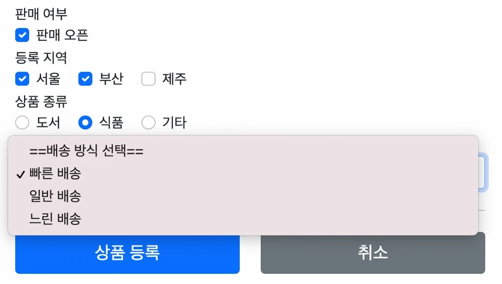

# [스프링 MVC 2편 - 백엔드 웹 개발 핵심 기술] 2. 타임리프 - 스프링 통합과 폼

## 원문

https://ch010104.tistory.com/277

## 노트 유형

`tutorial`

## 학습 목표 및 맥락

타임리프는 스프링 프레임워크와 유연하게 통합되어 단순한 뷰 템플릿 역할을 넘어선 강력한 엔터프라이즈 기능을 지원합니다.

스프링의 SpringEL 문법 통합: ${@myBean.doSomething()}과 같이 스프링 빈을 직접 호출할 수 있습니다.

## 원문 기반 학습 정리

### 1. 타임리프와 스프링 MVC 통합 개요

타임리프는 스프링 프레임워크와 유연하게 통합되어 단순한 뷰 템플릿 역할을 넘어선 강력한 엔터프라이즈 기능을 지원합니다.

### 스프링 통합으로 추가되는 주요 기능

스프링의 SpringEL 문법 통합: ${@myBean.doSomething()}과 같이 스프링 빈을 직접 호출할 수 있습니다.

편리한 폼(Form) 관리 속성: th:object, th:field, th:errors, th:errorclass 등을 제공합니다.

폼 컴포넌트의 편의 기능: 체크박스(Checkbox), 라디오 버튼(Radio button), 셀렉트 박스(Select/List)를 쉽게 렌더링하도록 돕습니다.

메시지 및 국제화 기능 통합: 스프링의 다국어 메시지 설정을 타임리프 템플릿 내에서 손쉽게 사용합니다.

검증(Validation) 및 오류 처리 통합: 스프링의 BindingResult와 연동하여 폼 필드 에러를 일괄 처리합니다.

변환 서비스(ConversionService) 통합: 스프링이 제공하는 포맷터 및 컨버터를 자동으로 적용합니다.

### 의존성 추가 (Spring Boot)

스프링 부트 환경에서는 아래의 단 한 줄의 의존성 선언만으로 타임리프 엔진 및 뷰 리졸버(View Resolver) 등의 설정이 자동화됩니다.

build.gradle

```java
implementation 'org.springframework.boot:spring-boot-starter-thymeleaf'
```

### 2. 입력 폼 처리 (Input Form Processing)

타임리프는 데이터 바인딩과 폼 생성을 자동화하기 위해 세 가지 핵심 속성을 제공합니다.

th:object: 폼에서 바인딩하여 사용할 커맨드 객체(Command Object)를 지정합니다.

{...}: 선택 변수 식(Selection Variable Expression). th:object로 지정된 객체의 프로퍼티에 간결하게 접근합니다.

th:field: HTML 태그의 id, name, value 속성을 자동으로 생성 및 관리합니다.

### th:field 렌더링 전후 비교

개발자가 작성한 타임리프 코드 (렌더링 전)

<input type="text" th:field="*{itemName}" />

서버가 해석하여 출력한 HTML 결과 (렌더링 후)

<input type="text" id="itemName" name="itemName" th:value="*{itemName}" />

### [코드] 등록 및 수정 폼 구현

### Controller: src/main/java/hello/itemservice/web/form/FormItemController.java (폼 진입 및 바인딩용 빈 객체 주입)

```java
package hello.itemservice.web.form;

import hello.itemservice.domain.item.Item;
import hello.itemservice.domain.item.ItemRepository;
import lombok.RequiredArgsConstructor;
import lombok.extern.slf4j.Slf4j;
import org.springframework.stereotype.Controller;
import org.springframework.ui.Model;
import org.springframework.web.bind.annotation.*;

@Slf4j
@Controller
@RequestMapping("/form/items")
@RequiredArgsConstructor
public class FormItemController {

    private final ItemRepository itemRepository;

    /**
     * 상품 등록 폼 진입
     * th:object 적용을 위해 값이 비어있는 빈 Item 객체를 생성하여 Model에 넘겨줍니다.
     */
    @GetMapping("/add")
    public String addForm(Model model) {
        model.addAttribute("item", new Item());
        return "form/addForm";
    }

    /**
     * 상품 수정 폼 진입
     */
    @GetMapping("/{itemId}/edit")
    public String editForm(@PathVariable Long itemId, Model model) {
        Item item = itemRepository.findById(itemId);
        model.addAttribute("item", item);
        return "form/editForm";
    }
}
```

### HTML (등록): src/main/resources/templates/form/addForm.html

```text
<form action="item.html" th:action th:object="${item}" method="post">
    <div>
        <label for="itemName">상품명</label>
        <!-- th:field를 사용하면 id, name 속성이 자동으로 itemName으로 지정됩니다. -->
        <input type="text" id="itemName" th:field="*{itemName}" class="form-control" placeholder="이름을 입력하세요">
    </div>
    <div>
        <label for="price">가격</label>
        <input type="text" id="price" th:field="*{price}" class="form-control" placeholder="가격을 입력하세요">
    </div>
    <div>
        <label for="quantity">수량</label>
        <input type="text" id="quantity" th:field="*{quantity}" class="form-control" placeholder="수량을 입력하세요">
    </div>
</form>
```

### HTML (수정): src/main/resources/templates/form/editForm.html

```text
<form action="item.html" th:action th:object="${item}" method="post">
    <div>
        <label for="id">상품 ID</label>
        <input type="text" id="id" th:field="*{id}" class="form-control" readonly>
    </div>
    <div>
        <label for="itemName">상품명</label>
        <input type="text" id="itemName" th:field="*{itemName}" class="form-control">
    </div>
    <div>
        <label for="price">가격</label>
        <input type="text" id="price" th:field="*{price}" class="form-control">
    </div>
    <div>
        <label for="quantity">수량</label>
        <input type="text" id="quantity" th:field="*{quantity}" class="form-control">
    </div>
</form>
```

### 3. 요구사항 추가 및 도메인 모델 설계

체크박스, 라디오 버튼, 셀렉트 박스의 다양한 상황(ENUM, Class, List 등)을 검증하기 위한 추가 요구사항 및 도메인 모델 설계입니다.

### 요구사항 목록



판매 여부 (단일 체크박스): Boolean 타입

등록 지역 (다중 체크박스): 서울, 부산, 제주 멀티 선택 (List 타입)

상품 종류 (라디오 버튼): 도서, 식품, 기타 중 단일 선택 (ENUM 타입)

배송 방식 (셀렉트 박스): 빠른/일반/느린 배송 중 단일 선택 (클래스 모델 객체 타입)

### [코드] 도메인 모델 구현

### ENUM: src/main/java/hello/itemservice/domain/item/ItemType.java (상품 종류)

```text
package hello.itemservice.domain.item;

public enum ItemType {
    BOOK("도서"), FOOD("식품"), ETC("기타");

    private final String description;

    ItemType(String description) {
        this.description = description;
    }

    public String getDescription() {
        return description;
    }
}
```

### Class: src/main/java/hello/itemservice/domain/item/DeliveryCode.java (배송 방식)

```java
package hello.itemservice.domain.item;

import lombok.AllArgsConstructor;
import lombok.Data;

/**
 * FAST: 빠른 배송
 * NORMAL: 일반 배송
 * SLOW: 느린 배송
 */
@Data
@AllArgsConstructor
public class DeliveryCode {
    private String code;         // 시스템 전달 값 (예: FAST)
    private String displayName;  // 사용자 노출 값 (예: 빠른 배송)
}
```

### Class: src/main/java/hello/itemservice/domain/item/Item.java (상품 정보 핵심 클래스)

```java
package hello.itemservice.domain.item;

import lombok.Data;
import java.util.List;

@Data
public class Item {
    private Long id;
    private String itemName;
    private Integer price;
    private Integer quantity;

    private Boolean open;              // 판매 여부 (단일 체크박스 바인딩용)
    private List<String> regions;      // 등록 지역 (멀티 체크박스 바인딩용)
    private ItemType itemType;         // 상품 종류 (라디오 버튼 바인딩용)
    private String deliveryCode;       // 배송 방식 (셀렉트 박스 바인딩용)

    public Item() {
    }

    public Item(String itemName, Integer price, Integer quantity) {
        this.itemName = itemName;
        this.price = price;
        this.quantity = quantity;
    }
}
```

### Class: src/main/java/hello/itemservice/domain/item/ItemRepository.java (데이터 수정 처리 추가)

```java
package hello.itemservice.domain.item;

import org.springframework.stereotype.Repository;
import java.util.ArrayList;
import java.util.HashMap;
import java.util.List;
import java.util.Map;

@Repository
public class ItemRepository {
    private static final Map<Long, Item> store = new HashMap<>();
    private static long sequence = 0L;

    public Item save(Item item) {
        item.setId(++sequence);
        store.put(item.getId(), item);
        return item;
    }

    public Item findById(Long id) {
        return store.get(id);
    }

    public List<Item> findAll() {
        return new ArrayList<>(store.values());
    }

    /**
     * 상품 수정 정보 반영 메서드 (신규 요구사항 반영)
     */
    public void update(Long itemId, Item updateParam) {
        Item findItem = findById(itemId);
        findItem.setItemName(updateParam.getItemName());
        findItem.setPrice(updateParam.getPrice());
        findItem.setQuantity(updateParam.getQuantity());

        // 새로 추가된 필드들 업데이트
        findItem.setOpen(updateParam.getOpen());
        findItem.setRegions(updateParam.getRegions());
        findItem.setItemType(updateParam.getItemType());
        findItem.setDeliveryCode(updateParam.getDeliveryCode());
    }

    public void clearStore() {
        store.clear();
    }
}
```

### 4. 단일 체크박스 처리 (Single Checkbox)

### HTML 스펙의 체크박스 제약과 스프링의 해결법

HTML 동작 원리: HTML checkbox는 체크되지 않은 상태로 폼을 제출하면, 클라이언트(브라우저)에서 서버로 아예 해당 필드 키 값 자체를 전송하지 않습니다.

서버에서의 부작용: 값이 공백으로 들어오는 수정 상황에서, 서버는 바인딩을 아예 건너뛰므로 기존 데이터가 수정되지 않고 유지되는 버그가 발생할 수 있습니다. (서버 측 데이터가 null로 유지됨)

스프링 MVC의 해결 트릭 (_ 언더스코어): 원래 이름 앞에 _를 붙인 히든 필드를 제공하여 체크 여부를 명시적으로 알립니다.

체크 상태: open=on&_open=on -> 스프링 MVC가 open 우선 파싱 후 true 바인딩.

미체크 상태: _open=on -> 스프링 MVC가 _open만 넘어온 것을 보고 체크 해제로 판별 후 false 바인딩.

<input type="hidden" name="_open" value="on" />

### [코드] 타임리프의 단일 체크박스 자동화

타임리프는 th:field를 적용하면 브라우저 사양에 호환되는 히든 필드를 백그라운드에서 자동으로 생성해 줍니다.

### HTML (등록): src/main/resources/templates/form/addForm.html (체크박스 추가)

```text
<!-- single checkbox -->
<div>판매 여부</div>
<div>
    <div class="form-check">
        <!-- 타임리프 th:field 사용으로 히든필드가 수동 작성 없이 자동 생성됩니다. -->
        <input type="checkbox" id="open" th:field="*{open}" class="form-check-input">
        <label for="open" class="form-check-label">판매 오픈</label>
    </div>
</div>
```

서버에서 자동으로 생성된 실제 HTML 결과

```html
<hr class="my-4">
        <!-- single checkbox(체크박스 open이 체크가 안되면 false라는 값조차 서버로 넘기지 않음 -> open이 null로 저장됨) -> 이를 위해 히든 필드를 추가함 -->
        <div>판매 여부</div>
        <div>
            <div class="form-check">
                <input type="checkbox" id="open" name="open" class="form-check-input">
                <input type="hidden" name="_open" value="on"/>
                <!-- 히든 필드 추가(체크 박스가 체크되어 있을 시에는 _open은 무시, 그렇지 않을 경우에만 Spring MVC가 _open만 있는 것을 확인하고, open이 체크되지 않았다고 인식함 -> open은 null이 아닌 false로 인식)-->
                <label for="open" class="form-check-label">판매 오픈</label>
            </div>
        </div>
```

> 원문 코드가 길어 이 노트에서는 앞부분만 보존했습니다. 전체는 원문에서 확인합니다.

### HTML (상세 조회): src/main/resources/templates/form/item.html (체크박스 추가)

```text
<hr class="my-4">
<!-- single checkbox -->
<div>판매 여부</div>
<div>
    <div class="form-check">
        <!-- th:object를 미사용하므로 ${item.open} 전체 경로를 작성합니다. -->
        <!-- 상세 뷰는 조작 방지를 위해 disabled 속성을 추가합니다. -->
        <input type="checkbox" id="open" th:field="${item.open}" class="form-check-input" disabled>
        <label for="open" class="form-check-label">판매 오픈</label>
    </div>
</div>
```

동작 원리: item.open 값이 true인 경우, 타임리프가 자동 감지하여 HTML 내부 태그에 checked="checked" 속성을 추가해 줍니다.

### HTML (수정): src/main/resources/templates/form/editForm.html (체크박스 추가)

```text
<hr class="my-4">
<!-- single checkbox -->
<div>판매 여부</div>
<div>
    <div class="form-check">
        <input type="checkbox" id="open" th:field="*{open}" class="form-check-input">
        <label for="open" class="form-check-label">판매 오픈</label>
    </div>
</div>
```

### 5. 다중 체크박스 처리 (Multi Checkbox)

여러 지역(서울, 부산, 제주)을 멀티 선택하기 위한 로직입니다.

### @ModelAttribute의 효율적인 공통 사용

특정 컨트롤러 클래스에 @ModelAttribute 애노테이션이 붙은 별도의 메서드가 존재하면, 해당 컨트롤러 내부의 어떤 URL 호출이 들어와도 반환된 값이 지정한 Key(예: "regions") 이름으로 모델에 항상 자동으로 담기게 됩니다.

### 동적 ID 관리와 #ids.prev(...), #ids.next(...)

th:each 반복문으로 체크박스를 연속 생성할 때, 태그의 name은 동일해야 하지만 HTML 표준 상 id는 유일무이해야 합니다.

타임리프는 반복 도중 자동으로 뒤에 인덱스 숫자(1, 2, 3...)를 붙여서 id를 유니크하게 다듬어 줍니다 (예: regions1, regions2).

이때 대응하는 <label for="..."> 역시 동적으로 변경된 id를 추적해야 하므로 #ids.prev('regions') 함수를 사용해 바로 이전에 생성된 checkbox의 동적 id 값을 가져와 연결합니다.

### [코드] 멀티 체크박스 연동 구현

### Controller: src/main/java/hello/itemservice/web/form/FormItemController.java (공통 데이터 추가)

```text
import java.util.LinkedHashMap;
import java.util.Map;

// FormItemController 클래스 내부에 추가
@ModelAttribute("regions")
public Map<String, String> regions() {
    // 순서 유지를 위해 LinkedHashMap 사용
    Map<String, String> regions = new LinkedHashMap<>();
    regions.put("SEOUL", "서울");
    regions.put("BUSAN", "부산");
    regions.put("JEJU", "제주");
    return regions;
}
```

### HTML (등록): src/main/resources/templates/form/addForm.html (멀티 체크박스 영역)

```text
<!-- multi checkbox -->
<div>
    <div>등록 지역</div>
    <div th:each="region : ${regions}" class="form-check form-check-inline">
        <!-- th:field="*{regions}"에 바인딩되어 다중 선택된 결과가 List<String> regions 필드로 바인딩됨 -->
        <input type="checkbox" th:field="*{regions}" th:value="${region.key}" class="form-check-input">
        <label th:for="${#ids.prev('regions')}" th:text="${region.value}" class="form-check-label">서울</label>
    </div>
</div>
```

동적 생성된 HTML 변환 결과 (서울, 부산, 제주 차례대로 id가 매핑됨)

```html
<div class="form-check form-check-inline">
    <input type="checkbox" value="SEOUL" class="form-check-input" id="regions1" name="regions">
    <input type="hidden" name="_regions" value="on" />
    <label for="regions1" class="form-check-label">서울</label>
</div>
<div class="form-check form-check-inline">
    <input type="checkbox" value="BUSAN" class="form-check-input" id="regions2" name="regions">
    <input type="hidden" name="_regions" value="on" />
    <label for="regions2" class="form-check-label">부산</label>
</div>
```

### HTML (상세 조회): src/main/resources/templates/form/item.html

```text
<!-- multi checkbox -->
<div>
    <div>등록 지역</div>
    <div th:each="region : ${regions}" class="form-check form-check-inline">
        <input type="checkbox" th:field="${item.regions}" th:value="${region.key}" class="form-check-input" disabled>
        <label th:for="${#ids.prev('regions')}" th:text="${region.value}" class="form-check-label">서울</label>
    </div>
</div>
```

### HTML (수정): src/main/resources/templates/form/editForm.html

```text
<!-- multi checkbox -->
<div>
    <div>등록 지역</div>
    <div th:each="region : ${regions}" class="form-check form-check-inline">
        <input type="checkbox" th:field="*{regions}" th:value="${region.key}" class="form-check-input">
        <label th:for="${#ids.prev('regions')}" th:text="${region.value}" class="form-check-label">서울</label>
    </div>
</div>
```

### 6. 라디오 버튼 처리 (Radio Button)

라디오 버튼은 여러 개 중 오직 하나만 선택할 때 요긴하며 자바의 ENUM 타입과 편리하게 통합됩니다.

### 라디오 버튼에 히든 필드가 필요 없는 이유

체크박스는 수정 상황에서 전체 선택을 해제(0개 체크)할 시 아무것도 브라우저가 송신하지 않는 예외 상황이 발생해 히든 필드가 반드시 요구됩니다.

반면, 라디오 버튼은 사용자가 한 번 무언가를 선택한 이후에는 무조건 한 개의 항목을 고정적으로 제출해야 하는 제약을 지니므로, 체크박스처럼 수정을 위한 언더스코어(_) 기반의 무선택 방지용 히든 필드를 별도로 구성할 필요가 없습니다.

### [코드] 라디오 버튼 연동 구현

### Controller: src/main/java/hello/itemservice/web/form/FormItemController.java (공통 데이터 추가)

```text
// FormItemController 클래스 내부에 추가
@ModelAttribute("itemTypes")
public ItemType[] itemTypes() {
    // ENUM의 모든 상수를 배열로 반환 ([BOOK, FOOD, ETC])
    return ItemType.values();
}
```

### HTML (등록): src/main/resources/templates/form/addForm.html (라디오 버튼 영역)

```text
<!-- radio button -->
<div>
    <div>상품 종류</div>
    <div th:each="type : ${itemTypes}" class="form-check form-check-inline">
        <input type="radio" th:field="*{itemType}" th:value="${type.name()}" class="form-check-input">
        <label th:for="${#ids.prev('itemType')}" th:text="${type.description}" class="form-check-label">도서</label>
    </div>
</div>
```

### HTML (상세 조회): src/main/resources/templates/form/item.html

```text
<!-- radio button -->
<div>
    <div>상품 종류</div>
    <div th:each="type : ${itemTypes}" class="form-check form-check-inline">
        <input type="radio" th:field="${item.itemType}" th:value="${type.name()}" class="form-check-input" disabled>
        <label th:for="${#ids.prev('itemType')}" th:text="${type.description}" class="form-check-label">도서</label>
    </div>
</div>
```

### HTML (수정): src/main/resources/templates/form/editForm.html

```text
<!-- radio button -->
<div>
    <div>상품 종류</div>
    <div th:each="type : ${itemTypes}" class="form-check form-check-inline">
        <input type="radio" th:field="*{itemType}" th:value="${type.name()}" class="form-check-input">
        <label th:for="${#ids.prev('itemType')}" th:text="${type.description}" class="form-check-label">도서</label>
    </div>
</div>
```

동적 생성된 HTML 변환 결과 (수정 시, 식품(FOOD)을 선택한 케이스)

```text
<div class="form-check form-check-inline">
    <input type="radio" value="BOOK" class="form-check-input" id="itemType1" name="itemType">
    <label for="itemType1" class="form-check-label">도서</label>
</div>
<div class="form-check form-check-inline">
    <!-- 타임리프가 기존 바인딩 정보를 분석하여 자동으로 checked="checked"를 입력함 -->
    <input type="radio" value="FOOD" class="form-check-input" id="itemType2" name="itemType" checked="checked">
    <label for="itemType2" class="form-check-label">식품</label>
</div>
```

### [참고] 타임리프에서 ENUM 직접 사용하기 (Model에 추가하지 않는 방식)

컨트롤러단 모델에 ENUM 정보를 담아주지 않고 스프링 EL 문법으로 뷰 내에서 직통 참조할 수도 있습니다.

```text
<div th:each="type : ${T(hello.itemservice.domain.item.ItemType).values()}">
```

주의점: 패키지 경로를 HTML 소스상에 수동으로 하드코딩하기 때문에, 패키지 리팩토링이나 클래스 이름 변경 작업 시 타임리프 파일 내부의 패키지 문자열까지 자동 컴파일 오류 감지가 되지 않아 유지보수 측면에서 추천하는 방식은 아닙니다.

### 7. 셀렉트 박스 처리 (Select Box)

여러 선택지 리스트 중 드롭다운 메뉴 형식으로 단 하나의 옵션을 택할 때 주로 활용하며, 자바 내 커스텀 객체 컬렉션(DeliveryCode) 데이터와 유연하게 연결됩니다.

### [코드] 셀렉트 박스 연동 구현

### Controller: src/main/java/hello/itemservice/web/form/FormItemController.java (공통 데이터 추가)

```text
import java.util.ArrayList;
import java.util.List;

// FormItemController 클래스 내부에 추가
@ModelAttribute("deliveryCodes")
public List<DeliveryCode> deliveryCodes() {
    List<DeliveryCode> deliveryCodes = new ArrayList<>();
    deliveryCodes.add(new DeliveryCode("FAST", "빠른 배송"));
    deliveryCodes.add(new DeliveryCode("NORMAL", "일반 배송"));
    deliveryCodes.add(new DeliveryCode("SLOW", "느린 배송"));
    return deliveryCodes;
}
```

효율성 팁: @ModelAttribute로 선언된 공통 데이터 공급용 메서드는 컨트롤러로 오는 모든 호출마다 매번 객체 컬렉션을 신규 생성하므로 실제 고성능 상용 시스템에서는 한 곳에서 한 번 미리 구성(Static 등)해두고 재사용하는 편이 좋습니다.

### HTML (등록): src/main/resources/templates/form/addForm.html (셀렉트 박스 영역)

```sql
<!-- SELECT -->
<div>
    <div>배송 방식</div>
    <select th:field="*{deliveryCode}" class="form-select">
        <option value="">==배송 방식 선택==</option>
        <option th:each="deliveryCode : ${deliveryCodes}"
                th:value="${deliveryCode.code}"
                th:text="${deliveryCode.displayName}">FAST</option>
    </select>
</div>
```

### HTML (상세 조회): src/main/resources/templates/form/item.html

```sql
<!-- SELECT -->
<div>
    <div>배송 방식</div>
    <select th:field="${item.deliveryCode}" class="form-select" disabled>
        <option value="">==배송 방식 선택==</option>
        <option th:each="deliveryCode : ${deliveryCodes}"
                th:value="${deliveryCode.code}"
                th:text="${deliveryCode.displayName}">FAST</option>
    </select>
</div>
```

### HTML (수정): src/main/resources/templates/form/editForm.html

```sql
<!-- SELECT -->
<div>
    <div>배송 방식</div>
    <select th:field="*{deliveryCode}" class="form-select">
        <option value="">==배송 방식 선택==</option>
        <option th:each="deliveryCode : ${deliveryCodes}"
                th:value="${deliveryCode.code}"
                th:text="${deliveryCode.displayName}">FAST</option>
    </select>
</div>
```

동적 생성된 HTML 변환 결과 (수정 시, 빠른 배송(FAST)을 선택한 케이스)

```sql
<div class="form-select-box-wrapper">
    <select class="form-select" id="deliveryCode" name="deliveryCode">
        <option value="">==배송 방식 선택==</option>
        <!-- 선택 상태 값에 매치하여 자동으로 selected="selected" 속성이 주입됨 -->
        <option value="FAST" selected="selected">빠른 배송</option>
        <option value="NORMAL">일반 배송</option>
        <option value="SLOW">느린 배송</option>
    </select>
</div>
```

### 8. 최종 정리 요약

## 관련 글

- [[blog/INFLEARN/index|INFLEARN]]
- [[blog/INFLEARN/스프링 MVC 2편 - 백엔드 웹 개발 핵심 기술- 3. 메시지와 국제화|[스프링 MVC 2편 - 백엔드 웹 개발 핵심 기술] 3. 메시지와 국제화]]
- [[blog/INFLEARN/스프링 MVC 2편 - 백엔드 웹 개발 핵심 기술- 4. 검증1 - Validation|[스프링 MVC 2편 - 백엔드 웹 개발 핵심 기술] 4. 검증1 - Validation]]
- [[blog/INFLEARN/스프링 MVC 2편 - 백엔드 웹 개발 핵심 기술- 5.검증2 - Bean Validation|[스프링 MVC 2편 - 백엔드 웹 개발 핵심 기술] 5.검증2 - Bean Validation]]
