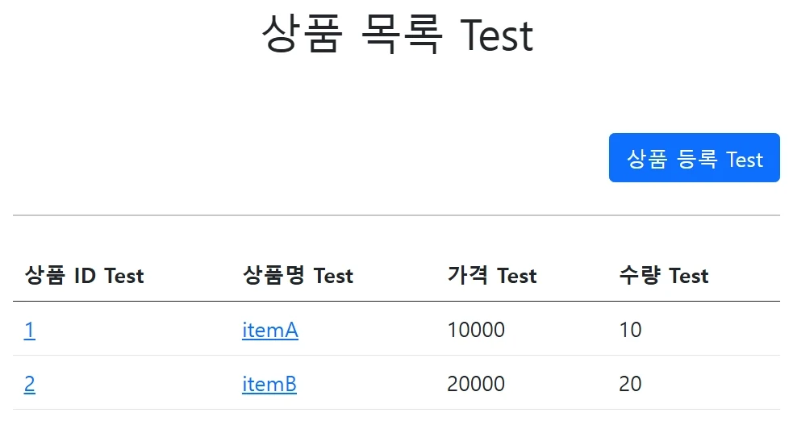
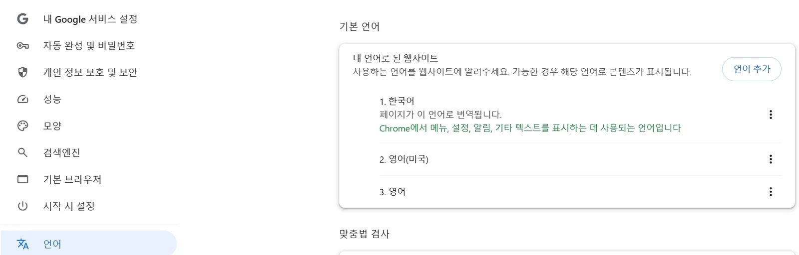
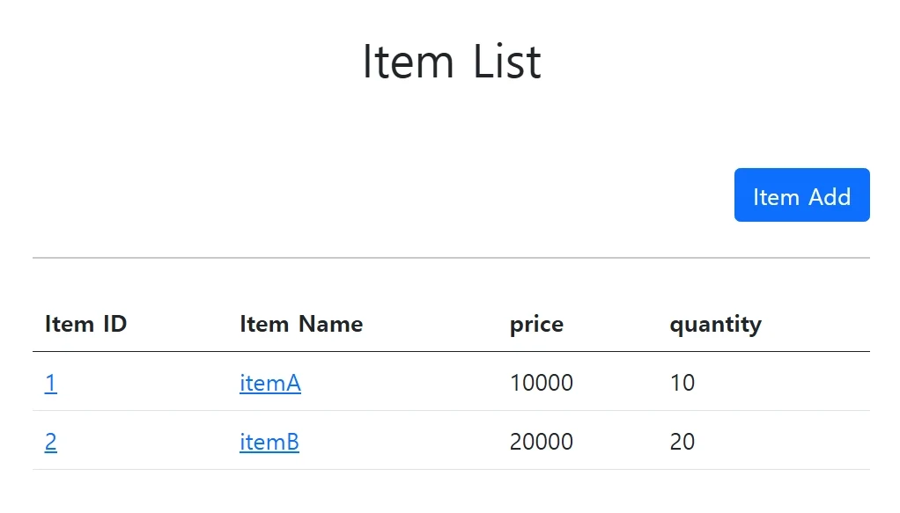

# [스프링 MVC 2편 - 백엔드 웹 개발 핵심 기술] 3. 메시지와 국제화

## 원문

https://ch010104.tistory.com/279

## 노트 유형

`tutorial`

## 학습 목표 및 맥락

악덕? 기획자가 화면에 보이는 문구가 마음에 들지 않는다고, 상품명이라는 단어를 모두 상품이름으로 고쳐달라고 하면 어떻게 해야할까?

여러 화면에 보이는 상품명, 가격, 수량 등, label에 있는 단어를 변경하려면 다음 화면들을 다 찾아가면서 모두 변경해야 한다. 지금처럼 화면 수가 적으면 문제가 되지 않지만 화면이 수십 개 이상이라면 수십 개의 파일을 모두 고쳐야 한다.

## 원문 기반 학습 정리

### 1. 메시지, 국제화 소개

### 메시지

악덕? 기획자가 화면에 보이는 문구가 마음에 들지 않는다고, 상품명이라는 단어를 모두 상품이름으로 고쳐달라고 하면 어떻게 해야할까?

여러 화면에 보이는 상품명, 가격, 수량 등, label에 있는 단어를 변경하려면 다음 화면들을 다 찾아가면서 모두 변경해야 한다. 지금처럼 화면 수가 적으면 문제가 되지 않지만 화면이 수십 개 이상이라면 수십 개의 파일을 모두 고쳐야 한다.

addForm.html, editForm.html, item.html, items.html

왜냐하면 해당 HTML 파일에 메시지가 하드코딩 되어 있기 때문이다.

이런 다양한 메시지를 한 곳에서 관리하도록 하는 기능을 메시지 기능이라 한다.

예를 들어서 messages.properties 라는 메시지 관리용 파일을 만들고 아래와 같이 정의한다.

```text
item=상품
item.id=상품 ID
item.itemName=상품명
item.price=가격
item.quantity=수량
```

각 HTML들은 다음과 같이 해당 데이터를 key 값으로 불러서 사용하는 것이다.

addForm.html

```text
<label for="itemName" th:text="#{item.itemName}"></label>
```

editForm.html

```text
<label for="itemName" th:text="#{item.itemName}"></label>
```

### 국제화

메시지에서 한 발 더 나가보자.

메시지에서 설명한 메시지 파일(messages.properties)을 각 나라별로 별도로 관리하면 서비스를 국제화 할 수 있다.

예를 들어서 다음과 같이 2개의 파일을 만들어서 분류한다.

### 📄 파일명: messages_en.properties

```text
item=Item
item.id=Item ID
item.itemName=Item Name
item.price=price
item.quantity=quantity
```

### 📄 파일명: messages_ko.properties

```text
item=상품
item.id=상품 ID
item.itemName=상품명
item.price=가격
item.quantity=수량
```

영어를 사용하는 사람이면 messages_en.properties를 사용하고, 한국어를 사용하는 사람이면 messages_ko.properties를 사용하게 개발하면 된다. 이렇게 하면 사이트를 국제화 할 수 있다.

한국에서 접근한 것인지 영어에서 접근한 것인지 인식하는 방법은 HTTP Accept-Language 헤더 값을 사용하거나 사용자가 직접 언어를 선택하도록 하고, 쿠키 등을 사용해서 처리하면 된다.

메시지와 국제화 기능을 직접 구현할 수도 있겠지만, 스프링은 기본적인 메시지와 국제화 기능을 모두 제공한다. 그리고 타임리프도 스프링이 제공하는 메시지와 국제화 기능을 편리하게 통합해서 제공한다.

### 2. 스프링 메시지 소스 설정

스프링은 기본적인 메시지 관리 기능을 제공한다. 메시지 관리 기능을 사용하려면 스프링이 제공하는 MessageSource를 스프링 빈으로 등록하면 되는데, MessageSource는 인터페이스이다.

따라서 구현체인 ResourceBundleMessageSource를 스프링 빈으로 등록하면 된다.

### 직접 등록 예시

```text
@Bean
public MessageSource messageSource() {
    ResourceBundleMessageSource messageSource = new ResourceBundleMessageSource();
    messageSource.setBasenames("messages", "errors");
    messageSource.setDefaultEncoding("utf-8");
    return messageSource;
}
```

basenames: 설정 파일의 이름을 지정한다.

messages로 지정하면 messages.properties 파일을 읽어서 사용한다.

추가로 국제화 기능을 적용하려면 messages_en.properties, messages_ko.properties와 같이 파일명 마지막에 언어 정보를 주면 된다. 만약 찾을 수 있는 국제화 파일이 없으면 messages.properties (언어정보가 없는 파일명)를 기본으로 사용한다.

파일의 위치는 /resources/messages.properties에 두면 된다.

여러 파일을 한번에 지정할 수 있다. 여기서는 messages, errors 둘을 지정했다.

defaultEncoding: 인코딩 정보를 지정한다. utf-8을 사용하면 된다.

### 스프링 부트에서의 자동 설정

스프링 부트를 사용하면 스프링 부트가 MessageSource를 자동으로 스프링 빈으로 등록한다.

### 스프링 부트 메시지 소스 설정 (application.properties)

```text
spring.messages.basename=messages,config.i18n.messages
```

### 스프링 부트 메시지 소스 기본 값

```text
spring.messages.basename=messages
```

MessageSource를 스프링 빈으로 직접 등록하지 않고, 스프링 부트와 관련된 별도의 설정을 하지 않으면 messages라는 이름으로 기본 등록된다.

따라서 messages_en.properties, messages_ko.properties, messages.properties 파일만 등록하면 자동으로 인식된다.

### 3. 메시지 파일 만들기

메시지 파일을 만들어보자. 국제화 테스트를 위해서 messages_en 파일도 추가하자.

messages.properties: 기본 값으로 사용(한글)

messages_en.properties: 영어 국제화 사용

주의! 파일명은 massage가 아니라 messages다! 마지막 s에 주의하자.

### 📄 경로: /resources/messages.properties

```text
hello=안녕
hello.name=안녕 {0}
```

### 📄 경로: /resources/messages_en.properties

```text
hello=hello
hello.name=hello {0}
```

### 💡 한글 깨짐이 발생하는 경우 해결법

인텔리제이에서 한글 깨짐이 발생하면 다음 설정을 확인하자.

Setting - File Encodings로 이동한다.

Default encoding for properties files를 ISO-8859-1에서 UTF-8로 변경한다.

Transparent native-to-ascii conversion 항목에 체크한다.

### 4. 스프링 메시지 소스 사용

### MessageSource 인터페이스 구조

```text
public interface MessageSource {
    String getMessage(String code, @Nullable Object[] args, @Nullable String defaultMessage, Locale locale);
    String getMessage(String code, @Nullable Object[] args, Locale locale) throws NoSuchMessageException;
}
```

MessageSource 인터페이스를 보면 코드를 포함한 일부 파라미터로 메시지를 읽어오는 기능을 제공한다.

### 📄 경로: src/test/java/hello/itemservice/message/MessageSourceTest.java

```java
package hello.itemservice.message;

import org.junit.jupiter.api.Test;
import org.springframework.beans.factory.annotation.Autowired;
import org.springframework.boot.test.context.SpringBootTest;
import org.springframework.context.MessageSource;
import org.springframework.context.NoSuchMessageException;

import java.util.Locale;

import static org.assertj.core.api.Assertions.*;

@SpringBootTest
public class MessageSourceTest {

    @Autowired
    MessageSource ms;

    @Test
    void helloMessage() {
        String result = ms.getMessage("hello", null, null);
        assertThat(result).isEqualTo("안녕");
    }

    @Test
    void notFoundMessageCode() {
        assertThatThrownBy(() -> ms.getMessage("no_code", null, null))
                .isInstanceOf(NoSuchMessageException.class);
    }

    @Test
    void notFoundMessageCodeDefaultMessage() {
        String result = ms.getMessage("no_code", null, "기본 메시지", null);
        assertThat(result).isEqualTo("기본 메시지");
    }

    @Test
    void argumentMessage() {
        String result = ms.getMessage("hello.name", new Object[]{"Spring"}, null);
        assertThat(result).isEqualTo("안녕 Spring");
    }

    @Test
    void defaultLang() {
        assertThat(ms.getMessage("hello", null, null)).isEqualTo("안녕");
        assertThat(ms.getMessage("hello", null, Locale.KOREA)).isEqualTo("안녕");
    }

    @Test
    void enLang() {
        assertThat(ms.getMessage("hello", null, Locale.ENGLISH)).isEqualTo("hello");
    }
}
```

### 상세 분석 및 테스트 설명

### 1) ms.getMessage("hello", null, null)

code: hello

args: null

locale: null

가장 단순한 테스트는 메시지 코드로 hello를 입력하고 나머지 값은 null을 입력했다.

locale 정보가 없으면 basename에서 설정한 기본 이름 메시지 파일을 조회한다. basename으로 messages를 지정했으므로 messages.properties 파일에서 데이터를 조회한다.

### 2) 메시지가 없는 경우와 기본 메시지 처리 (notFoundMessageCode, notFoundMessageCodeDefaultMessage)

메시지가 없는 경우에는 NoSuchMessageException이 발생한다.

메시지가 없어도 기본 메시지(defaultMessage)를 매개변수로 함께 사용하면 에러 없이 기본 메시지가 반환된다.

### 3) 매개변수 사용 (argumentMessage)

메시지의 {0} 부분은 매개변수를 전달해서 치환할 수 있다.

hello.name=안녕 {0} ➡️ Spring 단어를 매개변수로 전달 ➡️ 안녕 Spring으로 매핑된다.

### 4) 국제화 파일 선택 원리

locale 정보를 기반으로 국제화 파일을 선택한다.

Locale이 en_US인 경우, messages_en_US ➡️ messages_en ➡️ messages 순서로 찾는다.

즉, Locale에 맞추어 가장 구체적인 것이 있으면 먼저 찾고, 없으면 단계별로 상위 범위를 찾다가 디폴트를 찾는다.

defaultLang():

ms.getMessage("hello", null, null): locale 정보가 없으므로 messages.properties를 사용한다.

ms.getMessage("hello", null, Locale.KOREA): locale 정보가 있지만 messages_ko 파일이 없으므로 기본인 messages.properties를 사용한다.

enLang():

ms.getMessage("hello", null, Locale.ENGLISH): locale 정보가 Locale.ENGLISH이므로 messages_en을 찾아서 사용한다.

💡 강의 내용 정정 - 영상과 다른 내용 보충Locale 정보가 null인 경우 내부적으로 Locale.getDefault()를 호출해서 시스템의 기본 로케일을 사용합니다.

예) locale = null 인 경우 시스템 기본 locale이 ko_KR이므로 messages_ko.properties 조회 시도 ➡️ 조회 실패 ➡️ messages.properties 조회

### 5. 웹 애플리케이션에 메시지 적용하기

먼저 메시지를 추가 등록하자.

### 📄 경로: /resources/messages.properties (수정 등록)

```text
hello=안녕
hello.name=안녕 {0}

label.item=상품
label.item.id=상품 ID
label.item.itemName=상품명
label.item.price=가격
label.item.quantity=수량

page.items=상품 목록
page.item=상품 상세
page.addItem=상품 등록
page.updateItem=상품 수정

button.save=저장
button.cancel=취소
```

### 타임리프 메시지 적용 문법

타임리프의 메시지 표현식 #{...}를 사용하면 스프링의 메시지를 편리하게 조회할 수 있다. 예를 들어서 방금 등록한 상품이라는 이름을 조회하려면 #{label.item}이라고 하면 된다.

렌더링 전

```text
<div th:text="#{label.item}"></h2>
```

렌더링 후

```text
<div>상품</h2>
```

### 타임리프 템플릿 파일 변경 내용

적용할 대상 파일:

addForm.html

editForm.html

item.html

items.html

### 📄 경로: /resources/templates/message/addForm.html

```text
<!DOCTYPE HTML>
<html xmlns:th="[http://www.thymeleaf.org](http://www.thymeleaf.org)">
<head>
    <meta charset="utf-8">
    <link th:href="@{/css/bootstrap.min.css}"
          href="../css/bootstrap.min.css" rel="stylesheet">
    <style>
        .container {
            max-width: 560px;
        }
    </style>
</head>
<body>

<div class="container">

    <div class="py-5 text-center">
        <h2 th:text="#{page.addItem}">상품 등록</h2>
    </div>

    <h4 class="mb-3">상품 입력</h4>

    <form action="item.html" th:action th:object="${item}" method="post">
        <div>
            <label for="itemName" th:text="#{label.item.itemName}">상품명</label>
            <input type="text" id="itemName" th:field="*{itemName}" class="form-control" placeholder="이름을 입력하세요">
        </div>
        <div>
            <label for="price" th:text="#{label.item.price}">가격</label>
            <input type="text" id="price" th:field="*{price}" class="form-control" placeholder="가격을 입력하세요">
        </div>
        <div>
            <label for="quantity" th:text="#{label.item.quantity}">수량</label>
            <input type="text" id="quantity" th:field="*{quantity}" class="form-control" placeholder="수량을 입력하세요">
        </div>

        <hr class="my-4">

        <div class="row">
            <div class="col">
                <button class="w-100 btn btn-primary btn-lg" type="submit" th:text="#{button.save}">저장</button>
            </div>
            <div class="col">
                <button class="w-100 btn btn-secondary btn-lg"
                        onclick="location.href='items.html'"
                        th:onclick="|location.href='@{/message/items}'|"
                        type="button" th:text="#{button.cancel}">취소</button>
            </div>
        </div>

    </form>

</div> <!-- /container -->
</body>
</html>
```

### ✏️ addForm.html 주요 변경 사항 상세

페이지 이름 적용

기존: <h2>상품 등록 폼</h2>

변경: <h2 th:text="#{page.addItem}">상품 등록</h2>

레이블 적용

<label for="itemName">상품명</label> ➡️ <label for="itemName" th:text="#{label.item.itemName}">상품명</label>

가격: th:text="#{label.item.price}"

수량: th:text="#{label.item.quantity}"

버튼 적용

기존: <button type="submit">상품 등록</button>

변경: <button type="submit" th:text="#{button.save}">저장</button>

취소 버튼: th:text="#{button.cancel}"

### 📄 경로: /resources/templates/message/editForm.html

```text
<!DOCTYPE HTML>
<html xmlns:th="[http://www.thymeleaf.org](http://www.thymeleaf.org)">
<head>
    <meta charset="utf-8">
    <link th:href="@{/css/bootstrap.min.css}"
          href="../css/bootstrap.min.css" rel="stylesheet">
    <style>
        .container {
            max-width: 560px;
        }
    </style>
</head>
<body>

<div class="container">

    <div class="py-5 text-center">
        <h2 th:text="#{page.updateItem}">상품 수정</h2>
    </div>

    <form action="item.html" th:action th:object="${item}" method="post">
        <div>
            <label for="id" th:text="#{label.item.id}">상품 ID</label>
            <input type="text" id="id" th:field="*{id}" class="form-control" readonly>
        </div>
        <div>
            <label for="itemName" th:text="#{label.item.itemName}">상품명</label>
            <input type="text" id="itemName" th:field="*{itemName}" class="form-control">
        </div>
        <div>
            <label for="price" th:text="#{label.item.price}">가격</label>
            <input type="text" id="price" th:field="*{price}" class="form-control">
        </div>
        <div>
            <label for="quantity" th:text="#{label.item.quantity}">수량</label>
            <input type="text" id="quantity" th:field="*{quantity}" class="form-control">
        </div>

        <hr class="my-4">

        <div class="row">
            <div class="col">
                <button class="w-100 btn btn-primary btn-lg" type="submit" th:text="#{button.save}">저장</button>
            </div>
            <div class="col">
                <button class="w-100 btn btn-secondary btn-lg"
                        onclick="location.href='item.html'"
                        th:onclick="|location.href='@{/message/items/{itemId}(itemId=${item.id})}'|"
                        type="button" th:text="#{button.cancel}">취소</button>
            </div>
        </div>

    </form>

</div> <!-- /container -->
</body>
</html>
```

### 📄 경로: /resources/templates/message/item.html

```text
<!DOCTYPE HTML>
<html xmlns:th="[http://www.thymeleaf.org](http://www.thymeleaf.org)">
<head>
    <meta charset="utf-8">
    <link th:href="@{/css/bootstrap.min.css}"
          href="../css/bootstrap.min.css" rel="stylesheet">
    <style>
        .container {
            max-width: 560px;
        }
    </style>
</head>
<body>

<div class="container">

    <div class="py-5 text-center">
        <h2 th:text="#{page.item}">상품 상세</h2>
    </div>

    <!-- 추가 -->
    <h2 th:if="${param.status}" th:text="'저장 완료'"></h2>

    <div>
        <label for="itemId" th:text="#{label.item.id}">상품 ID</label>
        <input type="text" id="itemId" name="itemId" class="form-control" value="1" th:value="${item.id}" readonly>
    </div>
    <div>
        <label for="itemName" th:text="#{label.item.itemName}">상품명</label>
        <input type="text" id="itemName" name="itemName" class="form-control" value="상품A" th:value="${item.itemName}" readonly>
    </div>
    <div>
        <label for="price" th:text="#{label.item.price}">가격</label>
        <input type="text" id="price" name="price" class="form-control" value="10000" th:value="${item.price}" readonly>
    </div>
    <div>
        <label for="quantity" th:text="#{label.item.quantity}">수량</label>
        <input type="text" id="quantity" name="quantity" class="form-control" value="10" th:value="${item.quantity}" readonly>
    </div>

    <hr class="my-4">

    <div class="row">
        <div class="col">
            <button class="w-100 btn btn-primary btn-lg"
                    onclick="location.href='editForm.html'"
                    th:onclick="|location.href='@{/message/items/{itemId}/edit(itemId=${item.id})}'|"
                    type="button" th:text="#{page.updateItem}">상품 수정</button>
        </div>
        <div class="col">
            <button class="w-100 btn btn-secondary btn-lg"
                    onclick="location.href='items.html'"
                    th:onclick="|location.href='@{/message/items}'|"
                    type="button" th:text="#{page.items}">목록으로</button>
        </div>
    </div>

</div> <!-- /container -->
</body>
</html>
```

### 📄 경로: /resources/templates/message/items.html

```text
<!DOCTYPE HTML>
<html xmlns:th="[http://www.thymeleaf.org](http://www.thymeleaf.org)">
<head>
    <meta charset="utf-8">
    <link th:href="@{/css/bootstrap.min.css}"
          href="../css/bootstrap.min.css" rel="stylesheet">
</head>
<body>

<div class="container" style="max-width: 600px">
    <div class="py-5 text-center">
        <h2 th:text="#{page.items}">상품 목록</h2>
    </div>

    <div class="row">
        <div class="col">
            <button class="btn btn-primary float-end"
                    onclick="location.href='addForm.html'"
                    th:onclick="|location.href='@{/message/items/add}'|"
                    type="button" th:text="#{page.addItem}">상품 등록</button>
        </div>
    </div>

    <hr class="my-4">

    <div>
        <table class="table">
            <thead>
            <tr>
                <th th:text="#{label.item.id}">ID</th>
                <th th:text="#{label.item.itemName}">상품명</th>
                <th th:text="#{label.item.price}">가격</th>
                <th th:text="#{label.item.quantity}">수량</th>
            </tr>
            </thead>
            <tbody>
            <tr th:each="item : ${items}">
                <td><a href="item.html" th:href="@{/message/items/{itemId}(itemId=${item.id})}" th:text="${item.id}">회원id</a></td>
                <td><a href="item.html" th:href="@{|/message/items/${item.id}|}" th:text="${item.itemName}">상품명</a></td>
                <td th:text="${item.price}">10000</td>
                <td th:text="${item.quantity}">10</td>
            </tr>
            </tbody>
        </table>
    </div>

</div> <!-- /container -->
</body>
</html>
```

### ✏️ items.html 테이블 헤더 변경 상세

```text
<!-- 변경 전 -->
<th>ID</th>
<th>상품명</th>
<th>가격</th>
<th>수량</th>

<!-- 변경 후 -->
<th th:text="#{label.item.id}">ID</th>
<th th:text="#{label.item.itemName}">상품명</th>
<th th:text="#{label.item.price}">가격</th>
<th th:text="#{label.item.quantity}">수량</th>
```

### 실행 및 테스트

잘 동작하는지 확인하기 위해 messages.properties 파일의 내용을 가격 ➡️ 금액과 같이 임의로 변경해서 확인해 보자. 정상 동작이 확인되면 원래대로 되돌려 두자.

### 💡 참고: 타임리프에서 파라미터 전달 방법



메시지에 파라미터가 필요한 경우 다음과 같이 타임리프 메시지 표현식에 파라미터를 넘겨줄 수 있다.

properties 정의: hello.name=안녕 {0}

타임리프 사용 예시:

```text
<p th:text="#{hello.name(${item.itemName})}"></p>
```

### 6. 웹 애플리케이션에 국제화 적용하기

타임리프 파일들에 이미 #{...}를 통해 메시지 표현식을 사용하도록 설정했기 때문에, 이제 영어 메시지 파일만 추가해 주면 모든 국제화 작업이 끝난다.

### 📄 경로: /resources/messages_en.properties

```text
hello=hello
hello.name=hello {0}

label.item=Item
label.item.id=Item ID
label.item.itemName=Item Name
label.item.price=price
label.item.quantity=quantity

page.items=Item List
page.item=Item Detail
page.addItem=Item Add
page.updateItem=Item Update

button.save=Save
button.cancel=Cancel
```

### 웹에서 동작 확인하기



웹 브라우저의 언어 설정 값을 변경하면서 국제화 적용을 직접 확인해 본다.

크롬 브라우저 ➡️ 설정 ➡️ 언어로 이동한다.

우선순위 언어를 영어(English)로 변경하고 최상위로 올린다.

브라우저 새로고침 후 페이지를 테스트해 본다.

웹 브라우저의 언어 설정 값을 변경하면 브라우저가 요청 시 전송하는 HTTP Accept-Language 헤더의 값이 함께 변경된다.

Accept-Language는 클라이언트가 서버에 기대하는 언어 정보를 담아서 요청하는 HTTP 요청 헤더이다.

### 스프링의 국제화 메시지 선택



메시지 기능은 Locale 정보를 알아야 그에 맞는 언어를 선택하여 화면에 노출해 줄 수 있다.

스프링은 기본적으로 HTTP 요청 헤더의 Accept-Language 값을 활용하여 Locale을 선택하게 된다.

### LocaleResolver

스프링은 개발자가 Locale 선택 방식을 자유롭게 변경할 수 있도록 LocaleResolver라는 인터페이스를 제공한다.

스프링 부트는 기본적으로 Accept-Language 헤더를 활용하는 AcceptHeaderLocaleResolver를 사용하도록 설정되어 있다.

### LocaleResolver 인터페이스 구조

```text
public interface LocaleResolver {
    Locale resolveLocale(HttpServletRequest request);
    void setLocale(HttpServletRequest request, @Nullable HttpServletResponse response, @Nullable Locale locale);
}
```

### LocaleResolver 변경하기

만약 Accept-Language 헤더가 아니라 세션이나 쿠키 기반으로 언어를 변경 및 유지하고 싶다면, LocaleResolver의 구현체를 교체하여 사용할 수 있다. (예: 사용자가 직접 화면 상단에서 한국어/영어 국기를 클릭하여 직접 Locale을 선택하도록 구현하는 경우)

## 관련 글

- [[blog/INFLEARN/index|INFLEARN]]
- [[blog/INFLEARN/스프링 MVC 2편 - 백엔드 웹 개발 핵심 기술- 4. 검증1 - Validation|[스프링 MVC 2편 - 백엔드 웹 개발 핵심 기술] 4. 검증1 - Validation]]
- [[blog/INFLEARN/스프링 MVC 2편 - 백엔드 웹 개발 핵심 기술- 2. 타임리프 - 스프링 통합과 폼|[스프링 MVC 2편 - 백엔드 웹 개발 핵심 기술] 2. 타임리프 - 스프링 통합과 폼]]
- [[blog/INFLEARN/스프링 MVC 2편 - 백엔드 웹 개발 핵심 기술- 5.검증2 - Bean Validation|[스프링 MVC 2편 - 백엔드 웹 개발 핵심 기술] 5.검증2 - Bean Validation]]
