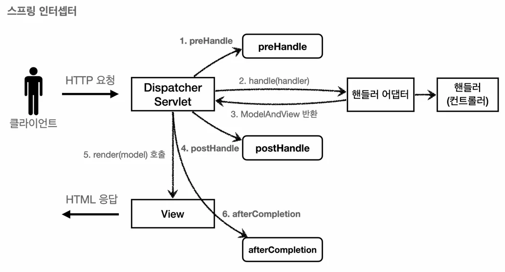
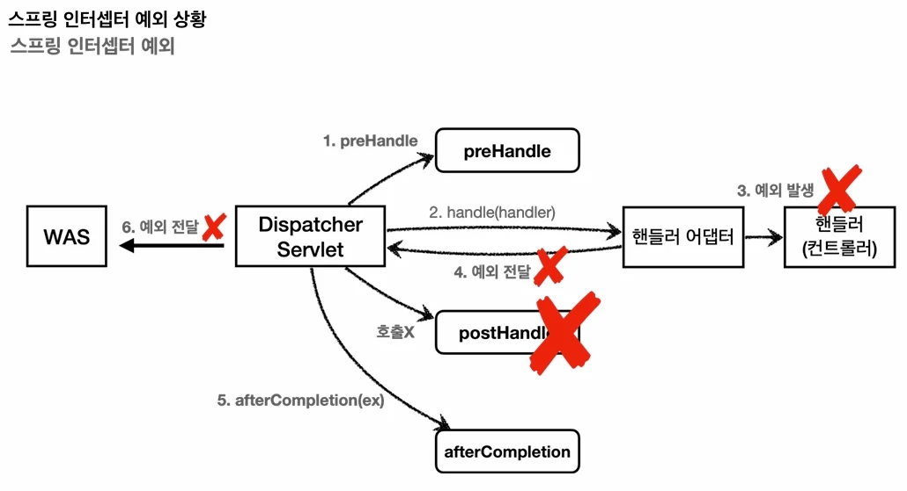

# [스프링 MVC 2편 - 백엔드 웹 개발 핵심 기술] 7. 로그인처리1 - 필터, 인터셉트

## 원문

https://ch010104.tistory.com/289

## 노트 유형

`tutorial`

## 학습 목표 및 맥락

문제 상황: 로그인하지 않은 사용자도 URL(http://localhost:8080/items)을 직접 입력하면 상품 관리 화면에 접근할 수 있는 문제가 발생합니다.

해결 방향: 모든 컨트롤러 로직(등록, 수정, 삭제, 조회 등)에서 공통으로 로그인 여부를 체크해야 합니다. 만약 이를 각 컨트롤러마다 개별 작성한다면 향후 로직이 변경될 때 모든 코드를 수정해야 하는 대참사가 일어납니다.

## 원문 기반 학습 정리

### 1. 서블릿 필터 - 소개

### 공통 관심 사항 (Cross-Cutting Concern)

문제 상황: 로그인하지 않은 사용자도 URL(http://localhost:8080/items)을 직접 입력하면 상품 관리 화면에 접근할 수 있는 문제가 발생합니다.

해결 방향: 모든 컨트롤러 로직(등록, 수정, 삭제, 조회 등)에서 공통으로 로그인 여부를 체크해야 합니다. 만약 이를 각 컨트롤러마다 개별 작성한다면 향후 로직이 변경될 때 모든 코드를 수정해야 하는 대참사가 일어납니다.

공통 관심사: 애플리케이션의 여러 로직에서 공통으로 가지는 관심사를 의미하며, 여기서는 '인증(로그인 여부)'이 해당됩니다.

기술 선택: 이러한 웹 관련 공통 관심사는 스프링 AOP로도 해결할 수 있지만, HTTP 헤더나 URL 정보가 필요한 웹 관련 처리는 HttpServletRequest를 직접 제공하는 서블릿 필터 또는 스프링 인터셉터를 사용하는 것이 웹 기술에 특화되어 있어 훨씬 유리합니다.

### 서블릿 필터의 특징 및 아키텍처

### 1) 필터 흐름

필터는 서블릿이 지원하는 수문장 역할을 합니다.

```text
HTTP 요청 -> WAS -> 필터 -> 서블릿 -> 컨트롤러
```

필터를 적용하면 필터가 호출된 다음에 서블릿이 호출됩니다.

특정 URL 패턴(예: /*)을 지정하여 모든 요청에 일괄 적용할 수 있습니다.

스프링을 사용할 때 여기서 말하는 '서블릿'은 스프링의 디스패처 서블릿(DispatcherServlet)을 의미합니다.

### 2) 필터 제한

필터는 부적절한 요청을 서블릿 단계로 넘기지 않고 차단할 수 있습니다.

로그인 사용자: HTTP 요청 -> WAS -> 필터 -> 서블릿 -> 컨트롤러

비로그인 사용자: HTTP 요청 -> WAS -> 필터(적절하지 않은 요청이라 판단, 서블릿 호출X) // 요청 종료

### 3) 필터 체인

필터는 체인 형태로 구성되며 자유롭게 중간에 필터를 추가할 수 있습니다.

```text
HTTP 요청 -> WAS -> 필터1(로그 필터) -> 필터2(인증 체크 필터) -> 서블릿 -> 컨트롤러
```

### 필터 인터페이스 (javax.servlet.Filter)

필터 인터페이스를 구현하고 스프링 빈으로 등록하면, 서블릿 컨테이너가 필터를 싱글톤 객체로 생성하고 관리합니다.

```text
public interface Filter {

    public default void init(FilterConfig filterConfig) throws ServletException {}

    public void doFilter(ServletRequest request, ServletResponse response,
                         FilterChain chain) throws IOException, ServletException;

    public default void destroy() {}
}
```

init(): 필터 초기화 메서드로, 서블릿 컨테이너가 생성될 때 단 한 번 호출됩니다.

doFilter(): 고객의 요청이 올 때마다 호출됩니다. 이곳에 실제 필터의 공통 비즈니스 로직을 구현합니다.

destroy(): 필터 종료 메서드로, 서블릿 컨테이너가 종료될 때 호출됩니다.

### 2. 서블릿 필터 - 요청 로그

모든 HTTP 요청이 필터를 거쳐 로그로 남겨지는 단순한 로그 필터를 구현하고 등록하는 예제입니다.

### LogFilter - 로그 필터 소스코드

```java
package hello.login.web.filter;

import lombok.extern.slf4j.Slf4j;
import javax.servlet.*;
import javax.servlet.http.HttpServletRequest;
import java.io.IOException;
import java.util.UUID;

@Slf4j
public class LogFilter implements Filter {

    @Override
    public void init(FilterConfig filterConfig) throws ServletException {
        log.info("log filter init");
    }

    @Override
    public void doFilter(ServletRequest request, ServletResponse response,
                         FilterChain chain) throws IOException, ServletException {

        // ServletRequest는 HTTP가 아닌 프로토콜까지 고려된 인터페이스이므로, HTTP 기능을 사용하기 위해 다운캐스팅 합니다.
        HttpServletRequest httpRequest = (HttpServletRequest) request;
        String requestURI = httpRequest.getRequestURI();

        // 요청 건마다 서로 구분할 수 있도록 임의의 UUID를 생성합니다.
        String uuid = UUID.randomUUID().toString();

        try {
            log.info("REQUEST [{}] [{}]", uuid, requestURI);

            // 핵심: 다음 필터가 있으면 다음 필터를 호출하고, 없으면 서블릿(디스패처 서블릿)을 호출합니다.
            // 이 호출을 생략하면 다음 단계로 진행되지 않고 요청이 멈추게 됩니다.
            chain.doFilter(request, response);

        } catch (Exception e) {
            throw e;
        } finally {
            log.info("RESPONSE [{}] [{}]", uuid, requestURI);
        }
    }

    @Override
    public void destroy() {
        log.info("log filter destroy");
    }
}
```

### WebConfig - 필터 설정 및 등록

스프링 부트 환경에서 필터를 가장 안정적으로 등록하는 방법은 FilterRegistrationBean을 사용하는 것입니다.

```java
package hello.login;

import hello.login.web.filter.LogFilter;
import org.springframework.boot.web.servlet.FilterRegistrationBean;
import org.springframework.context.annotation.Bean;
import org.springframework.context.annotation.Configuration;
import javax.servlet.Filter;

@Configuration
public class WebConfig {

    @Bean
    public FilterRegistrationBean logFilter() {
        FilterRegistrationBean<Filter> filterRegistrationBean = new FilterRegistrationBean<>();

        // 등록할 필터를 지정합니다.
        filterRegistrationBean.setFilter(new LogFilter());

        // 필터 체인의 순서를 지정합니다. 값이 낮을수록 먼저 동작합니다.
        filterRegistrationBean.setOrder(1);

        // 필터를 적용할 URL 패턴을 지정합니다. 여기서는 모든 경로(/*)에 필터를 적용합니다.
        filterRegistrationBean.addUrlPatterns("/*");

        return filterRegistrationBean;
    }
}
```

참고 사항

@ServletComponentScan과 @WebFilter 애노테이션 조합으로도 필터 등록이 가능하지만, 이 방식은 필터 간의 실행 순서를 세밀하게 조절할 수 없습니다. 따라서 실무에서는 항상 FilterRegistrationBean을 사용해 등록할 것을 권장합니다.

실무에서 HTTP 요청 시 하나의 요청 맥락 내에서 발생하는 모든 로그에 동일한 식별자(UUID 등)를 자동으로 남기고자 한다면 **Logback MDC (Mapped Diagnostic Context)**에 대해 추가로 학습해 보는 것을 권장합니다.

### 실행 로그 예시

```text
hello.login.web.filter.LogFilter: REQUEST [0a2249f2-cc70-4db4-98d1-492ccf5629dd] [/items]
hello.login.web.filter.LogFilter: RESPONSE [0a2249f2-cc70-4db4-98d1-492ccf5629dd] [/items]
```

### 3. 서블릿 필터 - 인증 체크

인증 체크 필터를 구현하여, 로그인하지 않은 사용자는 상품 관리 화면뿐만 아니라 미래에 생성될 모든 보안 영역 페이지에도 접근할 수 없도록 강제합니다. 단, 홈, 로그인 화면, 회원 가입 등은 로그인 여부와 관계없이 접근할 수 있어야 하므로 화이트리스트(whitelist) 개념을 도입합니다.

### LoginCheckFilter - 인증 체크 필터 소스코드

```java
package hello.login.web.filter;

import hello.login.web.SessionConst;
import lombok.extern.slf4j.Slf4j;
import org.springframework.util.PatternMatchUtils;
import javax.servlet.*;
import javax.servlet.http.HttpServletRequest;
import javax.servlet.http.HttpServletResponse;
import javax.servlet.http.HttpSession;
import java.io.IOException;

@Slf4j
public class LoginCheckFilter implements Filter {

    // 인증 필터를 적용하지 않고 항상 통과시킬 화이트리스트 경로를 정의합니다.
    private static final String[] whitelist = {"/", "/members/add", "/login", "/logout", "/css/*"};

    @Override
    public void doFilter(ServletRequest request, ServletResponse response,
                         FilterChain chain) throws IOException, ServletException {

        HttpServletRequest httpRequest = (HttpServletRequest) request;
        String requestURI = httpRequest.getRequestURI();

        HttpServletResponse httpResponse = (HttpServletResponse) response;

        try {
            log.info("인증 체크 필터 시작 {}", requestURI);

            // 화이트리스트를 제외한 경로에 대해서만 인증 로직을 수행합니다.
            if (isLoginCheckPath(requestURI)) {
                log.info("인증 체크 로직 실행 {}", requestURI);

                // 기존 세션이 있는지 확인합니다. (세션이 없어도 새로 생성하지 않도록 false 전달)
                HttpSession session = httpRequest.getSession(false);

                if (session == null || session.getAttribute(SessionConst.LOGIN_MEMBER) == null) {
                    log.info("미인증 사용자 요청 {}", requestURI);

                    // 미인증 사용자는 로그인 화면으로 리다이렉트 시킵니다.
                    // 로그인에 성공하면 원래 보려던 페이지로 바로 이동할 수 있게 redirectURL 쿼리 파라미터를 추가합니다.
                    httpResponse.sendRedirect("/login?redirectURL=" + requestURI);

                    // 중요: 미인증 사용자는 더 이상 필터 체인이나 서블릿을 진행하지 않고 여기서 블록킹(요청 종료)합니다!
                    return;
                }
            }

            // 화이트리스트 경로이거나, 인증에 성공한 사용자는 다음 단계(다음 필터 혹은 서블릿)로 진행합니다.
            chain.doFilter(request, response);

        } catch (Exception e) {
            throw e; // 예외 로깅이 가능하지만, 최종적으로 톰캣(WAS)까지 예외를 던져주어야 합니다.
        } finally {
            log.info("인증 체크 필터 종료 {}", requestURI);
        }
    }

    /**
     * 입력받은 URI가 화이트리스트에 포함되는지 확인하여 인증 체크 대상 여부를 가려냅니다.
     * 화이트리스트에 매칭되면 false(체크하지 않음)를 반환합니다.
     */
    private boolean isLoginCheckPath(String requestURI) {
        return !PatternMatchUtils.simpleMatch(whitelist, requestURI);
    }
}
```

### WebConfig - 인증 체크 필터 등록 설정 추가

앞서 만든 LoginCheckFilter를 로그 필터 뒤에 호출되도록 체인 순서를 2번으로 설정하여 등록합니다.

```text
@Bean
public FilterRegistrationBean loginCheckFilter() {
    FilterRegistrationBean<Filter> filterRegistrationBean = new FilterRegistrationBean<>();

    // 로그인 인증 체크 필터를 등록합니다.
    filterRegistrationBean.setFilter(new LoginCheckFilter());

    // 로그 필터(Order 1) 다음 단계인 2번으로 설정합니다.
    filterRegistrationBean.setOrder(2);

    // 모든 요청에 필터를 적용합니다. 내부에서 whitelist로 필터링할 대상인지 확인하게 됩니다.
    filterRegistrationBean.addUrlPatterns("/*");

    return filterRegistrationBean;
}
```

### RedirectURL 처리 컨트롤러 개발 (LoginController)

미인증 상태에서 상품 관리를 클릭해 /login?redirectURL=/items로 리다이렉트되어 들어온 사용자가 로그인을 완료하면, 곧바로 원래 요청했던 /items로 이동시켜 주는 편리한 리다이렉트 로직을 구현합니다.

### LoginController - loginV4() 소스코드

```text
/**
 * 로그인 이후 redirect 처리 기능을 추가한 컨트롤러 메서드
 */
@PostMapping("/login")
public String loginV4(
        @Valid @ModelAttribute LoginForm form, BindingResult bindingResult,
        @RequestParam(defaultValue = "/") String redirectURL, // redirectURL 파라미터가 없으면 기본값인 "/"로 지정됩니다.
        HttpServletRequest request) {

    if (bindingResult.hasErrors()) {
        return "login/loginForm";
    }

    Member loginMember = loginService.login(form.getLoginId(), form.getPassword());
    log.info("login? {}", loginMember);

    if (loginMember == null) {
        bindingResult.reject("loginFail", "아이디 또는 비밀번호가 맞지 않습니다.");
        return "login/loginForm";
    }

    // 로그인 성공 처리
    // 세션이 있으면 기존 세션을 반환하고, 없으면 신규 세션을 생성합니다.
    HttpSession session = request.getSession();

    // 세션에 로그인 회원 정보를 보관합니다.
    session.setAttribute(SessionConst.LOGIN_MEMBER, loginMember);

    // 전달받은 redirectURL을 사용하여 로그인 성공 시 해당 경로로 바로 고객을 리다이렉트 시킵니다.
    return "redirect:" + redirectURL;
}
```

정리: 서블릿 필터를 공통 관심사 해결 기술로 채택함으로써, 향후 로그인 관련 보안 정책이 추가되거나 변경되더라도 필터 클래스 한 곳만 수정하면 되는 우수한 유지보수성을 확보하게 되었습니다.

강력한 필터 전용 기능: 필터 내부에서는 chain.doFilter(request, response)를 호출할 때, 개발자가 직접 정의한 커스텀 ServletRequest나 ServletResponse 객체로 바꾸어 전달하는 강력한 기능이 존재합니다. (인터셉터에서는 지원하지 않는 기능이지만 자주 사용되지는 않습니다.)

### 4. 스프링 인터셉터 - 소개

스프링 인터셉터도 서블릿 필터처럼 웹 관련 공통 관심 사항을 처리하지만, 서블릿 기술이 아닌 스프링 MVC가 제공하는 기술입니다. 적용되는 순서, 범위, 그리고 설정 방법에서 필터보다 훨씬 정교하고 풍부한 기능을 지원합니다.

### 스프링 인터셉터 아키텍처 흐름

### 1) 인터셉터 흐름

```text
HTTP 요청 -> WAS -> 필터 -> 서블릿(디스패처 서블릿) -> 스프링 인터셉터 -> 컨트롤러
```

스프링 인터셉터는 디스패처 서블릿과 컨트롤러 사이에서 컨트롤러 호출 직전에 동작합니다.

스프링 MVC의 핵심 시작점이 디스패처 서블릿이므로, 서블릿 이후에 인터셉터가 작동하는 구조가 성립됩니다.

서블릿 필터보다 매우 세밀하고 구체적인 URL 패턴 설정이 가능합니다.

### 2) 인터셉터 제한

로그인 사용자: HTTP 요청 -> WAS -> 필터 -> 서블릿 -> 스프링 인터셉터 -> 컨트롤러

비로그인 사용자: HTTP 요청 -> WAS -> 필터 -> 서블릿 -> 스프링 인터셉터(적절치 않다 판단, 컨트롤러 호출X) // 요청 종료

### 3) 인터셉터 체인

필터와 마찬가지로 여러 인터셉터를 체인 형태로 자유롭게 추가 구성할 수 있습니다.

```text
HTTP 요청 -> WAS -> 필터 -> 서블릿 -> 인터셉터1(로그) -> 인터셉터2(인증) -> 컨트롤러
```

### 인터셉터 인터페이스 (HandlerInterceptor)

서블릿 필터는 단순히 doFilter() 하나만 제공하여 모든 동작을 하나의 메서드 안에서 처리하지만, 스프링 인터셉터는 호출 단계가 세분화되어 있으며 호출 정보를 더 많이 제공받습니다.

```text
public interface HandlerInterceptor {

    // 1. 컨트롤러(핸들러 어댑터) 호출 전에 실행됩니다.
    // 반환값이 true이면 다음 단계로 진행하고, false이면 이후 동작(인터셉터, 컨트롤러)을 모두 중단합니다.
    default boolean preHandle(HttpServletRequest request, HttpServletResponse response,
                             Object handler) throws Exception {}

    // 2. 컨트롤러(핸들러 어댑터) 호출 후에 실행됩니다. (컨트롤러에서 예외 발생 시 호출되지 않음)
    default void postHandle(HttpServletRequest request, HttpServletResponse response,
                            Object handler, @Nullable ModelAndView modelAndView) throws Exception {}

    // 3. 뷰가 렌더링된 후 모든 요청 처리가 끝난 다음에 실행됩니다.
    // 예외 발생 여부와 무관하게 항상 호출되며, 발생한 예외(Exception ex)를 인자로 받아 로그를 남기는 등의 공통 처리가 가능합니다.
    default void afterCompletion(HttpServletRequest request, HttpServletResponse response,
                                 Object handler, @Nullable Exception ex) throws Exception {}
}
```

### 스프링 인터셉터 호출 흐름 및 예외 상황

### 1) 정상 흐름 호출 다이어그램

### 2) 예외 발생 시의 흐름 다이어그램

컨트롤러 수행 도중 예외가 발생하면 인터셉터의 각 메서드는 다음과 같이 동작합니다.

preHandle: 컨트롤러 호출 전에 항상 호출됩니다.

postHandle: 컨트롤러에서 예외가 발생하면 절대 호출되지 않습니다.

afterCompletion: 예외가 발생하더라도 무조건 호출이 보장됩니다. 따라서 예외 여부와 상관없이 무언가 공통 자원을 해제하거나 예외 전용 로그를 정교하게 남기기 위해서는 postHandle이 아닌 afterCompletion을 사용해야 합니다.

### 5. 스프링 인터셉터 - 요청 로그

모든 요청을 로그로 기록하는 스프링 인터셉터를 구현합니다. 필터와 달리 각 콜백 메서드(preHandle, afterCompletion 등)가 분리되어 실행되므로 하나의 요청 상태값을 전달하기 위한 설계 방식에 주의해야 합니다.

### LogInterceptor - 요청 로그 인터셉터 소스코드

```java
package hello.login.web.interceptor;

import lombok.extern.slf4j.Slf4j;
import org.springframework.web.method.HandlerMethod;
import org.springframework.web.servlet.HandlerInterceptor;
import org.springframework.web.servlet.ModelAndView;
import javax.servlet.http.HttpServletRequest;
import javax.servlet.http.HttpServletResponse;
import java.util.UUID;

@Slf4j
public class LogInterceptor implements HandlerInterceptor {

    public static final String LOG_ID = "logId";

    @Override
    public boolean preHandle(HttpServletRequest request, HttpServletResponse response,
                             Object handler) throws Exception {

        String requestURI = request.getRequestURI();
        String uuid = UUID.randomUUID().toString();

        // 중요: 인터셉터는 싱글톤처럼 관리되므로 멤버 변수를 사용해 상태를 저장하면 동시성 이슈가 터집니다!
        // preHandle에서 생성한 UUID를 postHandle, afterCompletion까지 유지하기 위해 request 객체에 담아둡니다.
        request.setAttribute(LOG_ID, uuid);

        // 스프링 MVC에서 사용하는 핸들러 매핑 종류에 따라 handler 타입이 달라집니다.
        // @Controller, @RequestMapping을 사용하는 일반적인 컨트롤러는 HandlerMethod 타입으로 넘어옵니다.
        if (handler instanceof HandlerMethod) {
            HandlerMethod hm = (HandlerMethod) handler; // 호출할 컨트롤러 메서드의 모든 정보(클래스, 메서드 등)가 담겨 있습니다.
        }

        log.info("REQUEST [{}] [{}] [{}]", uuid, requestURI, handler);
        return true; // true를 반환해야 다음 인터셉터나 컨트롤러로 진행됩니다.
    }

    @Override
    public void postHandle(HttpServletRequest request, HttpServletResponse response,
                           Object handler, ModelAndView modelAndView) throws Exception {
        log.info("postHandle [{}]", modelAndView);
    }

    @Override
    public void afterCompletion(HttpServletRequest request, HttpServletResponse response,
                                Object handler, Exception ex) throws Exception {

        String requestURI = request.getRequestURI();

        // preHandle에서 request에 임시 저장해 두었던 UUID를 꺼냅니다.
        String logId = (String) request.getAttribute(LOG_ID);

        log.info("RESPONSE [{}] [{}]", logId, requestURI);

        // 예외가 발생했다면 상세히 에러 로그를 남깁니다.
        if (ex != null) {
            log.error("afterCompletion error!!", ex);
        }
    }
}
```

ResourceHttpRequestHandler: 만약 컨트롤러가 아니라 /resources/static과 같은 정적 리소스 경로가 호출되는 경우, handler 인자로 HandlerMethod 대신 ResourceHttpRequestHandler가 넘어옵니다. 따라서 타입 검증 로직이 필요할 수 있습니다.

### WebConfig - 인터셉터 등록

스프링 MVC 설정을 담당하는 WebMvcConfigurer를 구현하여 인터셉터를 추가합니다. 필터와 중복되지 않도록 기존에 등록해 두었던 logFilter() 빈 등록 메서드는 주석 처리 또는 제거합니다.

```java
@Configuration
public class WebConfig implements WebMvcConfigurer {

    @Override
    public void addInterceptors(InterceptorRegistry registry) {
        // 인터셉터를 등록합니다.
        registry.addInterceptor(new LogInterceptor())
                // 인터셉터 동작 순서를 정합니다. 낮을수록 먼저 실행됩니다.
                .order(1)
                // 인터셉터를 적용할 URL 패턴을 지정합니다. (/**는 모든 하위 경로를 포함)
                .addPathPatterns("/**")
                // 인터셉터 적용에서 아예 배제시킬 제외 경로를 세밀하게 정의합니다.
                .excludePathPatterns("/css/**", "/*.ico", "/error");
    }
}
```

### 실행 로그 예시

```java
REQUEST [6234a913-f24f-461f-a9e1-85f153b3c8b2][/members/add] [hello.login.web.member.MemberController#addForm(Member)]

postHandle [ModelAndView [view="members/addMemberForm"; model={member=Member(id=null, loginId=null, name=null, password=null), org.springframework.validation.BindingResult.member=org.springframework.validation.BeanPropertyBindingResult: 0 errors}]]

RESPONSE [6234a913-f24f-461f-a9e1-85f153b3c8b2][/members/add]
```

### 스프링 URL 경로 패턴 (PathPattern 규칙)

스프링부트 인터셉터가 제공하는 URL 경로는 단순 서블릿의 URL 경로 매칭 방식보다 고도로 정밀한 세부 규칙을 제공합니다.

구체적 예시:

/pages/t?st.html → /pages/test.html 또는 /pages/tXst.html 등 매치 (단, /pages/는 매치 불가)

/resources/*.png → /resources 바로 밑의 모든 .png 확장자 파일 매치

/resources/ → /resources 하위 깊이에 있는 모든 파일 및 디렉터리 매치 (/resources/image.png, /resources/css/spring.css 전부 포함)

/resources/{*path} → 하위 모든 경로를 변수 path에 바인딩 (예: /resources/css/spring.css 매칭 시 path 변수에 "/css/spring.css"가 들어감)

/resources/{filename:\\w+}.dat → /resources/spring.dat 매칭 시 변수 filename에 "spring" 할당

### 6. 스프링 인터셉터 - 인증 체크

앞서 서블릿 필터로 구현했던 복잡한 로그인 인증 방어 코드를 스프링 인터셉터로 변환하여 깔끔하고 간결하게 재구성합니다.

### LoginCheckInterceptor - 인증 체크 인터셉터 소스코드

```java
package hello.login.web.interceptor;

import hello.login.web.SessionConst;
import lombok.extern.slf4j.Slf4j;
import org.springframework.web.servlet.HandlerInterceptor;
import javax.servlet.http.HttpServletRequest;
import javax.servlet.http.HttpServletResponse;
import javax.servlet.http.HttpSession;

@Slf4j
public class LoginCheckInterceptor implements HandlerInterceptor {

    @Override
    public boolean preHandle(HttpServletRequest request, HttpServletResponse response,
                             Object handler) throws Exception {

        String requestURI = request.getRequestURI();

        log.info("인증 체크 인터셉터 실행 {}", requestURI);

        HttpSession session = request.getSession(false);

        // 인증 실패 상황: 세션이 없거나 세션 내부 로그인 회원 정보가 없는 경우
        if (session == null || session.getAttribute(SessionConst.LOGIN_MEMBER) == null) {
            log.info("미인증 사용자 요청");

            // 로그인 처리 페이지로 리다이렉트 하며, 로그인 성공 시 되돌아올 URI 정보를 같이 보냅니다.
            response.sendRedirect("/login?redirectURL=" + requestURI);

            // 핵심: false를 리턴하여 핸들러 어댑터 및 컨트롤러 호출 흐름을 즉시 종료합니다.
            return false;
        }

        return true; // true 리턴 시 정상적으로 컨트롤러가 호출됩니다.
    }
}
```

### WebConfig - 인증 체크 인터셉터 등록 설정

앞선 서블릿 필터 등록(logFilter, loginCheckFilter)용 Bean 설정들은 모두 주석 처리하여 무효화시키고 인터셉터를 전면 등록합니다.

```java
@Configuration
public class WebConfig implements WebMvcConfigurer {

    @Override
    public void addInterceptors(InterceptorRegistry registry) {
        // 1. 요청 로그 기록 인터셉터 등록
        registry.addInterceptor(new LogInterceptor())
                .order(1)
                .addPathPatterns("/**")
                .excludePathPatterns("/css/**", "/*.ico", "/error");

        // 2. 로그인 인증 체크 인터셉터 등록
        registry.addInterceptor(new LoginCheckInterceptor())
                .order(2)
                // 모든 경로에 로그인 인터셉터를 기본 적용하되
                .addPathPatterns("/**")
                // 화이트리스트(정적 리소스, 홈, 회원가입, 로그인, 에러 페이지 등)를 여기서 배제시킵니다.
                .excludePathPatterns(
                        "/", "/members/add", "/login", "/logout",
                        "/css/**", "/*.ico", "/error"
                );
    }
}
```

서블릿 필터 vs 스프링 인터셉터 비교: 인터셉터는 복잡한 하드코딩 화이트리스트 판별 로직을 클래스 내부에 둘 필요 없이, WebConfig 등록 부분에서 excludePathPatterns라는 직관적인 체이닝 메서드로 일괄 제외할 수 있어 코드가 극단적으로 깔끔해집니다.

### 7. ArgumentResolver 활용

컨트롤러에서 세션의 로그인 사용자 정보를 가져올 때, 반복되는 번거로운 세션 확인 코드를 걷어내고 직접 생성한 커스텀 애노테이션 @Login을 적용하는 우아한 패턴으로 개선합니다.

### 1) 개선 목표 (HomeController 예시)

```text
@GetMapping("/")
public String homeLoginV3ArgumentResolver(@Login Member loginMember, Model model) {

    // 만약 세션에 회원 데이터가 없으면 홈(/) 페이지를 그대로 보여줍니다.
    if (loginMember == null) {
        return "home";
    }

    // 로그인된 회원이 존재할 경우 로그인 전용 홈 화면으로 보냅니다.
    model.addAttribute("member", loginMember);
    return "loginHome";
}
```

컨트롤러 파라미터에 @Login을 붙여두면 커스텀 ArgumentResolver가 알아서 세션을 까보고 로그인된 회원 객체(Member)를 주입하며, 없을 경우 null을 바인딩해 줍니다.

### 2) @Login 애노테이션 생성

```text
package hello.login.web.argumentresolver;

import java.lang.annotation.ElementType;
import java.lang.annotation.Retention;
import java.lang.annotation.RetentionPolicy;
import java.lang.annotation.Target;

// 파라미터 매개변수 선언처에만 사용할 수 있도록 제한합니다.
@Target(ElementType.PARAMETER)
// 리플렉션 기술 등을 활용할 수 있도록 애노테이션 정보를 컴파일 이후 런타임까지 유지시킵니다.
@Retention(RetentionPolicy.RUNTIME)
public @interface Login {
}
```

### 3) LoginMemberArgumentResolver 구현

HandlerMethodArgumentResolver 인터페이스를 직접 상속받아 커스텀 주입 엔진을 완성시킵니다.

```java
package hello.login.web.argumentresolver;

import hello.login.domain.member.Member;
import hello.login.web.SessionConst;
import lombok.extern.slf4j.Slf4j;
import org.springframework.core.MethodParameter;
import org.springframework.web.bind.support.WebDataBinderFactory;
import org.springframework.web.context.request.NativeWebRequest;
import org.springframework.web.method.support.HandlerMethodArgumentResolver;
import org.springframework.web.method.support.ModelAndViewContainer;
import javax.servlet.http.HttpServletRequest;
import javax.servlet.http.HttpSession;

@Slf4j
public class LoginMemberArgumentResolver implements HandlerMethodArgumentResolver {

    /**
     * 해당 ArgumentResolver가 현재 컨트롤러 메서드의 특정 파라미터를 지원하는지 여부를 검증합니다.
     * 여기서는 @Login 애노테이션이 붙어있으면서 동시에 Member 타입이어야 활성화됩니다.
     */
    @Override
    public boolean supportsParameter(MethodParameter parameter) {
        log.info("supportsParameter 실행");

        boolean hasLoginAnnotation = parameter.hasParameterAnnotation(Login.class);
        boolean hasMemberType = Member.class.isAssignableFrom(parameter.getParameterType());

        // 두 조건을 모두 만족해야 true가 리턴되어 resolveArgument()가 순차 호출됩니다.
        return hasLoginAnnotation && hasMemberType;
    }

    /**
     * supportsParameter() 검증을 무사히 통과했을 때 실제 컨트롤러 파라미터로 넘겨줄 데이터 객체를 생성해 반환합니다.
     */
    @Override
    public Object resolveArgument(MethodParameter parameter, ModelAndViewContainer mavContainer,
                                  NativeWebRequest webRequest, WebDataBinderFactory binderFactory) throws Exception {

        log.info("resolveArgument 실행");

        // NativeWebRequest로부터 기저에 위치한 HttpServletRequest를 추출해 냅니다.
        HttpServletRequest request = (HttpServletRequest) webRequest.getNativeRequest();

        // 세션을 조회합니다. (없을 시 신규 세션 생성 방지)
        HttpSession session = request.getSession(false);
        if (session == null) {
            return null; // 세션 자체가 없다면 그냥 null을 반환합니다.
        }

        // 세션에 보관되어 있던 로그인 회원 객체(Member)를 반환합니다.
        // 스프링 MVC는 이 반환값을 컨트롤러의 매개변수로 고스란히 바인딩 시켜줍니다.
        return session.getAttribute(SessionConst.LOGIN_MEMBER);
    }
}
```

### 4) WebConfig에 ArgumentResolver 등록

만든 리졸버가 스프링 내부 메커니즘에서 정상 작동할 수 있도록 WebConfig 설정 클래스에 등록합니다.

```java
@Configuration
public class WebConfig implements WebMvcConfigurer {

    // 앞서 개발한 LoginMemberArgumentResolver를 리스트에 추가합니다.
    @Override
    public void addArgumentResolvers(List<HandlerMethodArgumentResolver> resolvers) {
        resolvers.add(new LoginMemberArgumentResolver());
    }

    // ... 기존 인터셉터 및 필터 설정 코드 생략 ...
}
```

### 8. 최종 정리

서블릿 필터와 스프링 인터셉터 모두 웹 애플리케이션의 공통 관심사를 중앙 집중식으로 해결하는 대표적인 수문장 기술입니다.

필터 대비 스프링 인터셉터는 스프링 MVC 아키텍처에 완벽히 동기화되어 ModelAndView 제어나 세밀한 예외 전파 제어(afterCompletion), 정교한 URL 제외 패턴(excludePathPatterns) 지정을 지원하므로 스프링 환경에서는 특별한 이유가 없다면 인터셉터를 사용하는 것이 압도적으로 편리하고 유용합니다.

이에 더해 ArgumentResolver 구조를 추가로 응용하면 로그인한 회원 정보 바인딩 같은 매번 반복 수행되는 보일러플레이트 컨트롤러 로직을 고도화하여 코드를 매우 스마트하고 직관적으로 관리할 수 있습니다.

## 핵심 이미지





## 관련 글

- [[blog/INFLEARN/index|INFLEARN]]
- [[blog/INFLEARN/스프링 MVC 2편 - 백엔드 웹 개발 핵심 기술- 6. 로그인처리1 - 쿠키, 세션|[스프링 MVC 2편 - 백엔드 웹 개발 핵심 기술] 6. 로그인처리1 - 쿠키, 세션]]
- [[blog/INFLEARN/스프링 MVC 2편 - 백엔드 웹 개발 핵심 기술- 8. 예외 처리와 오류 페이지|[스프링 MVC 2편 - 백엔드 웹 개발 핵심 기술] 8. 예외 처리와 오류 페이지]]
- [[blog/INFLEARN/스프링 MVC 2편 - 백엔드 웹 개발 핵심 기술- 5.검증2 - Bean Validation|[스프링 MVC 2편 - 백엔드 웹 개발 핵심 기술] 5.검증2 - Bean Validation]]
