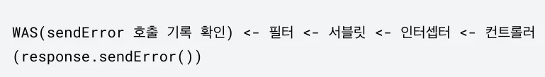
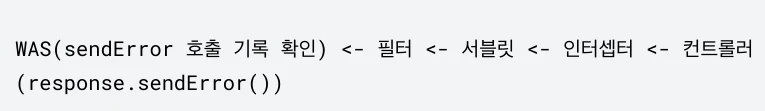

# [스프링 MVC 2편 - 백엔드 웹 개발 핵심 기술] 8. 예외 처리와 오류 페이지

## 원문

https://ch010104.tistory.com/290

## 노트 유형

`tutorial`

## 학습 목표 및 맥락

스프링 프레임워크가 없는 순수 서블릿 컨테이너(WAS) 환경에서는 기본적으로 다음 2가지 방식으로 예외 처리를 지원합니다.

response.sendError (HTTP 상태 코드, 오류 메시지)

## 원문 기반 학습 정리

### 1. 서블릿 예외 처리 - 시작

스프링 프레임워크가 없는 순수 서블릿 컨테이너(WAS) 환경에서는 기본적으로 다음 2가지 방식으로 예외 처리를 지원합니다.

Exception (예외 발생)

response.sendError (HTTP 상태 코드, 오류 메시지)

### 1) Exception (예외)

### 자바 직접 실행 시

main 이라는 이름의 쓰레드가 실행됩니다.

실행 도중 예외를 잡지 못하고 main() 메서드를 넘어서 던져지면, 에러 로그를 남기고 해당 쓰레드는 종료됩니다.

### 웹 애플리케이션 실행 시

사용자 요청별로 독립적인 쓰레드가 할당되어 서블릿 컨테이너 안에서 동작합니다.

애플리케이션 내부에서 try-catch로 예외를 잡아 처리하면 정상 처리되지만, 만약 서블릿 밖으로까지 예외가 전파되면 다음과 같이 WAS까지 전달됩니다.

톰캣과 같은 WAS는 최종적으로 예외가 올라왔을 때 자체적인 오류 화면을 제공하게 됩니다.

테스트 준비: 스프링 부트의 기본 화이트라벨(Whitelabel) 에러 페이지를 꺼두어야 서블릿 컨테이너 본래의 동작을 확인할 수 있습니다.

```text
# application.properties
spring.web.error.whitelabel.enabled=false
```

### ServletExController - 예외 발생 컨트롤러 코드

```java
package hello.exception.servlet;

import lombok.extern.slf4j.Slf4j;
import org.springframework.stereotype.Controller;
import org.springframework.web.bind.annotation.GetMapping;

@Slf4j
@Controller
public class ServletExController {

    @GetMapping("/error-ex")
    public void errorEx() {
        throw new RuntimeException("예외 발생!");
    }
}
```

결과: http://localhost:8080/error-ex 호출 시 톰캣이 기본으로 제공하는 HTTP 500 (Internal Server Error) 화면과 상태 코드가 노출됩니다. WAS는 서버 내부에서 복구되지 못한 Exception을 500 오류로 처리합니다.

존재하지 않는 경로(http://localhost:8080/no-page) 호출 시에는 톰캣이 기본 제공하는 HTTP 404 (Not Found) 화면을 보여줍니다.

### 2) response.sendError()

당장 예외를 던지지는 않지만, 서블릿 컨테이너에게 "오류가 발생했다"는 상태를 전달할 수 있는 메서드입니다. 이 메서드가 호출되면 HTTP 상태 코드와 메시지를 설정할 수 있습니다.

response.sendError(HTTP 상태 코드)

response.sendError(HTTP 상태 코드, 오류 메시지)

### ServletExController - sendError 기능 추가

```text
import javax.servlet.http.HttpServletResponse;
import java.io.IOException;

// ... (클래스 내부 추가 메서드)

    @GetMapping("/error-404")
    public void error404(HttpServletResponse response) throws IOException {
        response.sendError(404, "404 오류!");
    }

    @GetMapping("/error-500")
    public void error500(HttpServletResponse response) throws IOException {
        response.sendError(500);
    }
```

### sendError의 흐름

response.sendError()를 호출한다고 해서 컨트롤러가 즉시 정지되거나 예외가 던져지지는 않습니다. 대신 response 내부에 "오류 발생 상태"와 설정한 코드를 보관합니다.

서블릿 컨테이너는 최종적으로 클라이언트에게 응답을 보내기 직전에 response에 sendError()가 호출되었는지 여부를 확인하고, 호출되었다면 지정한 오류 코드에 맞게 기본 에러 페이지를 클라이언트에 반환합니다.

### 2. 서블릿 예외 처리 - 오류 화면 제공

서블릿 컨테이너가 보여주는 기본 톰캣 오류 창은 사용자 경험(UX) 측면에서 지극히 불친절합니다. 서블릿이 제공하는 커스텀 오류 화면 지정 기능을 통해 이를 개선할 수 있습니다.

### 과거의 방식 (XML 설정)

과거 web.xml을 사용할 때는 다음과 같이 에러 코드 및 예외 타입별로 이동할 경로를 일일이 지정했습니다.

```text
<web-app>
    <error-page>
        <error-code>404</error-code>
        <location>/error-page/404.html</location>
    </error-page>
    <error-page>
        <error-code>500</error-code>
        <location>/error-page/500.html</location>
    </error-page>
    <error-page>
        <exception-type>java.lang.RuntimeException</exception-type>
        <location>/error-page/500.html</location>
    </error-page>
</web-app>
```

### 스프링 부트 환경에서의 서블릿 오류 페이지 등록

스프링 부트 환경에서는 WebServerFactoryCustomizer를 상속받은 빈을 등록하여 프로그래밍 방식으로 오류 페이지를 지정합니다.

### WebServerCustomizer 코드

```java
package hello.exception;

import org.springframework.boot.web.server.ConfigurableWebServerFactory;
import org.springframework.boot.web.server.ErrorPage;
import org.springframework.boot.web.server.WebServerFactoryCustomizer;
import org.springframework.http.HttpStatus;
import org.springframework.stereotype.Component;

@Component
public class WebServerCustomizer implements WebServerFactoryCustomizer<ConfigurableWebServerFactory> {

    @Override
    public void customize(ConfigurableWebServerFactory factory) {
        ErrorPage errorPage404 = new ErrorPage(HttpStatus.NOT_FOUND, "/error-page/404");
        ErrorPage errorPage500 = new ErrorPage(HttpStatus.INTERNAL_SERVER_ERROR, "/error-page/500");
        ErrorPage errorPageEx = new ErrorPage(RuntimeException.class, "/error-page/500");

        factory.addErrorPages(errorPage404, errorPage500, errorPageEx);
    }
}
```

response.sendError(404) 발생 시 → /error-page/404 경로로 재요청

response.sendError(500) 발생 시 → /error-page/500 경로로 재요청

RuntimeException 및 그 자식 타입 예외가 WAS까지 도달 시 → /error-page/500 경로로 재요청

### ErrorPageController - 예외 처리용 컨트롤러

WAS가 지정된 경로(/error-page/xxx)로 다시 내부 요청을 보내기 때문에, 이를 받아 뷰(View)를 반환할 컨트롤러가 필요합니다.

```java
package hello.exception.servlet;

import lombok.extern.slf4j.Slf4j;
import org.springframework.stereotype.Controller;
import org.springframework.web.bind.annotation.RequestMapping;

import javax.servlet.http.HttpServletRequest;
import javax.servlet.http.HttpServletResponse;

@Slf4j
@Controller
public class ErrorPageController {

    @RequestMapping("/error-page/404")
    public String errorPage404(HttpServletRequest request, HttpServletResponse response) {
        log.info("errorPage 404");
        return "error-page/404";
    }

    @RequestMapping("/error-page/500")
    public String errorPage500(HttpServletRequest request, HttpServletResponse response) {
        log.info("errorPage 500");
        return "error-page/500";
    }
}
```

### Thymeleaf 기반 오류 화면 뷰 파일 작성

/templates/error-page/404.html

```text
<!DOCTYPE HTML>
<html xmlns:th="http://www.thymeleaf.org">
<head>
    <meta charset="utf-8">
</head>
<body>
<div class="container" style="max-width: 600px">
    <div class="py-5 text-center">
        <h2>404 오류 화면</h2>
    </div>
    <div>
        <p>오류 화면 입니다.</p>
    </div>
    <hr class="my-4">
</div>
</body>
</html>
```

/templates/error-page/500.html

```text
<!DOCTYPE HTML>
<html xmlns:th="http://www.thymeleaf.org">
<head>
    <meta charset="utf-8">
</head>
<body>
<div class="container" style="max-width: 600px">
    <div class="py-5 text-center">
        <h2>500 오류 화면</h2>
    </div>
    <div>
        <p>오류 화면 입니다.</p>
    </div>
    <hr class="my-4">
</div>
</body>
</html>
```

### 3. 서블릿 예외 처리 - 오류 페이지 작동 원리

컨트롤러에서 예외가 발생하거나 response.sendError()가 호출된 후, 어떤 메커니즘을 거쳐 커스텀 에러 화면이 클라이언트에 제공되는지 단계별로 정리합니다.

### 1) 작동 흐름 요약

예외 발생 단계:

WAS 내부 판단:

던져진 예외(RuntimeException) 혹은 기록된 에러 코드를 확인하여 이에 대응되는 ErrorPage 정보를 매핑합니다.

new ErrorPage(RuntimeException.class, "/error-page/500") 가 등록되어 있다면, WAS는 내부적으로 /error-page/500 요청을 다시 생성하여 서블릿 컨테이너에 전달합니다.

오류 페이지 재요청 단계:

핵심 포인트: 클라이언트(웹 브라우저)는 서버 내부에서 이러한 재요청(Re-dispatch)이 일어나고 있다는 사실을 전혀 알지 못합니다. 오직 서버 안에서 오류 페이지를 띄우기 위해 필터, 서블릿, 인터셉터, 컨트롤러를 한 번 더 거치는 과정이 일어납니다.

### 2) WAS가 추가해 주는 오류 정보 (Request Attributes)

WAS는 단순히 URL 재요청만 보내는 것이 아니라, 발생한 오류의 구체적인 정보를 HttpServletRequest의 Attribute에 담아서 전달합니다.

### ErrorPageController - 정보 출력을 위한 확장 코드

```java
package hello.exception.servlet;

import lombok.extern.slf4j.Slf4j;
import org.springframework.stereotype.Controller;
import org.springframework.web.bind.annotation.RequestMapping;
import javax.servlet.http.HttpServletRequest;
import javax.servlet.http.HttpServletResponse;

@Slf4j
@Controller
public class ErrorPageController {

    // RequestDispatcher 상수로 정의되어 있는 상수값 복사
    public static final String ERROR_EXCEPTION = "javax.servlet.error.exception";
    public static final String ERROR_EXCEPTION_TYPE = "javax.servlet.error.exception_type";
    public static final String ERROR_MESSAGE = "javax.servlet.error.message";
    public static final String ERROR_REQUEST_URI = "javax.servlet.error.request_uri";
    public static final String ERROR_SERVLET_NAME = "javax.servlet.error.servlet_name";
    public static final String ERROR_STATUS_CODE = "javax.servlet.error.status_code";

    @RequestMapping("/error-page/404")
    public String errorPage404(HttpServletRequest request, HttpServletResponse response) {
        log.info("errorPage 404");
        printErrorInfo(request);
        return "error-page/404";
    }

    @RequestMapping("/error-page/500")
    public String errorPage500(HttpServletRequest request, HttpServletResponse response) {
        log.info("errorPage 500");
        printErrorInfo(request);
        return "error-page/500";
    }

    private void printErrorInfo(HttpServletRequest request) {
        log.info("ERROR_EXCEPTION: ex=", request.getAttribute(ERROR_EXCEPTION));
        log.info("ERROR_EXCEPTION_TYPE: {}", request.getAttribute(ERROR_EXCEPTION_TYPE));
        log.info("ERROR_MESSAGE: {}", request.getAttribute(ERROR_MESSAGE)); // 스프링이 예외를 Wrapped 한 경우 확인 가능
        log.info("ERROR_REQUEST_URI: {}", request.getAttribute(ERROR_REQUEST_URI));
        log.info("ERROR_SERVLET_NAME: {}", request.getAttribute(ERROR_SERVLET_NAME));
        log.info("ERROR_STATUS_CODE: {}", request.getAttribute(ERROR_STATUS_CODE));
        log.info("dispatchType={}", request.getDispatcherType());
    }
}
```

전달되는 주요 정보 목록:

javax.servlet.error.exception: 예외 객체 자체

javax.servlet.error.exception_type: 예외 클래스 타입

javax.servlet.error.message: 에러 메시지

javax.servlet.error.request_uri: 최초 클라이언트가 요청했던 URI

javax.servlet.error.servlet_name: 에러가 발생한 서블릿 이름

javax.servlet.error.status_code: HTTP 상태 코드

request.getDispatcherType(): 현재 요청이 처리되는 물리적인 분류 타입

스프링 부트 3.0 이상 주의사항: 스프링 부트 3.0 이상 버전을 사용하는 경우 패키지 구조가 javax.*에서 jakarta.*로 변경되었습니다. 따라서 위 상수의 문자열 또한 jakarta.servlet.error.exception 등으로 매핑되어야 정상 작동합니다.

### 4. 서블릿 예외 처리 - 필터와 DispatcherType

### 1) 이중 호출 문제와 해결 방안

오류가 발생해 WAS 내부에서 다시 에러 페이지가 요청될 때, 필터나 인터셉터와 같은 공통 처리가 다시 수행되는 비효율적인 문제가 생길 수 있습니다. (예: 이미 로그인 체크 필터를 거쳤는데, 오류 페이지 띄울 때 또 다시 체크하는 상황)

이를 구분하기 위해 서블릿은 DispatcherType 이라는 정보를 추가로 제공합니다.

### 2) javax.servlet.DispatcherType 종류

서블릿 스펙에 정의된 DispatcherType 열거형 상수는 다음과 같습니다.

REQUEST: 최초의 클라이언트 일반 요청

ERROR: 에러 상태에서 WAS가 내부적으로 재처리하기 위해 호출하는 요청

FORWARD: 서블릿에서 다른 서블릿이나 JSP를 호출할 때 (RequestDispatcher.forward())

INCLUDE: 서블릿에서 다른 서블릿이나 JSP의 결과를 포함할 때 (RequestDispatcher.include())

ASYNC: 서블릿 비동기 호출 시 사용

### 3) 필터에 DispatcherType 적용하기

### LogFilter - DispatcherType을 남기는 필터 예제

```java
package hello.exception.filter;

import lombok.extern.slf4j.Slf4j;
import javax.servlet.*;
import javax.servlet.http.HttpServletRequest;
import java.io.IOException;
import java.util.UUID;

@Slf4j
public class LogFilter implements Filter {

    @Override
    public void init(FilterConfig filterConfig) throws ServletException {
        log.info("log filter init");
    }

    @Override
    public void doFilter(ServletRequest request, ServletResponse response, FilterChain chain)
            throws IOException, ServletException {
        HttpServletRequest httpRequest = (HttpServletRequest) request;
        String requestURI = httpRequest.getRequestURI();
        String uuid = UUID.randomUUID().toString();

        try {
            log.info("REQUEST [{}] [{}] [{}]", uuid, request.getDispatcherType(), requestURI);
            chain.doFilter(request, response);
        } catch (Exception e) {
            throw e;
        } finally {
            log.info("RESPONSE [{}] [{}] [{}]", uuid, request.getDispatcherType(), requestURI);
        }
    }

    @Override
    public void destroy() {
        log.info("log filter destroy");
    }
}
```

### WebConfig - 필터 등록 설정

```java
package hello.exception;

import hello.exception.filter.LogFilter;
import org.springframework.boot.web.servlet.FilterRegistrationBean;
import org.springframework.context.annotation.Bean;
import org.springframework.context.annotation.Configuration;
import org.springframework.web.servlet.config.annotation.WebMvcConfigurer;
import javax.servlet.DispatcherType;
import javax.servlet.Filter;

@Configuration
public class WebConfig implements WebMvcConfigurer {

    @Bean
    public FilterRegistrationBean<Filter> logFilter() {
        FilterRegistrationBean<Filter> filterRegistrationBean = new FilterRegistrationBean<>();
        filterRegistrationBean.setFilter(new LogFilter());
        filterRegistrationBean.setOrder(1);
        filterRegistrationBean.addUrlPatterns("/*");

        // 이 설정을 통해 클라이언트 요청(REQUEST)과 에러 재요청(ERROR) 시 모두 필터가 호출되도록 제어함
        filterRegistrationBean.setDispatcherTypes(DispatcherType.REQUEST, DispatcherType.ERROR);
        return filterRegistrationBean;
    }
}
```

filterRegistrationBean.setDispatcherTypes(...)를 통해 특정 DispatcherType일 때만 필터가 적용되도록 세밀히 조절 가능합니다.

기본값: 아무런 값도 지정하지 않고 디폴트로 생성하면 오직 DispatcherType.REQUEST에서만 필터가 동작하므로, 에러 재호출에 의한 불필요한 공통 로직 실행을 자연스럽게 방지할 수 있습니다.

### 5. 서블릿 예외 처리 - 인터셉터

### 1) 인터셉터의 중복 호출 방지 메커니즘

스프링 MVC 인터셉터는 서블릿 스펙이 아닌 스프링 MVC 기술이기 때문에 서블릿의 DispatcherTypes 옵션을 통한 직접적인 필터링 제어를 받지 않고 항상 호출됩니다. 대신 스프링 인터셉터는 매우 정밀한 URL 패턴 기반의 매핑 구조를 가집니다. 따라서 excludePathPatterns 옵션에 오류 페이지 전용 경로(/error-page/ 혹은 /error 등)를 지정하는 방식으로 중복 처리를 차단합니다.

### LogInterceptor 코드

```java
package hello.exception.interceptor;

import lombok.extern.slf4j.Slf4j;
import org.springframework.web.servlet.HandlerInterceptor;
import org.springframework.web.servlet.ModelAndView;
import javax.servlet.http.HttpServletRequest;
import javax.servlet.http.HttpServletResponse;
import java.util.UUID;

@Slf4j
public class LogInterceptor implements HandlerInterceptor {

    public static final String LOG_ID = "logId";

    @Override
    public boolean preHandle(HttpServletRequest request, HttpServletResponse response, Object handler)
            throws Exception {
        String requestURI = request.getRequestURI();
        String uuid = UUID.randomUUID().toString();
        request.setAttribute(LOG_ID, uuid);

        log.info("REQUEST [{}] [{}] [{}] [{}]", uuid, request.getDispatcherType(), requestURI, handler);
        return true;
    }

    @Override
    public void postHandle(HttpServletRequest request, HttpServletResponse response, Object handler,
                           ModelAndView modelAndView) throws Exception {
        log.info("postHandle [{}]", modelAndView);
    }

    @Override
    public void afterCompletion(HttpServletRequest request, HttpServletResponse response, Object handler,
                                Exception ex) throws Exception {
        String requestURI = request.getRequestURI();
        String logId = (String) request.getAttribute(LOG_ID);

        log.info("RESPONSE [{}] [{}] [{}]", logId, request.getDispatcherType(), requestURI);
        if (ex != null) {
            log.error("afterCompletion error!!", ex);
        }
    }
}
```

### WebConfig - 인터셉터 등록 및 필터 빈 주석 해제

```java
package hello.exception;

import hello.exception.filter.LogFilter;
import hello.exception.interceptor.LogInterceptor;
import org.springframework.boot.web.servlet.FilterRegistrationBean;
import org.springframework.context.annotation.Configuration;
import org.springframework.web.servlet.config.annotation.InterceptorRegistry;
import org.springframework.web.servlet.config.annotation.WebMvcConfigurer;
import javax.servlet.Filter;

@Configuration
public class WebConfig implements WebMvcConfigurer {

    @Override
    public void addInterceptors(InterceptorRegistry registry) {
        registry.addInterceptor(new LogInterceptor())
                .order(1)
                .addPathPatterns("/**")
                .excludePathPatterns(
                        "/css/**", "/*.ico",
                        "/error", "/error-page/**" // 오류 페이지 내부 재요청 경로 제외
                );
    }

    // 인터셉터 테스트를 위해 필터 빈 등록 해제(주석 처리)
    //@Bean
    public FilterRegistrationBean<Filter> logFilter() {
        FilterRegistrationBean<Filter> filterRegistrationBean = new FilterRegistrationBean<>();
        filterRegistrationBean.setFilter(new LogFilter());
        filterRegistrationBean.setOrder(1);
        filterRegistrationBean.addUrlPatterns("/*");
        return filterRegistrationBean;
    }
}
```

### 2) 전체 흐름 최종 정리

### 정상 동작 요청 시 (/hello)

### 컨트롤러에서 예외 발생 시 (/error-ex)

서버 내부 예외 상향 전달:

WAS 오류 페이지 매핑 확인: RuntimeException 에 대해 /error-page/500이 지정되어 있음을 파악

내부 재요청: dispatchType=ERROR로 설정한 상태에서 /error-page/500으로 재호출

공통 필터/인터셉터 통과 검증:

필터: DispatcherType.ERROR가 제외되어 있다면 필터 생략 (중복 호출 없음)

인터셉터: excludePathPatterns("/error-page/") 설정에 따라 인터셉터 생략 (중복 호출 없음)

에러 렌더링 완성:

### 6. 스프링 부트 - 오류 페이지 1 (자동 등록 메커니즘)

지금까지의 과정(커스텀 WebServerCustomizer 생성, ErrorPage 추가, /error-page 담당 ErrorPageController 개발 등)은 스프링 부트를 사용하면 모두 자동으로 완성되어 개발자가 일일이 작업할 필요가 없습니다.

### 1) 스프링 부트가 제공하는 자동화 에러 페이지 기능

ErrorPage 자동 등록: 스프링 부트는 오류 발생 시 /error 경로를 기본 매핑하도록 오류 페이지를 자동 세팅합니다.

BasicErrorController 자동 등록: 자동으로 세팅된 /error 경로를 처리해 주는 표준 에러 컨트롤러를 등록해 줍니다. 이 컨트롤러 내부에는 알맞은 오류 뷰를 판단하여 반환하는 정밀한 로직이 이미 탑재되어 있습니다.

작동 배경: 스프링 부트 내부의 ErrorMvcAutoConfiguration 클래스가 해당 자동 구성을 완성해 줍니다.

### 사전 준비

스프링 부트가 제공하는 자동 에러 메커니즘을 온전히 활용하기 위해 앞서 수동으로 만들었던 WebServerCustomizer의 @Component 지시어를 주석 처리하여 기능을 무력화해야 합니다.

### 2) 개발자가 해야 할 일: 규칙에 맞춰 '에러 뷰(View)'만 생성하기

BasicErrorController는 사전에 정의된 우선순위 규칙에 따라 에러 경로에 있는 뷰 파일을 탐색합니다. 개발자는 아래 우선순위에 부합하도록 에러 파일명만 잘 명명해서 정적 폴더나 뷰 템플릿 폴더에 넣어두면 됩니다.

### 에러 뷰 선택 우선순위 (BasicErrorController 기준)

뷰 템플릿 (Thymeleaf 등 동적 페이지)

resources/templates/error/500.html (특정 상태 코드 구체적 타깃팅)

resources/templates/error/5xx.html (500대 전체 에러 공통 타깃팅)

정적 리소스 (Static, Public 등 정적 페이지)

resources/static/error/400.html

resources/static/error/404.html

resources/static/error/4xx.html

매칭되는 뷰가 아예 없을 때의 대체재(Fallback)

resources/templates/error.html

### 3) 스프링 부트 표준 에러 화면 소스 코드

### resources/templates/error/4xx.html (400대 오류 공통)

```text
<!DOCTYPE HTML>
<html xmlns:th="http://www.thymeleaf.org">
<head>
    <meta charset="utf-8">
</head>
<body>
<div class="container" style="max-width: 600px">
    <div class="py-5 text-center">
        <h2>4xx 오류 화면 스프링 부트 제공</h2>
    </div>
    <div>
        <p>오류 화면 입니다.</p>
    </div>
    <hr class="my-4">
</div>
</body>
</html>
```

### resources/templates/error/404.html (404 예외 전용)

```text
<!DOCTYPE HTML>
<html xmlns:th="http://www.thymeleaf.org">
<head>
    <meta charset="utf-8">
</head>
<body>
<div class="container" style="max-width: 600px">
    <div class="py-5 text-center">
        <h2>404 오류 화면 스프링 부트 제공</h2>
    </div>
    <div>
        <p>오류 화면 입니다.</p>
    </div>
    <hr class="my-4">
</div>
</body>
</html>
```

### resources/templates/error/500.html (500 예외 전용)

```text
<!DOCTYPE HTML>
<html xmlns:th="http://www.thymeleaf.org">
<head>
    <meta charset="utf-8">
</head>
<body>
<div class="container" style="max-width: 600px">
    <div class="py-5 text-center">
        <h2>500 오류 화면 스프링 부트 제공</h2>
    </div>
    <div>
        <p>오류 화면 입니다.</p>
    </div>
    <hr class="my-4">
</div>
</body>
</html>
```

### 7. 스프링 부트 - 오류 페이지 2 (오류 정보 활용과 제어)

BasicErrorController는 오류 상황에 대한 풍부한 메타데이터를 추출해 Model 객체에 담아 뷰에 고스란히 전달합니다.

### 1) Model에 담기는 오류 상세 리스트

timestamp: 오류가 발생한 시각 (예: Fri Feb 05 00:00:00 KST 2021)

status: HTTP 상태 코드 (예: 400, 500)

error: 에러 구분 (예: Bad Request)

exception: 에러를 발생시킨 예외 클래스 (예: org.springframework.validation.BindException)

trace: 예외 스택 트레이스 내용

message: 예외 바인딩 메시지 및 세부 내용

errors: 바인딩 에러 목록 (BindingResult 상의 리스트)

path: 사용자가 요청했던 URI 경로 (예: /hello)

### 500.html 확장 - 에러 정보 동적 출력 예제

```text
<!DOCTYPE HTML>
<html xmlns:th="http://www.thymeleaf.org">
<head>
    <meta charset="utf-8">
</head>
<body>
<div class="container" style="max-width: 600px">
    <div class="py-5 text-center">
        <h2>500 오류 화면 스프링 부트 제공</h2>
    </div>
    <div>
        <p>오류 화면 입니다.</p>
    </div>
    <ul>
        <li>오류 정보</li>
        <ul>
            <li th:text="|timestamp: ${timestamp}|"></li>
            <li th:text="|path: ${path}|"></li>
            <li th:text="|status: ${status}|"></li>
            <li th:text="|message: ${message}|"></li>
            <li th:text="|error: ${error}|"></li>
            <li th:text="|exception: ${exception}|"></li>
            <li th:text="|errors: ${errors}|"></li>
            <li th:text="|trace: ${trace}|"></li>
        </ul>
    </ul>
    <hr class="my-4">
</div>
</body>
</html>
```

### 2) 보안 위협 차단을 위한 에러 정보 노출 옵션 제어

스택 트레이스나 내부 에러 바인딩 세부 사항을 운영(Production) 서버 화면에 여과 없이 노출하는 것은 심각한 보안 취약점이 될 수 있으며, 사용자에게도 좋지 못한 혼란을 야기합니다. 따라서 스프링 부트에서는 이 정보들의 모델 수록 여부를 프로퍼티 파일 설정을 통해 아주 미세하게 제어할 수 있는 기능을 열어두었습니다.

### application.properties 설정 종류

```text
# Exception 클래스명을 포함할지 여부 (true, false)
spring.web.error.include-exception=false

# Error message 상세 내용을 포함할지 여부
spring.web.error.include-message=never

# StackTrace 예외 역추적 흔적을 포함할지 여부
spring.web.error.include-stacktrace=never

# 바인딩 검증 에러(errors)를 포함할지 여부
spring.web.error.include-binding-errors=never
```

### 옵션 값 분석 (never, always, on_param)

never: 절대로 에러 모델에 정보를 포함하지 않습니다 (보안상 매우 권장).

always: 에러 정보를 조건 없이 항상 표기합니다.

on_param: 에러 처리 요청 주소 끝에 특정 파라미터(?message=&errors=&trace=)를 주입했을 때만 정보를 바인딩하여 뷰에 제공해 줍니다. (로컬/개발 단계에서 테스트 목적으로 유용하게 사용하지만, 운영 단계에서는 권장하지 않습니다.)

### 3) 스프링 부트 에러 관련 추가 주요 옵션

```text
# 오류 처리 화면(뷰)을 서버가 끝내 찾지 못했을 때 최종 보루로 보여주는 스프링 기본 whitelabel 에러 페이지 사용 여부
spring.web.error.whitelabel.enabled=true

# 에러를 담당하는 서블릿 글로벌 에러 페이지 경로 및 BasicErrorController 매핑 통합 기본값 (기본값: /error)
spring.web.error.path=/error
```

### 4) 고급 확장성 가이드

기본 공통 에러 처리를 위한 컨트롤러 로직을 고도화하고 싶거나 비즈니스 맞춤형으로 튜닝하고 싶을 때는 다음 기법을 제공합니다.

ErrorController 인터페이스를 직접 상속받아 직접 완전히 새로운 통합 컨트롤러 클래스 정의

혹은 이미 구현된 BasicErrorController를 상속(Extends)받아 원하는 부분만 메서드 오버라이딩하여 기능 추가/개조

### 8. 전체 요약 및 핵심정리

서블릿 원천 기술: Exception 발생 및 sendError() 작동 시 결국 WAS까지 전달되며, WAS는 내부 설정에 등록된 에러 주소로 요청을 물리적으로 재실행합니다.

필터 이중 처리 예방: 내부 재실행 시 DispatcherType 속성을 활용해, 일반 요청(REQUEST)과 에러 내부 요청(ERROR)에 실행될 필터를 제어함으로써 자원 소모를 아낍니다.

인터셉터 이중 처리 예방: 인터셉터는 스프링 고유 기능이므로 스프링 URL 매핑을 활용해 excludePathPatterns 구문에 /error, /error-page/를 직접 제외합니다.

스프링 부트가 가져다주는 극단적 편리함: BasicErrorController를 통해 모든 복잡한 Customizer 구현체 및 매핑 핸들러 작성 작업이 필요 없어지며, 약속된 디렉터리(templates/error/, static/error/) 안에 알맞은 HTML을 명명하여 생성하기만 하면 예외 처리가 유연하게 완성됩니다.

## 핵심 이미지






## 관련 글

- [[blog/INFLEARN/index|INFLEARN]]
- [[blog/INFLEARN/스프링 MVC 2편 - 백엔드 웹 개발 핵심 기술- 7. 로그인처리1 - 필터, 인터셉트|[스프링 MVC 2편 - 백엔드 웹 개발 핵심 기술] 7. 로그인처리1 - 필터, 인터셉트]]
- [[blog/INFLEARN/스프링 MVC 2편 - 백엔드 웹 개발 핵심 기술- 9. API 예외 처리|[스프링 MVC 2편 - 백엔드 웹 개발 핵심 기술] 9. API 예외 처리]]
- [[blog/INFLEARN/스프링 MVC 2편 - 백엔드 웹 개발 핵심 기술- 6. 로그인처리1 - 쿠키, 세션|[스프링 MVC 2편 - 백엔드 웹 개발 핵심 기술] 6. 로그인처리1 - 쿠키, 세션]]
