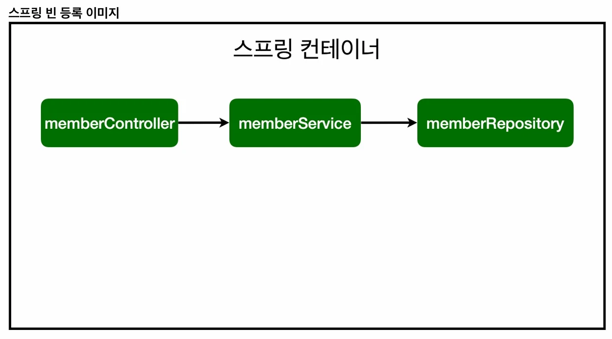

# [스프링 입문] 5. 컴포넌트 스캔과 자동 의존관계 설정(@Componet와 @Bean)

## 원문

https://ch010104.tistory.com/208

## 노트 유형

`tutorial`

## 학습 목표 및 맥락

스프링이 애플리케이션 실행 시 @Component와 관련된 어노테이션을 찾아 자동으로 빈(Bean)을 생성하고 연결하는 방식입니다.

@Controller, @Service, @Repository: 내부적으로 @Component를 포함하고 있어 스캔 대상이 됩니다.

## 원문 기반 학습 정리

### 1. 컴포넌트 스캔과 자동 의존관계 설정



스프링이 애플리케이션 실행 시 @Component와 관련된 어노테이션을 찾아 자동으로 빈(Bean)을 생성하고 연결하는 방식입니다.

### 핵심 어노테이션

@Component: 스프링 빈으로 자동 등록됩니다.

@Controller, @Service, @Repository: 내부적으로 @Component를 포함하고 있어 스캔 대상이 됩니다.

@Autowired: 스프링 컨테이너에서 연관된 객체를 찾아 주입해 줍니다. (DI: Dependency Injection)

### 코드 예시

```java
package com.example.spring_study.domain.controller;

import com.example.spring_study.domain.service.MemberService;
import org.springframework.beans.factory.annotation.Autowired;
import org.springframework.stereotype.Controller;

// 1. Controller: 외부 요청을 받고 서비스 연결
// Controller라는 어노태이션이 붙어 있으면, 스프링 서버가 실행될 때, MemberController 객체를 생성해서 Bean으로 관리함
@Controller
public class MemberController {

    private MemberService memberService;

    // Autowired 어노태이션이 붙어 있으면, 스프링 서버가 실행될 때, spring container에 있는 memberservice를 membercontroller에 연결함
    // 생성자 주입 - DI(의존성 주입)이라고 함
    // 만약 생성자가 1개 뿐이라면, @Autowired 생략 가능 -> 이것도 객체가 @Controller처럼 @Component로 관리되어야만 사용 가능
    @Autowired
    public MemberController(MemberService memberService) {
        this.memberService = memberService;
    }

}
```

```java
// 2. Service: 비즈니스 로직 처리
@Service
public class MemberService {
    private final MemberRepository memberRepository;

    @Autowired
    public MemberService(MemberRepository memberRepository) {
        this.memberRepository = memberRepository;
    }
}
```

```java
// 3. Repository: 데이터 저장 및 관리
@Repository
public class MemoryMemberRepository implements MemberRepository {
    // 구현 내용 생략
}
```

### 2. 자바 코드로 직접 스프링 빈 등록하기

향후 구현 클래스를 변경해야 할 상황(예: 메모리 리포지토리를 실제 DB 리포지토리로 교체)이 있다면, 컴포넌트 스캔 대신 설정 파일을 통해 수동으로 등록하는 것이 유리합니다.

먼저 @Service, @Repository, @Autowired 어노테이션을 제거한 뒤 진행합니다.

### 설정 클래스 (SpringConfig.java)

```java
package com.example.spring_study;

import com.example.spring_study.domain.repository.MemberRepository;
import com.example.spring_study.domain.repository.MemoryMemberRepository;
import com.example.spring_study.domain.service.MemberService;
import org.springframework.context.annotation.Bean;
import org.springframework.context.annotation.Configuration;

@Configuration
public class SpringConfig {

    @Bean
    public MemberService memberService() {
        return new MemberService(memberRepository());
    }

    // 이렇게 하면, 추후에 MemoryMemberRepository를 변경할 필요가 있을 경우, 이 부분만 변경하면 됨(자바 코드로 @Bean의 장점)
    @Bean
    public MemberRepository memberRepository() {
        return new MemoryMemberRepository(); // MemberRepository 인터페이스는 new 불가
    }
}
```

### 3. 핵심 참고 사항 및 주의점

싱글톤 (Singleton): 스프링은 빈을 등록할 때 기본적으로 유일하게 하나만 등록해서 공유합니다. 따라서 같은 빈이면 모두 동일한 인스턴스입니다.

DI의 3가지 방법: 필드 주입, Setter 주입, 생성자 주입이 있습니다. 의존관계가 런타임에 동적으로 변하는 경우는 거의 없으므로 생성자 주입을 권장합니다.

스프링 관리 객체: @Autowired를 통한 DI는 스프링 컨테이너에 등록된 빈끼리만 동작합니다. 내가 직접 new로 생성한 객체에서는 스프링이 의존성을 넣어주지 않습니다.

### 4. import와 @Bean의 결정적 차이

이 부분이 가장 헷갈릴 수 있는 지점인데, 역할 자체가 완전히 다릅니다.

## 관련 글

- [[blog/INFLEARN/index|INFLEARN]]
- [[blog/INFLEARN/스프링 입문- 8. 스프링 데이터 JPA|[스프링 입문] 8. 스프링 데이터 JPA]]
- [[blog/INFLEARN/스프링 입문- 4. JUnit5 테스트 코드 작성|[스프링 입문] 4. JUnit5 테스트 코드 작성]]
- [[blog/INFLEARN/스프링 입문- 9. AOP 와 프록시|[스프링 입문] 9. AOP 와 프록시]]
