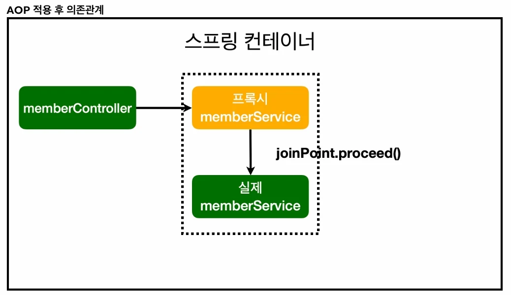
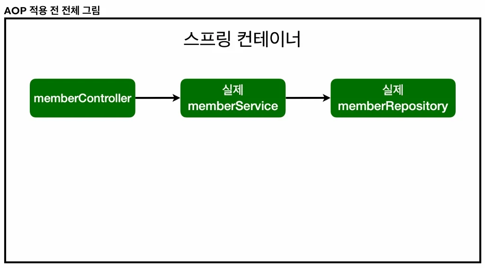
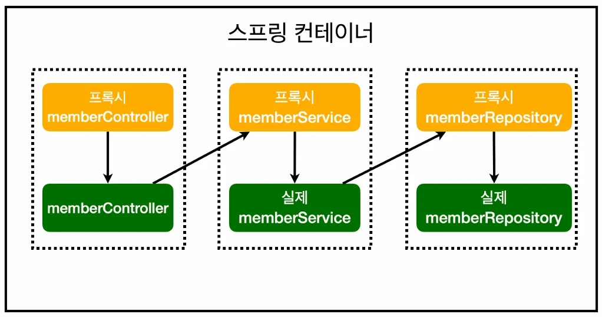

# [스프링 입문] 9. AOP 와 프록시

## 원문

https://ch010104.tistory.com/212

## 노트 유형

`tutorial`

## 학습 목표 및 맥락

기존의 MemberService는 아래와 같이 핵심 로직보다 시간 측정 로직이 더 비대해진 상태였습니다.

문제점: join()과 findMembers()에 동일한 시간 측정 로직이 중복되어 있고, 비즈니스 로직을 한눈에 파악하기 어렵습니다.

## 원문 기반 학습 정리

### 1. AOP가 필요한 상황 (Before AOP)

기존의 MemberService는 아래와 같이 핵심 로직보다 시간 측정 로직이 더 비대해진 상태였습니다.

```text
// MemberService의 기존 모습 (핵심 로직과 공통 로직의 혼재)
public Long join(Member member) {
    long start = System.currentTimeMillis(); // 공통 관심 사항
    try {
        validateDuplicateMember(member);      // 핵심 관심 사항
        memberRepository.save(member);       // 핵심 관심 사항
        return member.getId();
    } finally {
        long finish = System.currentTimeMillis(); // 공통 관심 사항
        long timeMs = finish - start;
        System.out.println("join " + timeMs + "ms");
    }
}
```

문제점: join()과 findMembers()에 동일한 시간 측정 로직이 중복되어 있고, 비즈니스 로직을 한눈에 파악하기 어렵습니다.

### 2. AOP 적용 후: 코드의 분리

이제 TimeTraceAop를 통해 시간 측정 로직을 완전히 밖으로 빼냅니다.

### 공통 관심 사항: TimeTraceAop

```java
package com.example.spring_study.aop;

import org.aspectj.lang.ProceedingJoinPoint;
import org.aspectj.lang.annotation.Around;
import org.aspectj.lang.annotation.Aspect;
import org.springframework.stereotype.Component;

// AOP 클래스임
@Aspect
// @Component // -> Component 로 등록해서 사용도 가능하고, SpringConfig에서 @Bean 등록도 가능
public class TimeTraceAop {

    // @Around -> ()의 package에 있는 파일들에 적용 -> SpringConfig는 Aop 대상에 포함 x
    @Around("execution(* com.example.spring_study..*(..)) && !target(com.example.spring_study.SpringConfig)")
    public Object excute(ProceedingJoinPoint joinPoint) throws Throwable {

        long startTime = System.currentTimeMillis();
        System.out.println("Start: " + joinPoint.toString());

        try {
            return joinPoint.proceed();
        }finally {
            final long endTime = System.currentTimeMillis();
            final long elapsedTime = endTime - startTime;
            System.out.println("End: " + joinPoint.toString() + " " + elapsedTime + " ms");
        }
    }
}
```

### 3. 핵심 동작 원리: 프록시와 DI

### ① 가짜 객체(Proxy)의 생성

스프링 컨테이너가 올라갈 때, AOP 설정(@Aspect)을 보고 MemberService를 복제한 **가짜 객체(Proxy)**를 만듭니다. 스프링은 이 프록시를 실제 MemberService 대신 빈으로 등록합니다.

### ② 의존관계 주입(DI)의 역할

MemberController는 MemberService를 주입받을 때, 스프링이 가짜(Proxy)를 넣어줘도 아무 의심 없이 받습니다. 타입이 같기 때문이죠. 이것이 가능한 근본적인 이유가 바로 DI 덕분입니다.

### ③ joinPoint.proceed()의 진짜 의미

사용자가 memberService.join()을 호출하면 벌어지는 일입니다:

프록시 호출: 컨트롤러는 가짜 객체인 프록시의 join()을 먼저 호출합니다.

AOP 실행: TimeTraceAop의 execute 로직이 먼저 실행되어 START 로그를 찍고 시간을 재기 시작합니다.

핵심 로직 진입: joinPoint.proceed()가 실행되는 순간, 프록시가 들고 있던 제어권을 진짜 MemberService 객체에게 넘깁니다. 이때 비로소 "회원가입"이나 "회원조회"가 실행됩니다.

AOP 마무리: 진짜 객체의 일이 끝나면 다시 프록시로 돌아와 finally 블록의 END 로그와 수행 시간을 출력합니다.

## 핵심 이미지







## 관련 글

- [[blog/INFLEARN/index|INFLEARN]]
- [[blog/INFLEARN/스프링 입문- 8. 스프링 데이터 JPA|[스프링 입문] 8. 스프링 데이터 JPA]]
- [[blog/INFLEARN/스프링 입문- 5. 컴포넌트 스캔과 자동 의존관계 설정(@Componet와 @Bean)|[스프링 입문] 5. 컴포넌트 스캔과 자동 의존관계 설정(@Componet와 @Bean)]]
- [[blog/INFLEARN/스프링 입문- 4. JUnit5 테스트 코드 작성|[스프링 입문] 4. JUnit5 테스트 코드 작성]]
