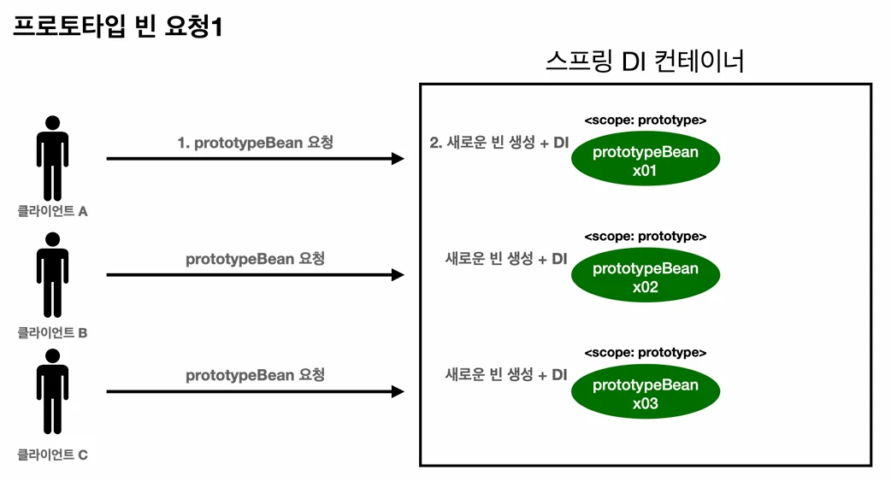
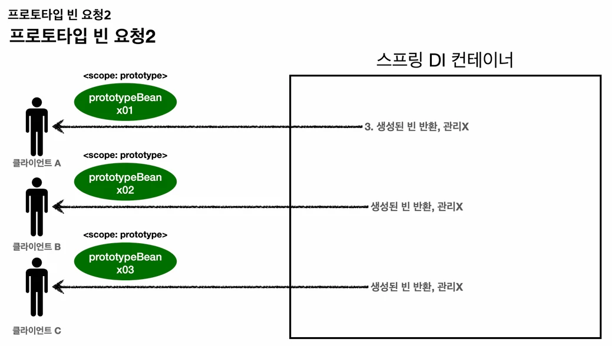
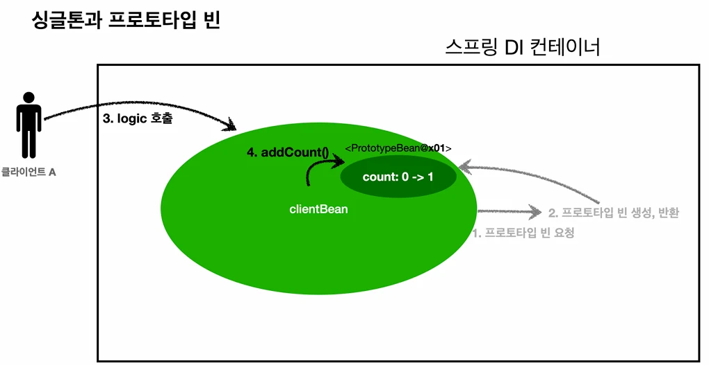

# [스프링 핵심 원리 - 기본편] 17. 빈 스코프(Singleton, Prototype, Request, Proxy)

## 원문

https://ch010104.tistory.com/238

## 노트 유형

`tutorial`

## 학습 목표 및 맥락

스프링 빈은 기본적으로 싱글톤 스코프로 생성되므로 컨테이너 시작부터 종료까지 유지됩니다. **스코프(Scope)**는 빈이 존재할 수 있는 범위를 뜻합니다.

싱글톤: 기본 스코프, 컨테이너의 시작과 종료까지 유지되는 가장 넓은 범위.

## 원문 기반 학습 정리

### 1. 빈 스코프란?

스프링 빈은 기본적으로 싱글톤 스코프로 생성되므로 컨테이너 시작부터 종료까지 유지됩니다. **스코프(Scope)**는 빈이 존재할 수 있는 범위를 뜻합니다.

### 스프링이 지원하는 다양한 스코프

싱글톤: 기본 스코프, 컨테이너의 시작과 종료까지 유지되는 가장 넓은 범위.

프로토타입: 생성과 의존관계 주입까지만 관여하고 더는 관리하지 않는 매우 짧은 범위.

웹 관련 스코프:

request: 웹 요청이 들어오고 나갈 때까지 유지.

session: 웹 세션의 생성과 종료까지 유지.

application: 서블릿 컨텍스트와 동일한 범위.

### 빈 스코프 지정 방법

자동 등록:

```java
@Scope("prototype")
@Component
public class HelloBean {
}
```

> 원문 코드가 길어 이 노트에서는 앞부분만 보존했습니다. 전체는 원문에서 확인합니다.

수동 등록:

```text
@Scope("prototype")
@Bean
PrototypeBean HelloBean() { return new HelloBean(); }
```

### 2. 프로토타입 스코프

싱글톤은 항상 같은 인스턴스를 반환하지만, 프로토타입은 조회 시점에 항상 새로운 인스턴스를 생성해서 반환합니다.

### 프로토타입 빈 요청 과정

클라이언트가 프로토타입 빈을 스프링 컨테이너에 요청한다.

스프링 컨테이너는 이 시점에 빈을 생성하고, 의존관계를 주입한다.

컨테이너는 생성한 빈을 클라이언트에 반환한다.

이후 컨테이너는 빈을 관리하지 않는다. (관리 책임은 클라이언트에 있음)

따라서 @PreDestroy 같은 종료 메서드가 호출되지 않는다.

### 프로토타입 스코프 빈 테스트 코드

```java
package com.example.spring_study.scope;

import jakarta.annotation.PostConstruct;
import jakarta.annotation.PreDestroy;
import org.junit.jupiter.api.Test;
import org.springframework.context.annotation.AnnotationConfigApplicationContext;
import org.springframework.context.annotation.Scope;

import static org.assertj.core.api.Assertions.assertThat;

public class PrototypeTest {
    @Test
    void prototypeBeanFind() {
        AnnotationConfigApplicationContext ac = new AnnotationConfigApplicationContext(PrototypeBean.class);

        System.out.println("find prototype bean1");
        PrototypeBean prototypeBean1 = ac.getBean(PrototypeBean.class); // 해당 시점에서 init() 함수가 실행되어 객체가 생성됨

        System.out.println("find prototype bean2");
        PrototypeBean prototypeBean2 = ac.getBean(PrototypeBean.class); // 해당 시점에서 init() 함수가 실행되어 객체가 생성됨

        // 두 객체의 참조값이 서로 다름(prototype 이기 때문에, 그때마다 서로 다른 객체를 생성해서 반환)
        System.out.println("prototypeBean1 = " + prototypeBean1);
        System.out.println("prototypeBean2 = " + prototypeBean2);

        assertThat(prototypeBean1).isNotSameAs(prototypeBean2);

        ac.close(); // 컨테이너를 close()해도 destroy() 함수가 호출되지 않음 -> singletion의 경우에는 이 시점에 destroy()가 호출됨

        // destroy() 함수 호출이 필요시에 container가 아닌, 사용하는 곳에서 직접 함수를 호출해야함
        prototypeBean1.destroy();
        prototypeBean2.destroy();
    }

    @Scope("prototype")
    static class PrototypeBean{

        @PostConstruct
        public void init(){
            System.out.println("PrototypeBean init");
        }

        @PreDestroy
        public void destroy(){
            System.out.println("PrototypeBean destroy");
        }
    }
}
```

### 3. 싱글톤 빈과 함께 사용 시 문제점

싱글톤 빈이 프로토타입 빈을 주입받으면, 주입 시점에만 새로 생성되고 싱글톤 빈과 함께 계속 유지되는 문제가 발생합니다.

### 테스트 코드 (문제가 발생하는 경우)

```java
package com.example.spring_study.scope;

import jakarta.annotation.PostConstruct;
import jakarta.annotation.PreDestroy;
import org.junit.jupiter.api.Test;
import org.springframework.beans.factory.annotation.Autowired;
import org.springframework.context.annotation.AnnotationConfigApplicationContext;
import org.springframework.context.annotation.Scope;
import org.springframework.stereotype.Component;

import static org.assertj.core.api.Assertions.*;

public class SingletonWithPrototypeTest1 {

    @Test
    void prototypeFind(){
        AnnotationConfigApplicationContext ac = new AnnotationConfigApplicationContext(PrototypeBean.class);

        PrototypeBean prototypeBean1 = ac.getBean(PrototypeBean.class);
        prototypeBean1.addCount();
        assertThat(prototypeBean1.getCount()).isEqualTo(1);

        PrototypeBean prototypeBean2 = ac.getBean(PrototypeBean.class);
        prototypeBean2.addCount();
        assertThat(prototypeBean2.getCount()).isEqualTo(1);

    }

    @Test
    void singletonClientUsePrototype() {
        AnnotationConfigApplicationContext ac = new AnnotationConfigApplicationContext(ClientBean.class, PrototypeBean.class);

        ClientBean clientBean1 = ac.getBean(ClientBean.class);
        int count1 = clientBean1.logic();
        assertThat(count1).isEqualTo(1); // count가 0인 prototype 객체를 생성해서 1을 더함

        ClientBean clientBean2 = ac.getBean(ClientBean.class);
        int count2 = clientBean2.logic();
        assertThat(count2).isEqualTo(2); // count가 1인 prototype이 있는 singleton을 가져와서 1을 더하기 때문에 2가 됨
    }

    @Scope("singleton")
    @Component
    static class ClientBean{
        private final PrototypeBean prototypeBean; // 생성 시점에 prototypeBean이 singleton인 ClientBean에 주입됨 -> 이후에는 계속 같은 prototpe을 singleton에서 사용

        @Autowired
        public ClientBean(PrototypeBean prototypeBean){
            this.prototypeBean = prototypeBean;
        }

        public int logic(){
            prototypeBean.addCount();
            int count = prototypeBean.getCount();
            return count;
        }
    }

    @Scope("prototype")
    @Component
    static class PrototypeBean{
        private int count = 0;

        public void addCount(){
            count++;
        }

        public int getCount(){
            return count;
        }

        @PostConstruct
        public void init(){
            System.out.println("PrototypeBean.init" + this);
        }

        @PreDestroy
        // prototype Bean이므로 실제로는 호출될 일이 없음
        public void destroy(){
            System.out.println("PrototypeBean.destroy");
        }
    }
}
```

### 4. Provider로 문제 해결

의존관계를 외부에서 주입받는 것이 아니라, 직접 필요한 의존관계를 찾는 **DL(Dependency Lookup, 의존관계 조회)**을 사용합니다.

### 방법 1: ObjectProvider (스프링 제공)

```text
@Autowired
private ObjectProvider<PrototypeBean> prototypeBeanProvider;

public int logic() {
    PrototypeBean prototypeBean = prototypeBeanProvider.getObject(); // 호출 시점 DL
    prototypeBean.addCount();
    return prototypeBean.getCount();
}
```

### 방법 2: JSR-330 Provider (자바 표준)

jakarta.inject:jakarta.inject-api:2.0.1 라이브러리 추가 필요.

```text
@Autowired
private Provider<PrototypeBean> provider;

public int logic() {
    PrototypeBean prototypeBean = provider.get(); // 호출 시점 DL
    prototypeBean.addCount();
    return prototypeBean.getCount();
}
```

### 5. 웹 스코프와 프록시 (Request 스코프)

request 스코프는 HTTP 요청 하나가 들어오고 나갈 때까지 유지되는 스코프입니다.

### WebScope와 Provider

```java
package com.example.spring_study.web;

import com.example.spring_study.commom.MyLogger;
import jakarta.servlet.http.HttpServletRequest;
import lombok.RequiredArgsConstructor;
import org.springframework.beans.factory.ObjectProvider;
import org.springframework.stereotype.Controller;
import org.springframework.web.bind.annotation.RequestMapping;
import org.springframework.web.bind.annotation.ResponseBody;

@Controller
@RequiredArgsConstructor
public class LogDemoController {

    private final LogDemoService logDemoService;
    private final ObjectProvider<MyLogger> myLoggerProvider; // myLogger를 찾을 수 있는 dependacny lookup을 할 수 있는 provider가 주입됨

    @RequestMapping("log-demo")
    @ResponseBody
    public String logDemo(HttpServletRequest request) { // HttpServletRequest으로 고객 요청 정보를 받을 수 있음

        String requestURL = request.getRequestURL().toString();
        MyLogger myLogger = myLoggerProvider.getObject();
        myLogger.setRequestURL(requestURL);

        myLogger.log("controller test");
        logDemoService.logic("testId");

        return "OK";
    }
}
```

```java
package com.example.spring_study.web;

import com.example.spring_study.commom.MyLogger;
import lombok.RequiredArgsConstructor;
import org.springframework.beans.factory.ObjectProvider;
import org.springframework.stereotype.Service;

@Service
@RequiredArgsConstructor
public class LogDemoService {

    private final ObjectProvider<MyLogger> myLoggerProvider; // myLogger를 찾을 수 있는 dependacny lookup을 할 수 있는 provider가 주입됨

    public void logic(String id) {

        MyLogger myLogger = myLoggerProvider.getObject();
        myLogger.log("service id = " + id);
    }
}
```

```java
package com.example.spring_study.commom;

import jakarta.annotation.PostConstruct;
import jakarta.annotation.PreDestroy;
import org.springframework.context.annotation.Scope;
import org.springframework.stereotype.Component;

import java.util.UUID;

@Component
@Scope(value = "request")
public class MyLogger {

    private String uuid;
    private String requestURL;

    public void setRequestURL(String requestURL) {
        this.requestURL = requestURL;
    }

    public void log(String message) {
        System.out.println("[" + uuid + "] " + "[" + requestURL + "] " + message);
    }

    @PostConstruct
    public void init() {
        uuid = UUID.randomUUID().toString();
        System.out.println("[" + uuid + "] request scope bean create:" + this);
    }

    @PreDestroy
    public void close() {
        System.out.println("[" + uuid + "] request scope bean close:" + this);
    }
}
```

### 결과

http://localhost:8080/log-demo 에 3번 요청했을 때, 각자 다른 requset의 myLogger가 생성되는 것을 확인 가능

```text
[09d36931-eab1-4d47-aae1-857ccc3e96a7] request scope bean create:com.example.spring_study.commom.MyLogger@1c2f1807
[09d36931-eab1-4d47-aae1-857ccc3e96a7] [<http://localhost:8080/log-demo>] controller test
[09d36931-eab1-4d47-aae1-857ccc3e96a7] [<http://localhost:8080/log-demo>] service id = testId
[09d36931-eab1-4d47-aae1-857ccc3e96a7] request scope bean close:com.example.spring_study.commom.MyLogger@1c2f1807
[7d4b38ea-f337-4967-a45e-1cc3fe3d147e] request scope bean create:com.example.spring_study.commom.MyLogger@d507a0d
[7d4b38ea-f337-4967-a45e-1cc3fe3d147e] [<http://localhost:8080/log-demo>] controller test
[7d4b38ea-f337-4967-a45e-1cc3fe3d147e] [<http://localhost:8080/log-demo>] service id = testId
[7d4b38ea-f337-4967-a45e-1cc3fe3d147e] request scope bean close:com.example.spring_study.commom.MyLogger@d507a0d
[a4b011b1-3257-4e6f-b45f-55f75e0cce3f] request scope bean create:com.example.spring_study.commom.MyLogger@25f6541e
[a4b011b1-3257-4e6f-b45f-55f75e0cce3f] [<http://localhost:8080/log-demo>] controller test
[a4b011b1-3257-4e6f-b45f-55f75e0cce3f] [<http://localhost:8080/log-demo>] service id = testId
[a4b011b1-3257-4e6f-b45f-55f75e0cce3f] request scope bean close:com.example.spring_study.commom.MyLogger@25f6541e
```

### MyLogger (프록시 설정)

```java
package com.example.spring_study.commom;

import jakarta.annotation.PostConstruct;
import jakarta.annotation.PreDestroy;
import org.springframework.context.annotation.Scope;
import org.springframework.context.annotation.ScopedProxyMode;
import org.springframework.stereotype.Component;

import java.util.UUID;

@Component
@Scope(value = "request", proxyMode = ScopedProxyMode.TARGET_CLASS)
// 적용 대상이 인터페이스가 아닌 클래스면 TARGET_CLASS를 선택
// 적용 대상이 인터페이스면 INTERFACES를 선택
public class MyLogger {

    private String uuid;
    private String requestURL;

    public void setRequestURL(String requestURL) {
        this.requestURL = requestURL;
    }

    public void log(String message) {
        System.out.println("[" + uuid + "] " + "[" + requestURL + "] " + message);
    }

    @PostConstruct
    public void init() {
        uuid = UUID.randomUUID().toString();
        System.out.println("[" + uuid + "] request scope bean create:" + this);
    }

    @PreDestroy
    public void close() {
        System.out.println("[" + uuid + "] request scope bean close:" + this);
    }
}
```

```java
package com.example.spring_study.web;

import com.example.spring_study.commom.MyLogger;
import jakarta.servlet.http.HttpServletRequest;
import lombok.RequiredArgsConstructor;
import org.springframework.beans.factory.ObjectProvider;
import org.springframework.stereotype.Controller;
import org.springframework.web.bind.annotation.RequestMapping;
import org.springframework.web.bind.annotation.ResponseBody;

@Controller
@RequiredArgsConstructor
public class LogDemoController {

    private final LogDemoService logDemoService;
    // private final ObjectProvider<MyLogger> myLoggerProvider; // myLogger를 찾을 수 있는 dependacny lookup을 할 수 있는 provider가 주입됨
    private final MyLogger myLogger;

    @RequestMapping("log-demo")
    @ResponseBody
    public String logDemo(HttpServletRequest request) { // HttpServletRequest으로 고객 요청 정보를 받을 수 있음

        String requestURL = request.getRequestURL().toString();
        // MyLogger myLogger = myLoggerProvider.getObject(); // 이 시점에 myLogger가 생성됨 - request 스코프 이므로 HTTP 요청 하나가 들어올 때 딱 한 번 생성됨
        myLogger.setRequestURL(requestURL);

        myLogger.log("controller test");
        logDemoService.logic("testId");

        return "OK";
    }
}
```

```java
package com.example.spring_study.web;

import com.example.spring_study.commom.MyLogger;
import lombok.RequiredArgsConstructor;
import org.springframework.beans.factory.ObjectProvider;
import org.springframework.stereotype.Service;

@Service
@RequiredArgsConstructor
public class LogDemoService {

    // private final ObjectProvider<MyLogger> myLoggerProvider; // myLogger를 찾을 수 있는 dependacny lookup을 할 수 있는 provider가 주입됨
    private final MyLogger myLogger;

    public void logic(String id) {

        // MyLogger myLogger = myLoggerProvider.getObject(); // 이 시점에 myLogger가 생성됨 - request 스코프 이므로 HTTP 요청 하나가 들어올 때 딱 한 번 생성됨
        // 이 request 스코프의 myLogger는 하나의 클라이언트(http 요청)당 1개이기 때문에 한 http 요청에서의 Serivce랑 Controller가 공유함(Controller에서 만든 그 myLogger를 가져옴)
        myLogger.log("service id = " + id);
    }
}
```

### 웹 스코프의 동작 원리

CGLIB 라이브러리로 원본 클래스를 상속받은 가짜 프록시 객체를 생성하여 주입합니다.

가짜 프록시 객체는 싱글톤처럼 동작하며, 실제 요청이 오면 내부에서 진짜 빈을 요청하는 위임 로직을 수행합니다.

핵심은 진짜 객체 조회를 꼭 필요한 시점까지 지연처리 한다는 점입니다.

## 핵심 이미지







## 관련 글

- [[blog/INFLEARN/index|INFLEARN]]
- [[blog/INFLEARN/스프링 핵심 원리 - 기본편- 16. 빈 생명주기 콜백|[스프링 핵심 원리 - 기본편] 16. 빈 생명주기 콜백]]
- [[blog/INFLEARN/스프링 핵심 원리 - 기본편- 15. 조회한 빈이 모두 필요할 때- List, Map 활용|[스프링 핵심 원리 - 기본편] 15. 조회한 빈이 모두 필요할 때: List, Map 활용]]
- [[blog/INFLEARN/스프링 핵심 원리 - 기본편- 14. 애노태이션 직접 생성하기|[스프링 핵심 원리 - 기본편] 14. 애노태이션 직접 생성하기]]
