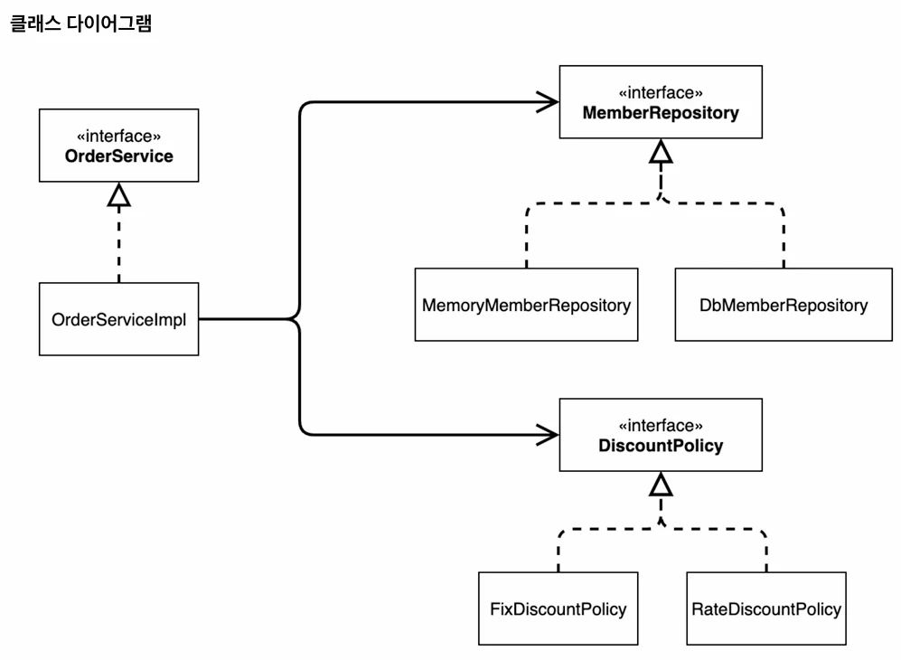
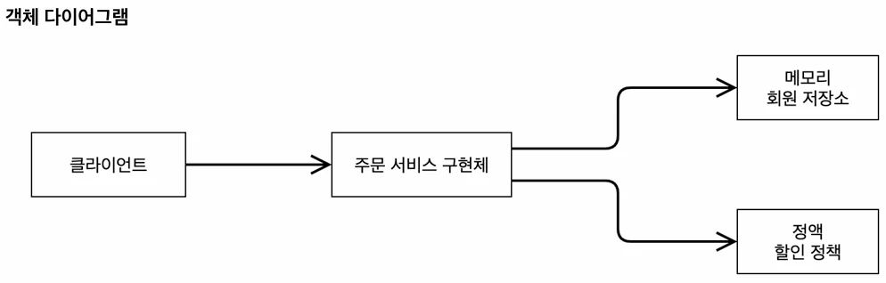

# [스프링 핵심 원리 - 기본편] 2. DIP, OCP 예시 보충

## 원문

https://ch010104.tistory.com/220

## 노트 유형

`tutorial`

## 학습 목표 및 맥락

인터페이스를 썼지만, 서비스 내부에서 직접 구현체를 선택하고 있는 상태입니다.

이제 서비스는 외부에서 주는 대로 받는 '수동적인' 구조로 바뀝니다.

## 원문 기반 학습 정리

### 1. Before: 다형성만 사용 (OCP, DIP 위반)

인터페이스를 썼지만, 서비스 내부에서 직접 구현체를 선택하고 있는 상태입니다.

```java
package com.example.spring_study.spring_study.member;

public class MemberSeviceImpl implements MemberSevice{

    private final MemberRepository memberRepository = new MemoryMemberRepository();

    @Override
    public void join(Member member) {
        memberRepository.save(member);
    }

    @Override
    public Member findMember(Long memberId) {
        return memberRepository.findById(memberId);
    }
}
```

```java
package com.example.spring_study.spring_study.order;

import com.example.spring_study.spring_study.discount.DiscountPolicy;
import com.example.spring_study.spring_study.discount.FixDiscountPolicy;
import com.example.spring_study.spring_study.member.Member;
import com.example.spring_study.spring_study.member.MemberRepository;
import com.example.spring_study.spring_study.member.MemoryMemberRepository;

public class OrderServiceImpl implements OrderSevice{

    private final MemberRepository memberRepository = new MemoryMemberRepository();
    private final DiscountPolicy discountPolicy = new FixDiscountPolicy();

    @Override
    public Order createOrder(Long memberId, String itemName, int itemPrice) {
        Member member = memberRepository.findById(memberId);

        // 단일 책임 원칙(SRP)
        // OrderService 입장에서는 discount에 대한 사항을 모름 -> 책임을 DiscountPolicy한테 인가
        int discountPrice = discountPolicy.discount(member, itemPrice);

        return new Order(memberId, itemName, itemPrice, discountPrice);
    }
}
```

### 2. After: AppConfig 도입 (OCP, DIP 완성)

이제 서비스는 외부에서 주는 대로 받는 '수동적인' 구조로 바뀝니다.

### ① MemberServiceImpl & OrderServiceImpl (수정 후)

```java
package com.example.spring_study.spring_study.member;

public class MemberServiceImpl implements MemberService {

    private final MemberRepository memberRepository;

    public MemberServiceImpl(MemberRepository memberRepository) {
        this.memberRepository = memberRepository;
    }

    @Override
    public void join(Member member) {
        memberRepository.save(member);
    }

    @Override
    public Member findMember(Long memberId) {
        return memberRepository.findById(memberId);
    }
}
```

```java
package com.example.spring_study.spring_study.order;

import com.example.spring_study.spring_study.discount.DiscountPolicy;
import com.example.spring_study.spring_study.member.Member;
import com.example.spring_study.spring_study.member.MemberRepository;

public class OrderServiceImpl implements OrderService {

    private final MemberRepository memberRepository;
    private final DiscountPolicy discountPolicy;

    public OrderServiceImpl(MemberRepository memberRepository, DiscountPolicy discountPolicy) {
        this.memberRepository = memberRepository;
        this.discountPolicy = discountPolicy;
    }

    @Override
    public Order createOrder(Long memberId, String itemName, int itemPrice) {
        Member member = memberRepository.findById(memberId);

        // 단일 책임 원칙(SRP)
        // OrderService 입장에서는 discount에 대한 사항을 모름 -> 책임을 DiscountPolicy한테 인가
        int discountPrice = discountPolicy.discount(member, itemPrice);

        return new Order(memberId, itemName, itemPrice, discountPrice);
    }
}
```

### ② AppConfig (기획자 등장)

객체를 생성하고, 이들의 연결 고리를 맺어주는 제3의 장소입니다.

```java
package com.example.spring_study.spring_study;

import com.example.spring_study.spring_study.discount.FixDiscountPolicy;
import com.example.spring_study.spring_study.member.MemberService;
import com.example.spring_study.spring_study.member.MemberServiceImpl;
import com.example.spring_study.spring_study.member.MemoryMemberRepository;
import com.example.spring_study.spring_study.order.OrderServiceImpl;
import com.example.spring_study.spring_study.order.OrderService;

// 객체의 생성과 연결을 담당함
public class AppConfig {

    public MemberService memberService(){
        return new MemberServiceImpl(new MemoryMemberRepository());
    }

    public OrderService orderService(){
        // OrderSe
        return new OrderServiceImpl(new MemoryMemberRepository(), new FixDiscountPolicy());
    }
}
```

### ③ MemberApp (실행)

이제 메인 프로그램은 AppConfig에게 부탁해서 객체를 꺼내 씁니다.

```java
package com.example.spring_study.spring_study;

import com.example.spring_study.spring_study.member.Grade;
import com.example.spring_study.spring_study.member.Member;
import com.example.spring_study.spring_study.member.MemberService;

public class MemberApp {
    public static void main(String[] args) {
        AppConfig appConfig = new AppConfig();
        // 기존 MemberService memberService = new MemberServiceImpl()을 대체 -> AppConfig의 생성자로 memberService 객체를 가져옴
        MemberService memberService = appConfig.memberService();
        Member member = new Member(1L, "memberA", Grade.VIP);
        memberService.join(member);

        Member findMember = memberService.findMember(1L);
        System.out.println("new Member = " + member.getName());
        System.out.println("find Member = " + findMember.getName());
    }
}
```

```java
package com.example.spring_study.spring_study;

import com.example.spring_study.spring_study.member.Grade;
import com.example.spring_study.spring_study.member.Member;
import com.example.spring_study.spring_study.member.MemberService;
import com.example.spring_study.spring_study.order.Order;
import com.example.spring_study.spring_study.order.OrderService;

public class OrderApp {
    public static void main(String[] args) {
        AppConfig appConfig = new AppConfig();
        MemberService memberService = appConfig.memberService(); // MemberService memberService = new MemberServiceImpl()을 대체
        OrderService orderService = appConfig.orderService(); // OrderService orderService = new OrderServiceImpl()을 대체

        Long memberId = 1L;
        Member member = new Member(memberId,"memberA", Grade.VIP);
        memberService.join(member);

        Order order = orderService.createOrder(memberId,"itemA", 10000);

        System.out.println("order = " + order);
        // System.out.println("order.calculatePrice = " + order.calculatePrice());
    }
}
```

### 💡 요점 정리





## 관련 글

- [[blog/INFLEARN/index|INFLEARN]]
- [[blog/INFLEARN/스프링 핵심 원리 - 기본편- 1. SOLID 원칙|[스프링 핵심 원리 - 기본편] 1. SOLID 원칙]]
- [[blog/INFLEARN/스프링 핵심 원리 - 기본편- 3. 프레임워크 vs 라이브러리|[스프링 핵심 원리 - 기본편] 3. 프레임워크 vs 라이브러리]]
- [[blog/INFLEARN/스프링 핵심 원리 - 기본편- 4. 순수 Java 코드 → Spring 전환|[스프링 핵심 원리 - 기본편] 4. 순수 Java 코드 → Spring 전환]]
