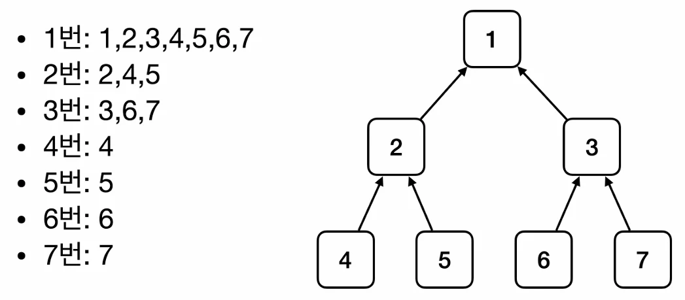

# [스프링 핵심 원리 - 기본편] 6. 스프링 빈 조회 - 기본, 동일타입이 둘 이상, 상속

## 원문

https://ch010104.tistory.com/224

## 노트 유형

`tutorial`

## 학습 목표 및 맥락

구체 타입 조회: 인터페이스가 아닌 구현체 타입(예: MemberServiceImpl)으로도 조회가 가능하지만, 변경 시 유연성이 떨어짐.

예외 발생: 조회 대상 스프링 빈이 없으면 NoSuchBeanDefinitionException이 발생. (assertThrows로 검증)

## 원문 기반 학습 정리

### 1. 스프링 빈 조회 - 기본

스프링 컨테이너에서 빈을 찾는 가장 기본적인 방법

조회 방법

ac.getBean(빈이름, 타입)

ac.getBean(타입)

특이 사항

구체 타입 조회: 인터페이스가 아닌 구현체 타입(예: MemberServiceImpl)으로도 조회가 가능하지만, 변경 시 유연성이 떨어짐.

예외 발생: 조회 대상 스프링 빈이 없으면 NoSuchBeanDefinitionException이 발생. (assertThrows로 검증)

```java
package com.example.spring_study.spring_study.beanfind;

import com.example.spring_study.spring_study.AppConfig;
import com.example.spring_study.spring_study.member.MemberService;
import com.example.spring_study.spring_study.member.MemberServiceImpl;
import org.junit.jupiter.api.DisplayName;
import org.junit.jupiter.api.Test;
import org.springframework.beans.factory.NoSuchBeanDefinitionException;
import org.springframework.context.annotation.AnnotationConfigApplicationContext;

import static org.assertj.core.api.Assertions.*;
import static org.junit.jupiter.api.Assertions.*;

class ApplicationContextBasicFindTest {

    AnnotationConfigApplicationContext ac = new AnnotationConfigApplicationContext(AppConfig.class);

    @Test
    @DisplayName("빈 이름으로 조회")
    void findBeanByName(){
        MemberService memberService = ac.getBean("memberService", MemberService.class);

        // System.out.println("memberService = " + memberService);
        // System.out.println("memberService.getClass() = " + memberService.getClass());

        // MemerService가 MemberServiceImpl의 인스턴스인지
        assertThat(memberService).isInstanceOf(MemberServiceImpl.class);
    }

    @Test
    @DisplayName("이름 없이 타입으로 조회")
    void findBeanByType(){
        // 같은 타입이 여러 개의 경우 위험(하나일 경우에는, 가능)
        MemberService memberService = ac.getBean(MemberService.class);

        // MemerService가 MemberServiceImpl의 인스턴스인지
        assertThat(memberService).isInstanceOf(MemberServiceImpl.class);
    }

    @Test
    @DisplayName("구체 타입으로 조회")
    // 구체에 의존하는 형식이기 때문에, DIP에 위반 -> 좋은 코드는 아님
    void findBeanByType2(){
        MemberServiceImpl memberServiceImpl = ac.getBean("memberService", MemberServiceImpl.class);

        // MemerService가 MemberServiceImpl의 인스턴스인지
        assertThat(memberServiceImpl).isInstanceOf(MemberServiceImpl.class);
    }

    @Test
    @DisplayName("빈 이름으로 조회 x")
    void findBeanByNameX(){
        // ac.getBean("xxxxx", MemberService.class);
        // MemberService xxxxx = ac.getBean("xxxxx", MemberService.class); -> 실행시에 NoSuchBeanDefinitionException 에러가 나옴
        assertThrows(NoSuchBeanDefinitionException.class, () -> ac.getBean("xxxxx", MemberService.class));
    }
}
```

### 2. 스프링 빈 조회 - 동일한 타입이 둘 이상일 때

타입으로 조회 시 같은 타입의 빈이 컨테이너에 둘 이상 등록되어 있다면 별도의 처리가 필요

문제 상황

타입만으로 조회(ac.getBean(타입))하면 NoUniqueBeanDefinitionException 오류가 발생

해결 방법

빈 이름 지정: ac.getBean("빈이름", 타입)을 사용하여 특정 빈을 명시

모두 조회: ac.getBeansOfType(타입)을 사용하면 해당 타입의 모든 빈을 Map 형태로 조회할 수 있음

```java
package com.example.spring_study.spring_study.beanfind;

import com.example.spring_study.spring_study.member.MemberRepository;
import com.example.spring_study.spring_study.member.MemoryMemberRepository;
import org.junit.jupiter.api.DisplayName;
import org.junit.jupiter.api.Test;
import org.springframework.beans.factory.NoUniqueBeanDefinitionException;
import org.springframework.context.annotation.AnnotationConfigApplicationContext;
import org.springframework.context.annotation.Bean;
import org.springframework.context.annotation.Configuration;

import java.util.Map;

import static org.assertj.core.api.Assertions.*;
import static org.junit.jupiter.api.Assertions.*;

public class ApplicationContextSameBeanFindTest {

    // Spring Container의 중복 타입 테스트를 위해서 기존의 AppConfig가 아닌, 테스트용 SameBeanConfig를 사용
    AnnotationConfigApplicationContext ac = new AnnotationConfigApplicationContext(SameBeanConfig.class);

    @Configuration
    static class SameBeanConfig {

        @Bean
        public MemberRepository memberRepository1() {
            return new MemoryMemberRepository();
        }

        @Bean
        public MemberRepository memberRepository2() {
            return new MemoryMemberRepository();
        }
    }

    @Test
    @DisplayName("타입으로 조회시 같은 타입이 둘 이상 있으면, 중복 오류가 발생한다")
    void findBeanByTypeDuplicate(){
        // MemberRepository bean = ac.getBean(MemberRepository.class); // -> NoUniqueBeanDefinitionException 에러 발생
        assertThrows(NoUniqueBeanDefinitionException.class, () -> ac.getBean(MemberRepository.class));
    }

    @Test
    @DisplayName("타입으로 조회시 같은 타입이 둘 이상이 있으면, 빈 이름을 지정하면 된다")
    void findBeanByName(){
        MemberRepository memberRepository = ac.getBean("memberRepository1",MemberRepository.class);
        assertThat(memberRepository).isInstanceOf(MemberRepository.class);
    }

    @Test
    @DisplayName("특정 타입을 모두 조회하기")
    void findAllBeanByType(){
        // getBeanOfType으로 특정 타입의 Bean을 모두 꺼내면, 반환값이 Map으로 나옴
        Map<String, MemberRepository> beansOfType = ac.getBeansOfType(MemberRepository.class);

        for (String key : beansOfType.keySet()) {
            System.out.println("key = " + key + ", value = " + beansOfType.get(key));
        }

        System.out.println("beansOfType = " + beansOfType);

        assertThat(beansOfType).hasSize(2);
    }

}
```

### 3. 스프링 빈 조회 - 상속

스프링 빈을 조회할 때 부모 타입으로 조회하면, 자식 타입은 함께 조회

원칙: 부모 타입으로 조회하면, 해당 부모를 상속받거나 구현한 모든 자식 타입 빈들이 함께 조회

Object 타입: 그래서 자바의 최상위 객체인 Object 타입으로 조회하면, 스프링 컨테이너에 등록된 모든 스프링 빈을 조회 가능

```java
package com.example.spring_study.spring_study.beanfind;

import com.example.spring_study.spring_study.discount.DiscountPolicy;
import com.example.spring_study.spring_study.discount.FixDiscountPolicy;
import com.example.spring_study.spring_study.discount.RateDiscountPolicy;
import org.junit.jupiter.api.DisplayName;
import org.junit.jupiter.api.Test;
import org.springframework.beans.factory.NoUniqueBeanDefinitionException;
import org.springframework.context.annotation.AnnotationConfigApplicationContext;
import org.springframework.context.annotation.Bean;
import org.springframework.context.annotation.Configuration;

import java.util.Map;

import static org.assertj.core.api.Assertions.assertThat;
import static org.junit.jupiter.api.Assertions.assertThrows;

public class ApplicationContextExtendsFindTest {
    AnnotationConfigApplicationContext ac = new AnnotationConfigApplicationContext(TestConfig.class);

    @Configuration
    static class TestConfig {

        @Bean
        public DiscountPolicy rateDiscountPolicy() {
            return new RateDiscountPolicy();
        }

        @Bean
        public DiscountPolicy fixDiscountPolicy() {
            return new FixDiscountPolicy();
        }
    }

    @Test
    @DisplayName("부모 타입으로 조회시, 자식이 둘 이상 있으면, 중복 오류가 발생")
    void findBeanByParentType() {
        // DiscountPolicy bean = ac.getBean(DiscountPolicy.class); // -> NoUniqueBeanDefinitionException 발생
        assertThrows(NoUniqueBeanDefinitionException.class, () -> ac.getBean(DiscountPolicy.class));
    }

    @Test
    @DisplayName("부모 타입으로 조회시, 자식이 둘 이상 있으면, 빈 이름으로 지정")
    void findBeanByParentTypeBeanName() {
        DiscountPolicy rateDiscountPolicy = ac.getBean("rateDiscountPolicy", DiscountPolicy.class);
        assertThat(rateDiscountPolicy).isInstanceOf(RateDiscountPolicy.class);
    }

    @Test
    @DisplayName("특정 하위 타입으로 조회")
    void findBeanBySubType() {
        // DIP 원칙 상으로는 안 좋은 설계
        RateDiscountPolicy bean = ac.getBean(RateDiscountPolicy.class);
        assertThat(bean).isInstanceOf(RateDiscountPolicy.class);
    }

    @Test
    @DisplayName("부모 타입으로 모두 조회하기")
    // DiscountPolicy 클래스의 자식인, rateDiscountPolicy, fixedDiscountPolicy가 조회됨
    void findAllBeanByParentType() {
        Map<String, DiscountPolicy> beansOfType = ac.getBeansOfType(DiscountPolicy.class);
        assertThat(beansOfType.size()).isEqualTo(2);

        for (String key : beansOfType.keySet()) {
            System.out.println("key = " + key + ", value = " + beansOfType.get(key));
        }
    }

    @Test
    @DisplayName("부모 타입으로 모두 조회하기 - Object")
    // Spring 안에 있는 springframework... 같은 Bean들도 조회됨
    void findAllBeanByObjectType() {
        Map<String, Object> beansOfType = ac.getBeansOfType(Object.class);

        for (String key : beansOfType.keySet()) {
            System.out.println("key = " + key + ", value = " + beansOfType.get(key));
        }
    }

}
```

### 핵심 테스트 코드 패턴

성공: assertThat(조회객체).isInstanceOf(기대클래스.class)

필요 import : import static org.assertj.core.api.Assertions.*;

실패: assertThrows(예외클래스.class, () -> ac.getBean(...))

필요 import : import static org.junit.jupiter.api.Assertions.*;

## 핵심 이미지



## 관련 글

- [[blog/INFLEARN/index|INFLEARN]]
- [[blog/INFLEARN/스프링 핵심 원리 - 기본편- 7. BeanFactory와 ApplicationContext|[스프링 핵심 원리 - 기본편] 7. BeanFactory와 ApplicationContext]]
- [[blog/INFLEARN/스프링 핵심 원리 - 기본편- 4. 순수 Java 코드 → Spring 전환|[스프링 핵심 원리 - 기본편] 4. 순수 Java 코드 → Spring 전환]]
- [[blog/INFLEARN/스프링 핵심 원리 - 기본편- 8. 웹 애플리케이션과 Singleton|[스프링 핵심 원리 - 기본편] 8. 웹 애플리케이션과 Singleton]]
