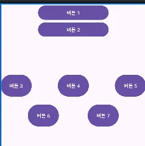
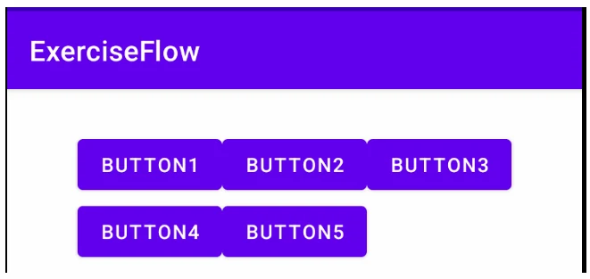

# [모바일 프로그래밍] ConstraintLayout와 Flow

## 원문

https://ch010104.tistory.com/153

## 노트 유형

`guide`

## 적용 목적과 전제조건

ConstraintLayout은 위젯에 여러 **제약(constraint)**을 적용해 위치와 크기를 결정하는 레이아웃. 각 위젯의 경계선을 다른 위젯이나 부모 레이아웃에 연결하는 방식으로 UI를 구성함.

1. 상대적 위치 지정 (Relative Positioning)

## 구현 절차·검증·주의점

### 1. ConstraintLayout

ConstraintLayout은 위젯에 여러 **제약(constraint)**을 적용해 위치와 크기를 결정하는 레이아웃. 각 위젯의 경계선을 다른 위젯이나 부모 레이아웃에 연결하는 방식으로 UI를 구성함.

1. 상대적 위치 지정 (Relative Positioning)

- 위젯의 상하좌우(top, bottom, left, right) 및 기준선(baseline)을 다른 대상에 연결해 위치를 정함.

기본 형식: app:layout_constraint[자신위치]_to[상대방위치]Of="@+id/대상ID".

주요 예시:

app:layout_constraintLeft_toRightOf="@+id/btnA": 현재 위젯의 왼쪽을 btnA의 오른쪽에 맞춤.

app:layout_constraintTop_toBottomOf="@+id/btnA": 현재 위젯의 위쪽을 btnA의 아래쪽에 맞춤.

2. 기타 주요 제약

여백 (Margins): android:layout_margin... 속성을 사용해 위젯 간의 여백을 설정.

원형 위치 지정 (Circular Positioning): - 특정 위젯을 중심으로 거리(반지름)와 각도를 지정해 다른 위젯을 원형으로 배치.

app:layout_constraintCircle: 중심이 될 위젯 ID.

app:layout_constraintCircleRadius: 중심으로부터의 거리.

app:layout_constraintCircleAngle: 중심으로부터의 각도 (0~360).

3. 체인 (Chains)

- 수평 또는 수직으로 나열된 위젯들을 그룹화하는 기능. 위젯끼리 서로 양방향 제약이 걸리면 체인으로 정의됨.

체인 헤드 (Chain Head): 체인의 가장 첫 번째 위젯(수평은 가장 왼쪽, 수직은 가장 위). 체인 헤드의 속성 설정으로 전체 체인의 스타일을 제어할 수 있음.

체인 스타일 (Chain Style): app:layout_constraintHorizontal_chainStyle 또는 app:layout_constraintVertical_chainStyle 속성으로 위젯 분배 방식을 결정.

spread: 위젯들을 균일한 간격으로 분배.

spread inside: 양 끝 위젯을 가장자리에 붙이고 나머지를 균일하게 분배.

packed: 모든 위젯을 가운데로 모아서 그룹화.

4. 전체 XML 코드 예시

```html
<?xml version="1.0" encoding="utf-8"?>
<androidx.constraintlayout.widget.ConstraintLayout xmlns:android="http://schemas.android.com/apk/res/android"
    xmlns:app="http://schemas.android.com/apk/res-auto"
    xmlns:tools="http://schemas.android.com/tools"
    android:id="@+id/main"
    android:layout_width="match_parent"
    android:layout_height="match_parent"
    tools:context=".MainActivity">

    <Button
        android:id="@+id/btn1"
        android:layout_width="200dp"
        android:layout_height="wrap_content"
        android:text="버튼 1"
        app:layout_constraintBottom_toTopOf="@+id/btn2"
        app:layout_constraintTop_toTopOf="parent"
        app:layout_constraintLeft_toLeftOf="parent"
        app:layout_constraintRight_toRightOf="parent"/>

    <Button
        android:id="@+id/btn2"
        android:layout_width="0dp"
        android:layout_height="wrap_content"
        android:text="버튼 2"
        app:layout_constraintTop_toBottomOf="@+id/btn1"
        app:layout_constraintLeft_toLeftOf="@id/btn1"
        app:layout_constraintRight_toRightOf="@id/btn1"/>

    <Button
        android:id="@+id/btn3"
        android:layout_width="wrap_content"
        android:layout_height="70dp"
        android:text="버튼 3"
        android:layout_marginTop="100dp"
        app:layout_constraintHorizontal_chainStyle="spread_inside"
        app:layout_constraintLeft_toLeftOf="parent"
        app:layout_constraintRight_toLeftOf="@id/btn4"
        app:layout_constraintTop_toBottomOf="@id/btn2" />

    <Button
        android:id="@+id/btn4"
        android:layout_width="wrap_content"
        android:layout_height="0dp"
        android:text="버튼 4"
        app:layout_constraintBottom_toBottomOf="@id/btn3"
        app:layout_constraintTop_toTopOf="@id/btn3"
        app:layout_constraintLeft_toRightOf="@id/btn3"
        app:layout_constraintRight_toLeftOf="@id/btn5"/>

    <Button
        android:id="@+id/btn5"
        android:layout_width="wrap_content"
        android:layout_height="0dp"
        android:text="버튼 5"
        app:layout_constraintBottom_toBottomOf="@id/btn4"
        app:layout_constraintTop_toTopOf="@id/btn4"
        app:layout_constraintLeft_toRightOf="@id/btn4"
        app:layout_constraintRight_toRightOf="parent"/>

    <Button
        android:id="@+id/btn6"
        android:layout_width="wrap_content"
        android:layout_height="70dp"
        android:text="버튼 6"
        app:layout_constraintCircle="@id/btn4"
        app:layout_constraintCircleAngle="225"
        app:layout_constraintCircleRadius="120dp"
        tools:ignore="MissingConstraints"/>

    <Button
        android:id="@+id/btn7"
        android:layout_width="wrap_content"
        android:layout_height="70dp"
        android:text="버튼 7"
        app:layout_constraintCircle="@id/btn4"
        app:layout_constraintCircleAngle="135"
        app:layout_constraintCircleRadius="120dp"
        tools:ignore="MissingConstraints"/>

</androidx.constraintlayout.widget.ConstraintLayout>
```

> 원문 코드가 길어 이 노트에서는 앞부분만 보존했습니다. 전체는 원문에서 확인합니다.

### 2. ConstraintLayout Flow

- ConstraintLayout Flow는 화면 크기에 따라 UI가 깨지는 문제를 해결하는 가상 헬퍼(virtual helper)

- 공간이 부족할 때 참조된 위젯을 다음 줄로 자동으로 넘겨 유연한 레이아웃을 만듬

1. 주요 특징

자동 줄 바꿈(Wrapping): 한 줄에 위젯이 다 들어가지 않으면 다음 줄로 자동 배치.

가상 헬퍼: 화면에 직접 보이지 않고 다른 위젯의 배치를 제어.

동적 배열: Chain과 달리 여러 줄에 걸쳐 위젯 그룹을 동적으로 관리.

2. 사용법

위젯 추가: Flow로 배열할 위젯들(Button 등)을 먼저 레이아웃에 추가.

Flow 정의: <androidx.constraintlayout.helper.widget.Flow> 태그를 추가.

ID 참조: app:constraint_referenced_ids 속성에 관리할 위젯들의 ID를 콤마(,)로 구분해 연결.

3. 핵심 속성

app:flow_wrapMode: 줄 바꿈 시 정렬 방식.

chain: 각 줄을 독립적인 체인처럼 다룸.

aligned: 이전 줄과 아이템의 정렬을 맞춤.

app:flow_horizontalStyle: 한 줄 안에서의 수평 정렬.

spread: 위젯을 균일하게 분배.

spread_inside: 양 끝 위젯을 가장자리에 붙이고 나머지를 분배.

packed: 위젯을 중앙으로 모음

4. 전체 XML 코드 예시

```html
<?xml version="1.0" encoding="utf-8"?>
<androidx.constraintlayout.widget.ConstraintLayout xmlns:android="http://schemas.android.com/apk/res/android"
    xmlns:app="http://schemas.android.com/apk/res-auto"
    xmlns:tools="http://schemas.android.com/tools"
    android:id="@+id/main"
    android:layout_width="match_parent"
    android:layout_height="match_parent"
    tools:context=".MainActivity">

    <Button
        android:id="@+id/btn1"
        android:layout_width="wrap_content"
        android:layout_height="wrap_content"
        android:text="Button1"/>

    <Button
        android:id="@+id/btn2"
        android:layout_width="wrap_content"
        android:layout_height="wrap_content"
        android:text="Button2"/>

    <Button
        android:id="@+id/btn3"
        android:layout_width="wrap_content"
        android:layout_height="wrap_content"
        android:text="Button3"/>

    <Button
        android:id="@+id/btn4"
        android:layout_width="wrap_content"
        android:layout_height="wrap_content"
        android:text="Button4"/>

    <Button
        android:id="@+id/btn5"
        android:layout_width="wrap_content"
        android:layout_height="wrap_content"
        android:text="Button5"/>

    <androidx.constraintlayout.helper.widget.Flow
        android:layout_width="0dp"
        android:layout_height="wrap_content"
        android:id="@+id/flow"
        app:constraint_referenced_ids="btn1,btn2,btn3,btn4,btn5"
        android:layout_marginTop="25dp"
        app:flow_firstHorizontalStyle="packed"
        app:flow_wrapMode="aligned"
        app:layout_constraintStart_toStartOf="parent"
        app:layout_constraintEnd_toEndOf="parent"
        app:layout_constraintTop_toTopOf="parent"/>

</androidx.constraintlayout.widget.ConstraintLayout>
```

> 원문 코드가 길어 이 노트에서는 앞부분만 보존했습니다. 전체는 원문에서 확인합니다.

## 핵심 이미지





## 관련 글

- [[blog/MOBILE PROGRAMING/index|MOBILE PROGRAMING]]
- [[blog/MOBILE PROGRAMING/모바일 프로그래밍- 테이블레이아웃과 그리드레이아웃|[모바일 프로그래밍] 테이블레이아웃과 그리드레이아웃]]
- [[blog/MOBILE PROGRAMING/모바일 프로그래밍- RelativeLayout 안드로이드 레이아웃|[모바일 프로그래밍] RelativeLayout 안드로이드 레이아웃]]
- [[blog/MOBILE PROGRAMING/모바일 프로그래밍- LinearLayout 안드로이드 레이아웃|[모바일 프로그래밍]  LinearLayout 안드로이드 레이아웃]]
