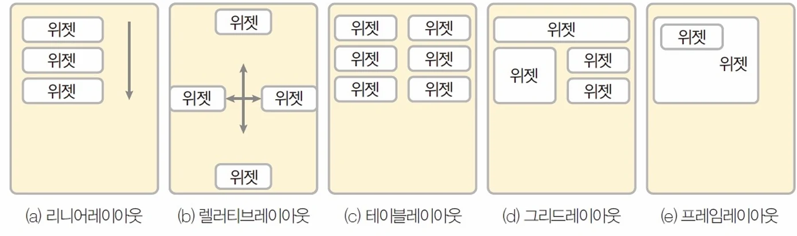
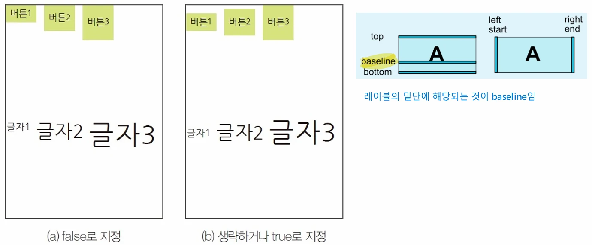

# [모바일 프로그래밍]  LinearLayout 안드로이드 레이아웃

## 원문

https://ch010104.tistory.com/149

## 노트 유형

`concept`

## 핵심 개념과 선택 맥락

- 레이아웃은 내부에 다양한 위젯(버튼, 텍스트뷰 등)을 담는 일종의 컨테이너

- 안드로이드에는 여러 종류의 레이아웃이 있으며, 각기 다른 규칙에 따라 위젯을 배치

## 원문 기반 개념 정리

### 1. 레이아웃(Layout)이란?

- 레이아웃은 내부에 다양한 위젯(버튼, 텍스트뷰 등)을 담는 일종의 컨테이너

- 안드로이드에는 여러 종류의 레이아웃이 있으며, 각기 다른 규칙에 따라 위젯을 배치

리니어 레이아웃 (LinearLayout): 위젯을 수직 또는 수평으로 차례대로 배치

렐러티브 레이아웃 (RelativeLayout): 다른 위젯이나 부모 레이아웃을 기준으로 상대적인 위치에 위젯을 배치

테이블 레이아웃 (TableLayout): 격자무늬(표) 형태로 위젯을 배치

그리드 레이아웃 (GridLayout): 테이블 레이아웃과 비슷하지만 행과 열을 확장하는 등 더 유연한 배치가 가능

프레임 레이아웃 (FrameLayout): 위젯을 좌측 상단에 겹쳐서 배치하며, 특정 위젯만 선택적으로 보여줄 때 유용

### 2. LinearLayout의 핵심 속성

- LinearLayout을 다루기 위해 꼭 알아야 할 주요 속성들이 있음

orientation: - 내부에 포함될 위젯들을 수직(vertical)으로 쌓을지, 수평(horizontal)으로 쌓을지 방향을 결정하는 가장 기본적인 속성

gravity: - 레이아웃 내부의 위젯들을 전체적으로 정렬하는 방 - 예를 들어, gravity="right"로 설정하면 모든 자식 위젯들이 오른쪽으로 정렬 - right|bottom처럼 두 가지 속성을 조합할 수도 있음

layout_gravity: - 위젯 자체를 부모 레이아웃 안에서 정렬하는 속성

baselineAligned: - 크기가 다른 위젯들을 텍스트의 밑단(baseline)을 기준으로 정렬하여 가독성을 높여주는 속성

layout_weight: - 화면 크기를 비율로 나누어 위젯이 차지할 공간을 설정

### 3. LinearLayout 사용법

orientation: 배치 방향 설정

- orientation 속성은 vertical(수직)과 horizontal(수평), 두 가지 값을 가짐

android:orientation="vertical" 위젯들이 위에서 아래로 차곡차곡 쌓임

```html
<LinearLayout
    android:orientation="vertical" >
    <Button
        android:text="Button" />
    <TextView
        android:text="TextView" />
    <CheckBox
        android:text="CheckBox" />
</LinearLayout>
```

android:orientation="horizontal" 위젯들이 왼쪽에서 오른쪽으로 나란히 배치

```html
<LinearLayout
    android:orientation="horizontal" >
    <Button
        android:text="Button" />
    <TextView
        android:text="TextView" />
    <CheckBox
        android:text="CheckBox" />
</LinearLayout>
```

gravity와 layout_gravity: 정렬 마스터하기

gravity: - LinearLayout 자체에 설정하여 내부의 모든 위젯을 정렬 - 아래 코드는 모든 위젯을 오른쪽 하단으로 정렬

```text
<LinearLayout
    android:orientation="vertical"
    android:gravity="right|bottom" >
    </LinearLayout>
```

```html
<LinearLayout
    android:orientation="vertical" >
    <Button
        android:layout_gravity="right"
        android:text="오른쪽" />
    <Button
        android:layout_gravity="center"
        android:text="중앙" />
    <Button
        android:layout_gravity="left"
        android:text="왼쪽" />
</LinearLayout>
```

### 4. 복잡한 화면을 위한 LinearLayout 활용

중첩 레이아웃 (Nested Layouts)

- 더 복잡한 화면은 LinearLayout 안에 또 다른 LinearLayout을 넣어 구성할 수 있음

- 예를 들어, 전체적인 배치는 수직으로 하되 특정 영역은 수평으로 배치하고 싶을 때 유용

```html
<LinearLayout android:orientation="vertical">  <LinearLayout android:orientation="horizontal"> <Button ... />
        <Button ... />
    </LinearLayout>
    <LinearLayout android:orientation="horizontal"> <Button ... />
        <Button ... />
    </LinearLayout>
</LinearLayout>
```

layout_weight: 유연한 비율 배치

layout_weight 속성을 사용하면 화면 크기와 관계없이 일정한 비율로 공간을 차지하도록 설정할 수 있음 - 주로 여러 개의 중첩된 리니어 레이아웃의 크기를 비율로 지정할 때 사용

예를 들어 3개의 자식 레이아웃에 각각 layout_weight="1"을 주면, 세 레이아웃이 화면을 1:1:1 비율로 동일하게 나누어 가짐

### 5. 중복 LinearLayout 실습

```html
// activity_main.xml
<?xml version="1.0" encoding="utf-8"?>
<LinearLayout xmlns:android="http://schemas.android.com/apk/res/android"
    xmlns:app="http://schemas.android.com/apk/res-auto"
    xmlns:tools="http://schemas.android.com/tools"
    android:id="@+id/main"
    android:layout_width="match_parent"
    android:layout_height="match_parent"
    android:orientation="vertical"
    tools:context=".MainActivity">

    <LinearLayout
        android:id="@+id/linerLayout1"
        android:layout_width="match_parent"
        android:layout_height="wrap_content"
        android:gravity="center_horizontal"
        android:layout_weight="1"
        android:orientation="vertical">

        <Button
            android:id="@+id/btn1"
            android:layout_width="wrap_content"
            android:layout_height="wrap_content"
            android:text="버튼1-1"/>

        <Button
            android:id="@+id/btn2"
            android:layout_width="wrap_content"
            android:layout_height="wrap_content"
            android:text="버튼1-2"/>

    </LinearLayout>

    <LinearLayout
        android:id="@+id/linerLayout2"
        android:layout_width="match_parent"
        android:layout_height="wrap_content"
        android:gravity="center"
        android:baselineAligned="true"
        android:layout_weight="1"
        android:background="@android:color/holo_green_light"
        android:orientation="horizontal">

        <Button
            android:id="@+id/btn3"
            android:layout_width="wrap_content"
            android:layout_height="wrap_content"
            android:layout_weight="1"
            android:text="버튼2-1"/>

        <Button
            android:id="@+id/btn4"
            android:layout_width="wrap_content"
            android:layout_height="wrap_content"
            android:layout_weight="2"
            android:text="버튼2-2"/>

        <Button
            android:id="@+id/btn5"
            android:layout_width="wrap_content"
            android:layout_height="wrap_content"
            android:layout_weight="3"
            android:text="버튼2-3"/>

    </LinearLayout>

    <LinearLayout
        android:id="@+id/linerLayout3"
        android:layout_weight="1"
        android:layout_width="match_parent"
        android:layout_height="wrap_content"
        android:gravity="center_horizontal"
        android:background="@android:color/holo_orange_light"
        android:orientation="vertical">

        <Button
            android:layout_width="wrap_content"
            android:layout_height="wrap_content"
            android:text="버튼3-1"/>

        <Button
            android:layout_width="wrap_content"
            android:layout_height="wrap_content"
            android:text="버튼3-2"/>

    </LinearLayout>


</LinearLayout>
```

```text
// MainActity.kt
package com.cookandroid.linerlayoutexcercise

import android.os.Bundle
import androidx.activity.enableEdgeToEdge
import androidx.appcompat.app.AppCompatActivity
import androidx.core.view.ViewCompat
import androidx.core.view.WindowInsetsCompat

class MainActivity : AppCompatActivity() {
    override fun onCreate(savedInstanceState: Bundle?) {
        super.onCreate(savedInstanceState)
        enableEdgeToEdge()
        setContentView(R.layout.activity_main)
        ViewCompat.setOnApplyWindowInsetsListener(findViewById(R.id.main)) { v, insets ->
            val systemBars = insets.getInsets(WindowInsetsCompat.Type.systemBars())
            v.setPadding(systemBars.left, systemBars.top, systemBars.right, systemBars.bottom)
            insets
        }
    }
}
```

```text
// build.gradle.kts
plugins {
    alias(libs.plugins.android.application)
    alias(libs.plugins.kotlin.android)
}

android {
    namespace = "com.cookandroid.linerlayoutexcercise"
    compileSdk = 36

    defaultConfig {
        applicationId = "com.cookandroid.linerlayoutexcercise"
        minSdk = 24
        targetSdk = 36
        versionCode = 1
        versionName = "1.0"

        testInstrumentationRunner = "androidx.test.runner.AndroidJUnitRunner"
    }

    buildTypes {
        release {
            isMinifyEnabled = false
            proguardFiles(
                getDefaultProguardFile("proguard-android-optimize.txt"),
                "proguard-rules.pro"
            )
        }
    }
    compileOptions {
        sourceCompatibility = JavaVersion.VERSION_11
        targetCompatibility = JavaVersion.VERSION_11
    }
    kotlinOptions {
        jvmTarget = "11"
    }

    buildFeatures {
        viewBinding = true
    }
}

dependencies {

    implementation(libs.androidx.core.ktx)
    implementation(libs.androidx.appcompat)
    implementation(libs.material)
    implementation(libs.androidx.activity)
    implementation(libs.androidx.constraintlayout)
    testImplementation(libs.junit)
    androidTestImplementation(libs.androidx.junit)
    androidTestImplementation(libs.androidx.espresso.core)
}
```

## 핵심 이미지





## 관련 글

- [[blog/MOBILE PROGRAMING/index|MOBILE PROGRAMING]]
- [[blog/MOBILE PROGRAMING/모바일 프로그래밍- 이미지뷰와 이미지버튼 실습|[모바일 프로그래밍] 이미지뷰와 이미지버튼 실습]]
- [[blog/MOBILE PROGRAMING/모바일 프로그래밍- 테이블레이아웃과 그리드레이아웃|[모바일 프로그래밍] 테이블레이아웃과 그리드레이아웃]]
- [[blog/MOBILE PROGRAMING/모바일 프로그래밍- 파운드 버튼과 이벤트 처리|[모바일 프로그래밍] 파운드 버튼과 이벤트 처리]]
