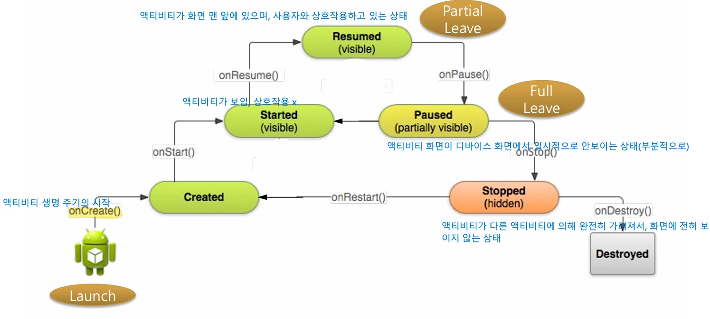
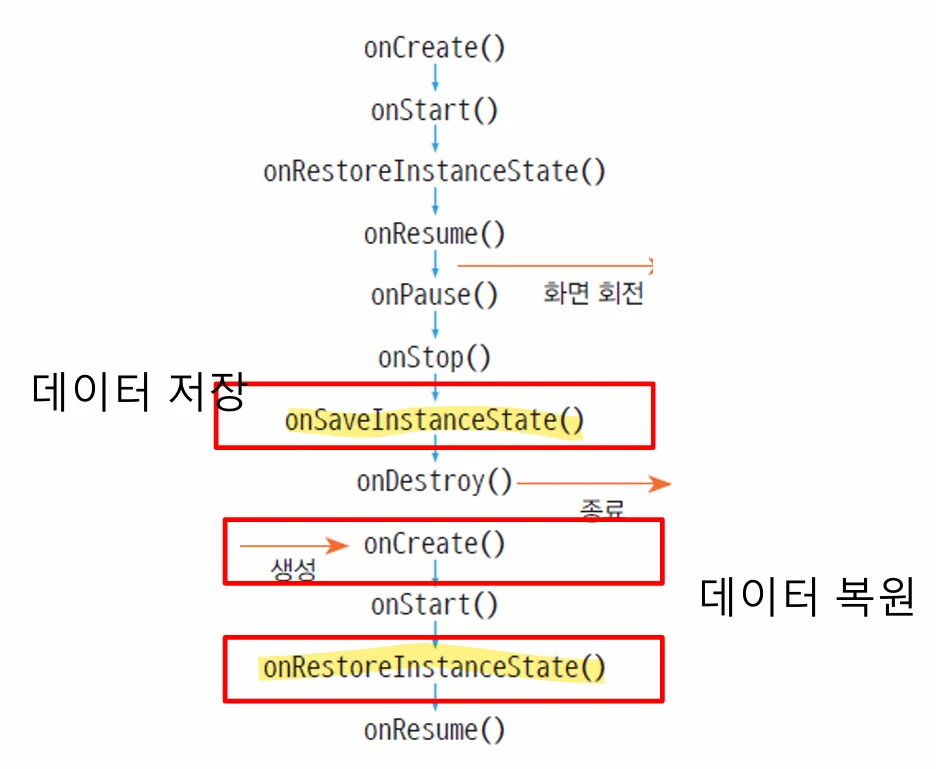

# [모바일 프로그래밍] 암시적 Intent와 액티비티 생명 주기

## 원문

https://ch010104.tistory.com/177

## 노트 유형

`concept`

## 핵심 개념과 선택 맥락

- 인텐트는 안드로이드 컴포넌트 간의 통신 수단이며, 명시적 인텐트와 암시적 인텐트로 나뉨.

정의: 실행할 컴포넌트(예: 액티비티)를 클래스 참조 정보(<code>::class.java</code>)로 명확하게 지정함.

## 원문 기반 개념 정리

### 1. 인텐트(Intent) 이해

- 인텐트는 안드로이드 컴포넌트 간의 통신 수단이며, 명시적 인텐트와 암시적 인텐트로 나뉨.

1. 명시적 인텐트 (Explicit Intent)

정의: 실행할 컴포넌트(예: 액티비티)를 클래스 참조 정보(<code>::class.java</code>)로 명확하게 지정함.

동작: 시스템은 인텐트의 클래스 정보 와 매니페스트에 등록된 액티비티의 이름(<code>name=</code>) 을 직접 비교하여 해당 컴포넌트를 실행함.

예시 코드: <code>SecondActivity</code>를 직접 지정하여 실행.

```text
val mIntent: Intent = Intent(applicationContext, SecondActivity::class.java)
startActivity(mIntent)
```

매니페스트 등록 예시:

```html
<activity android:name=".OneActivity" />
```

2. 암시적 인텐트 (Implicit Intent)

정의: 실행할 컴포넌트를 직접 지정하지 않고, 매니페스트 파일에 선언된 인텐트 필터(Intent Filter) 정보를 이용하여 시스템이 적절한 컴포넌트를 찾아 실행함.

주요 용도: 특정 앱이 외부 앱의 기능을 실행해야 할 때 사용됨.

동작: 시스템은 인텐트가 가진 정보(예: action = ACTION_EDIT )와 매니페스트에 등록된 여러 컴포넌트의 인텐트 필터 를 비교하여 일치하는 컴포넌트(예: TwoActivity )를 실행함.

3. 인텐트 필터 (Intent Filter)

인텐트 필터는 <code><activity></code> (또는 다른 컴포넌트) 태그 내에 선언되며 , 해당 컴포넌트가 어떤 암시적 인텐트를 받을 수 있는지 정의함.

<code>android:exported="true"</code> 속성이 있어야 외부 앱에서 이 인텐트 필터를 통해 액티비티를 실행할 수 있음.

주요 구성 요소:

<code><action></code>: 컴포넌트의 기능을 나타내는 문자열 (예: ACTION_EDIT, ACTION_VIEW).

<code><category></code>: 컴포넌트가 포함되는 범주를 나타내는 문자열 (예: DEFAULT, LAUNCHER).

<code><data></code>: 컴포넌트가 처리할 데이터의 속성(예: scheme, mimeType)을 정의함.

인텐트 필터 예시 1 (Action, Category):

```html
<activity
    android:name=".TwoActivity"
    [cite_start]android:exported="true">
    <intent-filter>
        <action android:name="ACTION_EDIT" />
        <category android:name="android.intent.category.DEFAULT" />
    </intent-filter>
</activity>
```

> 원문 코드가 길어 이 노트에서는 앞부분만 보존했습니다. 전체는 원문에서 확인합니다.

인텐트 필터 예시 2 (Launcher):

```html
<activity android:name=".MainActivity">
    android:exported="true" >
    <intent-filter>
        <action android:name="android.intent.action.MAIN" />
        <category android:name="android.intent.category.LAUNCHER" />
    </intent-filter>
</activity>
```

> 원문 코드가 길어 이 노트에서는 앞부분만 보존했습니다. 전체는 원문에서 확인합니다.

```html
<activity android:name=".TwoActivity"
    [cite_start]android:exported="true">
    <intent-filter>
        <action android:name="ACTION_EDIT" />
        <category android:name="android.intent.category.DEFAULT"/>
        <data android:scheme="http" />
    </intent-filter>
</activity>
```

> 원문 코드가 길어 이 노트에서는 앞부분만 보존했습니다. 전체는 원문에서 확인합니다.

위 필터와 일치하는 암시적 인텐트 생성:

```text
// 방법 1
val intent Intent()
intent.action = "ACTION_EDIT"
intent.data = Uri.parse("http://www.google.com")
startActivity(intent)

// 방법 2 (생성자 이용)
// category를 설정하지 않으면 자동으로 DEFAULT가 지정됨
val intent = Intent("ACTION_EDIT", Uri.parse("http://www.google.com"))
startActivity(intent)
```

> 원문 코드가 길어 이 노트에서는 앞부분만 보존했습니다. 전체는 원문에서 확인합니다.

인텐트 필터 예시 3 (Data Scheme):

```html
<activity android:name=".TwoActivity"
    <intent-filter>
        <action android:name="ACTION_EDIT" />
        <category android:name="android.intent.category.DEFAULT" />
        <data android:mimeType="image/*" />
    </intent-filter>
</activity>
```

> 원문 코드가 길어 이 노트에서는 앞부분만 보존했습니다. 전체는 원문에서 확인합니다.

위 필터와 일치하는 암시적 인텐트 생성:

```text
// mimeType을 사용할 경우, 인텐트에도 type을 설정해야 함
val intent = Intent("ACTION_EDIT")
intent.type = "image/*"
startActivity(intent)
```

> 원문 코드가 길어 이 노트에서는 앞부분만 보존했습니다. 전체는 원문에서 확인합니다.

인텐트 필터 예시 4 (Data MIME Type):

4. 인텐트 동작 방식 (매칭 결과)

매칭되는 액티비티가 1개일 때: 문제없이 해당 액티비티가 실행됨.

매칭되는 액티비티가 없을 때: 오류(android.content.ActivityNotFoundException)가 발생함.

예외 처리: try-catch 문을 사용하여 앱 비정상 종료를 방지해야 함.

```text
val intent = Intent("ACTION_HELLO")
try {
    startActivity(intent)
} catch (e: Exception) {
    Toast.makeText(this, "no app...", Toast.LENGTH_SHORT).show()
}
```

> 원문 코드가 길어 이 노트에서는 앞부분만 보존했습니다. 전체는 원문에서 확인합니다.

매칭되는 액티비티가 여러 개일 때: "연결 프로그램" 선택창(App Chooser)이 나타나며, 사용자가 선택한 하나의 앱만 실행됨. (예: 지도 앱 선택) .

```text
// geo URI를 사용하지만 Google 지도 앱을 특정해서 실행
val intent = Intent(Intent.ACTION_VIEW, Uri.parse("geo:37.7749,127.4194"))
intent.setPackage("com.google.android.apps.maps")
startActivity(intent)
```

> 원문 코드가 길어 이 노트에서는 앞부분만 보존했습니다. 전체는 원문에서 확인합니다.

특정 앱 지정 실행: 암시적 인텐트라도 setPackage()를 이용해 특정 패키지명의 앱을 강제로 지정하여 실행할 수 있음.

### 2. 액티비티 생명주기 (Activity Lifecycle)

액티비티가 생성되어 소멸되기까지의 주기. 안드로이드에서는 한 번에 하나의 액티비티만 활성화 상태(화면 맨 앞)가 될 수 있음.

1.생명주기 상태와 콜백

Created (생성됨): 액티비티가 생성됨. onCreate() 호출.

Started (시작됨): 액티비티가 화면에 보이지만 (visible) 아직 사용자와 상호작용은 못하는 상태. onStart() 호출.

Resumed (활성화됨): 액티비티가 화면 맨 앞에 있으며(visible) 사용자와 상호작용하고 있는 상태 (활성 상태). onResume() 호출.

Paused (일시정지됨): 다른 액티비티(예: 다이얼로그)에 의해 부분적으로 가려진 상태 (partially visible). onPause() 호출.

Stopped (중지됨): 다른 액티비티에 의해 완전히 가려져 화면에 보이지 않는 상태 (hidden). onStop() 호출.

Destroyed (소멸됨): 액티비티가 소멸됨. onDestroy() 호출.

onRestart(): Stopped 상태였던 액티비티가 다시 시작될 때 onStart() 직전에 호출됨.

2. 두 액티비티 간 생명주기 (A -> B 전환)

- Activity A에서 Activity B를 새로 시작할 때, 시스템은 새로운 Activity B를 최대한 빨리 사용자에게 보여주는 것을 목표

전환 순서 로그:

MainActivity: onPause() (기존 A가 일시정지)

SecondActivity: onCreate() (새로운 B 생성)

SecondActivity: onStart() (새로운 B 시작)

SecondActivity: onResume() (새로운 B 활성화 완료)

MainActivity: onStop() (기존 A가 중지)

핵심: 기존 액티비티(A)의 onStop()은 새로운 액티비티(B)가 onResume() 될 때까지 호출되지 않고 Paused 상태에서 대기함.

이유: onStop()은 DB 저장 등 무거운 리소스 정리 작업을 포함할 수 있음. 만약 A의 onStop()이 B의 onResume()보다 먼저 실행되면, A를 정리하는 시간 때문에 B가 화면에 뜨는 것이 지연될 수 있기 때문.

B -> A (뒤로가기) 전환 순서 로그:

SecondActivity: onPause() (B가 일시정지)

MainActivity: onRestart() (A가 재시작)

MainActivity: onStart() (A가 시작)

MainActivity: onResume() (A가 활성화 완료)

SecondActivity: onStop() (B가 중지)

SecondActivity: onDestroy() (B가 소멸)

3. LogCat (로그 남기기)

- android.util.Log 클래스를 사용하여 앱 실행 중 로그 메시지를 남길 수 있음.

로그 메소드:

Log.d("태그", "메시지"): Debug (디버깅)

Log.e("태그", "메시지"): Error (오류)

Log.i("태그", "메시지"): Information (정보)

Log.w("태그", "메시지"): Warning (경고)

Log.v("태그", "메시지"): Verbose (상세)

로그 확인: Android Studio의 LogCat 툴 윈도우([View] > [Tool Windows] > [Logcat])에서 확인.

필터링: 태그나 package:mine 등을 이용해 원하는 로그만 선별적으로 볼 수 있음.

4.액티비티 상태 저장 및 복원

- 액티비티가 소멸되면(예: 화면 회전 ) 데이터가 사라지므로 , 데이터를 저장했다가 다시 생성될 때 복원해야 함.

저장 및 복원 시점 (화면 회전 기준):

onPause()

onStop()

onSaveInstanceState(): 데이터 저장 (Bundle 객체에 담음)

onDestroy() (소멸)

onCreate(): 데이터 복원 가능 (Bundle 객체가 null이 아님)

onStart()

onRestoreInstanceState(): 데이터 복원 (이 시점 권장)

onResume()

```text
override fun onSaveInstanceState(outState: Bundle) {
    super.onSaveInstanceState(outState)
    outState.putString("data1", "hello")
    outState.putInt("data2", 10)
}
```

> 원문 코드가 길어 이 노트에서는 앞부분만 보존했습니다. 전체는 원문에서 확인합니다.

데이터 저장: onSaveInstanceState()의 outState (Bundle) 객체에 데이터를 저장함.

```text
// 1. onCreate에서 복원
override fun onCreate(savedInstanceState: Bundle?) {
    super.onCreate(savedInstanceState)
    if (savedInstanceState != null) {
        val data1 = savedInstanceState.getString("data1")
        val data2 = savedInstanceState.getInt("data2")
    }
}

// 2. onRestoreInstanceState에서 복원
override fun onRestoreInstanceState(savedInstanceState: Bundle) {
    super.onRestoreInstanceState(savedInstanceState)
    val data1 = savedInstanceState.getString("data1")]
    val data2 = savedInstanceState.getInt("data2")
}
```

> 원문 코드가 길어 이 노트에서는 앞부분만 보존했습니다. 전체는 원문에서 확인합니다.

데이터 복원: onCreate() 또는 onRestoreInstanceState()의 savedInstanceState (Bundle) 객체에서 데이터를 읽어옴.

### 3. 실습

```text
// MainActivitiy.kt

package com.cookandroid.activityexcercise

import android.content.Intent
import android.os.Bundle
import android.util.Log
import androidx.activity.enableEdgeToEdge
import androidx.appcompat.app.AppCompatActivity
import androidx.core.view.ViewCompat
import androidx.core.view.WindowInsetsCompat
import com.cookandroid.activityexcercise.databinding.ActivityMainBinding

class MainActivity : AppCompatActivity() {

    private lateinit var bindingMain : ActivityMainBinding

    override fun onCreate(savedInstanceState: Bundle?) {
        super.onCreate(savedInstanceState)
//        enableEdgeToEdge()
//        setContentView(R.layout.activity_main)
//        ViewCompat.setOnApplyWindowInsetsListener(findViewById(R.id.main)) { v, insets ->
//            val systemBars = insets.getInsets(WindowInsetsCompat.Type.systemBars())
//            v.setPadding(systemBars.left, systemBars.top, systemBars.right, systemBars.bottom)
//            insets
//        }

        Log.i("액티비티 생명주기 테스트","MainActivity: onCreate()")

        bindingMain = ActivityMainBinding.inflate(layoutInflater)
        setContentView(bindingMain.root)

        bindingMain.btn2ndActivity.setOnClickListener {
            val mIntent : Intent = Intent(applicationContext, SecondActivity::class.java)

            mIntent.putExtra("Name","John")
            mIntent.putExtra("Age",25)

            startActivity(mIntent)
        }
    }

    override fun onStart() {
        super.onStart()
        Log.i("액티비티 생명주기 테스트","MainActivity: onStart()")
    }

    override fun onResume() {
        super.onResume()
        Log.i("액티비티 생명주기 테스트","MainActivity: onResume()")
    }

    override fun onPause() {
        super.onPause()
        Log.i("액티비티 생명주기 테스트","MainActivity: onPause()")
    }

    override fun onStop() {
        super.onStop()
        Log.i("액티비티 생명주기 테스트","MainActivity: onStop()")
    }

    override fun onRestart() {
        super.onRestart()
        Log.i("액티비티 생명주기 테스트","MainActivity: onRestart()")
    }

    override fun onDestroy() {
        super.onDestroy()
        Log.i("액티비티 생명주기 테스트","MainActivity: onDestroy()")
    }

    override fun onSaveInstanceState(outState: Bundle) { // 화면 전환으로 MainActivity를 종료할 때, onStop() 이후 실행
        super.onSaveInstanceState(outState)
        outState.putString("data1","hello")
        outState.putInt("data2", 10)

        Log.i("액티비티 Bundle 객체 테스트", "MainActivity: onSaveInstanceState() | 데이터가 저장됨")
    }

    override fun onRestoreInstanceState(savedInstanceState: Bundle) { // 화면 전환으로 MainActivity를 종료후 다시 실행될 때, onStart() 이후 실행
        super.onRestoreInstanceState(savedInstanceState)

        val data1 = savedInstanceState.getString("data1")
        val data2 = savedInstanceState.getInt("data2")

        Log.i("액티비티 Bundle 객체 테스트","MainActivity: onRestoreInstanceState() | data1: ${data1}, data2: ${data2.toString()}")
    }

}
```

```text
// SecondActivity.kt

package com.cookandroid.activityexcercise

import android.content.Intent
import android.os.Bundle
import android.util.Log
import android.view.View
import androidx.appcompat.app.AppCompatActivity
import com.cookandroid.activityexcercise.databinding.ActivitySecondBinding

class SecondActivity : AppCompatActivity() {

    private lateinit var bindingSecond : ActivitySecondBinding

    override fun onCreate(savedInstanceState: Bundle?) {
        super.onCreate(savedInstanceState)

        Log.i("액티비티 생명주기 테스트","SecondActivity: onCreate()")

        bindingSecond = ActivitySecondBinding.inflate(layoutInflater)
        setContentView(bindingSecond.root)

        val rxIntent: Intent = getIntent()

        val extras: Bundle? = rxIntent.getExtras()

        val rxName:String? = extras?.getString("Name") ?: null
        val rxAge = extras?.getInt("Age") ?: null

        bindingSecond.edit1.setText("Name: " + rxName + ", Age: " + rxAge.toString())

        // SecondActivity를 종료시켜서 자동으로 MainActivity로 돌아감
        bindingSecond.btnReturn.setOnClickListener(object: View.OnClickListener {
            override fun onClick(p0: View?){
                finish()
            }
        })
    }

    override fun onStart() {
        super.onStart()
        Log.i("액티비티 생명주기 테스트","SecondActivity: onStart()")
    }

    override fun onResume() {
        super.onResume()
        Log.i("액티비티 생명주기 테스트","SecondActivity: onResume()")
    }

    override fun onPause() {
        super.onPause()
        Log.i("액티비티 생명주기 테스트","SecondActivity: onPause()")
    }

    override fun onStop() {
        super.onStop()
        Log.i("액티비티 생명주기 테스트","SecondActivity: onStop()")
    }

    override fun onRestart() {
        super.onRestart()
        Log.i("액티비티 생명주기 테스트","SecondActivity: onRestart()")
    }

    override fun onDestroy() {
        super.onDestroy()
        Log.i("액티비티 생명주기 테스트","SecondActivity: onDestroy()")
    }

}
```

> 원문 코드가 길어 이 노트에서는 앞부분만 보존했습니다. 전체는 원문에서 확인합니다.

## 핵심 이미지





## 관련 글

- [[blog/MOBILE PROGRAMING/index|MOBILE PROGRAMING]]
- [[blog/MOBILE PROGRAMING/모바일 프로그래밍- Activity와 Intent(양방향)|[모바일 프로그래밍] Activity와 Intent(양방향)]]
- [[blog/MOBILE PROGRAMING/모바일 프로그래밍- Activity와 Intent(단방향)|[모바일 프로그래밍] Activity와 Intent(단방향)]]
- [[blog/MOBILE PROGRAMING/모바일 프로그래밍- Listener를 이용한 두 프래그먼트 간의 통신|[모바일 프로그래밍] Listener를 이용한 두 프래그먼트 간의 통신]]
