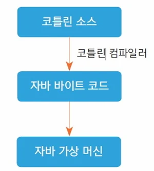

# [모바일 프로그래밍] 코틀린(Kotlin)이란? (변수와 함수)

## 원문

https://ch010104.tistory.com/122

## 노트 유형

`concept`

## 핵심 개념과 선택 맥락

JetBrains에서 개발한 최신 프로그래밍 언어로, 2017년 구글에 의해 안드로이드 공식 언어로 지정

자바 가상 머신(JVM)에 기반을 두고 있어 자바와 100% 호환

## 원문 기반 개념 정리

### 1. 코틀린(Kotlin) 시작하기



JetBrains에서 개발한 최신 프로그래밍 언어로, 2017년 구글에 의해 안드로이드 공식 언어로 지정

자바 가상 머신(JVM)에 기반을 두고 있어 자바와 100% 호환

더 간결한 문법과 널 안전성(Null Safety)과 같은 강력한 기능들을 제공

코틀린의 동작 방식

코틀린 컴파일러는 .kt 확장자를 가진 코틀린 소스 파일을 자바 바이트 코드로 컴파일

이 바이트 코드는 자바 가상 머신(JVM) 위에서 실행

코틀린 소스 파일(.kt)의 구조

기본적으로 패키지 선언, 임포트 구문, 그리고 변수, 함수, 클래스 등의 멤버로 구성

프로그램을 실행하기 위해서는 main() 함수가 반드시 필요

프로그램은 main() 함수의 실행과 함께 시작되고 종료

```text
// User.kt 예시
package com.example.test3 // 패키지

import java.text.SimpleDateFormat // 임포트
import java.util.*

var data = 10 // 변수

// 함수
fun formatDate(date: Date): String {
    val sdformat = SimpleDateFormat("yyyy-mm-dd")
    return sdformat.format(date)
}

// 클래스
class User {
    var name = "hello"
    fun sayHello() {
        println("name : $name")
    }
}
```

> 원문 코드가 길어 이 노트에서는 앞부분만 보존했습니다. 전체는 원문에서 확인합니다.

변수 선언: val과 var

val과 var 두 가지 키워드로 변수를 선언

val (value): 초기값이 할당된 후에는 값을 변경할 수 없는 불변(immutable) 변수

var (variable): 초기값 할당 후에도 값을 계속 변경할 수 있는 가변(mutable) 변수

```text
val data1 = 10 // 값 변경 불가
var data2 = 10 // 값 변경 가능

fun main() {
    // data1 = 20 // 오류 발생!
    data2 = 20 // 성공!
}
```

> 원문 코드가 길어 이 노트에서는 앞부분만 보존했습니다. 전체는 원문에서 확인합니다.

타입 지정과 추론

변수를 선언할 때 콜론(:)을 사용하여 타입을 명시적으로 지정

하지만 코틀린은 대입되는 값을 보고 타입을 유추하는 '타입 추론' 기능이 뛰어나 대부분의 경우 타입을 생략 가능

```text
// 타입 지정
val data1: Int = 10

// 타입 추론
val data2 = 10
```

> 원문 코드가 길어 이 노트에서는 앞부분만 보존했습니다. 전체는 원문에서 확인합니다.

변수 초기화 규칙

최상위 레벨이나 클래스의 멤버 변수는 선언과 동시에 초기화

함수 내부에 선언된 지역 변수는 선언과 동시에 초기화하지 않아도 되지만, 사용하기 전에는 반드시 초기화

초기화 미루기

경우에 따라 변수 초기화를 나중에 해야 할 때가 있음

Int, Boolean과 같은 기본 타입에는 사용할 수 없음

lateinit: - var로 선언된 변수의 초기화를 나중에 할 수 있도록 함

by lazy {}: - val로 선언된 변수에 사용 - 해당 변수가 코드에서 처음 사용되는 시점에 중괄호 {} 안의 코드가 실행되어 그 결과로 초기화

```text
// lateinit 예시it
lateinit var data3: String // 성공!

// by lazy 예시
val data4: Int by lazy {
    println("in lazy.......")
    10 [cite: 152]
}

fun main() {
    println("in main......")
    println(data4 + 10) // 이 시점에 "in lazy......."가 출력되고 data4가 10으로 초기화됨
}
```

> 원문 코드가 길어 이 노트에서는 앞부분만 보존했습니다. 전체는 원문에서 확인합니다.

코틀린의 데이터 타입

- 코틀린의 모든 변수는 객체

기본 타입: Int, Long, Double, Float, Boolean, Byte, Short 등이 있음

문자와 문자열:

Char: 작은따옴표(')로 문자를 표현

String: 큰따옴표(")나 삼중따옴표(""")로 문자열을 표현

```text
val name: String = "kkang"
println("name: $name, plus: ${10 + 20}")
```

> 원문 코드가 길어 이 노트에서는 앞부분만 보존했습니다. 전체는 원문에서 확인합니다.

문자열 템플릿: $ 기호를 사용해 문자열 안에 변수나 표현식의 결과를 쉽게 포함시킬 수 있음

특수 타입:

Any: 모든 타입의 최상위 클래스로, 어떤 타입의 값이든 할당할 수 있음

Unit: 반환값이 없는 함수를 의미합니다. 함수에서 반환 타입을 생략하면 자동으로 Unit이 적용

Nothing: null을 반환하거나 예외를 던지는 등, 정상적으로 끝나지 않는 함수의 반환을 명시할 때 사용

널 허용(Nullable) 타입: 코틀린은 기본적으로 null을 허용하지 않아 NullPointerException을 방지

```text
var data1: Int = 10
// data1 = null // 오류!

var data2: Int? = 10
data2 = null // 성공!
```

변수가 null 값을 가질 수 있게 하려면 타입 뒤에 물음표(?)를 붙여야 함.

함수 선언 및 호출

fun 키워드를 사용하여 함수를 선언

```text
fun 함수명(매개변수명: 타입): 반환타입 { ... }
```

매개변수: - 함수에 전달되는 매개변수는 기본적으로 val이 적용되어 함수 내에서 값을 변경할 수 없음

기본값 인수 (Default Arguments): - 매개변수에 기본값을 지정할 수 있으며, 함수 호출 시 해당 인자를 생략하면 기본값이 사용

명명된 인수 (Named Arguments): - 함수를 호출할 때 매개변수명을 직접 지정할 수 있음 - 이 경우 매개변수의 순서와 상관없이 호출이 가능

```text
// 기본값 인수
fun some(data1: Int, data2: Int = 10): Int {
    return data1 * data2
}

// 명명된 인수
some(data2 = 20, data1 = 10)
```

> 원문 코드가 길어 이 노트에서는 앞부분만 보존했습니다. 전체는 원문에서 확인합니다.

컬렉션 타입: 배열 (Array)

- 배열은 Array 클래스로 표현되며, 크기와 초깃값을 지정하여 생성

데이터 접근: 대괄호([]) 또는 get(), set() 함수를 사용

기초 타입 배열: IntArray, BooleanArray 등 기본 타입에 최적화된 배열 클래스도 제공

intArrayOf(), booleanArrayOf()와 같이 각 기본 타입에 맞는 함수도 있음

arrayOf() 함수: 배열을 선언함과 동시에 값을 할당하는 간편한 방법을 제공

```text
// Array 클래스로 생성
val data1: Array<Int> = Array(3, { 0 }) // 크기가 3이고 모든 요소가 0인 배열
data1[0] = 10 [cite: 319]
data1.set(2, 30) // 2번 인덱스에 30 설정

// arrayOf() 함수로 생성
val data2 = arrayOf<Int>(10, 20, 30)
val data3 = intArrayOf(10, 20, 30)
```

> 원문 코드가 길어 이 노트에서는 앞부분만 보존했습니다. 전체는 원문에서 확인합니다.

## 관련 글

- [[blog/MOBILE PROGRAMING/index|MOBILE PROGRAMING]]
- [[blog/MOBILE PROGRAMING/모바일 프로그램밍- 코틀린(Kotlin)이란- ( 2 )|[모바일 프로그램밍] 코틀린(Kotlin)이란? ( 2 )]]
- [[blog/MOBILE PROGRAMING/모바일 프로그래밍- 코틀린(Kotlin)이란- ( 3 ) - 실습|[모바일 프로그래밍] 코틀린(Kotlin)이란? ( 3 ) - 실습]]
- [[blog/MOBILE PROGRAMING/모바일 프로그래밍- 안드로이드(Android) 소프트웨어 Stack|[모바일 프로그래밍] 안드로이드(Android) 소프트웨어 Stack]]
