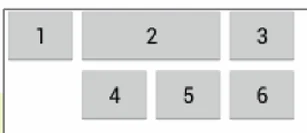
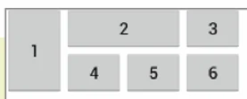

# [모바일 프로그래밍] 테이블레이아웃과 그리드레이아웃

## 원문

https://ch010104.tistory.com/152

## 노트 유형

`guide`

## 적용 목적과 전제조건

- TableLayout은 위젯을 표 형태의 행과 열로 배치하기 위해 사용

구조: <TableLayout> 안에 행을 의미하는 <TableRow>를 추가하고, <TableRow> 안에 위젯을 넣어 열을 구성함. 한 행에 들어간 위젯 수로 열의 개수가 결정

## 구현 절차·검증·주의점

### 1. TableLayout: 표 형태 구조

- TableLayout은 위젯을 표 형태의 행과 열로 배치하기 위해 사용

구조: <TableLayout> 안에 행을 의미하는 <TableRow>를 추가하고, <TableRow> 안에 위젯을 넣어 열을 구성함. 한 행에 들어간 위젯 수로 열의 개수가 결정

주요 속성

- <TableLayout> 자체에 설정.

android:stretchColumns: 특정 열의 폭을 늘려 남은 공간을 모두 채움.

android:layout_span: 위젯이 지정된 수의 열을 합쳐서 표시되도록 함.

android:layout_column: 위젯을 지정된 열(인덱스)에 표시함.

- layout_span으로 버튼 '2'가 2개 열을 차지하고, layout_column으로 버튼 '4'가 인덱스 1 위치에 배치됨.

```html
<TableLayout xmlns:android="http://schemas.android.com/apk/res/android"
    android:layout_width="match_parent"
    android:layout_height="match_parent">

    <TableRow>
        <Button android:text="1" />
        <Button
            android:layout_span="2"
            android:text="2" />
        <Button android:text="3" />
    </TableRow>

    <TableRow>
        <Button
            android:layout_column="1"
            android:text="4" />
        <Button android:text="5" />
        <Button android:text="6" />
    </TableRow>

</TableLayout>
```

### 2. GridLayout: 유연한 그리드 구조

- GridLayout은 안드로이드 4.0(API 14)부터 지원

- TableLayout보다 더 유연하고 직관적인 그리드 구조를 만들 때 사용

- 위젯을 여러 행과 열에 걸쳐 배치하는 등 세밀한 제어가 가능.

주요 속성

android:rowCount & android:columnCount: 그리드의 전체 행과 열 개수를 정의.

android:layout_row & android:layout_column: 각 위젯이 위치할 행과 열 번호(0부터 시작)를 지정.

android:layout_rowSpan & android:layout_columnSpan: 위젯이 지정된 수만큼 행 또는 열을 확장하도록 함.

android:layout_gravity: fill, fill_horizontal 등의 값으로 셀 공간을 가득 채우는 효과를 냄.

- 버튼 '1'은 layout_rowSpan으로 2개 행을, 버튼 '2'는 layout_columnSpan으로 2개 열을 차지

- layout_gravity는 위젯이 확장된 셀 공간을 가득 채우도록 만듦.

```html
<GridLayout xmlns:android="http://schemas.android.com/apk/res/android"
    android:layout_width="match_parent"
    android:layout_height="match_parent"
    android:columnCount="4"
    android:rowCount="2">

    <Button
        android:layout_column="0"
        android:layout_row="0"
        android:layout_rowSpan="2"
        android:layout_gravity="fill_vertical"
        android:text="1" />

    <Button
        android:layout_column="1"
        android:layout_row="0"
        android:layout_columnSpan="2"
        android:layout_gravity="fill_horizontal"
        android:text="2" />
</GridLayout>
```

### 3. FrameLayout: 뷰 겹치기

FrameLayout은 위젯들을 왼쪽 상단에 겹쳐서 배치하는 가장 단순한 구조의 레이아웃

나중에 추가된 위젯이 가장 위에 표시되는 특징이 있음

특정 위젯만 선택적으로 보여주거나 뷰를 중첩시켜야 할 때 유용하게 사용

- RatingBar, ImageView, CheckBox가 코드에 정의된 순서대로 왼쪽 상단에 겹쳐서 표시됨.

```html
<FrameLayout xmlns:android="http://schemas.android.com/apk/res/android"
    android:layout_width="match_parent"
    android:layout_height="match_parent" >

    <RatingBar
        android:id="@+id/ratingBar1"
        android:layout_width="wrap_content"
        android:layout_height="wrap_content" />

    <ImageView
        android:layout_width="wrap_content"
        android:layout_height="wrap_content"
        android:src="@drawable/ic_launcher" />

    <CheckBox
        android:layout_width="wrap_content"
        android:layout_height="wrap_content"
        android:text="CheckBox" />

</FrameLayout>
```

### 실습: 전화앱의키패드화면구현

```html
<?xml version="1.0" encoding="utf-8"?>
<LinearLayout xmlns:android="http://schemas.android.com/apk/res/android"
    xmlns:app="http://schemas.android.com/apk/res-auto"
    xmlns:tools="http://schemas.android.com/tools"
    android:id="@+id/main"
    android:layout_width="match_parent"
    android:layout_height="match_parent"
    android:orientation="vertical"
    android:gravity="center_horizontal"
    tools:context=".MainActivity">

    <LinearLayout
        android:layout_width="wrap_content"
        android:layout_height="wrap_content"
        android:orientation="horizontal"
        android:layout_marginTop="20dp">

        <ImageView
            android:layout_width="15dp"
            android:layout_height="15dp"
            android:src="@drawable/add"
            app:tint="#00FF00" />

        <TextView
            android:layout_width="wrap_content"
            android:layout_height="wrap_content"
            android:text="연락처 추가"
            android:textColor="#00FF00"
            android:textStyle="bold"/>

    </LinearLayout>

    <TextView
        android:layout_width="wrap_content"
        android:layout_height="wrap_content"
        android:layout_marginTop="100dp"
        android:text="02-120"
        android:textSize="40dp" />

    <GridLayout
        android:layout_width="wrap_content"
        android:layout_height="wrap_content"
        android:layout_marginTop="10dp"
        android:rowCount="4"
        android:columnCount="3"
        android:orientation="horizontal">

        <TextView
            android:paddingLeft="40dp"
            android:paddingRight="40dp"
            android:paddingTop="10dp"
            android:paddingBottom="10dp"
            android:text="1"
            android:textSize="30dp"
            android:textStyle="bold"/>

        <TextView
            android:paddingLeft="40dp"
            android:paddingRight="40dp"
            android:paddingTop="10dp"
            android:paddingBottom="10dp"
            android:text="2"
            android:textSize="30dp"
            android:textStyle="bold"/>

        <TextView
            android:paddingLeft="40dp"
            android:paddingRight="40dp"
            android:paddingTop="10dp"
            android:paddingBottom="10dp"
            android:text="3"
            android:textSize="30dp"
            android:textStyle="bold"/>

        <TextView
            android:paddingLeft="40dp"
            android:paddingRight="40dp"
            android:paddingTop="10dp"
            android:paddingBottom="10dp"
            android:text="4"
            android:textSize="30dp"
            android:textStyle="bold"/>

        <TextView
            android:paddingLeft="40dp"
            android:paddingRight="40dp"
            android:paddingTop="10dp"
            android:paddingBottom="10dp"
            android:text="5"
            android:textSize="30dp"
            android:textStyle="bold"/>

        <TextView
            android:paddingLeft="40dp"
            android:paddingRight="40dp"
            android:paddingTop="10dp"
            android:paddingBottom="10dp"
            android:text="6"
            android:textSize="30dp"
            android:textStyle="bold"/>

        <TextView
            android:paddingLeft="40dp"
            android:paddingRight="40dp"
            android:paddingTop="10dp"
            android:paddingBottom="10dp"
            android:text="7"
            android:textSize="30dp"
            android:textStyle="bold"/>

        <TextView
            android:paddingLeft="40dp"
            android:paddingRight="40dp"
            android:paddingTop="10dp"
            android:paddingBottom="10dp"
            android:text="8"
            android:textSize="30dp"
            android:textStyle="bold"/>

        <TextView
            android:paddingLeft="40dp"
            android:paddingRight="40dp"
            android:paddingTop="10dp"
            android:paddingBottom="10dp"
            android:text="9"
            android:textSize="30dp"
            android:textStyle="bold"/>

        <TextView
            android:paddingLeft="40dp"
            android:paddingRight="40dp"
            android:paddingTop="10dp"
            android:paddingBottom="10dp"
            android:text="*"
            android:textSize="30dp"
            android:textStyle="bold"/>

        <TextView
            android:paddingLeft="40dp"
            android:paddingRight="40dp"
            android:paddingTop="10dp"
            android:paddingBottom="10dp"
            android:text="0"
            android:textSize="30dp"
            android:textStyle="bold"/>

        <TextView
            android:paddingLeft="40dp"
            android:paddingRight="40dp"
            android:paddingTop="10dp"
            android:paddingBottom="10dp"
            android:text="#"
            android:textSize="30dp"
            android:textStyle="bold"/>

    </GridLayout>

    <RelativeLayout
        android:layout_width="wrap_content"
        android:layout_height="wrap_content"
        android:layout_marginTop="20dp">

        <ImageView
            android:id="@+id/icon_video"
            android:layout_width="50dp"
            android:layout_height="50dp"
            android:layout_marginRight="30dp"
            android:src="@drawable/video"/>

        <ImageView
            android:id="@+id/icon_call"
            android:layout_width="50dp"
            android:layout_height="50dp"
            android:layout_toRightOf="@+id/icon_video"
            android:src="@drawable/call"/>

        <ImageView
            android:id="@+id/icon_back"
            android:layout_width="50dp"
            android:layout_height="50dp"
            android:layout_marginLeft="30dp"
            android:layout_toRightOf="@+id/icon_call"
            android:src="@drawable/back"/>


    </RelativeLayout>


</LinearLayout>
```

> 원문 코드가 길어 이 노트에서는 앞부분만 보존했습니다. 전체는 원문에서 확인합니다.

## 핵심 이미지






## 관련 글

- [[blog/MOBILE PROGRAMING/index|MOBILE PROGRAMING]]
- [[blog/MOBILE PROGRAMING/모바일 프로그래밍- LinearLayout 안드로이드 레이아웃|[모바일 프로그래밍]  LinearLayout 안드로이드 레이아웃]]
- [[blog/MOBILE PROGRAMING/모바일 프로그래밍- 이미지뷰와 이미지버튼 실습|[모바일 프로그래밍] 이미지뷰와 이미지버튼 실습]]
- [[blog/MOBILE PROGRAMING/모바일 프로그래밍- 메뉴 (Option Menu & Context Menu)|[모바일 프로그래밍] 메뉴 (Option Menu & Context Menu)]]
