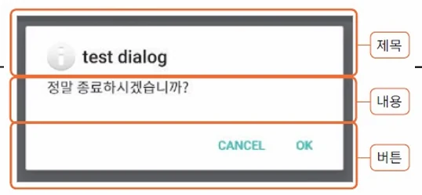
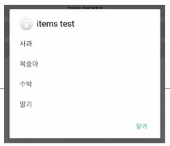
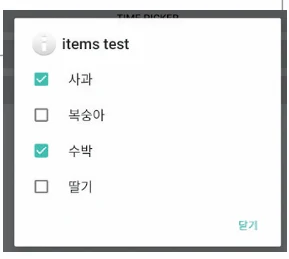

# [모바일 프로그래밍] 토스트(Toast)와 대화 상자(AlertDialog)

## 원문

https://ch010104.tistory.com/164

## 노트 유형

`guide`

## 적용 목적과 전제조건

Toast.makeText() 함수를 사용하여 토스트를 생성함.

open static fun makeText(context: Context!, text: CharSequence!, duration: Int): Toast!

## 구현 절차·검증·주의점

### 1. 토스트 (Toast)

- 토스트는 화면에 잠시 나타났다가 사라지는 간단한 메시지

토스트 생성

Toast.makeText() 함수를 사용하여 토스트를 생성함.

주요 makeText() 함수:

open static fun makeText(context: Context!, text: CharSequence!, duration: Int): Toast!

open static fun makeText(context: Context!, resld: Int, duration: Int): Toast!

Duration (지속 시간):

Toast.LENGTH_LONG: 긴 시간 동안 보임.

Toast.LENGTH_SHORT: 짧은 시간 동안 보임.

토스트를 화면에 표시하려면 반드시 toast.show()를 호출해야 함.

토스트 기타 함수

- 다음 함수들을 이용해서도 토스트를 설정할 수 있음:

open fun setText(resld: Int): Unit (메시지 설정)

open fun setDuration (duration: Int): Unit (지속 시간 설정)

open fun setGravity(gravity: Int, xOffset: Int, yOffset: Int): Unit (위치 설정)

open fun setMargin (horizontalMargin: Float, verticalMargin: Float): Unit (여백 설정)

토스트 콜백 (Callback)

토스트가 화면에 보이거나 사라지는 순간을 감지하는 콜백 기능.

이 기능은 API 레벨 30 (Android R)부터 추가됨.

예제 코드:

```text
// API 레벨 호환성 애너테이션 필요
@RequiresApi (Build.VERSION_CODES.R) [cite: 21]
fun showToast() {
    val toast = Toast.makeText(this, "종료하려면 한 번 더 누르세요.", Toast.LENGTH_SHORT) [cite: 23]
    toast.addCallback(
        object: Toast.Callback() { [cite: 24]
            // 토스트가 사라질 때 호출
            override fun onToastHidden() { [cite: 25]
                super.onToastHidden() [cite: 26]
                Log.d("kkang", "toast hidden") [cite: 27]
            }
            // 토스트가 나타날 때 호출
            override fun onToastShown() { [cite: 29]
                super.onToastShown() [cite: 30]
                Log.d("kkang", "toast shown") [cite: 31]
            }
        }) [cite: 28, 32, 33]
    toast.show() [cite: 34]
} [cite: 22, 35]
```

### 2. 대화상자 (AlertDialog)

- 대화상자의 기본은 AlertDialog이며, 제목, 내용, 버튼 영역으로 구분됨.

AlertDialog 생성

AlertDialog.Builder를 이용하여 알림창을 생성함.

주요 Builder 함수:

open fun setIcon(iconld: Int): 아이콘 설정.

open fun setTitle(title: CharSequence!): 제목 설정.

open fun setMessage(message: CharSequence!): 내용 설정.

버튼 지정 함수:

setPositiveButton(...): '확인'과 같은 긍정적 버튼.

setNegativeButton(...): '취소'와 같은 부정적 버튼.

setNeutralButton(...): '나중에'와 같은 중립적 버튼.

AlertDialog 띄우기 예제

show() 함수를 호출하여 대화상자를 화면에 띄움.

예제 코드:

```text
AlertDialog.Builder(this).run { [cite: 61]
    setTitle("test dialog") [cite: 62]
    setIcon(android.R.drawable.ic_dialog_info) [cite: 63]
    setMessage("정말 종료하시겠습니까?") [cite: 64]
    setNeutralButton("More", null) [cite: 66]
    setPositiveButton("Yes", null) [cite: 67]
    setNegativeButton("No", null) [cite: 67]
    show() [cite: 71]
} [cite: 72]
```

위 예제에서 버튼의 두 번째 매개변수(리스너)가 null이므로 버튼을 눌러도 이벤트가 발생하지 않음.

버튼 이벤트 핸들러 등록

DialogInterface.OnClickListener를 구현하여 버튼 클릭 이벤트를 처리함.

예제 코드:

```text
// 1. 이벤트 핸들러 정의
val eventHandler = object: DialogInterface.OnClickListener { [cite: 80]
    override fun onClick(p0: DialogInterface?, p1: Int) {
        if (p1 == DialogInterface.BUTTON_POSITIVE) { [cite: 81]
            Log.d("kkang", "positive button click") [cite: 81]
        } else if (p1 == DialogInterface.BUTTON_NEGATIVE) { [cite: 82]
            Log.d("kkang", "negative button click") [cite: 83]
        } [cite: 84]
    } [cite: 85]
} [cite: 86]

// 2. 빌더에 핸들러 설정
AlertDialog.Builder(this).run {
    // ... (setTitle, setMessage 등)
    setPositiveButton("OK", eventHandler) [cite: 88]
    setNegativeButton("Cancel", eventHandler) [cite: 89]
    show()
}
```

### 3. 목록 형태의 대화상자

- 목록을 제공하고 사용자의 선택을 받는 대화상자를 만들 수 있음.

기본 목록 (setItems)

함수: open fun setitems(items: Array<CharSequence!>!, listener: DialogInterface.OnClickListener!): AlertDialog.Builder!

예제 코드:

```text
val items = arrayOf<String>("사과", "복숭아", "수박", "딸기") [cite: 104]
AlertDialog.Builder(this).run { [cite: 105]
    setTitle("items test") [cite: 106]
    setIcon(android.R.drawable.ic_dialog_info) [cite: 107]
    setItems(items, object: DialogInterface.OnClickListener { [cite: 108]
        override fun onClick(p0: DialogInterface?, p1: Int) { [cite: 109, 110]
            Log.d("kkang", "선택한 과일: ${items[p1]}") [cite: 113]
        }
    }) [cite: 111]
    setPositiveButton("닫기", null) [cite: 114]
    show() [cite: 112]
}
```

다중 선택 목록 (setMultiChoiceItems)

체크박스가 포함된 다중 선택 목록을 생성함.

함수: open fun setMultiChoiceltems(items: Array<CharSequence!>!, checkedItems: BooleanArray!, listener: DialogInterface.OnMultiChoiceClickListener!): AlertDialog.Builder!

예제 코드:

```text
// "사과"와 "수박"을 미리 체크된 상태로 설정 (true, false, true, false)
setMultiChoiceItems(items, booleanArrayOf(true, false, true, false), [cite: 127, 128]
    object: DialogInterface.OnMultiChoiceClickListener { [cite: 128, 129]
        override fun onClick(p0: DialogInterface?, p1: Int, p2: Boolean) { [cite: 130, 131]
            Log.d("kkang", "${items[p1]} 이(가) ${if(p2) "선택되었습니다." else "선택 해제되었습니다."}") [cite: 132]
        } [cite: 133]
    })
```

단일 선택 목록 (setSingleChoiceItems)

라디오 버튼이 포함된 단일 선택 목록을 생성함.

함수: open fun setSingleChoiceltems(items: Array<CharSequence!>!, checkedItem: Int, listener: DialogInterface.OnClickListener!): AlertDialog.Builder!

예제 코드:

```text
// "복숭아" (인덱스 1)를 미리 선택된 상태로 설정
setSingleChoiceItems(items, 1, object: DialogInterface.OnClickListener { [cite: 143]
    override fun onClick(p0: DialogInterface?, p1: Int) { [cite: 144, 146]
        Log.d("kkang", "${items[p1]} 이 선택되었습니다.") [cite: 147]
    } [cite: 148]
})
```

### 4. 대화상자 닫기 옵션

setCancelable(false): 기기의 뒤로가기 버튼으로 대화상자가 닫히는 것을 방지함.

setCanceledOnTouchOutside(false): 대화상자의 바깥 영역을 터치했을 때 닫히는 것을 방지함.

예제 코드:

```text
AlertDialog.Builder(this).run {
    // ... (내용 설정) ...
    setCancelable(false) // 뒤로가기 버튼으로 닫기 비활성화
    setPositiveButton("닫기", null)
    show()
}.setCanceledOnTouchOutside(false) // 바깥 영역 터치로 닫기 비활성화
```

### 5. 실습

```text
// MainActivity.kt
package com.cookandroid.toastalertdialogexcercise

import android.content.DialogInterface
import android.os.Bundle
import android.view.Gravity
import android.view.View
import android.widget.Toast
import androidx.activity.enableEdgeToEdge
import androidx.appcompat.app.AlertDialog
import androidx.appcompat.app.AppCompatActivity
import androidx.core.view.ViewCompat
import androidx.core.view.WindowInsetsCompat
import com.cookandroid.toastalertdialogexcercise.databinding.ActivityMainBinding
import com.cookandroid.toastalertdialogexcercise.databinding.Dialog1Binding
import com.cookandroid.toastalertdialogexcercise.databinding.Toast1Binding

class MainActivity : AppCompatActivity() {

    private lateinit var binding: ActivityMainBinding
    private lateinit var dialogView: View
    private lateinit var toastView: View

    override fun onCreate(savedInstanceState: Bundle?) {
        super.onCreate(savedInstanceState)
//        enableEdgeToEdge()
//        setContentView(R.layout.activity_main)
//        ViewCompat.setOnApplyWindowInsetsListener(findViewById(R.id.main)) { v, insets ->
//            val systemBars = insets.getInsets(WindowInsetsCompat.Type.systemBars())
//            v.setPadding(systemBars.left, systemBars.top, systemBars.right, systemBars.bottom)
//            insets
//        }
        binding = ActivityMainBinding.inflate(layoutInflater)
        setContentView(binding.root)

        binding.button1.setOnClickListener {
            val dialogBinding = Dialog1Binding.inflate(layoutInflater) // dialog_1.xml이라는 이름의 XML 레이아웃 파일을 보고 자동 생성

            AlertDialog.Builder(this).run{
                setTitle("사용자 정보 입력")
                setIcon(R.drawable.outlin_add_box_24)

                setView(dialogBinding.root)

                setPositiveButton("확인", object : DialogInterface.OnClickListener {
                    override fun onClick(p0: DialogInterface?, p1: Int){
                        binding.tvName.setText(dialogBinding.dlgEdt1.text)
                        binding.tvEmail.setText(dialogBinding.dlgEdt2.text)
                    }
                })

                setNegativeButton("취소", object : DialogInterface.OnClickListener {
                    override fun onClick(p0: DialogInterface?, p1: Int){
                        val toast1Binding = Toast1Binding.inflate(layoutInflater)

                        val toast = Toast(applicationContext)

                        toast.view = toast1Binding.root
                        toast.setGravity(Gravity.CENTER, 0, 200)
                        toast.show()
                    }
                })

                setCancelable(false) // 사용자가 뒤로 가기 버튼을 눌렀을 때, dialog가 사라질 것인지(dafault는 true)
                show()
            }.setCanceledOnTouchOutside(false) // 사용자가 dialog 바깥 영역을 터치했을 때, dialog가 사라질 것인지(default는 true)

        }
    }
}
```

```html
// activity_main.xml
<?xml version="1.0" encoding="utf-8"?>
<LinearLayout xmlns:android="http://schemas.android.com/apk/res/android"
    xmlns:app="http://schemas.android.com/apk/res-auto"
    xmlns:tools="http://schemas.android.com/tools"
    android:id="@+id/main"
    android:layout_width="match_parent"
    android:layout_height="match_parent"
    android:orientation="vertical"
    android:gravity="bottom|center_horizontal"
    android:padding="30dp"
    tools:context=".MainActivity">

    <TextView
        android:id="@+id/tvName"
        android:layout_width="wrap_content"
        android:layout_height="wrap_content"
        android:text="사용자 이름"
        android:layout_margin="20dp"
        android:textSize="20dp"
        />

    <TextView
        android:id="@+id/tvEmail"
        android:layout_width="wrap_content"
        android:layout_height="wrap_content"
        android:text="이메일"
        android:layout_margin="20dp"
        android:textSize="20dp"
        />

    <Button
        android:id="@+id/button1"
        android:layout_width="wrap_content"
        android:layout_height="wrap_content"
        android:text="입력"
        android:layout_margin="20dp"
        />

</LinearLayout>
```

```html
// toast1.xml
<?xml version="1.0" encoding="utf-8"?>
<LinearLayout xmlns:android="http://schemas.android.com/apk/res/android"
    android:orientation="horizontal"
    android:background="@android:color/holo_orange_light"
    android:layout_width="match_parent"
    android:layout_height="match_parent">

    <ImageView
        android:layout_width="wrap_content"
        android:layout_height="wrap_content"
        android:src="@drawable/baseline_check_circle_outline_24"/>

    <TextView
        android:id="@+id/toastText1"
        android:layout_width="wrap_content"
        android:layout_height="wrap_content"
        android:textSize="20dp"
        android:text="취소했습니다."/>
</LinearLayout>
```

```html
// dialog1.xml
<?xml version="1.0" encoding="utf-8"?>
<LinearLayout xmlns:android="http://schemas.android.com/apk/res/android"
    android:orientation="vertical"
    android:layout_width="match_parent"
    android:layout_height="match_parent">

    <TextView
        android:layout_width="match_parent"
        android:layout_height="wrap_content"
        android:text="사용자 이름"/>

    <EditText
        android:id="@+id/dlgEdt1"
        android:layout_width="match_parent"
        android:layout_height="wrap_content"
        android:hint="이름 입력" />

    <TextView
        android:layout_width="match_parent"
        android:layout_height="wrap_content"
        android:text="이메일"/>

    <EditText
        android:id="@+id/dlgEdt2"
        android:hint="이메일 입력"
        android:layout_width="match_parent"
        android:layout_height="wrap_content"/>


</LinearLayout>
```

## 핵심 이미지







## 관련 글

- [[blog/MOBILE PROGRAMING/index|MOBILE PROGRAMING]]
- [[blog/MOBILE PROGRAMING/모바일 프로그래밍- Activity와 Intent(단방향)|[모바일 프로그래밍] Activity와 Intent(단방향)]]
- [[blog/MOBILE PROGRAMING/모바일 프로그래밍- 메뉴 (Option Menu & Context Menu)|[모바일 프로그래밍] 메뉴 (Option Menu & Context Menu)]]
- [[blog/MOBILE PROGRAMING/모바일 프로그래밍- Activity와 Intent(양방향)|[모바일 프로그래밍] Activity와 Intent(양방향)]]
