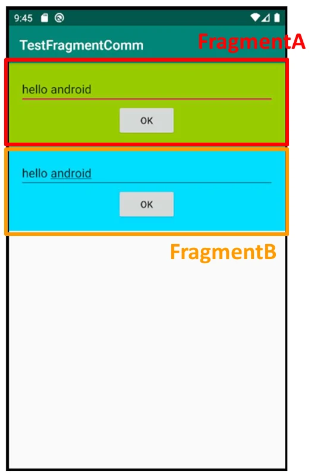

# [모바일 프로그래밍] 프래그먼트 간 통신 실습

## 원문

https://ch010104.tistory.com/186

## 노트 유형

`tutorial`

## 학습 목표 및 맥락

실습 목표: Fragment A와 Fragment B 간에 데이터를 주고받는 앱 구현.

통신 방식: 'Using Activity' (액티비티를 이용한 방식) 채택. 호스팅 액티비티가 두 프래그먼트 사이의 중개자 역할을 수행.

## 원문 기반 학습 정리

실습 목표: Fragment A와 Fragment B 간에 데이터를 주고받는 앱 구현.

통신 방식: 'Using Activity' (액티비티를 이용한 방식) 채택. 호스팅 액티비티가 두 프래그먼트 사이의 중개자 역할을 수행.

UI 구성:

하나의 MainActivity가 Fragment A와 Fragment B를 모두 포함.

각 프래그먼트는 텍스트를 입력받는 공간(EditText)과 'OK' 버튼을 가짐.

데이터 흐름 (Fragment A → Activity):

Fragment A는 getActivity()를 사용해 호스팅 액티비티의 참조를 획득.

'OK' 버튼 클릭 시, Fragment A는 획득한 액티비티 참조를 통해 액티비티에 구현된 특정 함수(예: onReceivedFromFragA)를 호출하며 데이터를 전달.

데이터 흐름 (Activity → Fragment B):

액티비티는 Fragment A로부터 호출될 함수(예: onReceivedFromFragA)를 구현.

이 함수 내부에서 getSupportFragmentManager().findFragmentById()를 사용해 Fragment B의 참조를 획득.

액티비티는 획득한 Fragment B의 참조를 통해, Fragment B 내부에 정의된 공개 함수(예: updateEditText)를 호출하여 데이터를 전달.

실행 결과: Fragment A의 EditText에 텍스트(예: "hello android")를 입력하고 'OK' 버튼을 누르면, 해당 텍스트가 Fragment B의 EditText에 나타남.

```text
// MainActivity.kt
package com.cookandroid.fragementcommunicationexcercise

import android.os.Bundle
import android.util.Log
import androidx.activity.enableEdgeToEdge
import androidx.appcompat.app.AppCompatActivity
import androidx.core.view.ViewCompat
import androidx.core.view.WindowInsetsCompat
import androidx.fragment.app.FragmentTransaction
import com.cookandroid.fragementcommunicationexcercise.databinding.ActivityMainBinding

class MainActivity : AppCompatActivity() {

    private lateinit var bindingMain : ActivityMainBinding
    private lateinit var fragmentA: FragmentA
    private lateinit var fragmentB: FragmentB

    override fun onCreate(savedInstanceState: Bundle?) {
        super.onCreate(savedInstanceState)
//        enableEdgeToEdge()
//        setContentView(R.layout.activity_main)
//        ViewCompat.setOnApplyWindowInsetsListener(findViewById(R.id.main)) { v, insets ->
//            val systemBars = insets.getInsets(WindowInsetsCompat.Type.systemBars())
//            v.setPadding(systemBars.left, systemBars.top, systemBars.right, systemBars.bottom)
//            insets
//        }

        bindingMain = ActivityMainBinding.inflate(layoutInflater)
        setContentView(bindingMain.root)

        fragmentA = FragmentA()
        fragmentB = FragmentB()

        val transaction : FragmentTransaction = supportFragmentManager.beginTransaction()

        transaction.add(R.id.container_a, fragmentA)
        transaction.add(R.id.container_b, fragmentB)
        transaction.addToBackStack(null)
        transaction.commit()
    }

    fun onRecievedFromFragA(input : CharSequence){
        Log.i("프래그먼트간 데이터 전달", "Recieved msg: $input")
        val fragmentManager : androidx.fragment.app.FragmentManager = supportFragmentManager
        val fragB : FragmentB = fragmentManager.findFragmentById(R.id.container_b) as FragmentB
        fragB.updateEditText(input)
    }
}
```

```typescript
// FragmentA.kt
package com.cookandroid.fragementcommunicationexcercise

import android.os.Bundle
import android.util.Log
import androidx.fragment.app.Fragment
import android.view.LayoutInflater
import android.view.View
import android.view.ViewGroup
import com.cookandroid.fragementcommunicationexcercise.databinding.FragmentABinding

// TODO: Rename parameter arguments, choose names that match
// the fragment initialization parameters, e.g. ARG_ITEM_NUMBER
private const val ARG_PARAM1 = "param1"
private const val ARG_PARAM2 = "param2"

/**
 * A simple [Fragment] subclass.
 * Use the [FragmentA.newInstance] factory method to
 * create an instance of this fragment.
 */
class FragmentA : Fragment() {

    private lateinit var bindingFragmentA : FragmentABinding

    override fun onCreate(savedInstanceState: Bundle?) {
        super.onCreate(savedInstanceState)
    }

    override fun onCreateView(
        inflater: LayoutInflater, container: ViewGroup?,
        savedInstanceState: Bundle?
    ): View? {
        bindingFragmentA = FragmentABinding.inflate(inflater, container, false)
        return bindingFragmentA.root
    }

    override fun onViewCreated(view: View, savedInstanceState: Bundle?) {
        super.onViewCreated(view, savedInstanceState)

        bindingFragmentA.buttonOk.setOnClickListener(object : View.OnClickListener{
            override fun onClick(v: View?) {
                val mainActivity : MainActivity = activity as MainActivity
                mainActivity.onRecievedFromFragA(bindingFragmentA.editText.text)
            }
        })
    }


//    companion object {
//        /**
//         * Use this factory method to create a new instance of
//         * this fragment using the provided parameters.
//         *
//         * @param param1 Parameter 1.
//         * @param param2 Parameter 2.
//         * @return A new instance of fragment FragmentA.
//         */
//        // TODO: Rename and change types and number of parameters
//        @JvmStatic
//        fun newInstance(param1: String, param2: String) =
//            FragmentA().apply {
//                arguments = Bundle().apply {
//                    putString(ARG_PARAM1, param1)
//                    putString(ARG_PARAM2, param2)
//                }
//            }
//    }
}
```

```typescript
// FragmentB.kt
package com.cookandroid.fragementcommunicationexcercise

import android.os.Bundle
import androidx.fragment.app.Fragment
import android.view.LayoutInflater
import android.view.View
import android.view.ViewGroup
import com.cookandroid.fragementcommunicationexcercise.databinding.FragmentBBinding

// TODO: Rename parameter arguments, choose names that match
// the fragment initialization parameters, e.g. ARG_ITEM_NUMBER
private const val ARG_PARAM1 = "param1"
private const val ARG_PARAM2 = "param2"

/**
 * A simple [Fragment] subclass.
 * Use the [FragmentB.newInstance] factory method to
 * create an instance of this fragment.
 */
class FragmentB : Fragment() {
    private lateinit var bindingFragmentB : FragmentBBinding
    // TODO: Rename and change types of parameters
//    private var param1: String? = null
//    private var param2: String? = null

//    override fun onCreate(savedInstanceState: Bundle?) {
//        super.onCreate(savedInstanceState)
//        arguments?.let {
//            param1 = it.getString(ARG_PARAM1)
//            param2 = it.getString(ARG_PARAM2)
//        }
//    }

    override fun onCreateView(
        inflater: LayoutInflater,
        container: ViewGroup?,
        savedInstanceState: Bundle?
    ): View? {
//        return super.onCreateView(inflater, container, savedInstanceState)
        bindingFragmentB = FragmentBBinding.inflate(layoutInflater)
        return  bindingFragmentB.root
    }

    override fun onViewCreated(view: View, savedInstanceState: Bundle?) {
        super.onViewCreated(view, savedInstanceState)
    }

    public fun updateEditText(newText : CharSequence) {
        bindingFragmentB.editText.setText(newText)
    }

//    companion object {
//        /**
//         * Use this factory method to create a new instance of
//         * this fragment using the provided parameters.
//         *
//         * @param param1 Parameter 1.
//         * @param param2 Parameter 2.
//         * @return A new instance of fragment FragmentB.
//         */
//        // TODO: Rename and change types and number of parameters
//        @JvmStatic
//        fun newInstance(param1: String, param2: String) =
//            FragmentB().apply {
//                arguments = Bundle().apply {
//                    putString(ARG_PARAM1, param1)
//                    putString(ARG_PARAM2, param2)
//                }
//            }
//    }
}
```

```html
// activity_main.xml
<?xml version="1.0" encoding="utf-8"?>
<LinearLayout xmlns:android="http://schemas.android.com/apk/res/android"
    xmlns:app="http://schemas.android.com/apk/res-auto"
    xmlns:tools="http://schemas.android.com/tools"
    android:id="@+id/main"
    android:layout_width="match_parent"
    android:layout_height="match_parent"
    android:orientation="vertical"
    tools:context=".MainActivity">

    <androidx.fragment.app.FragmentContainerView
        android:id="@+id/container_a"
        android:layout_width="match_parent"
        android:layout_height="0dp"
        android:layout_weight="1"/>

    <androidx.fragment.app.FragmentContainerView
        android:id="@+id/container_b"
        android:layout_width="match_parent"
        android:layout_height="0dp"
        android:layout_weight="1"/>

</LinearLayout>
```

```html
// fragment_a.xml
<?xml version="1.0" encoding="utf-8"?>
<LinearLayout xmlns:android="http://schemas.android.com/apk/res/android"
    xmlns:tools="http://schemas.android.com/tools"
    android:layout_width="match_parent"
    android:layout_height="match_parent"
    android:orientation="vertical"
    android:background="@android:color/holo_green_light"
    android:gravity="center_horizontal"
    tools:context=".FragmentA">

    <!-- TODO: Update blank fragment layout -->
    <EditText
        android:id="@+id/edit_text"
        android:layout_width="match_parent"
        android:layout_height="wrap_content"/>

    <Button
        android:id="@+id/button_ok"
        android:layout_width="wrap_content"
        android:layout_height="wrap_content"
        android:text="OK"/>

</LinearLayout>
```

> 원문 코드가 길어 이 노트에서는 앞부분만 보존했습니다. 전체는 원문에서 확인합니다.

```html
// fragment_b.xml
<?xml version="1.0" encoding="utf-8"?>
<LinearLayout xmlns:android="http://schemas.android.com/apk/res/android"
    xmlns:tools="http://schemas.android.com/tools"
    android:layout_width="match_parent"
    android:layout_height="match_parent"
    android:gravity="center_horizontal"
    android:orientation="vertical"
    android:background="@android:color/holo_blue_bright"
    tools:context=".FragmentB">

    <!-- TODO: Update blank fragment layout -->
    <EditText
        android:id="@+id/edit_text"
        android:layout_width="match_parent"
        android:layout_height="wrap_content"/>

    <Button
        android:id="@+id/button_ok"
        android:layout_width="wrap_content"
        android:layout_height="wrap_content"
        android:text="OK"/>

</LinearLayout>
```

## 핵심 이미지



## 관련 글

- [[blog/MOBILE PROGRAMING/index|MOBILE PROGRAMING]]
- [[blog/MOBILE PROGRAMING/모바일 프로그래밍- Listener를 이용한 두 프래그먼트 간의 통신|[모바일 프로그래밍] Listener를 이용한 두 프래그먼트 간의 통신]]
- [[blog/MOBILE PROGRAMING/모바일 프로그래밍- 암시적 Intent와 액티비티 생명 주기|[모바일 프로그래밍] 암시적 Intent와 액티비티 생명 주기]]
- [[blog/MOBILE PROGRAMING/모바일 프로그래밍- Activity와 Intent(양방향)|[모바일 프로그래밍] Activity와 Intent(양방향)]]
