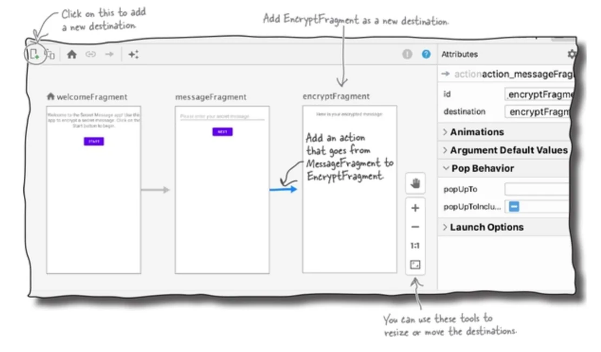
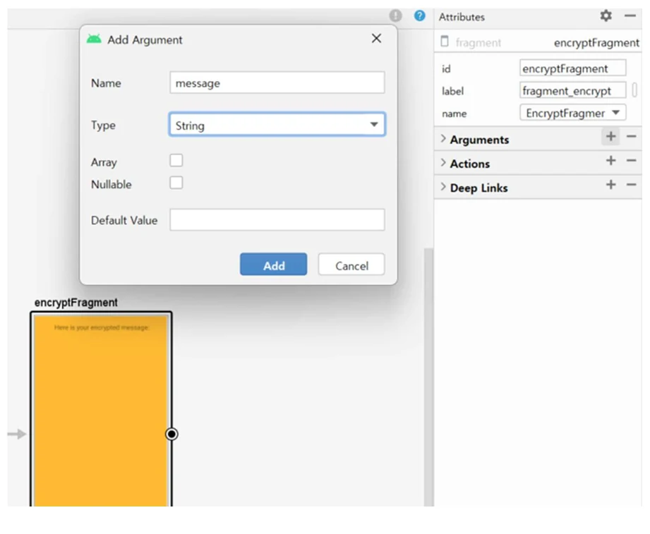
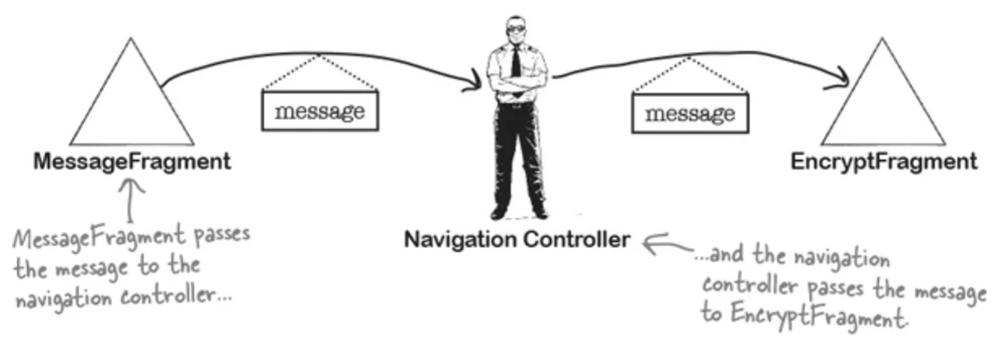

# [모바일프로그래밍] Safe Args (Fragment 간 데이터 전달)

## 원문

https://ch010104.tistory.com/193

## 노트 유형

`guide`

## 적용 목적과 전제조건

Navigation Component의 Safe Args 플러그인을 사용하여 Fragment 간에 데이터를 안전하게 전달

Safe Args 플러그인을 사용하기 위해 build.gradle 파일 수정 필요.

## 구현 절차·검증·주의점

### 1. Safe Args (Fragment 간 데이터 전달)

Navigation Component의 Safe Args 플러그인을 사용하여 Fragment 간에 데이터를 안전하게 전달

1.1. 사전 설정 (Gradle)

Safe Args 플러그인을 사용하기 위해 build.gradle 파일 수정 필요.

Project 수준 build.gradle

```text
buildscript {
    dependencies {
        val nav_version = "2.9.6"
        classpath("androidx.navigation:navigation-safe-args-gradle-plugin:$nav_version")
    }
}
```

App 수준 build.gradle

```text
plugins {
    id("androidx.navigation.safeargs.kotlin")
}
```

1.2. Navigation Graph 설정 (Argument 추가)

데이터를 받는 쪽(EncryptFragment)에 Argument를 정의해야 함.

설정 항목:

Name: 변수명 (예: message)

Type: 데이터 타입 (예: String)

Default Value: 기본값 설정 가능

XML 코드 예시:

```html
<fragment android:id="@+id/encryptFragment" ...>
    <argument
        android:name="message"
        app:argType="string" />
</fragment>
```

1.3. 데이터 송신 (Sender: MessageFragment)

Safe Args가 활성화되면 송신 측 Fragment의 이름 뒤에 Directions가 붙은 클래스(예: MessageFragmentDirections)가 자동 생성됨.

구현 순서:

Directions 클래스를 사용하여 Action 객체 생성 및 데이터 전달.

NavController를 통해 해당 Action으로 이동.

Kotlin 코드:

```text
bindingFragMessage.btnNext.setOnClickListener {
    val navController = Navigation.findNavController(view)
    val message = bindingFragMessage.edtMessage.text.toString()

    // Action 객체 생성 및 데이터(message) 포함
    val action = MessageFragmentDirections.actionMessageFragmentToEncryptFragment(message)

    // Navigation Controller를 통해 이동
    navController.navigate(action)
}
```

1.4. 데이터 수신 (Receiver: EncryptFragment)

수신 측 Fragment의 이름 뒤에 Args가 붙은 클래스(예: EncryptFragmentArgs)가 자동 생성됨

구현 방법: fromBundle(requireArguments()) 메서드를 사용하여 전달받은 인자를 추출.

Kotlin 코드:

```text
override fun onViewCreated(view: View, savedInstanceState: Bundle?) {
    super.onViewCreated(view, savedInstanceState)

    // 전달받은 메시지 추출
    val rxMessage: String = EncryptFragmentArgs.fromBundle(requireArguments()).message

    // 텍스트 뷰에 역순으로 표시 (예제 로직)
    bindingFragEncrypt.encryptedMessage.setText(rxMessage.reversed())
}
```

### 2. Back Stack 관리 (뒤로 가기 동작 변경)

앱 탐색 시 쌓이는 Back Stack을 조작하여 뒤로 가기 버튼을 눌렀을 때의 이동 경로를 변경하는 방법을 설명함.

2.1.Back Stack 개념

구조: 방문한 Fragment들이 스택(Stack) 구조로 쌓임 (LIFO).

기본 동작: 뒤로 가기 버튼 클릭 시 최상단 Fragment가 pop 되고 바로 아래 Fragment가 표시됨

문제 상황: Welcome -> Message -> Encrypt 순으로 이동했을 때, Encrypt에서 뒤로 가기를 누르면 Message가 아닌 Welcome으로 바로 가고 싶은 경우 발생.

2.2. popUpTo 속성 활용

Action 정의 시 popUpTo 속성을 사용하여 Back Stack에서 특정 지점까지 Fragment를 제거할 수 있음.

주요 속성:

app:popUpTo: 지정한 ID의 Fragment가 나올 때까지 스택 위의 Fragment들을 제거함.

app:popUpToInclusive: true일 경우 popUpTo로 지정한 Fragment까지 함께 제거함. false일 경우 지정한 Fragment는 유지함.

설정 예시 (Message -> Encrypt 이동 시):

```html
<action
    android:id="@+id/action_messageFragment_to_encryptFragment"
    app:destination="@id/encryptFragment"
    app:popUpTo="@id/welcomeFragment"
    app:popUpToInclusive="false" />
```

설명: EncryptFragment로 이동하면서 WelcomeFragment 위에 있는 모든 Fragment(MessageFragment)를 스택에서 제거함. 따라서 Encrypt에서 뒤로 가기 시 Welcome으로 이동.

2.3. 속성 값 조합에 따른 동작 비교

Message -> Encrypt 이동 시 아래 두 설정은 동일한 결과(MessageFragment가 스택에서 사라짐)를 가짐.

popUpTo Inclusive 사용:

XML

```text
app:popUpTo="@id/messageFragment"
app:popUpToInclusive="true"
```

popUpTo Non-Inclusive 사용:

XML

```text
app:popUpTo="@id/welcomeFragment"
app:popUpToInclusive="false"
```

### 3. 실습 예제 (AnotherFragment 활용)

3.1.시나리오 1: Message -> Another 이동 후 Back

목표: 뒤로 가기 시 MessageFragment를 건너뛰고 WelcomeFragment로 이동.

Action 설정:또는 popUpTo="@id/welcomeFragment", popUpToInclusive="false" 사용 가능.

XML

```html
<action
    android:id="@+id/action_messageFragment_to_anotherFragment"
    app:destination="@id/anotherFragment"
    app:popUpTo="@id/messageFragment"
    app:popUpToInclusive="true" />
```

3.2. 시나리오 2: Encrypt -> Another 이동 후 Back

목표: 뒤로 가기 시 EncryptFragment를 건너뛰고 MessageFragment로 이동.

Action 설정:또는 popUpTo="@id/messageFragment", popUpToInclusive="false" 사용 가능.

XML

```html
<action
    android:id="@+id/action_encryptFragment_to_anotherFragment"
    app:destination="@id/anotherFragment"
    app:popUpTo="@id/encryptFragment"
    app:popUpToInclusive="true" />
```

### 4. 최종 코드

```text
// MainActivity.kt

package com.cookandroid.navigationcomponentexcercise

import android.os.Bundle
import androidx.activity.enableEdgeToEdge
import androidx.appcompat.app.AppCompatActivity
import androidx.core.view.ViewCompat
import androidx.core.view.WindowInsetsCompat
import com.cookandroid.navigationcomponentexcercise.databinding.ActivityMainBinding
class MainActivity : AppCompatActivity() {

    private lateinit var bindingMain : ActivityMainBinding

    override fun onCreate(savedInstanceState: Bundle?) {
        super.onCreate(savedInstanceState)
//        enableEdgeToEdge()
//        setContentView(R.layout.activity_main)
//        ViewCompat.setOnApplyWindowInsetsListener(findViewById(R.id.main)) { v, insets ->
//            val systemBars = insets.getInsets(WindowInsetsCompat.Type.systemBars())
//            v.setPadding(systemBars.left, systemBars.top, systemBars.right, systemBars.bottom)
//            insets
//        }

        bindingMain = ActivityMainBinding.inflate(layoutInflater)
        setContentView(bindingMain.root)
    }
}
```

```typescript
// WelcomeFragment.kt

package com.cookandroid.navigationcomponentexcercise

import android.os.Bundle
import androidx.fragment.app.Fragment
import android.view.LayoutInflater
import android.view.View
import android.view.ViewGroup
import androidx.navigation.NavController
import androidx.navigation.Navigation
import com.cookandroid.navigationcomponentexcercise.databinding.FragmentWelcomeBinding

// TODO: Rename parameter arguments, choose names that match
// the fragment initialization parameters, e.g. ARG_ITEM_NUMBER
private const val ARG_PARAM1 = "param1"
private const val ARG_PARAM2 = "param2"

/**
 * A simple [Fragment] subclass.
 * Use the [WelcomeFragment.newInstance] factory method to
 * create an instance of this fragment.
 */
class WelcomeFragment : Fragment() {
    // TODO: Rename and change types of parameters

    private lateinit var bindingWelcomeFragment: FragmentWelcomeBinding

    override fun onCreate(savedInstanceState: Bundle?) {
        super.onCreate(savedInstanceState)
    }

    override fun onCreateView(
        inflater: LayoutInflater,
        container: ViewGroup?,
        savedInstanceState: Bundle?
    ): View? {
        bindingWelcomeFragment = FragmentWelcomeBinding.inflate(layoutInflater)
        return bindingWelcomeFragment.root

    }

    override fun onViewCreated(view: View, savedInstanceState: Bundle?) {
        super.onViewCreated(view, savedInstanceState)

        bindingWelcomeFragment.BtnStart.setOnClickListener(object : View.OnClickListener{
            override fun onClick(v: View?) {
                val navController : NavController  = Navigation.findNavController(view)

                navController.navigate(R.id.action_welcomeFragment_to_messageFragment)
            }
        })
    }

//    private var param1: String? = null
//    private var param2: String? = null
//
//    override fun onCreate(savedInstanceState: Bundle?) {
//        super.onCreate(savedInstanceState)
//        arguments?.let {
//            param1 = it.getString(ARG_PARAM1)
//            param2 = it.getString(ARG_PARAM2)
//        }
//    }
//
//    override fun onCreateView(
//        inflater: LayoutInflater, container: ViewGroup?,
//        savedInstanceState: Bundle?
//    ): View? {
//        // Inflate the layout for this fragment
//        return inflater.inflate(R.layout.fragment_welcome, container, false)
//    }
//
//    companion object {
//        /**
//         * Use this factory method to create a new instance of
//         * this fragment using the provided parameters.
//         *
//         * @param param1 Parameter 1.
//         * @param param2 Parameter 2.
//         * @return A new instance of fragment WelcomeFragment.
//         */
//        // TODO: Rename and change types and number of parameters
//        @JvmStatic
//        fun newInstance(param1: String, param2: String) =
//            WelcomeFragment().apply {
//                arguments = Bundle().apply {
//                    putString(ARG_PARAM1, param1)
//                    putString(ARG_PARAM2, param2)
//                }
//            }
//    }
}
```

```typescript
// MessageFragment.kt

package com.cookandroid.navigationcomponentexcercise

import android.os.Bundle
import androidx.fragment.app.Fragment
import android.view.LayoutInflater
import android.view.View
import android.view.ViewGroup
import androidx.navigation.NavController
import androidx.navigation.Navigation
import com.cookandroid.navigationcomponentexcercise.databinding.FragmentMessageBinding

// TODO: Rename parameter arguments, choose names that match
// the fragment initialization parameters, e.g. ARG_ITEM_NUMBER
private const val ARG_PARAM1 = "param1"
private const val ARG_PARAM2 = "param2"

/**
 * A simple [Fragment] subclass.
 * Use the [MessageFragment.newInstance] factory method to
 * create an instance of this fragment.
 */
class MessageFragment : Fragment() {

    private lateinit var bindingMessageFragment : FragmentMessageBinding

    override fun onCreate(savedInstanceState: Bundle?) {
        super.onCreate(savedInstanceState)
    }

    override fun onCreateView(
        inflater: LayoutInflater,
        container: ViewGroup?,
        savedInstanceState: Bundle?
    ): View? {
        bindingMessageFragment = FragmentMessageBinding.inflate(layoutInflater)
        return bindingMessageFragment.root

    }

    override fun onViewCreated(view: View, savedInstanceState: Bundle?) {
        super.onViewCreated(view, savedInstanceState)

        bindingMessageFragment.btnNext.setOnClickListener(object : View.OnClickListener{
            override fun onClick(v: View?) {
                // TODO: 다음 화면으로 이동하는 코드 추가
                val navController : NavController  = Navigation.findNavController(view) // navController에 message 전달
                val message : String = bindingMessageFragment.edtMessage.text.toString()
                val action = MessageFragmentDirections.actionMessageFragmentToEncryptFragment(message)
                navController.navigate(action)
            }
        })

        bindingMessageFragment.btnAnother.setOnClickListener(object : View.OnClickListener{
            override fun onClick(v: View?) {
                // TODO: 다음 화면으로 이동하는 코드 추가
                val navController : NavController  = Navigation.findNavController(view) // navController에 message 전달
                val message : String = bindingMessageFragment.edtMessage.text.toString()
                val action = MessageFragmentDirections.actionMessageFragmentToAnotherFragment(message)
                navController.navigate(action)
            }
        })
    }
    // TODO: Rename and change types of parameters
//    private var param1: String? = null
//    private var param2: String? = null
//
//    override fun onCreate(savedInstanceState: Bundle?) {
//        super.onCreate(savedInstanceState)
//        arguments?.let {
//            param1 = it.getString(ARG_PARAM1)
//            param2 = it.getString(ARG_PARAM2)
//        }
//    }
//
//    override fun onCreateView(
//        inflater: LayoutInflater, container: ViewGroup?,
//        savedInstanceState: Bundle?
//    ): View? {
//        // Inflate the layout for this fragment
//        return inflater.inflate(R.layout.fragment_message, container, false)
//    }
//
//    companion object {
//        /**
//         * Use this factory method to create a new instance of
//         * this fragment using the provided parameters.
//         *
//         * @param param1 Parameter 1.
//         * @param param2 Parameter 2.
//         * @return A new instance of fragment MessageFragment.
//         */
//        // TODO: Rename and change types and number of parameters
//        @JvmStatic
//        fun newInstance(param1: String, param2: String) =
//            MessageFragment().apply {
//                arguments = Bundle().apply {
//                    putString(ARG_PARAM1, param1)
//                    putString(ARG_PARAM2, param2)
//                }
//            }
//    }
}
```

```typescript
// EncryptFragment.kt

package com.cookandroid.navigationcomponentexcercise

import android.os.Bundle
import androidx.fragment.app.Fragment
import android.view.LayoutInflater
import android.view.View
import android.view.ViewGroup
import com.cookandroid.navigationcomponentexcercise.databinding.FragmentEncryptBinding

// TODO: Rename parameter arguments, choose names that match
// the fragment initialization parameters, e.g. ARG_ITEM_NUMBER
private const val ARG_PARAM1 = "param1"
private const val ARG_PARAM2 = "param2"

/**
 * A simple [Fragment] subclass.
 * Use the [EncryptFragment.newInstance] factory method to
 * create an instance of this fragment.
 */
class EncryptFragment : Fragment() {
    // TODO: Rename and change types of parameters

    private lateinit var bindingFragEncrpt: FragmentEncryptBinding

    override fun onCreate(savedInstanceState: Bundle?) {
        super.onCreate(savedInstanceState)
    }

    override fun onCreateView(
        inflater: LayoutInflater,
        container: ViewGroup?,
        savedInstanceState: Bundle?
    ): View? {
        // return super.onCreateView(inflater, container, savedInstanceState)
        bindingFragEncrpt = FragmentEncryptBinding.inflate(layoutInflater)
        return bindingFragEncrpt.root
    }

    override fun onViewCreated(view: View, savedInstanceState: Bundle?) {
        super.onViewCreated(view, savedInstanceState)

        val rxMessage : String = EncryptFragmentArgs.fromBundle(requireArguments()).message
        bindingFragEncrpt.encryptedMessage.setText(rxMessage.reversed())
    }
//    private var param1: String? = null
//    private var param2: String? = null
//
//    override fun onCreate(savedInstanceState: Bundle?) {
//        super.onCreate(savedInstanceState)
//        arguments?.let {
//            param1 = it.getString(ARG_PARAM1)
//            param2 = it.getString(ARG_PARAM2)
//        }
//    }
//
//    override fun onCreateView(
//        inflater: LayoutInflater, container: ViewGroup?,
//        savedInstanceState: Bundle?
//    ): View? {
//        // Inflate the layout for this fragment
//        return inflater.inflate(R.layout.fragment_encrypt, container, false)
//    }
//
//    companion object {
//        /**
//         * Use this factory method to create a new instance of
//         * this fragment using the provided parameters.
//         *
//         * @param param1 Parameter 1.
//         * @param param2 Parameter 2.
//         * @return A new instance of fragment EncryptFragment.
//         */
//        // TODO: Rename and change types and number of parameters
//        @JvmStatic
//        fun newInstance(param1: String, param2: String) =
//            EncryptFragment().apply {
//                arguments = Bundle().apply {
//                    putString(ARG_PARAM1, param1)
//                    putString(ARG_PARAM2, param2)
//                }
//            }
//    }
}
```

```typescript
// AnotherFragment.kt
package com.cookandroid.navigationcomponentexcercise

import android.os.Bundle
import androidx.fragment.app.Fragment
import android.view.LayoutInflater
import android.view.View
import android.view.ViewGroup
import com.cookandroid.navigationcomponentexcercise.databinding.FragmentAnotherBinding
import com.cookandroid.navigationcomponentexcercise.databinding.FragmentEncryptBinding

// TODO: Rename parameter arguments, choose names that match
// the fragment initialization parameters, e.g. ARG_ITEM_NUMBER
private const val ARG_PARAM1 = "param1"
private const val ARG_PARAM2 = "param2"

/**
 * A simple [Fragment] subclass.
 * Use the [AnotherFragment.newInstance] factory method to
 * create an instance of this fragment.
 */
class AnotherFragment : Fragment() {
    // TODO: Rename and change types of parameters

    private lateinit var bindingFragAnother : FragmentAnotherBinding

    override fun onCreate(savedInstanceState: Bundle?) {
        super.onCreate(savedInstanceState)
    }

    override fun onCreateView(
        inflater: LayoutInflater,
        container: ViewGroup?,
        savedInstanceState: Bundle?
    ): View? {
        // return super.onCreateView(inflater, container, savedInstanceState)
        bindingFragAnother = FragmentAnotherBinding.inflate(layoutInflater)
        return bindingFragAnother.root
    }

    override fun onViewCreated(view: View, savedInstanceState: Bundle?) {
        super.onViewCreated(view, savedInstanceState)

        val rxMessage : String = AnotherFragmentArgs.fromBundle(requireArguments()).message
        bindingFragAnother.anotherMessage.setText(rxMessage)
    }

//    private var param1: String? = null
//    private var param2: String? = null
//
//    override fun onCreate(savedInstanceState: Bundle?) {
//        super.onCreate(savedInstanceState)
//        arguments?.let {
//            param1 = it.getString(ARG_PARAM1)
//            param2 = it.getString(ARG_PARAM2)
//        }
//    }
//
//    override fun onCreateView(
//        inflater: LayoutInflater, container: ViewGroup?,
//        savedInstanceState: Bundle?
//    ): View? {
//        // Inflate the layout for this fragment
//        return inflater.inflate(R.layout.fragment_another, container, false)
//    }
//
//    companion object {
//        /**
//         * Use this factory method to create a new instance of
//         * this fragment using the provided parameters.
//         *
//         * @param param1 Parameter 1.
//         * @param param2 Parameter 2.
//         * @return A new instance of fragment AnotherFragment.
//         */
//        // TODO: Rename and change types and number of parameters
//        @JvmStatic
//        fun newInstance(param1: String, param2: String) =
//            AnotherFragment().apply {
//                arguments = Bundle().apply {
//                    putString(ARG_PARAM1, param1)
//                    putString(ARG_PARAM2, param2)
//                }
//            }
//    }
}
```

```text
// strings.xml
<resources>
    <string name="app_name">NavigationComponentExcercise</string>
    <!-- TODO: Remove or change this placeholder text -->
    <string name="hello_blank_fragment">Hello blank fragment</string>

    <string name="welcome_text">Welcome to the Secret Message app!
    Use this app to encrypt a secret message.
    Click on the Start button to begin</string>

    <string name="start">Start</string>

    <string name="message_hint">Please enter your secret message</string>

    <string name="next">Next</string>

    <string name="encrypt_text">Here is your encrypted message:</string>

    <string name="another_text">Here is your anothor message:</string>

    <string name="start_another">START ANOTHERFRAG</string>

</resources>
```

```text
// activity_main.xml
<?xml version="1.0" encoding="utf-8"?>
<androidx.fragment.app.FragmentContainerView xmlns:android="http://schemas.android.com/apk/res/android"
    xmlns:app="http://schemas.android.com/apk/res-auto"
    xmlns:tools="http://schemas.android.com/tools"
    android:id="@+id/fragment_container_view"
    android:layout_width="match_parent"
    android:layout_height="match_parent"
    android:padding="16dp"
    android:name="androidx.navigation.fragment.NavHostFragment"
    app:navGraph="@navigation/nav_graph"
    app:defaultNavHost="true"
    tools:context=".MainActivity">


</androidx.fragment.app.FragmentContainerView>
```

```html
// fragment_welcome.xml
<?xml version="1.0" encoding="utf-8"?>
<LinearLayout xmlns:android="http://schemas.android.com/apk/res/android"
    xmlns:tools="http://schemas.android.com/tools"
    android:layout_width="match_parent"
    android:layout_height="match_parent"
    android:orientation="vertical"
    android:gravity="center_horizontal"
    tools:context=".WelcomeFragment">

    <!-- TODO: Update blank fragment layout -->
    <TextView
        android:layout_width="match_parent"
        android:layout_height="wrap_content"
        android:gravity="center"
        android:layout_marginTop="20dp"
        android:textSize="20sp"
        android:text="@string/welcome_text"/>

    <Button
        android:id="@+id/BtnStart"
        android:layout_width="wrap_content"
        android:layout_height="wrap_content"
        android:layout_marginTop="30dp"
        android:text="@string/start"/>

</LinearLayout>
```

```html
// fragment_message.xml
<?xml version="1.0" encoding="utf-8"?>
<LinearLayout xmlns:android="http://schemas.android.com/apk/res/android"
    xmlns:tools="http://schemas.android.com/tools"
    android:layout_width="match_parent"
    android:layout_height="match_parent"
    android:orientation="vertical"
    android:padding="16dp"
    android:gravity="center_horizontal"
    tools:context=".MessageFragment">

    <!-- TODO: Update blank fragment layout -->
    <EditText
        android:id="@+id/edtMessage"
        android:layout_width="wrap_content"
        android:layout_height="wrap_content"
        android:hint="@string/message_hint"
        android:inputType="textMultiLine"
        android:textSize="20sp"/>

    <Button
        android:id="@+id/btnNext"
        android:layout_width="wrap_content"
        android:layout_height="wrap_content"
        android:text="@string/next"
        android:layout_marginTop="20dp"/>

    <Button
        android:id="@+id/btnAnother"
        android:layout_width="wrap_content"
        android:layout_height="wrap_content"
        android:text="@string/start_another"
        android:layout_marginTop="20dp"/>

</LinearLayout>
```

```html
// fragment_encrypt.xml
<?xml version="1.0" encoding="utf-8"?>
<LinearLayout xmlns:android="http://schemas.android.com/apk/res/android"
    xmlns:tools="http://schemas.android.com/tools"
    android:layout_width="match_parent"
    android:layout_height="match_parent"
    android:orientation="vertical"
    android:gravity="center_horizontal"
    tools:context=".EncryptFragment">

    <!-- TODO: Update blank fragment layout -->
    <TextView
        android:layout_width="wrap_content"
        android:layout_height="wrap_content"
        android:layout_marginTop="20dp"
        android:textSize="20dp"
        android:text="@string/encrypt_text"/>

    <TextView
        android:id="@+id/encrypted_message"
        android:layout_width="wrap_content"
        android:layout_height="wrap_content"
        android:layout_marginTop="20dp"
        android:textSize="20dp"/>

</LinearLayout>
```

```html
// fragment_another.xml
<?xml version="1.0" encoding="utf-8"?>
<LinearLayout xmlns:android="http://schemas.android.com/apk/res/android"
    xmlns:tools="http://schemas.android.com/tools"
    android:layout_width="match_parent"
    android:layout_height="match_parent"
    android:orientation="vertical"
    android:gravity="center_horizontal"
    tools:context=".AnotherFragment">

    <!-- TODO: Update blank fragment layout -->
    <TextView
        android:layout_width="wrap_content"
        android:layout_height="wrap_content"
        android:layout_marginTop="20dp"
        android:textSize="20dp"
        android:text="@string/another_text"/>

    <TextView
        android:id="@+id/another_message"
        android:layout_width="wrap_content"
        android:layout_height="wrap_content"
        android:layout_marginTop="20dp"
        android:textSize="20dp"/>


</LinearLayout>
```

```html
// nav_graph.xml
<?xml version="1.0" encoding="utf-8"?>
<navigation xmlns:android="http://schemas.android.com/apk/res/android"
    xmlns:app="http://schemas.android.com/apk/res-auto"
    xmlns:tools="http://schemas.android.com/tools"
    android:id="@+id/nav_graph"
    app:startDestination="@id/welcomeFragment">

    <fragment
        android:id="@+id/welcomeFragment"
        android:name="com.cookandroid.navigationcomponentexcercise.WelcomeFragment"
        android:label="fragment_welcome"
        tools:layout="@layout/fragment_welcome" >
        <action
            android:id="@+id/action_welcomeFragment_to_messageFragment"
            app:destination="@id/messageFragment" />
    </fragment>
    <fragment
        android:id="@+id/messageFragment"
        android:name="com.cookandroid.navigationcomponentexcercise.MessageFragment"
        android:label="fragment_message"
        tools:layout="@layout/fragment_message" >
        <action
            android:id="@+id/action_messageFragment_to_encryptFragment"
            app:destination="@id/encryptFragment"
            app:popUpTo="@id/welcomeFragment"
            app:popUpToInclusive="false" />
        <action
            android:id="@+id/action_messageFragment_to_anotherFragment"
            app:destination="@id/anotherFragment"
            app:popUpTo="@id/messageFragment"
            app:popUpToInclusive="true" />
    </fragment>
    <fragment
        android:id="@+id/encryptFragment"
        android:name="com.cookandroid.navigationcomponentexcercise.EncryptFragment"
        android:label="fragment_encrypt"
        tools:layout="@layout/fragment_encrypt" >
        <argument
            android:name="message"
            app:argType="string" />
    </fragment>
    <fragment
        android:id="@+id/anotherFragment"
        android:name="com.cookandroid.navigationcomponentexcercise.AnotherFragment"
        android:label="fragment_another"
        tools:layout="@layout/fragment_another" >
        <argument
            android:name="message"
            app:argType="string" />
    </fragment>
</navigation>
```

## 핵심 이미지







## 관련 글

- [[blog/MOBILE PROGRAMING/index|MOBILE PROGRAMING]]
- [[blog/MOBILE PROGRAMING/모바일 프로그래밍- Listener를 이용한 두 프래그먼트 간의 통신|[모바일 프로그래밍] Listener를 이용한 두 프래그먼트 간의 통신]]
- [[blog/MOBILE PROGRAMING/모바일 프로그래밍- 암시적 Intent와 액티비티 생명 주기|[모바일 프로그래밍] 암시적 Intent와 액티비티 생명 주기]]
- [[blog/MOBILE PROGRAMING/모바일 프로그래밍- Activity와 Intent(양방향)|[모바일 프로그래밍] Activity와 Intent(양방향)]]
