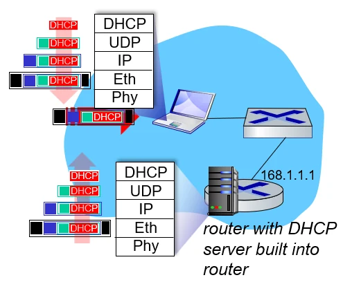
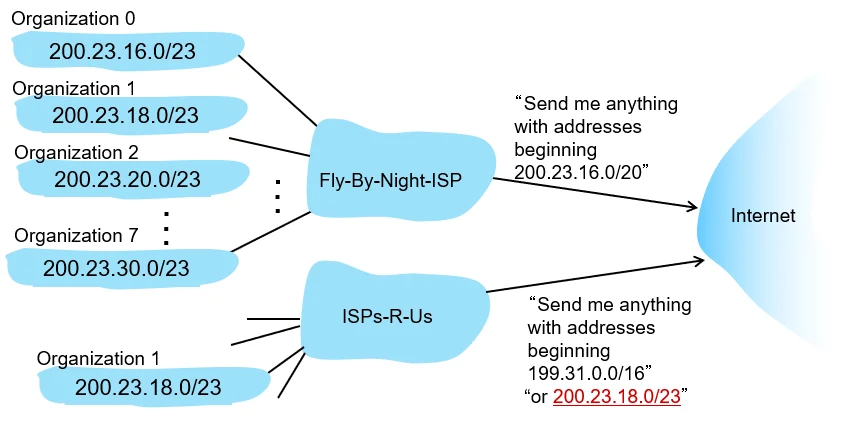
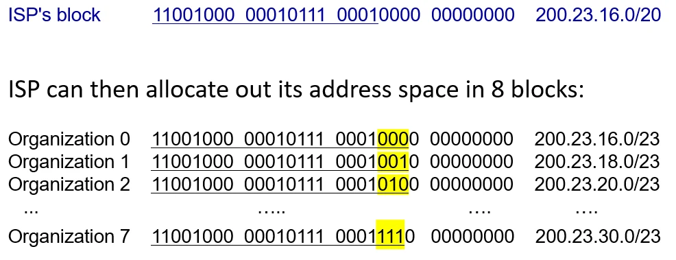

# [네트워크] DHCP와 NAT

## 원문

https://ch010104.tistory.com/271

## 노트 유형

`guide`

## 적용 목적과 전제조건

DHCP는 호스트가 네트워크에 접속할 때 자동으로 통신에 필요한 설정 정보를 할당받는 프로토콜입니다.

서브넷 마스크 (Subnet Mask): 네트워크 부분과 호스트 부분을 구분.

## 구현 절차·검증·주의점

### 1. DHCP (Dynamic Host Configuration Protocol)

DHCP는 호스트가 네트워크에 접속할 때 자동으로 통신에 필요한 설정 정보를 할당받는 프로토콜입니다.

### 1.1 할당되는 주요 정보

IP 주소: 호스트의 식별자.

서브넷 마스크 (Subnet Mask): 네트워크 부분과 호스트 부분을 구분.

기본 게이트웨이 (First-hop Router): 로컬 외부로 나가는 통로.

DNS 서버 주소: 도메인 네임을 IP로 변환하기 위한 주소.

### 1.2 동작 과정 (UDP/IP 기반)

Discovery (클라이언트 → 서버): 클라이언트가 브로드캐스트(FF:FF:FF:FF:FF:FF)를 통해 서버를 찾음.

Offer (서버 → 클라이언트): 서버가 사용 가능한 정보를 제안.

Request (클라이언트 → 서버): 제안된 정보를 사용하겠다고 요청.

ACK (서버 → 클라이언트): 최종 승인 및 설정 완료.

핵심 원리: 데이터는 각 계층에서 **캡슐화(Encapsulation)**되어 전송되고, 수신 측에서 역다중화(Demultiplexing) 과정을 거쳐 애플리케이션 계층에 도달합니다.

### 2. IP 주소 체계와 서브네팅 (Subnetting)

IP 주소는 유한한 자원이며, 이를 효율적으로 나누어 쓰는 것이 중요합니다.

### 2.1 CIDR (Classless Inter-Domain Routing)

클래스 기반 주소 할당의 비효율성을 극복하기 위해 /n (Prefix) 형태의 유연한 주소 할당 방식을 사용합니다.

### 2.2 서브네팅과 비트 계산 (2^n)

상위 블록에서 하위 블록으로 나눌 때, 나누려는 그룹의 수에 따라 추가 비트가 결정됩니다.

예시: 한 ISP가 8개의 조직에 주소를 나눠주려면 $2^3 = 8$이므로, 기존 프리픽스에 3비트를 더 사용합니다 (예: /20 → /23).

### 3. 계층적 라우팅과 경로 요약 (Route Aggregation)

전 세계 인터넷의 라우팅 테이블 크기를 줄이기 위한 전략입니다.

### 3.1 Route Aggregation (경로 통합)

여러 개의 세부 주소 대역을 하나의 큰 상위 주소 대역으로 묶어 인터넷에 광고합니다.

장점: 라우팅 테이블 최적화 및 네트워크 안정성 확보.

### 3.2 Longest Prefix Match (최장 프리픽스 일치)

특정 조직이 ISP를 옮겼을 때처럼 주소 대역이 겹치는 경우, 라우터는 가장 구체적으로(더 길게) 일치하는 경로를 우선 선택하여 데이터를 전달합니다.

### 4. NAT (Network Address Translation)

사설 IP 주소를 공인 IP 주소로 변환하여 주소 부족 문제를 해결하고 보안을 강화하는 기술입니다.

### 4.1 사설 IP 대역 (Private IP)

10.x.x.x, 172.16.x.x ~ 172.31.x.x, 192.168.x.x 등 로컬 네트워크 내에서만 사용되는 주소입니다.

### 4.2 NAT의 장점

주소 절약: 하나의 공인 IP로 수많은 기기가 통신 가능.

보안: 내부 기기의 실제 IP를 외부로부터 은닉.

유연성: 내부 네트워크 설정을 바꾸지 않고도 ISP 변경 가능.

### 4.3 NAT 동작 방식 (Translation Table)

Outgoing: (사설 IP, 포트) → (공인 IP, 신규 포트)로 변환 후 테이블 기록.

Incoming: 외부 응답의 포트 번호를 테이블에서 조회하여 다시 원래의 사설 주소로 복구.

핵심: 포트 번호를 식별자로 사용하여 여러 사설 IP를 하나의 공인 IP에 매핑합니다

## 핵심 이미지

## 관련 글

- [[blog/NETWORK/index|NETWORK]]
- [[blog/NETWORK/네트워크- 네트워크와 서브넷|[네트워크] 네트워크와 서브넷]]
- [[blog/NETWORK/네트워크- IPv4 vs IPv6|[네트워크] IPv4 vs IPv6]]
- [[blog/NETWORK/네트워크- 버퍼 관리, 스케줄링 및 정책|[네트워크] 버퍼 관리, 스케줄링 및 정책]]
