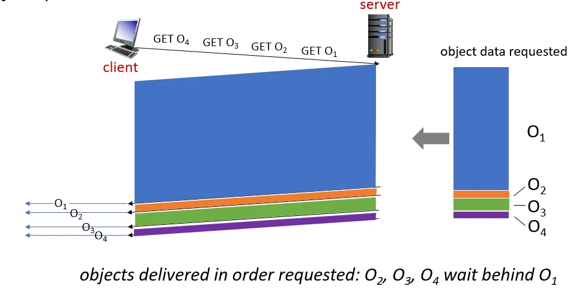
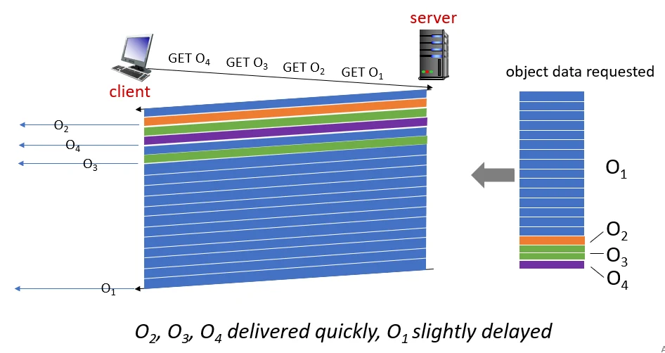
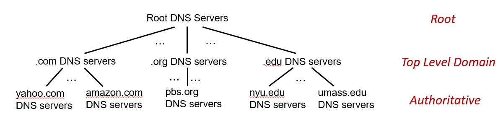

# [네트워크] HTTP와 DNS

## 원문

https://ch010104.tistory.com/247

## 노트 유형

`guide`

## 적용 목적과 전제조건

응답 시간 단축: 클라이언트와 물리적으로 가까운 곳에 데이터를 두어 객체 전송 속도를 높입니다.

대역폭 절약: 기관의 접속 링크(Access Link) 트래픽을 줄여 값비싼 회선 증설 비용을 아낄 수 있습니다.

## 구현 절차·검증·주의점

### 1. 웹 캐싱과 조건부 GET

### 웹 캐시 (Proxy Server)의 목적

응답 시간 단축: 클라이언트와 물리적으로 가까운 곳에 데이터를 두어 객체 전송 속도를 높입니다.

대역폭 절약: 기관의 접속 링크(Access Link) 트래픽을 줄여 값비싼 회선 증설 비용을 아낄 수 있습니다.

효율적 콘텐츠 전달: 콘텐츠 제공자가 트래픽 폭주 시에도 캐시를 통해 안정적으로 서비스를 제공할 수 있게 합니다.

### 조건부 GET (Conditional GET)

캐시에 저장된 데이터가 최신인지(Up-to-date) 확인하는 메커니즘입니다.

동작 순서:

캐시가 서버에 요청을 보낼 때 If-modified-since: <date> 헤더를 포함합니다.

서버의 판단:

수정되지 않은 경우: 서버는 본문(Data) 없이 HTTP/1.0 304 Not Modified라는 상태 코드만 보냅니다. 이는 대역폭 낭비를 막는 핵심입니다.

수정된 경우: 서버는 새로운 데이터를 담아 HTTP/1.0 200 OK 응답을 보냅니다.

### 2. HTTP 버전의 진화

### HTTP/1.1의 한계: HOL 블로킹

FCFS(First-Come-First-Served) 스케줄링: 서버는 요청받은 순서대로 응답해야 합니다. 만약 첫 번째 객체가 매우 크면 뒤에 있는 작은 객체들은 첫 번째 객체의 전송이 완료될 때까지 기다려야 하는 HOL(Head-of-Line) 블로킹 문제가 발생합니다.

### HTTP/2 (2015년 도입)

목적: 다중 객체 요청 시 지연 시간 최소화.

프레임 분할 및 인터리빙(Interleaving): 각 객체를 작은 '프레임' 단위로 쪼개어 여러 요청의 프레임을 섞어서 전송합니다. 이를 통해 큰 객체 전송 중에도 작은 객체가 틈틈이 전송되어 HOL 블로킹을 해결합니다.

서버 푸시(Server Push): 클라이언트가 요청하지 않아도 필요한 자원을 미리 밀어 넣어줍니다.

### HTTP/3

UDP 기반 QUIC 프로토콜: TCP 위에서 작동하는 HTTP/2는 패킷 하나만 손실되어도 전체 전송이 멈추는 한계가 있습니다. HTTP/3는 UDP 기반의 QUIC을 사용하여 각 객체별로 독립적인 오류 제어를 수행하며 보안(TLS)을 내장합니다.

### 3. DNS: Domain Name System

DNS는 사람이 읽기 쉬운 호스트 네임(예: www.amazon.com)을 컴퓨터가 이해하는 IP 주소로 변환하는 서비스입니다.

### 계층적 데이터베이스 구조

중앙 집중화의 위험(단일 장애점, 트래픽 폭주 등)을 피하기 위해 분산 구조를 가집니다.

Root DNS 서버: 전 세계 13개의 논리적 서버. TLD 서버의 위치 정보를 알려주는 최종 보루입니다.

TLD(Top-Level Domain) 서버: .com, .org, .net 및 국가 도메인(.kr, .jp)을 관리합니다.

Authoritative(책임) DNS 서버: 특정 조직(예: 학교, 기업)의 실제 IP 매핑 정보를 보유한 서버입니다.

Local DNS 서버: ISP가 운영하며, 호스트의 쿼리를 대신 처리하는 프록시 역할을 합니다.

### 이름 확인 방식 (Query types)

반복적 쿼리 (Iterated Query): 질의받은 서버가 "난 모르지만, 이 서버가 알 수도 있으니 여기로 물어봐"라고 다음 대상을 추천해 주는 방식입니다. (가장 일반적인 방식)

재귀적 쿼리 (Recursive Query): 질의받은 서버가 상위 서버에 직접 물어서 최종 결과까지 가져다주는 방식입니다. (상위 서버에 부하가 큼)

### DNS 레코드 유형 (Resource Records)

Type A: (hostname, IP address) 매핑.

Type NS: (domain, authoritative server's hostname) 해당 도메인의 책임 서버 이름.

Type CNAME: (alias name, canonical name) 별칭을 실제 이름으로 변환.

Type MX: 메일 서버의 이름을 제공.

### DNS 보안 이슈

DDoS 공격: Root 서버나 TLD 서버를 마비시키려는 시도 (캐싱 덕분에 완전 마비는 어려움).

DNS 포이즈닝(Poisoning): 가짜 IP 정보를 DNS 캐시에 주입하여 사용자를 낚시 사이트로 유도하는 공격.

해결책: 인증과 메시지 무결성을 제공하는 DNSSEC 프로토콜이 도입되었습니다.

### 4. DHCP: 동적 호스트 설정 프로토콜

네트워크에 새로 접속한 호스트에게 자동으로 설정을 제공합니다.

제공 정보:

할당받은 IP 주소

첫 번째 홉 라우터(Default Gateway)의 주소

DNS 서버의 이름 및 주소

서브넷 마스크 (Subnet Mask)

## 핵심 이미지

## 관련 글

- [[blog/NETWORK/index|NETWORK]]
- [[blog/NETWORK/네트워크- 전송 계층(Transport Layer)과 TCP-UDP|[네트워크] 전송 계층(Transport Layer)과 TCP/UDP]]
- [[blog/NETWORK/네트워크- 쿠키 (Cookies)와 Proxy Servers|[네트워크] 쿠키 (Cookies)와 Proxy Servers]]
- [[blog/NETWORK/네트워크- UDP 프로토콜과 RDT|[네트워크] UDP 프로토콜과 RDT]]
