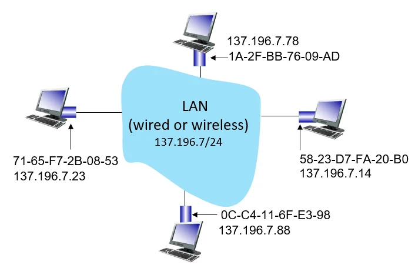
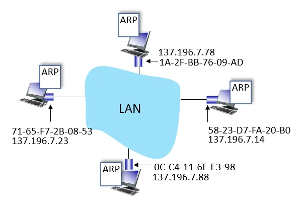
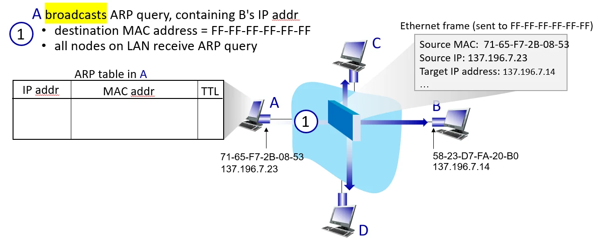

# [네트워크] MAC 주소와 ARP

## 원문

https://ch010104.tistory.com/283

## 노트 유형

`concept`

## 핵심 개념과 선택 맥락

네트워크 기기들은 통신을 위해 두 가지 대표적인 주소(논리 주소와 물리 주소)를 가집니다.

MAC 주소: 이동성이 있습니다. 노트북을 들고 학교, 집, 카페로 이동해도 내 랜카드의 MAC 주소는 변하지 않습니다.

## 원문 기반 개념 정리

### 1. 두 가지 네트워크 주소 체계 비교 (IP vs MAC)



네트워크 기기들은 통신을 위해 두 가지 대표적인 주소(논리 주소와 물리 주소)를 가집니다.

이동성(Portability)의 차이:

MAC 주소: 이동성이 있습니다. 노트북을 들고 학교, 집, 카페로 이동해도 내 랜카드의 MAC 주소는 변하지 않습니다.

IP 주소: 이동성이 없습니다. 접속하는 서브넷 대역에 따라 동적으로 새로운 IP를 할당받아야 통신이 가능합니다.

### 2. 프로토콜 계층과 데이터 포장 (캡슐화/역캡슐화)

데이터가 전송될 때는 프로토콜 스택 상단에서 하단으로 내려오며 포장지(헤더)가 붙고, 수신할 때는 반대로 올라가며 해체됩니다.

IP (Internet Protocol Layer / 3계층):

데이터 알맹이에 출발지 IP / 목적지 IP 라벨을 붙여 패킷(Packet)을 생성합니다. 이 알맹이는 목적지에 도착할 때까지 절대 변하지 않습니다.

Eth (Ethernet Layer / 2계층):

IP 패킷을 다시 한번 출발지 MAC / 목적지 MAC 봉투로 감싸 프레임(Frame)을 만듭니다. 이 봉투는 다음 목적지(인접 라우터 혹은 최종 기기)로 넘어갈 때마다 계속 교체됩니다.

Phy (Physical Layer / 1계층):

최종 완성된 프레임을 전기/광/무선 신호로 변환하여 물리적인 랜선이나 공기 중으로 쏘아 보냅니다.

💡 "IP 주소만으로는 전송할 수 없는가?" 랜카드(하드웨어)는 오직 2계층(Eth) 프레임 형태로 조립되어 목적지 MAC 주소가 찍혀 있어야만 물리 신호로 보낼 수 있습니다. 따라서 최종 목적지 IP를 알고 있더라도, 최종 전송을 위해서는 반드시 목적지 MAC 주소를 알아내야 합니다.

### 3. ARP (Address Resolution Protocol)의 역할과 동작



ARP는 "상대방의 IP 주소는 알지만, MAC 주소를 모를 때" 이를 해결해 주는 통역사 역할을 수행합니다.

### 3.1 ARP 테이블 (ARP Table)

각 기기(호스트, 라우터)는 매번 주소를 물어보는 비효율을 줄이기 위해 < IP 주소 ; MAC 주소 ; TTL > 정보를 메모리에 표 형태로 저장해 둡니다.

TTL (Time To Live): 매핑 정보의 유효 시간(통상 20분)입니다. 기기의 이동이나 IP 변경이 빈번하기 때문에, 유효 시간이 지나면 잘못된 전송을 막기 위해 테이블에서 자동 삭제됩니다.

### 3.2 ARP의 동작 과정



ARP Query (Request):

A가 B의 MAC 주소를 모를 때, LAN 상의 모든 기기에게 브로드캐스트(FF-FF-FF-FF-FF-FF)로 질문을 던집니다.

"IP 137.196.7.14 쓰시는 분? MAC 주소 알려주세요!"

2.패킷 필터링:

자신과 상관없는 IP를 받은 기기(C, D)는 패킷을 버립니다.

3. ARP Reply:

해당 IP를 가진 B만 요청을 수락하고, A의 IP-MAC 정보를 자신의 ARP 테이블에 저장한 뒤, A에게만 콕 집어 응답(Unicast)을 보냅니다.

"저 여기 있습니다! 제 MAC 주소는 58-23-D7-FA-20-B0입니다."

### 4. 다른 서브넷(외부 네트워크)으로의 라우팅 과정

우리가 인터넷을 통해 외부 서버와 통신할 때, 데이터는 릴레이 달리기(Hop-by-Hop) 방식으로 전달됩니다.

```text
[ 컴퓨터 A (서브넷 A) ] ───► [ 라우터 R ] ───► [ 컴퓨터 B (서브넷 B) ]
```

### 단계별 주소 변화 과정 분석

### 1단계: 컴퓨터 A에서 출발할 때

컴퓨터 A는 목적지 IP가 자신과 다른 서브넷에 있음을 인지하고, 데이터를 기본 게이트웨이(라우터 R)로 보내기로 결정합니다.

IP 헤더: 출발지 111.111.111.111 (A) ➡️ 목적지 222.222.222.222 (B)

이더넷 헤더 (MAC): 출발지 A의 MAC ➡️ 목적지 라우터 R의 왼쪽 팔 MAC (E6-E9-00-17-BB-4B)

### 2단계: 라우터 R에서의 중계 및 포장지 교체

라우터 R은 왼쪽 인터페이스로 들어온 프레임을 열어 목적지 IP(B)를 확인한 뒤, 오른쪽 인터페이스(서브넷 B 방향)로 내보내기로 결정합니다.

IP 헤더: 출발지 111.111.111.111 (A) ➡️ 목적지 222.222.222.222 (B) (변하지 않음)

이더넷 헤더 (MAC): 출발지 라우터 R의 오른쪽 팔 MAC (1A-23-F9-CD-06-9B) ➡️ 목적지 B의 MAC (49-BD-D2-C7-56-2A)

참고: 이때 라우터 R은 서브넷 B에서 ARP를 활용하여 B의 MAC 주소를 조회하거나 획득합니다.

### 3단계: 컴퓨터 B에서의 수신 및 해체

컴퓨터 B는 들어온 프레임의 목적지 MAC 주소가 자신인 것을 확인하고 이더넷(Eth) 헤더를 폐기합니다.

남은 IP 데이터그램을 상위 계층으로 올리며 목적지 IP가 자신(222.222.222.222)임을 최종 확인하고 데이터 수신을 완료합니다.

### 5. 핵심 질문 및 예외 상황 정리

MAC 주소와 IP 주소는 항상 1:1 대응인가요?

기본 원칙: 일반적인 단일 인터페이스 PC 환경에서는 특정 시점에 $1:1$로 대응되며, IP가 겹치면 IP 충돌이 발생합니다.

예외 상황 (1:多): 하나의 웹 서버 랜카드(MAC)에 여러 개의 웹사이트 운영을 위해 다중 IP 주소를 바인딩(IP Aliasing)할 수 있습니다.

예외 상황 (多:1): 이중화 구성(로드 밸런싱/HA) 환경에서는 외부로 드러난 가상 IP 하나를 백엔드의 여러 대 장비(여러 MAC)가 나누어 처리하기도 합니다.

## 관련 글

- [[blog/NETWORK/index|NETWORK]]
- [[blog/NETWORK/네트워크- 링크 계층(CRC)과 다중 접속 프로토콜|[네트워크] 링크 계층(CRC)과 다중 접속 프로토콜]]
- [[blog/NETWORK/네트워크- BGP와 SDN|[네트워크] BGP와 SDN]]
- [[blog/NETWORK/네트워크- BGP와 인터넷 AS 라우팅|[네트워크] BGP와 인터넷 AS 라우팅]]
