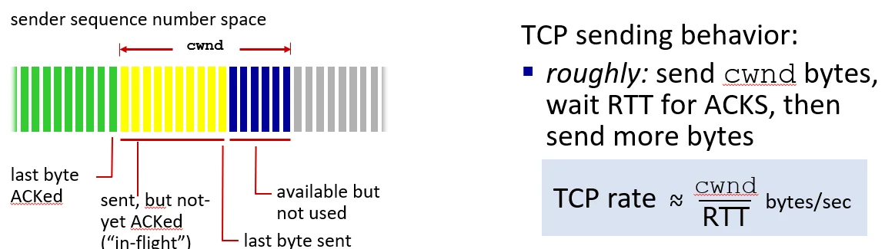
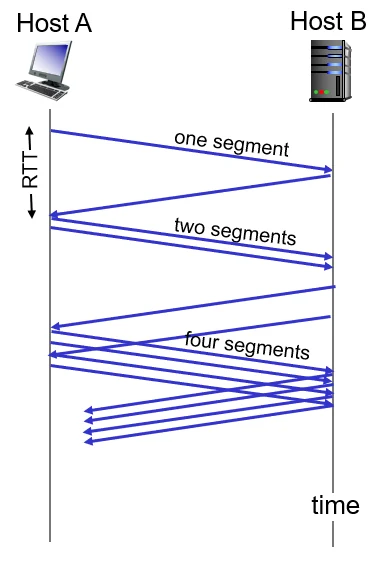
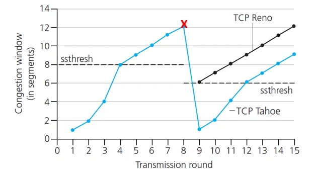

# [네트워크] TCP 혼잡 제어 및 전송

## 원문

https://ch010104.tistory.com/264

## 노트 유형

`guide`

## 적용 목적과 전제조건

MSS (Maximum Segment Size): TCP 패킷 하나가 실어 나를 수 있는 순수 데이터의 최대 크기. (보통 이더넷 기준 1460바이트)

cwnd (Congestion Window): 송신자가 네트워크 혼잡을 고려하여 한 번에 전송할 수 있는 데이터의 양. "네트워크가 허용하는 전송 제약 조건"입니다.

## 구현 절차·검증·주의점

### 1. TCP 혼잡 제어의 기초 (The Basics)

### 핵심 변수 정의

MSS (Maximum Segment Size): TCP 패킷 하나가 실어 나를 수 있는 순수 데이터의 최대 크기. (보통 이더넷 기준 1460바이트)

cwnd (Congestion Window): 송신자가 네트워크 혼잡을 고려하여 한 번에 전송할 수 있는 데이터의 양. "네트워크가 허용하는 전송 제약 조건"입니다.

rwnd (Receive Window): 수신자의 버퍼 여유 공간. 송신자는 최종적으로 min(cwnd, rwnd) 만큼의 데이터를 보냅니다.

ssthresh (Slow Start Threshold): 지수적 증가(Slow Start)에서 선형적 증가(Congestion Avoidance)로 전환되는 임계값.

### 전송 속도 공식

TCP는 매 왕복 시간(RTT)마다 cwnd만큼의 데이터를 네트워크 파이프에 채우려 노력합니다.

### 2. 혼잡 제어의 단계별 동작

### ① Slow Start (슬로우 스타트)

동작: cwnd = 1 MSS에서 시작하여 매 RTT마다 cwnd를 2배씩 증가시킵니다 (지수적 증가).

목적: 네트워크가 감당 가능한 대역폭을 빠르게 찾아내기 위함입니다.

### ② Congestion Avoidance (혼잡 회피 - AIMD)

조건: cwnd >= ssthresh 일 때 진입.

동작: 매 $RTT$마다 $cwnd$를 1 MSS씩 증가시킵니다 (선형적 증가 - Additive Increase).

목적: 대역폭 한계치 근처에서 조심스럽게 가용 자원을 탐색합니다.

### ③ Loss Event & Recovery (손실 발생과 복구)

Timeout (타임아웃): 심각한 혼잡으로 판단. cwnd를 1로 초기화하고 ssthresh를 현재 cwnd의 절반으로 설정합니다. (TCP Tahoe 방식)

3 Triple Duplicate ACKs: 일부 패킷만 유실된 일시적 혼잡으로 판단. cwnd를 절반으로 줄이고 바로 선형 증가를 시작합니다. (TCP Reno 방식 - Fast Recovery)

Fast Recovery (+3 MSS): 3개의 중복 ACK를 받았다는 것은 3개의 패킷이 이미 네트워크 파이프를 빠져나갔다는 뜻이므로, 그 빈 공간만큼 즉시 전송 허용량을 늘려주는 영리한 기법입니다.

### 3. 현대적 알고리즘과 대안

### TCP CUBIC (리눅스 기본값)

특징: 직선(AIMD)이 아닌 3차 함수(Cubic Function) 곡선을 따라 cwnd를 늘립니다.

동작: W_max(지난 로스 지점) 근처에서는 완만하게 접근하고, 멀 때는 가파르게 상승합니다.

장점: 대역폭 활용도가 훨씬 높으며, RTT가 긴 네트워크에서도 안정적인 성능을 냅니다.

### 지연 기반 제어 (Delay-based - TCP Vegas)

신호: 패킷 유실(Loss)이 아니라 RTT 지연 시간의 변화를 보고 혼잡을 예측합니다.

철학: "라우터 버퍼에 줄(Queue)이 길어지기 시작하면 미리 속도를 줄이자." (예방적 차원)

### ECN (Explicit Congestion Notification)

신호: 라우터가 직접 IP 헤더에 '혼잡 표시(Marking)'를 해서 송신자에게 알려줍니다.

장점: 패킷을 버리지 않고도 송신자에게 속도를 줄이라고 지시할 수 있어 매우 효율적입니다.

### 4. 네트워크 기초 및 공정성 (Fairness)

### 패킷 교환(Packet) vs 회선 교환(Circuit)

회선 교환: 물리적 전용선을 독점 (예: 구식 전화망). 자원 낭비가 심함.

패킷 교환: 데이터를 쪼개서 공유 도로(링크)를 사용 (예: 인터넷). 효율적이지만 혼잡 제어가 필수.

### TCP Fairness (공정성)

두 TCP 연결이 같은 병목 구간을 공유하면, AIMD의 수학적 특성상 결국 대역폭을 R/2씩 공평하게 나누어 갖는 지점으로 수렴하게 됩니다.

단, RTT가 짧은 쪽이 더 공격적으로 대역폭을 점유하는 경향이 있어 완벽히 공정하지는 않습니다.

### 5. 전송 계층의 진화: QUIC & HTTP/3

### 기존 TCP의 한계

HOLB (Head-of-Line Blocking): 패킷 하나가 막히면 뒤의 모든 데이터가 멈춤.

연결 지연: TCP 핸드셰이크와 TLS(보안) 핸드셰이크를 따로 해서 시간이 오래 걸림.

커널 의존성: TCP 로직이 OS 커널에 있어 업데이트가 매우 느림.

### QUIC의 혁신 (UDP 기반)

애플리케이션 계층 구현: UDP 위에서 동작하며, 모든 혼잡 제어 및 보안 로직을 앱 단에서 관리하여 업데이트가 빠릅니다.

0-RTT 연결: 보안 인증과 연결 설정을 한 번에 처리하여 즉시 데이터를 보냅니다.

스트림 멀티플렉싱: 데이터를 여러 스트림으로 쪼개어 패킷 하나가 사라져도 다른 데이터는 전송되는 구조로 HOLB를 해결했습니다.

Connection ID: IP 주소가 바뀌어도(Wi-Fi ↔ LTE) 연결이 끊기지 않는 이동성을 제공합니다.

## 핵심 이미지

## 관련 글

- [[blog/NETWORK/index|NETWORK]]
- [[blog/NETWORK/네트워크- RDT (Reliable Data Transfer) 프로토콜|[네트워크] RDT (Reliable Data Transfer) 프로토콜]]
- [[blog/NETWORK/네트워크- BGP와 인터넷 AS 라우팅|[네트워크] BGP와 인터넷 AS 라우팅]]
- [[blog/NETWORK/네트워크- BGP와 SDN|[네트워크] BGP와 SDN]]
