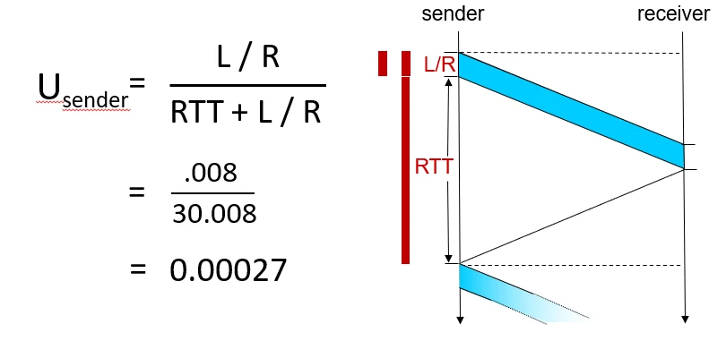
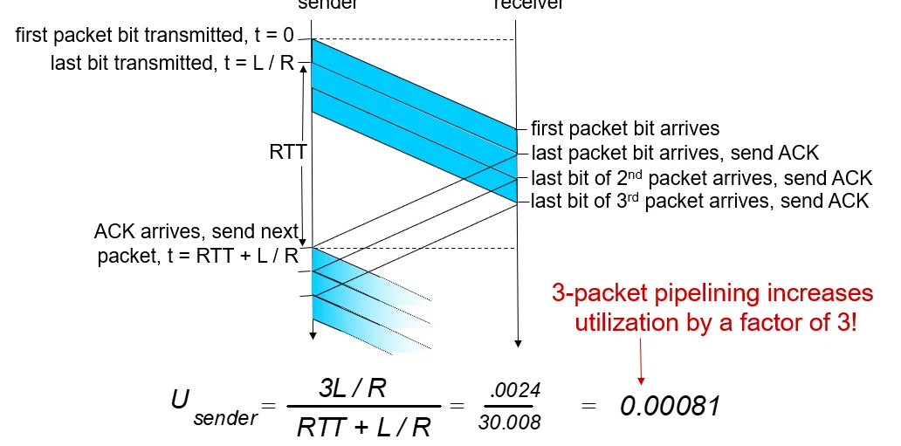
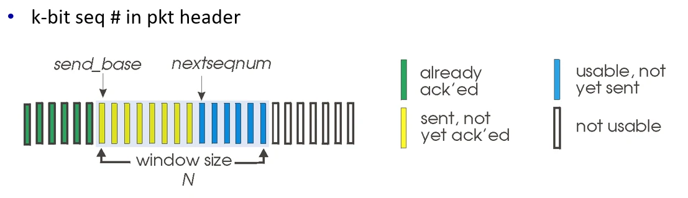

# [네트워크] rdt 3.0 과 TCP

## 원문

https://ch010104.tistory.com/260

## 노트 유형

`concept`

## 핵심 개념과 선택 맥락

신뢰성 있는 데이터 전송을 보장하는 rdt 3.0은 전송 후 대기(Stop-and-Wait) 방식을 사용합니다.

이용률 (U_{sender}): 송신자가 전체 시간 중 실제로 데이터를 전송하는 시간의 비율.

## 원문 기반 개념 정리

### 1. rdt 3.0 (Stop-and-Wait)의 성능과 한계

신뢰성 있는 데이터 전송을 보장하는 rdt 3.0은 전송 후 대기(Stop-and-Wait) 방식을 사용합니다.

### 주요 개념

이용률 (U_{sender}): 송신자가 전체 시간 중 실제로 데이터를 전송하는 시간의 비율.

전송 지연 (D_{trans}): 패킷을 네트워크 회선에 밀어 넣는 데 걸리는 시간 (L/R).

왕복 지연 시간 (RTT): 패킷이 송신자에서 수신자로 갔다가 ACK가 돌아올 때까지 걸리는 시간.

### 계산 예시 (1 Gbps 링크, 15ms 편도 지연, 8000비트 패킷)

전송 지연 계산: D_trans = {8,000}{10^9} = 8\mu s = 0.008ms

이용률 계산:.

RTT = 15ms * 2 = 30ms.

U_sender = 0.00027 (약 0.027%).

결론: 송신자는 99.97%의 시간을 기다리는 데 사용함. 매우 비효율적임.

### 2. 파이프라이닝 (Pipelining): 효율성 극대화

Stop-and-Wait의 낮은 이용률을 해결하기 위해 등장한 개념입니다.

### 특징

ACK를 기다리지 않고 여러 개의 패킷을 연속해서 전송합니다.

"In-flight"(가는 중인) 패킷이 여러 개 존재하도록 허용합니다.

이용률이 대략 윈도우 크기(N) 배만큼 증가합니다.

### 3. Go-Back-N (GBN)

파이프라이닝을 구현하는 첫 번째 방식입니다. "누적 확인"이 핵심입니다.

### 송신자 (Sender)

윈도우 크기 (N): 한 번에 보낼 수 있는 최대 패킷 수.

누적 확인 응답 (Cumulative ACK): ACK(n)은 "n번까지의 모든 패킷을 잘 받았다"는 뜻입니다.

타이머: 가장 오래된 'unACKed' 패킷 하나에 대해서만 타이머를 돌립니다.

타임아웃 발생 시: 타임아웃된 패킷부터 윈도우 내의 모든 패킷을 다시 전송합니다. (Go-Back-N!)

### 수신자 (Receiver)

순서대로만 수락: 다음에 올 번호가 아니면 버립니다 (Discard).

버퍼 없음: 순서가 틀린 패킷을 보관하지 않습니다.

중복 ACK: 마지막으로 성공한 번호에 대한 ACK를 반복해서 보냅니다.

### 4. Selective Repeat (SR)

GBN의 중복 전송 문제를 해결한 방식입니다. "개별 확인"이 핵심입니다.

### 특징

개별 ACK: 수신자가 받은 패킷마다 각각 ACK를 보냅니다.

수신자 버퍼: 순서가 어긋나도 윈도우 내라면 버리지 않고 버퍼에 저장합니다.

개별 재전송: 송신자는 타임아웃이 발생한 특정 패킷만 다시 전송합니다.

개별 타이머: 보낸 패킷마다 타이머를 각각 가집니다.

### 5. SR의 딜레마와 윈도우 크기 (시험 단골!)

순서 번호(Seq #)의 범위가 윈도우 크기에 비해 너무 작으면 수신자가 '새 패킷'과 '재전송된 옛날 패킷'을 구분하지 못합니다.

### 딜레마 예시 (N=3, Seq # 0, 1, 2, 3 사용 시)

송신자가 0, 1, 2 전송 -> 수신자 잘 받고 ACK 0, 1, 2 전송 -> 수신자 윈도우는 [3, 0, 1]로 이동.

모든 ACK 유실 -> 송신자는 옛날 0번 재전송.

수신자는 자신의 윈도우에 있는 새로운 0번인 줄 알고 받아버림-> 데이터 중복 오류 발생.

### 해결 공식 (최대 윈도우 크기)

수신자가 혼란을 겪지 않으려면 다음 조건을 만족해야 합니다.

### 6. TCP (Transmission Control Protocol) 개요

실제 인터넷에서 쓰이는 신뢰성 전송 프로토콜입니다.

### 주요 특징

Point-to-Point: 1:1 통신.

Reliable, in-order byte stream: 데이터 단위를 바이트로 취급.

Full duplex: 양방향 동시 전송 가능.

Connection-oriented: Handshaking 과정 필수.

Flow / Congestion Control: 상황에 따른 윈도우 조절.

### 7. TCP 세그먼트 구조 및 동작

### 핵심 필드

Sequence Number: 세그먼트 데이터의 첫 번째 바이트 번호.

Acknowledgement Number: 상대방에게 다음에 받고 싶은 바이트 번호.

Flags: SYN, FIN (연결 관리), ACK (응답 여부) 등.

Receive Window: 수신측 여유 버퍼 공간 (흐름 제어용).

### 텔넷 시나리오 예시 (대각선 규칙)

A가 Seq=42, ACK=79, data='C'(1byte) 전송.

B가 받으면 Seq=79, ACK=43(42+1), data='C' 전송 (Piggybacking).

A가 받으면 Seq=43, ACK=80(79+1) 전송.

### 8. TCP 타임아웃과 RTT 예측

타임아웃은 너무 짧아도(불필요한 재전송), 너무 길어도(느린 대응) 안 됩니다.

### RTT 예측 (EWMA 방식)

SampleRTT: 실제 측정값.

EstimatedRTT: 부드럽게 가공된 예측값

(보통 a = 0.125)

### 9. TCP 송신자 동작 (요약)

TCP는 GBN과 SR의 장점을 섞은 하이브리드 형태입니다.

데이터 수신: Seq #를 매기고, 타이머가 안 돌고 있다면 가장 오래된 것 하나에 대해 타이머 시작.

타임아웃: 타임아웃된 해당 세그먼트만 재전송 후 타이머 재시작.

ACK 수신: unACKed 세그먼트가 남았다면 타이머 다시 시작, 다 받았다면 종료.

## 관련 글

- [[blog/NETWORK/index|NETWORK]]
- [[blog/NETWORK/네트워크- TCP 연결과 3-Way Handshake|[네트워크] TCP 연결과 3-Way Handshake]]
- [[blog/NETWORK/네트워크- RDT (Reliable Data Transfer) 프로토콜|[네트워크] RDT (Reliable Data Transfer) 프로토콜]]
- [[blog/NETWORK/네트워크- TCP 혼잡 제어 및 전송|[네트워크] TCP 혼잡 제어 및 전송]]
