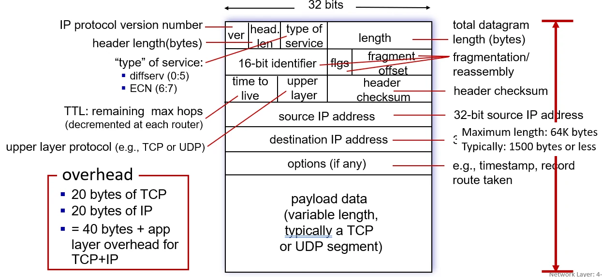
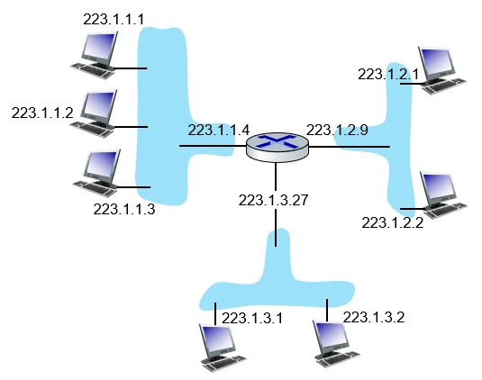
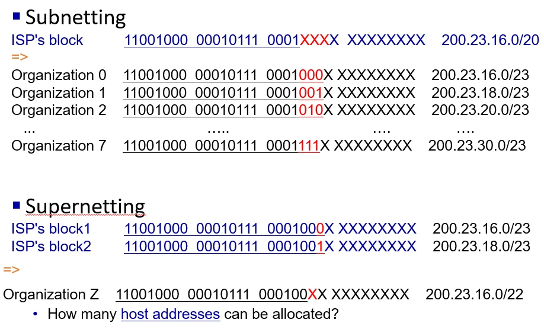

# [네트워크] 네트워크와 서브넷

## 원문

https://ch010104.tistory.com/270

## 노트 유형

`guide`

## 적용 목적과 전제조건

네트워크 계층은 단순히 패킷을 전달하는 것을 넘어, 복잡한 인터넷망에서 데이터의 흐름을 제어합니다.

포워딩(Forwarding): 패킷이 라우터의 입력 링크에 도착했을 때, 적절한 출력 링크로 이동시키는 라우터 내부의 국지적인 작업입니다. (데이터 평면)

## 구현 절차·검증·주의점

### 1. 네트워크 계층의 핵심 메커니즘

네트워크 계층은 단순히 패킷을 전달하는 것을 넘어, 복잡한 인터넷망에서 데이터의 흐름을 제어합니다.

포워딩(Forwarding): 패킷이 라우터의 입력 링크에 도착했을 때, 적절한 출력 링크로 이동시키는 라우터 내부의 국지적인 작업입니다. (데이터 평면)

라우팅(Routing): 패킷이 출발지에서 목적지까지 갈 전체 경로를 결정하는 네트워크 전체의 프로세스입니다. (제어 평면)

ICMP (Internet Control Message Protocol): 패킷 전송 중 발생하는 오류를 보고하거나 네트워크 상태를 진단합니다.

Type 0/8: Echo Reply/Request (Ping)

Type 3: Destination Unreachable (목적지 도달 불가)

Type 11: Time Exceeded (TTL 만료)

### 2. IPv4 데이터그램 상세 분석

헤더는 가변적인 Options 필드를 제외하고 기본적으로 20바이트입니다.

### 2.1 주요 필드와 역할

Total Length: 헤더와 데이터를 합친 전체 길이 (최대 65,535바이트).

TTL (Time To Live): 라우터를 거칠 때마다 1씩 감소하며, 0이 되면 패킷이 폐기됩니다. (무한 루프 방지)

Protocol: 페이로드에 담긴 상위 프로토콜 (TCP=6, UDP=17, ICMP=1).

### 2.2 IP 단편화 (Fragmentation)

큰 데이터그램이 MTU(Maximum Transmission Unit)가 작은 링크를 통과할 때 쪼개지는 과정입니다.

ID (Identification): 쪼개진 조각들이 원래 하나의 패킷이었음을 식별하는 번호.

Flags: 3비트 중 'More Fragments' 비트가 1이면 뒤에 조각이 더 있음을 의미.

Fragment Offset: 조각난 데이터가 원본 데이터그램의 어느 위치에 해당하는지 8바이트 단위로 표시.

### 3. IP 주소 체계와 CIDR (심화)

### 3.1 서브넷 마스크 (Subnet Mask)

IP 주소와 AND 연산을 수행하여 네트워크 주소를 추출합니다.

/24 → 255.255.255.0

/23 → 255.255.254.0 (세 번째 옥텟의 마지막 비트가 0)

### 3.2 서브네팅 vs 슈퍼네팅

Subnetting: 호스트 비트를 빌려와서 네트워크 수를 늘리는 기법. (부서별 네트워크 분리 시 유용)

Supernetting (Route Aggregation): 연속된 여러 네트워크 주소를 하나의 상위 주소로 묶어 라우팅 테이블의 크기를 줄이는 기법.

### 4. IP 주소 계산 실전 가이드

### 4.1 /23 서브넷 계산 예시 (200.23.16.0/23)

네트워크 비트: 23비트 고정.

호스트 비트: 32 - 23 = 9비트.

전체 IP 개수: 2^9 = 512개.

가용 호스트 수: 512 - 2 = 510$개.

주소 범위:

네트워크 주소: 200.23.16.0

첫 번째 호스트: 200.23.16.1

마지막 호스트: 200.23.17.254

브로드캐스트: 200.23.17.255

### 5. DHCP (Dynamic Host Configuration Protocol) 상세

"Plug-and-Play"를 실현하는 프로토콜로, 전송 계층의 UDP(포트 67: 서버, 68: 클라이언트)를 사용합니다.

### 5.1 DORA 과정의 상세 데이터

Discover (클라 → 서버): 출발지 0.0.0.0, 목적지 255.255.255.255 (브로드캐스트).

Offer (서버 → 클라): 서버가 할당 가능한 IP, 서브넷 마스크, 임대 기간(Lease Time)을 제안.

Request (클라 → 서버): 제안받은 주소를 사용하겠다고 알림. (여러 DHCP 서버가 있을 수 있어 선택 사실을 방송함)

ACK (서버 → 클라): 최종 승인 및 나머지 설정 정보(기본 게이트웨이, DNS 서버 주소 등) 전달.

### 6. 특수 주소 및 사설 IP

인터넷상에서 직접 라우팅되지 않는 사설 대역을 정확히 외워두면 실무에 유용합니다.

A 클래스 사설: 10.0.0.0 ~ 10.255.255.255

B 클래스 사설: 172.16.0.0 ~ 172.31.255.255

C 클래스 사설: 192.168.0.0 ~ 192.168.255.255

루프백(Loopback): 127.0.0.1 (localhost). 실제 패킷이 네트워크 카드를 거치지 않고 내부에서 회귀함.

## 관련 글

- [[blog/NETWORK/index|NETWORK]]
- [[blog/NETWORK/네트워크- DHCP와 NAT|[네트워크] DHCP와 NAT]]
- [[blog/NETWORK/네트워크- 버퍼 관리, 스케줄링 및 정책|[네트워크] 버퍼 관리, 스케줄링 및 정책]]
- [[blog/NETWORK/네트워크- IPv4 vs IPv6|[네트워크] IPv4 vs IPv6]]
