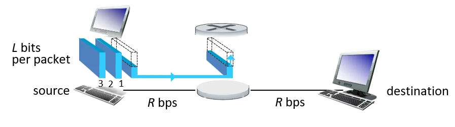
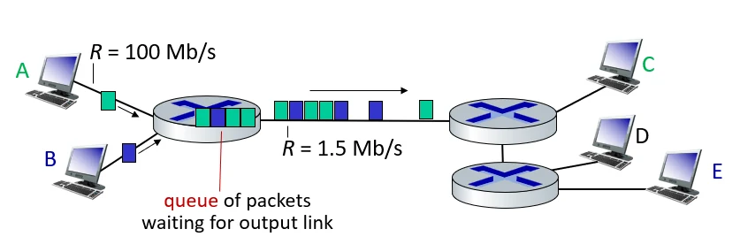
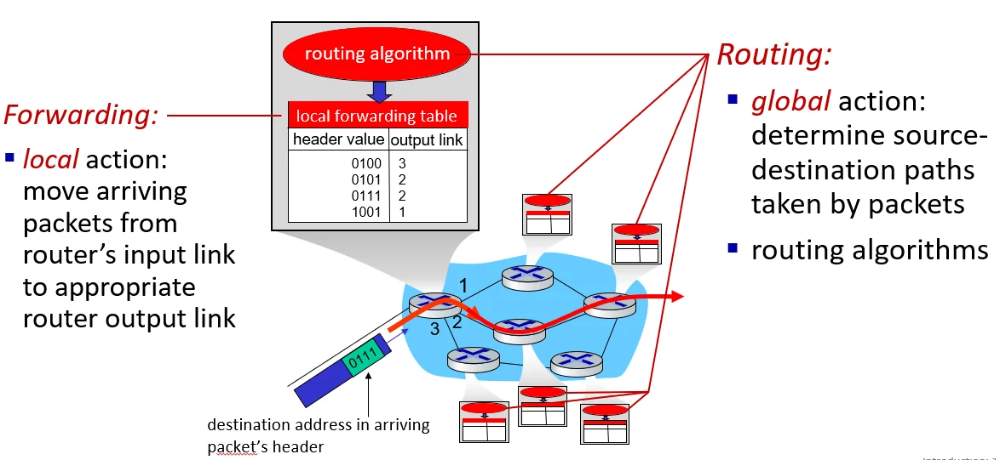

# [네트워크] 패킷 스위칭과 서킷 스위칭

## 원문

https://ch010104.tistory.com/218

## 노트 유형

`concept`

## 핵심 개념과 선택 맥락

패킷 분할 및 전송: 호스트는 긴 메시지를 '패킷'이라는 작은 단위(L bits)로 나누어 전송하며, 각 패킷은 링크의 전송률(R)을 최대치로 사용하여 이동합니다.

저장 후 전송 (Store-and-Forward): 라우터는 패킷의 모든 비트가 도착해야만 다음 링크로 전달을 시작할 수 있습니다.

## 원문 기반 개념 정리

### 1. 네트워크 코어의 기본 전달 방식: 패킷 스위칭

패킷 분할 및 전송: 호스트는 긴 메시지를 '패킷'이라는 작은 단위(L bits)로 나누어 전송하며, 각 패킷은 링크의 전송률(R)을 최대치로 사용하여 이동합니다.

저장 후 전송 (Store-and-Forward): 라우터는 패킷의 모든 비트가 도착해야만 다음 링크로 전달을 시작할 수 있습니다.

전송 지연 (Transmission Delay): 패킷을 링크로 밀어내는 데 L/R 초가 걸립니다. 이 지연 때문에 라우터는 패킷 전체가 모일 때까지 기다리게 됩니다.

전파 지연 (Propagation Delay): 비트가 실제 물리적인 링크(구리선, 광케이블 등)를 타고 다음 라우터까지 날아가는 시간(d/s)입니다. 전송 지연(L/R)과는 완전히 다른 개념입니다.

### 2. 라우터 내부의 혼잡과 성능 저하

큐잉 지연 (Queueing Delay): 패킷이 들어오는 속도가 나가는 링크의 전송률보다 빠르면, 패킷은 라우터 버퍼에서 차례를 기다리며 대기합니다.

패킷 손실 (Loss): 버퍼(큐)의 용량은 유한합니다. 대기 중인 패킷이 너무 많아 버퍼가 가득 차면, 새로 도착하는 패킷은 그대로 버려지게(Drop) 됩니다.

### 3. 라우터의 핵심 기능 (데이터 전달의 두 단계)

포워딩 (Forwarding): 패킷이 들어왔을 때, 헤더를 보고 로컬 포워딩 테이블을 참조하여 적절한 출력 링크로 "넘겨주는" 국지적인 동작입니다.

라우팅 (Routing): 출발지에서 목적지까지 패킷이 지나갈 "최적의 경로"를 라우팅 알고리즘을 통해 전체적으로 결정하는 과정입니다.

### 4. 대안적 방식: 서킷 스위칭 (Circuit Switching)

자원 독점: 데이터를 보내기 전, 출발지와 목적지 사이에 전용 통로를 미리 예약(Call Setup)합니다.

특징: 자원을 공유하지 않으므로 전송 품질이 완벽히 보장(Circuit-like behavior)되지만, 아무도 데이터를 보내지 않을 때도 자원이 묶여 있어 효율성이 떨어집니다.

구현: 주파수를 나누는 FDM 방식이나 시간을 나누어 쓰는 TDM 방식을 사용합니다.

FDM: 주파수 분할 다중화

모든 사용자가 항상 사용할 수 있지만, 사용자를 주파수로 분리(혼선 방지)

할당된 band 범위 내에서 최대치를 사용해서 각 사용자가 각 주파수에서 통신을 하는 것

TDM: 시간 분할 다중화

시간을 슬롯별로 쪼개고, 각 시간(call)에 사용자를 할당해주는것

Call의 시간에는 전체 주파수를 모두 사용해서 데이터를 보낼 수 있음

파란색의 call에는 파란 놈만이 전체 주파수를 사용해서 데이터를 전송

### 5. 패킷 스위칭이 더 많은 사용자가 네트워크를 사용할 수 있게 한다?

패킷 스위칭의 효율성: 모든 사용자가 동시에 100% 데이터를 쓰지 않는다는 점을 활용합니다.

예: 1Gbps 링크에서 100Mbps 사용자가 시간의 10%만 사용할 때, 서킷 방식은 10명만 수용하지만 패킷 방식은 훨씬 많은 사용자(예: 35명 이상)를 수용해도 실제 문제가 생길 확률이 매우 낮습니다.

패킷 스위칭에서 35명 중 11명 이상이 동시에 활성화될 확률을 계산하면 다음과 같음(약 0.0004로 거의 겹칠일 없다)

단, 동일 조건일 때 36명의 사용자가 된다면 이 확률은 급격하게 올라감

결론: 서킷 스위칭은 동일 조건에서 최대 10명이 사용할 수 있는 반면에 패킷 스위칭은 최대 35명까지 사용 가능하다.

## 핵심 이미지

## 관련 글

- [[blog/NETWORK/index|NETWORK]]
- [[blog/NETWORK/컴퓨터네트워크- 인터넷이란|[컴퓨터네트워크] 인터넷이란?]]
- [[blog/NETWORK/네트워크- 패킷 스위칭과 서킷 스위칭 2 + 프로토콜 계층 구조|[네트워크] 패킷 스위칭과 서킷 스위칭 2 + 프로토콜 계층 구조]]
- [[blog/NETWORK/네트워크- 네트워크 애플리케이션의 원리 및 서비스|[네트워크] 네트워크 애플리케이션의 원리 및 서비스]]
