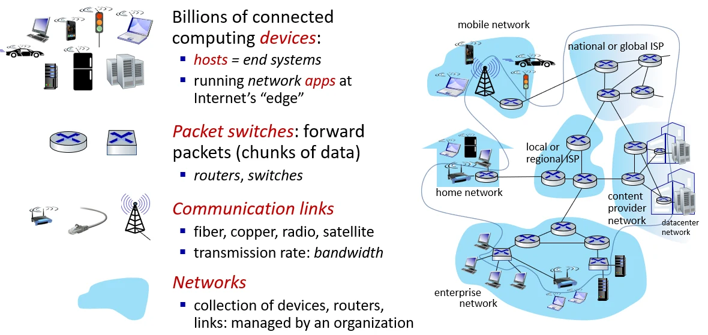
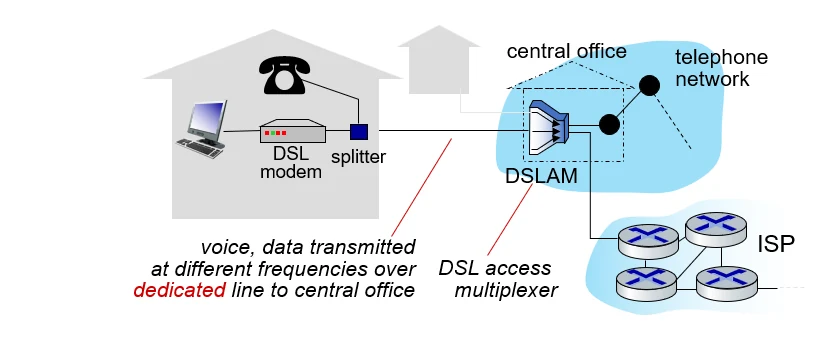
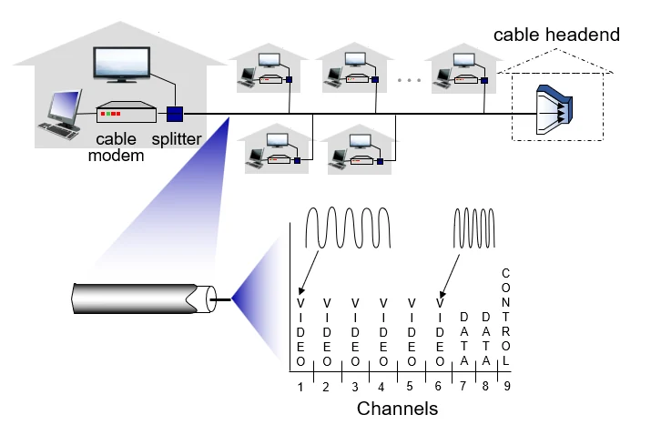

# [컴퓨터네트워크] 인터넷이란?

## 원문

https://ch010104.tistory.com/214

## 노트 유형

`concept`

## 핵심 개념과 선택 맥락

인터넷은 단순한 통신망을 넘어 구조적, 서비스적 측면에서 정의됩니다.

호스트(Host) 및 엔드 시스템(End Systems): - 네트워크 가장자리에서 실행되는 모든 장치(컴퓨팅 기기)를 의미합니다. (ex. 스마트폰)

## 원문 기반 개념 정리

### 1. 인터넷의 정의: 두 가지 관점

인터넷은 단순한 통신망을 넘어 구조적, 서비스적 측면에서 정의됩니다.

구성 요소 관점 (Nuts and Bolts View)

호스트(Host) 및 엔드 시스템(End Systems): - 네트워크 가장자리에서 실행되는 모든 장치(컴퓨팅 기기)를 의미합니다. (ex. 스마트폰)

패킷 스위치: - 데이터를 목적지까지 전달하는 역할을 하며, 대표적으로 라우터(Router)와 스위치(Switch)가 있습니다.

통신 링크: - 광섬유, 구리선, 무선 라디오, 위성 등 다양한 매체를 통해 데이터를 전송하며, 전송 속도는 대역폭(Bandwidth, bps)으로 측정됩니다. (대역폭이 넓을수록, 더 많은 데이터를 전송할 수 있음 -> 전송률이 높음) - 무선 : 같은 공간 속에서 통신할때는 주파수를 구분하는 방법이 필요함(같은 공간에서 여러 개의 주파수를 사용하면 혼합되어서 전달이 잘 안됨 - 유선 : 유선의 경우에는 선별로 주파수를 구분해서 사용함 - 유선이 무선보다 일반적으로 데이터 전송이 더 빠름

네트워크들의 네트워크: - 여러 ISP(Internet Service Provider)가 서로 유기적으로 연결된 거대한 집합체입니다.

서비스 관점 (Service View)

애플리케이션 인프라: 웹, 이메일, 게임, 스트리밍 등 다양한 분산 애플리케이션에 서비스를 제공합니다.

API (Application Programming Interface): 송신 프로그램이 수신 프로그램에 데이터를 전달할 수 있도록 규격화된 "통로(Hooks)"를 제공합니다. 이는 우편 서비스에서 편지를 보내는 방식과 유사한 규약을 가집니다.

### 2. 프로토콜 (Protocol)

네트워크에서 가장 중요한 개념으로, 통신을 수행하는 개체 간의 '약속'입니다.

정의: 둘 이상의 통신 개체 간에 주고받는 메시지의 형식(Format), 순서(Order), 그리고 메시지 전송/수신 시 취해야 할 행동을 정의합니다.

인터넷의 모든 통신은 프로토콜(HTTP, TCP, IP 등)을 통해 제어됩니다.

### 3. 네트워크 에지 (Network Edge)

구성: 호스트(클라이언트 및 서버)가 위치하는 영역입니다. 최근에는 데이터 센터 내에 서버가 집중되는 경향이 있습니다.

접속 네트워크 (Access Networks): 엔드 시스템을 '엣지 라우터(첫 번째 라우터)'에 연결하는 물리적 링크입니다.

네트워크 입장에서는 서버와 클라이언트가 모두 호스트로 봄

때문에, 서버나 클라이언트가 네트워크한테 정보를 전송하는 것이 업로드, 네트워크가 서버나 클라이언트한테 정보를 전송하는 것이 다운로드임

### 4. 접속 네트워크의 종류와 특징 (상세)

작성하신 메모를 바탕으로 각 매체의 특징을 정리했습니다.

가정용 접속 (Cable vs DSL)

DSL (Digital Subscriber Line): - 기존 전화선을 그대로 사용하며, 중앙국(CO)의 DSLAM과 통신합니다. 데이터는 전용 회선을 통해 전달되므로 사용자 간 대역폭 공유가 없습니다. - 대역폭이 좁아서 속도가 상대적으로 느림 - 공유방식이 아닌, 직접 연결 방식으로, 전화 통화에 대역폭의 일부를 사용하고, 나머지를 모두 데이터 전송에 사용함

케이블(Cable): - HFC(광동축 혼합망)를 사용합니다. - 여러 가구가 하나의 채널을 공유(Shared)하는 구조이므로, 동시 사용자가 많으면 속도가 느려질 수 있습니다. - FDM 방식을 사용하여 TV와 데이터를 서로 다른 주파수로 보냄(하나의 선에서 여러 채널의 주파수 대역을 이용함)

기업 및 홈 네트워크

이더넷(Ethernet): 주로 기관이나 대학에서 사용하며, 현재 100Mbps에서 10Gbps 이상의 속도를 지원합니다.

WiFi: 무선 공유기(AP)를 통해 네트워크에 접속하며, 이동성을 제공합니다.

무선 광역망 (Wide Area Wireless)

통신사에서 제공하는 4G(LTE), 5G 망을 통해 수십 킬로미터 범위까지 커버합니다.

### 5. 데이터 전송 방식과 물리 매체

패킷 전송의 원리

데이터를 패킷(Packet, L bits) 단위로 쪼개어 전송합니다.

왜 자를까? - 메시지 단위로 전송을 하면, 길이가 더 긴 메시지는 오래 걸리고, 길이가 짧은 메시지는 빠름 - 긴 시간이 필요한 긴 메시지도 쪼개서 전송해서, 속도가 공평하게 되도록 하기 위함

전송 지연 (Transmission Delay): 패킷의 모든 비트를 링크로 밀어내는 데 걸리는 시간입니다. 공식은 L/R (패킷 길이 / 링크 전송률)입니다.

물리적 매체 (Physical Media) - 신호 전달 방식에 따라 유도와 비유도로 나뉨

비트(Bit): 송수신 쌍 사이에서 전파되는 가장 작은 단위입니다.

유도 매체 (Guided Media): 고체 매체를 따라 신호가 진행됩니다.

꼬임쌍선 (TP): - 저렴하고 흔하며(Category 5e, 6), 구리선을 꼬아서 간섭을 줄임 - 짧은 거리에 적합하며, 저렴하고 성능이 상대적으로 낮음

동축 케이블(Coaxial cable): - 양방향 전송이 가능하며 케이블 TV에 주로 쓰임 - TP보다 성능이 좋음

광케이블 (Fiber Optic): - 빛의 펄스로 데이터를 전송 - 장점 : 초고속 전송이 가능하고 오류율이 매우 낮으며, 전자기 노이즈의 영향을 받지 않음 - 단점 : 초기 설치 비용 및 설치 시에 유의할 사항들이 있음

비유도 매체 (Unguided Media): 전자기파를 통해 무선으로 전송됩니다.

라디오 신호: 전파 경로의 환경(벽, 간섭, 거리 등)에 따라 품질이 크게 좌우됩니다.

위성(Satellite): 지상국 간을 연결하며, 궤도가 매우 높기 때문에 신호가 왕복하는 데 발생하는 **지연 시간(약 270ms)**이 크다는 특징이 있습니다.

## 관련 글

- [[blog/NETWORK/index|NETWORK]]
- [[blog/NETWORK/네트워크- 패킷 스위칭과 서킷 스위칭|[네트워크] 패킷 스위칭과 서킷 스위칭]]
- [[blog/NETWORK/네트워크- 패킷 스위칭과 서킷 스위칭 2 + 프로토콜 계층 구조|[네트워크] 패킷 스위칭과 서킷 스위칭 2 + 프로토콜 계층 구조]]
- [[blog/NETWORK/네트워크- 네트워크 애플리케이션의 원리 및 서비스|[네트워크] 네트워크 애플리케이션의 원리 및 서비스]]
