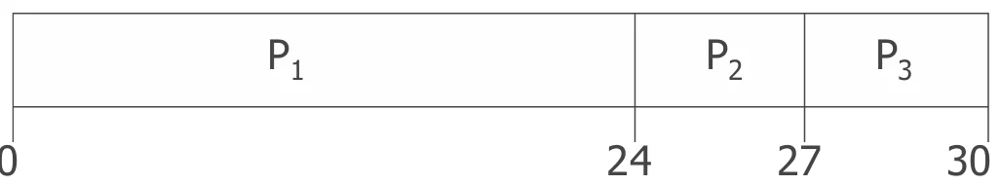
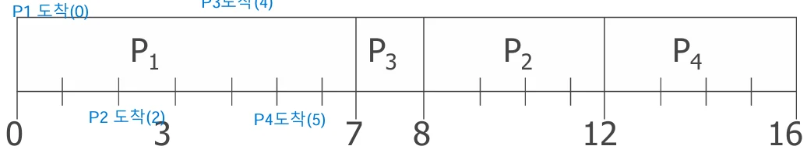
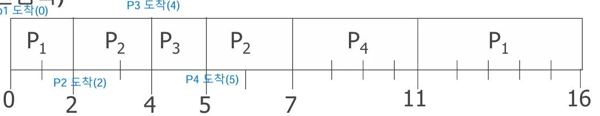

# [운영체제] CPU 스케줄링 알고리즘 이란??

## 원문

https://ch010104.tistory.com/56

## 노트 유형

`concept`

## 핵심 개념과 선택 맥락

Priority 스케줄링 - 스케줄링 알고리즘은 아니고, 프로세스에 우선순위를 부여하여 선택하는 것!!(어떤 기준으로 우선순위를 정하느냐에 중요)

CPU의 스케줄링 알고리즘에는 20가지 이상이 있지만, 그 중에서 대표적인 것으로 위와 같이 6가지 알고리즘을 살펴보자.

## 원문 기반 개념 정리

FCFS (First-Come First-Served)

SJF (Shortest Job First)

Priority 스케줄링 - 스케줄링 알고리즘은 아니고, 프로세스에 우선순위를 부여하여 선택하는 것!!(어떤 기준으로 우선순위를 정하느냐에 중요)

RR (Round Robin)

MQ (Multi-level Queue)

MFQ (Multi-level Feedback Queue)

HRN (Highest Response-rate Next)

CPU의 스케줄링 알고리즘에는 20가지 이상이 있지만, 그 중에서 대표적인 것으로 위와 같이 6가지 알고리즘을 살펴보자.

### 1. FCFS (First-Come First-Served)

비선점형 스케줄링

먼저 도착한 프로세스에게 CPU를 먼저 할당

준비 큐는 선입선출(Queue) 방식

예시

프로세스: P1(24), P2(3), P3(3) 도착 순서: P1, P2, P3

평균 대기시간: (0 + 24 + 27) / 3 = 17

→ 짧은 프로세스가 긴 프로세스 뒤에 오면 Convoy Effect(짧은 프로세스가 긴 프로세스 뒤에서 기다리는 것) 발생 - 평균 대기 시간이 저하됨.

단점

짧은 작업이 긴 작업 뒤에 오면 전체 응답 지연

시분할 시스템에 부적합

하나의 프로세스가 CPU를 반환할 때까지 기다림 -> 비선점식

### 2. SJF (Shortest Job First)

다음 CPU 버스트가 가장 짧은 프로세스를 먼저 실행

최적의 평균 대기시간을 가짐

비선점형 / 선점형(SRTF) 둘 다 가능

비선점형은 일단 CPU가 할당받으면 CPU 사용시간이 끝날 때까지 점유

선점형은 새로 도착하는 프로세스가 생겼을 때, 그 프로세스의 CPU 사용시간과 현재 진행 중인 프로세스의 남은 CPU 사용시간을 비교해서, 더 시간이 적은 프로세스를 선택 - > Shortest - Remaining -Time - First(SRTF)

비선점 SJF 예시

평균 대기시간 = (0 + (8 - 2) + (7 - 4) + (12 - 5)) / 4 = 4

선점 SJF (SRTF) 예시

평균 대기시간 = ((11 - 2) + (5 - 4) + 0 + (7 - 5)) / 4 = 3

이러한 SJF 방법을 사용하기 위해서는 각 프로세스의 CPU 사용시간을 미리 알아야함.

실제 값을 정확하게 알 수는 없고, 예측을 통해 다음 프로세스의 CPU 사용시간을 예측함.

CPU 버스트 예측 (지수 평균법)

τn+1=αTn+(1−α)τnτ_{n+1} = α T_n + (1 - α) τ_nτn+1​=αTn​+(1−α)τn​

α = 0.5인 경우 예측값은 실제값과 이전 예측값의 평균

즉, n + 1 번째 프로세스의 예측 CPU 사용시간 (tn+1) 은 Tn(실제 n번째 프로세스의 CPU 사용시간) * α + tn(1- α) 임.

n이 적을 때는 예측치와 실제 값이 오차가 나지만, n이 값이 커질수록 수렴하는 것을 보임.

### 3. Priority 스케줄링

프로세스마다 우선순위(정수)를 부여하여 CPU를 할당 - 이는 스케줄링 알고리즘이 아닌, 우선순위를 부여하여 CPU를 할당하는 방식을 말함.

고정/변동, 선점/비선점 모두 가능

SJF도 일종의 우선순위 스케줄링 (CPU 버스트 시간 기준)

⚠️ 문제점: Starvation(기아 상태)

낮은 우선순위는 영원히 실행되지 않을 수 있음 - 고정 스케줄링 방식에서는 우선순위가 프로세스 생성 시에 한 번 정해지면 바뀌지 않기 때문에, 낮은 우선순위의 프로세스는 영원히 실행 안될 수도 있음.

✅ 해결: Aging

오래 대기한 프로세스의 우선순위를 점진적으로 상승 - 변동 스케줄링 방식으로 오래 대기한 프로세스의 우선순위를 증가시켜, 기아 상태 문제를 해결

### 4. RR (Round Robin)

시분할 시스템을 위한 선점형 스케줄링

고정된 시간량(Time Quantum) 동안 CPU 사용, 이후 큐의 끝으로 이동

준비 큐는 FCFS 방식임.

선점 방식

예시1: Time Quantum = 20

프로세스: P1(53), P2(17), P3(68), P4(24)

예시2: Time Quantum = 2

도착시간까지 반영된 예

프로세스가 도착하면 FCFS 방식의 준비 큐에 들어감.

평균 대기시간: (7 + 3 + 2 + 5) / 4 = 4.25

💡 Time Quantum 크기 결정

너무 작으면 문맥교환 부담 ↑

너무 크면 FCFS처럼 됨

대부분의 프로세스(80%)의 CPU 버스트가 시간할당량보다 짧을 때 적절

### 5. MQ (Multi-Level Queue)

준비 큐를 다수로 나눔

예: 전면작업(대화식) / 후면작업(일괄처리)

큐마다 독립적인 스케줄링 알고리즘 사용

RR, FCFS 등

고정 우선순위 기반 → 상위 큐가 항상 우선

고정된 우선순위의 선점식 스케줄링

⚠️ 기아 상태 발생 가능

✅ 해결: 각 큐에 CPU 점유 비율 할당 → 전면: 80%, 후면: 20%

### 6. MFQ (Multi-Level Feedback Queue)

MQ에서 발전된 모델

프로세스가 큐 사이를 이동 가능

우선순위는 가변적 (→ Aging 내장)

가변식 우선순위 선점식 스케줄링

🔁 동작 방식

처음엔 모든 프로세스가 Q0에 위치

Q0에서 실행 중 타임퀀텀 초과 → Q1으로 이동

Q1 초과 → Q2로 이동

I/O로 CPU 반납 시 원래 큐 유지

예시

Q0: TQ=8ms (우선순위 높음)

Q1: TQ=16ms

Q2: FCFS

각 큐의 TQ 내에서는 RR의 방식으로 작동, 그 외를 넘어가면 하위의 큐에 들어감.

즉, CPU를 오래 사용하는 프로세스(일괄 처리가 필요한)의 경우, 우선순위가 점점 내려감

### 7. HRN (Highest Response-ratio Next)

SJF의 약점을 개선한 비선점형 스케줄링

짧은 작업 우선 + 오래 기다린 작업도 고려

가변적 우선순위의 비선점식 스케줄링

우선순위 계산 공식

Response Ratio = (대기시간+CPU 버스트)\ CPU 버스트

​

대기시간이 길수록, CPU 버스트가 짧을수록 우선순위 ↑

우선순위 계산 공식에 따라 우선순위가 변하고, 오래 대기할수록 우선순위가 높음

### 8. 표 정리

## 관련 글

- [[blog/OS/index|OS]]
- [[blog/OS/운영체제- CPU 스케줄링 이란|[운영체제] CPU 스케줄링 이란??]]
- [[blog/OS/운영체제- 프로세스의 동기화( 생산자 - 소비자 )란|[운영체제] 프로세스의 동기화( 생산자 - 소비자 )란?]]
- [[blog/OS/운영체제- 임계 구역 문제 란|[운영체제] 임계 구역 문제 란??]]
