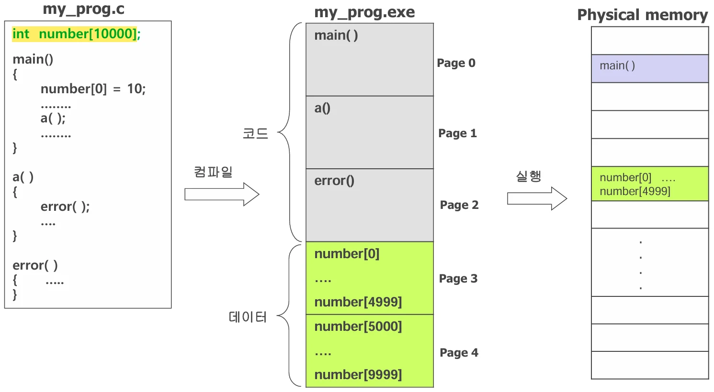
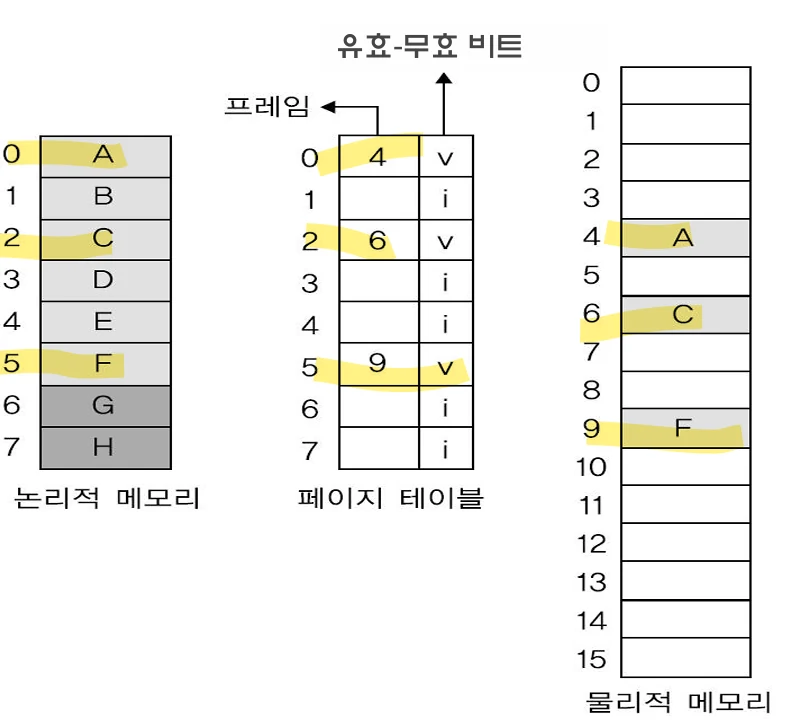
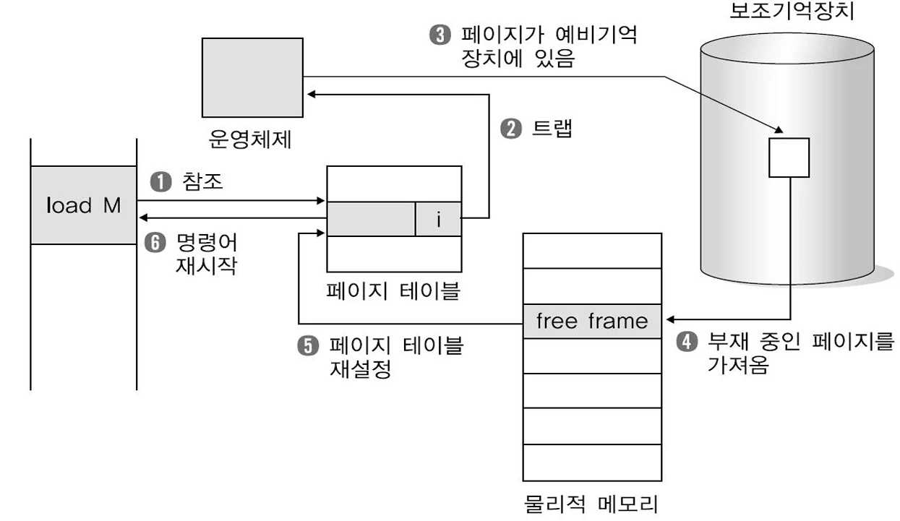

# [운영체제] 가상 기억장치란??

## 원문

https://ch010104.tistory.com/77

## 노트 유형

`concept`

## 핵심 개념과 선택 맥락

프로그램 전체가 메모리에 한꺼번에 올라오지 않아도 되는 경우가 많습니다.

**가상 기억장치(Virtual Memory)**는 프로세스의 전체 내용을 메모리에 올리지 않고도 실행할 수 있게 해주는 메모리 관리 기법입니다.

## 원문 기반 개념 정리

### 1. 가상 기억장치란?

1) 왜 필요한가?

프로그램 전체가 메모리에 한꺼번에 올라오지 않아도 되는 경우가 많습니다.

예외 처리 코드: 실행되지 않을 수도 있음

과도하게 할당된 배열/리스트: 전부 사용하지 않음

2) 정의

**가상 기억장치(Virtual Memory)**는 프로세스의 전체 내용을 메모리에 올리지 않고도 실행할 수 있게 해주는 메모리 관리 기법입니다.

즉, 물리 메모리보다 큰 프로그램도 실행 가능

필요한 부분만 메모리에 적재하여 실행

3) 구현 방법

요구 페이징 (Demand Paging)

요구 세그먼테이션 (Demand Segmentation)

### 2. 요구 페이징 (Demand Paging)

1) 개념

요구 페이징은 필요한 페이지가 실제 참조될 때 메모리에 로딩하는 방식

```text
int number[10000];
main() {
  number[0] = 10;
  ...
  a();
}

a() {
  ...
  error();
}

error() {
  ...
}
```

이처럼 number[0]이 참조될 때에만 해당 페이지가 메모리에 로딩됨.

### 3. 페이지 테이블과 유효-무효 비트

유효(valid) 비트: 1 → 메모리에 적재되어 있음

무효(invalid) 비트: 0 → 메모리에 없음 (디스크에만 존재)

1) 페이지 부재(Page Fault)

주소 변환 시 유효-무효 비트가 0이면 MMU가 **페이지 부재 인터럽트(Page Fault Interrupt)**를 발생시킴 - MMU가 스스로 메모리에 적재할 수 없기 때문에 인터럽트를 발생시켜 운영체제에게 메모리에 적재를 요청

### 4. 페이지 부재 처리 과정

페이지에 대한 참조가 첫번째 참조라면 페이지 부재가 발생되고 운영체제에게 제어가 넘어감

운영체제는 다음 둘 중의 어떤 상황인지를 검사한다. - 잘못된 참조라면 프로세스를 중지(abort)시킴 - 메모리에 없는 것 이라면 메모리에 페이지를 적재

비어 있는 프레임을 찾는다.

페이지를 프레임에 적재한다.

페이지 테이블 값을 변경한다. (프레임번호와유효비트)

중지된 명령어를 재시작시킨다.

### 5. 페이지 교체 (Page Replacement)

✔ 상황

메모리가 가득 찼을 때, 새 페이지를 로딩하려면 기존 페이지를 제거해야 함

여러프로세스가페이지를많이적재시키다되면나중에기억장치의빈프레임이 없어지게 됨

✔ 과정

페이지 교체 - 희생 페이지(victim frame) 선택 - 새 페이지를 적재할 때, 비어 있는 프레임이 없다면 사용 중인 프레임을 하나 선택하여 디스크로 swap out 시키고 새 페이지를 적재시키는것

디스크로 swap out

새 페이지를 swap in

→ 2번의 페이지 이동 필요(희생 프레임의 페이즈를 swap out, 새 페이지 적재)

### 6. 요구 페이징의 성능

1) 페이지 부재율(Page Fault Rate)

p = 페이지 부재 횟수 / 전체 페이지 참조 횟수

0 ≤ p ≤ 1

p = 0: 페이지 부재 없음

p = 1: 모든 참조가 페이지 부재

2) 유효 접근 시간 (EAT: Effective Access Time)

예시:

메모리 접근 시간 = 100ns

페이지 부재 처리 시간 = 25ms = 25,000,000ns

p = 0.001 (1000번 중 1번 페이지 부재)

EAT = (1 – p) x 100 + p x (25,000,000) = 100 + 24,999,900 x p

무려 100ns의 250배 → 성능 급감

페이지 부재율을 낮게 유지하는 것이 매우 중요

## 핵심 이미지







## 관련 글

- [[blog/OS/index|OS]]
- [[blog/AI(ML & DL)/기계학습- Python Pandas 란 -- ( 1 )|[기계학습] Python Pandas 란 ?? ( 1 )]]
- [[blog/AI(ML & DL)/기계학습- Python NumPy 란 -- ( 4 )|[기계학습] Python NumPy 란 ?? ( 4 )]]
- [[blog/OS/운영체제- 페이지 테이블 구조 란|[운영체제] 페이지 테이블 구조 란??]]
