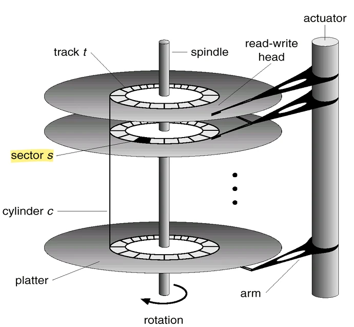
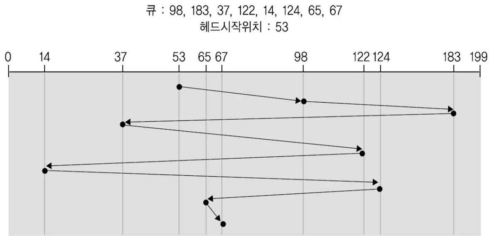
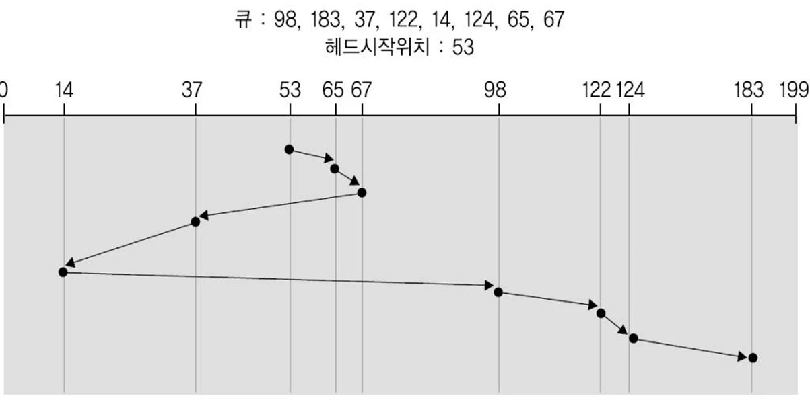

# [운영체제] 보조 기억 장치란?

## 원문

https://ch010104.tistory.com/94

## 노트 유형

`concept`

## 핵심 개념과 선택 맥락

여러 개의 디스크 플래터가 **축(spindle)**에 수직으로 쌓여 있음

**섹터(sector)**는 트랙을 나눈 데이터 단위 (예: 512B)

## 원문 기반 개념 정리

### 1. 하드디스크(HDD) 구조

1) 기본 개념

보조 기억장치로 가장 널리 사용됨

회전하는 자기 디스크에 데이터를 저장

기계적 동작 → 성능 병목의 원인이 되기도 함

2) 역사

1950년대 IBM에서 개발

1960년대부터 범용 컴퓨터에 보조 저장장치로 사용

3) 내부 구성

여러 개의 디스크 플래터가 **축(spindle)**에 수직으로 쌓여 있음

각 플래터 면마다 헤드가 존재

플래터 면은 동심원 구조의 **트랙(track)**으로 구성

**섹터(sector)**는 트랙을 나눈 데이터 단위 (예: 512B)

**실린더(cylinder)**는 같은 위치의 트랙들을 수직으로 연결한 개념

### 2. 디스크 접근 시간 구성

탐색시간(Seek Time): 헤드가 목적 실린더로 이동하는 시간

회전지연(Rotational Latency): 원하는 섹터가 헤드 아래 올 때까지의 회전 시간

전송시간(Transmission Time): 섹터 데이터를 전송하는 시간

예시:

탐색시간: 20ms

회전지연시간: 3ms

전송시간: 0.00094ms/byte

### 3. 디스크 스케줄링 알고리즘

디스크 I/O 큐

운영체제는 디스크 장치마다 요청 큐를 유지하며, 어떤 요청을 우선 처리할지 결정하는 것이 스케줄링의 핵심!

1) FCFS (First Come First Served)

처리 순서: 도착 순

장점: 공평함

단점: 탐색 거리 비효율적

2) SSTF (Shortest Seek Time First)

처리 순서: 현재 헤드 위치에서 가장 가까운 요청부터

장점: 평균 이동 거리 ↓

단점: 기아(Starvation) 발생 가능 → 양 끝 트랙이 계속 무시될 수 있음

3) SCAN (엘리베이터 알고리즘)

처리 순서: 한 방향으로 이동하며 요청 처리 후, 방향 전환

특징: 헤드는 디스크 끝까지 이동하며 왕복

장점: SSTF에 비해 편차 ↓

단점: 양 끝이 더 유리해질 수 있음

4) C-SCAN (Circular SCAN)

처리 순서: 한 방향만 처리하고 끝에서 처음으로 순간이동하여 다시 같은 방향으로 처리

장점: 응답 시간 편차 최소화

5) LOOK / C-LOOK

LOOK: 끝까지 가지 않고, 가장 먼 요청까지만 이동 후 방향 전환

C-LOOK: LOOK + C-SCAN → 마지막 요청 후 처음으로 이동

### 4. 스케줄링 알고리즘 선택 기준

요청이 순차적인지, 임의 접근인지에 따라 성능이 달라짐

파일이 연속할당인지 연결할당인지에 따라 달라짐

디렉토리와 색인 블록의 위치도 성능에 영향

### 5. SSD (Solid State Disk)

1) 개요

플래시 메모리 기반의 저장 장치

기계적 부품 없이 전자적으로 동작

속도 빠름, 전력 소비 낮음, 충격에 강함, 소형/경량

2) 단점

비쌈

데이터를 지우고 나서만 쓸 수 있음

삭제 횟수 제한 (10,000 ~ 1,000,000회 수준)

### 6. HDD vs SSD 비교

## 관련 글

- [[blog/OS/index|OS]]
- [[blog/OS/운영체제- 파일 시스템이란|[운영체제] 파일 시스템이란??]]
- [[blog/OS/운영체제- 스레싱과 지역성이란|[운영체제] 스레싱과 지역성이란??]]
- [[blog/OS/운영체제- 페이지 교체 알고리즘이란|[운영체제] 페이지 교체 알고리즘이란?]]
