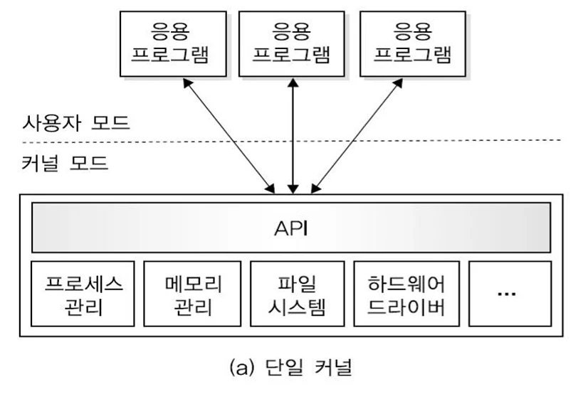
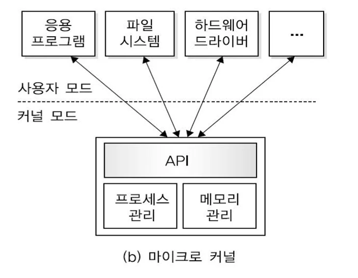
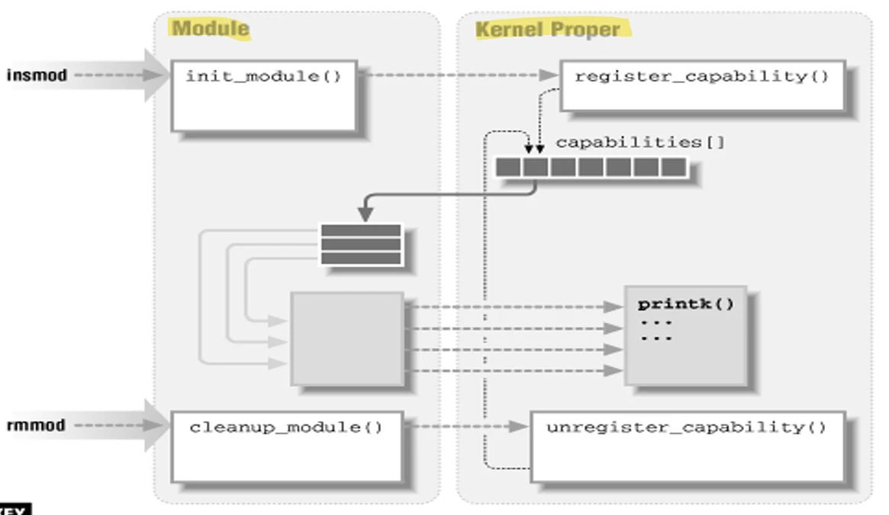

# [운영체제] 사용자 인터페이스와 운영체제

## 원문

https://ch010104.tistory.com/22

## 노트 유형

`concept`

## 핵심 개념과 선택 맥락

운영체제가 사용자와 소통하는 방법은 두 가지 대표적인 형태로 나뉨.

사용자는 명령어를 직접 입력해야 하며, 숙련도에 따라 효율적 사용 가능

## 원문 기반 개념 정리

### 1. 사용자 인터페이스 (CLI vs GUI)

운영체제가 사용자와 소통하는 방법은 두 가지 대표적인 형태로 나뉨.

🔹 CLI (Command Line Interface)

텍스트 기반 인터페이스

사용자는 명령어를 직접 입력해야 하며, 숙련도에 따라 효율적 사용 가능

예: bash, cmd, PowerShell

🔹 GUI (Graphical User Interface)

아이콘, 창, 버튼 등 시각적인 요소로 구성

직관적이며 초보자에게 사용이 쉬움

예: Windows, macOS, Ubuntu의 GNOME 등

### 2. 운영체제의 요구사항

운영체제는 사용자와 시스템(개발자, 관리자)의 요구사항을 동시에 만족해함..

✅ 사용자 목적 (User Goals)

사용하기 쉬워야 한다

배우기 쉬워야 한다

신뢰성과 안전성이 있어야 한다

빠르게 실행되어야 한다

✅ 시스템 목적 (System Goals)

설계와 구현이 용이해야 한다

유지보수가 쉬워야 한다

융통성과 확장성이 있어야 한다

신뢰성과 효율성을 제공해야 한다

### 3. 운영체제의 구조 – 커널(Kernel) 설계 방식

운영체제의 핵심은 **커널(Kernel)**!!! 커널은 하드웨어와 소프트웨어 사이의 다리 역할을 하며, OS 기능의 중심 커널은 크게 세 가지 구조로 나뉨.

### 1) 단일 커널 (Monolithic Kernel)

운영체제의 모든 기능이 하나의 프로그램 안에 통합

프로세스 관리, 메모리, 파일 시스템, 드라이버 등 모두 커널 내부에 포함됨

성능은 빠르지만, 유지보수와 안정성은 다소 낮을 수 있음 - 새로운 기능이나 드라이브가 추가되면 전체 커널 모드의 프로그램을 다시 컴파일 해야함.

🧠 예: 전통적인 Unix, 초기 Linux, MS-DOS

### 2) 마이크로커널 (Microkernel)

커널에는 최소한의 기능(예: 프로세스, 메모리 관리)만 포함

파일 시스템, 드라이버 등은 사용자 모드에서 독립적으로 실행 - 사용자 모듈 서버는 응용프로그램처럼 실행됨 - 사용자 모드에 작업이 들어오면 커널 모드로 넘기지 않고, 사용자 모드에서 직접 처리

장점:

확장이 쉽다. - 새로운 기능이나 드라이버가 추가되면, 사용자 모드에 추가하기 때문에, 커널을 새로 컴파일 할 필요가 없음

새로운 하드웨어 이식이 쉽다

커널 모드에서 실행되는 코드가 적어지기 때문에 신뢰성이 좋아짐.

안정성과 유연성이 높지만, IPC(프로세스 간 통신)로 인해 성능 저하 가능 - 사용자 공간과 커널 공간이 분리되어 있어서 잦은 통신이 필요함.

🧠 예: Minix, QNX, 일부 macOS 요소

### 3) 모듈형 커널 (Modular Kernel)

단일 커널 기반이지만, 기능을 모듈 형태로 분리 가능 - 운영체제가 커널과 모듈로 분리됨 - 커널은 프로세스, 메모리 관리 의 핵심 기능만 수행(마이크로 커널과 동일) - 하드웨어 드라이버, 파일시스템 등 추가 기능은 모듈로 구현 - 모듈이 로드 되기 전에는 사용자 영역에 존재하다가, 로드되는 순간 커널로 모듈을 로드하여 커널에서 실행(마이크로 커널과 차이)

드라이버나 파일 시스템 등을 필요할 때만 로드/제거 가능

단일 커널의 성능 + 마이크로커널의 유연성을 절충

🧠 예: 현대 Linux 커널(Linux Kernel Modules) **최근 대부분의 운영체제( Solaris, Linux, Mac OS ) 는 모듈형 커널을 지원함**

## 관련 글

- [[blog/OS/index|OS]]
- [[blog/OS/운영체제- 프로세스(Process) 란|[운영체제] 프로세스(Process) 란?]]
- [[blog/OS/운영체제- 시스템 호출(System Call)과 운영체제|[운영체제] 시스템 호출(System Call)과 운영체제]]
- [[blog/OS/운영체제- 프로세스의 상태(Process State) 란|[운영체제] 프로세스의 상태(Process State) 란?]]
