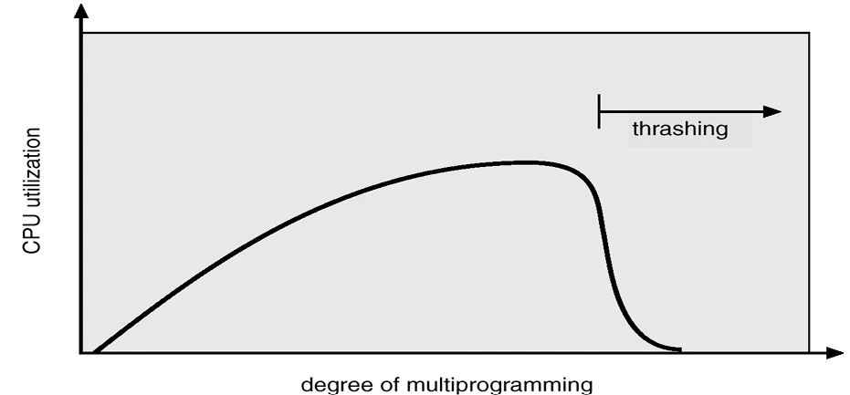
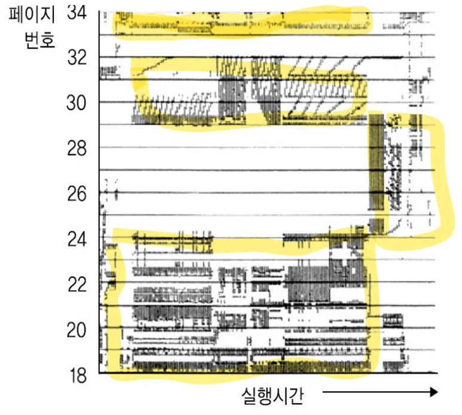
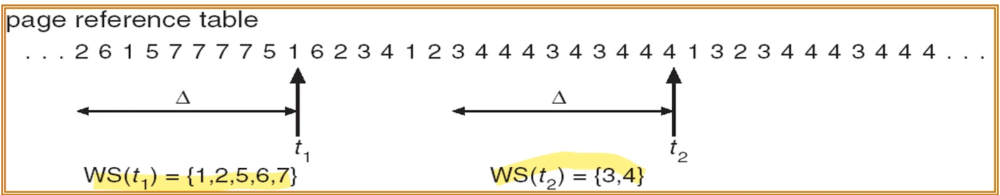

# [운영체제] 스레싱과 지역성이란??

## 원문

https://ch010104.tistory.com/88

## 노트 유형

`concept`

## 핵심 개념과 선택 맥락

메모리는 일정 크기의 프레임(Frame) 단위로 나뉘며, 운영체제는 각 프로세스에 이 프레임을 할당

예: 총 100개의 프레임, 5개의 프로세스 → 각 프로세스에 20개씩 할당.

## 원문 기반 개념 정리

### 1. 프레임 할당 방식

메모리는 일정 크기의 프레임(Frame) 단위로 나뉘며, 운영체제는 각 프로세스에 이 프레임을 할당

1) 균등 할당(Equal Allocation)

모든 프로세스에 동일한 수의 프레임을 할당.

예: 총 100개의 프레임, 5개의 프로세스 → 각 프로세스에 20개씩 할당.

2) 비례 할당(Proportional Allocation)

프로세스의 크기에 비례하여 프레임을 나눔.

큰 프로세스는 더 많은 프레임을 받음.

3) 작업집합 기반 할당(Working Set Model)

프로세스가 **최근에 참조한 페이지 집합(= 작업집합)**을 기준으로 프레임을 할당.

스레싱을 방지하고 다중 프로그래밍 수준을 높일 수 있음.

### 2. 스레싱(Thrashing)이란?

1) 스레싱이란?

프로세스가 실행보다 페이지 교체에 더 많은 시간을 소비하는 상태

2) 발생 원인

프로세스에 충분한 프레임이 할당되지 않음.

페이지 부재율(Page Fault Rate)이 증가 → 디스크 I/O 증가 → CPU 대기 → 성능 저하.

3) 악순환 구조

다중 프로그래밍 정도를 높이면 CPU 사용률이 오름.

하지만 한계를 넘으면 스레싱이 발생 → CPU 사용률 급락.

4) 해결 방법

다중 프로그래밍 정도를 줄임 (프로세스 수 감소).

각 프로세스에 충분한 프레임 할당.

### 3. 지역성(Locality)의 원리

1) 지역성 원칙(Principle of Locality)

프로세스는 메모리 전체를 고르게 접근하지 않고, 일부 페이지만 집중적으로 참조하는 경향이 있음

2) 지역성의 종류

시간 지역성 (Temporal Locality): 최근에 접근한 페이지는 곧 다시 접근될 가능성이 높음 예: 루프, 스택, 서브루틴 등

공간 지역성 (Spatial Locality): 현재 참조된 페이지 주변 주소도 곧 참조될 가능성이 높음 예: 배열 순회, 연속적인 코드 실행

3) 지역(Locality) 정의

프로세스가 실행되면서 함께 사용되는 페이지 집합

프로세스는 하나의 지역에서 실행 → 지역 전환 시 새로운 페이지들 참조.

### 4. 작업집합(Working Set) 모델

지역성을 기반으로 각 프로세스에 필요한 **최소한의 페이지 집합(Δ 시간 동안 참조된 페이지 집합)**을 정의

1) 주요 개념

WSSi: 프로세스 i의 작업집합 (Δ 기간 참조된 페이지 집합)

D = Σ WSSi: 전체 시스템의 메모리 수요

Δ가 너무 작으면 지역성 만족 못 함, 너무 크면 여러 지역 중복 포함

2) 스레싱 방지 방법

D > m (전체 프레임 수) 이면 → 스레싱 발생

이 경우 일부 프로세스를 중단시켜 프레임을 회수 → 다른 프로세스에 재할당

3) 장점

스레싱 방지 + 다중 프로그래밍 효율적 유지 가능

### 5. 페이지 부재 빈도(Page Fault Frequency, PFF) 기법

페이지 부재율(Page Fault Rate)을 실시간으로 추적하여 동적으로 프레임을 조정

1) 방법

페이지 부재율이 상한 초과 → 프레임 추가 할당

페이지 부재율이 하한 미만 → 프레임 일부 회수

2) 장점

실시간으로 각 프로세스의 메모리 수요 반영

스레싱을 미리 방지할 수 있음

### 6. 그 외 고려사항

1) 프리페이징(Prepaging)

페이지 부재가 발생하기 전에 미리 필요한 페이지를 로딩하여 성능 향상.

2) 페이지 크기(Page Size)

너무 작으면 페이지 테이블 커짐 (관리 오버헤드 증가)

너무 크면 내부 단편화 증가

적절한 균형이 필요함

## 핵심 이미지

## 관련 글

- [[blog/OS/index|OS]]
- [[blog/OS/운영체제- 페이지 교체 알고리즘이란|[운영체제] 페이지 교체 알고리즘이란?]]
- [[blog/OS/운영체제- 파일 시스템이란|[운영체제] 파일 시스템이란??]]
- [[blog/OS/운영체제- 보조 기억 장치란|[운영체제] 보조 기억 장치란?]]
