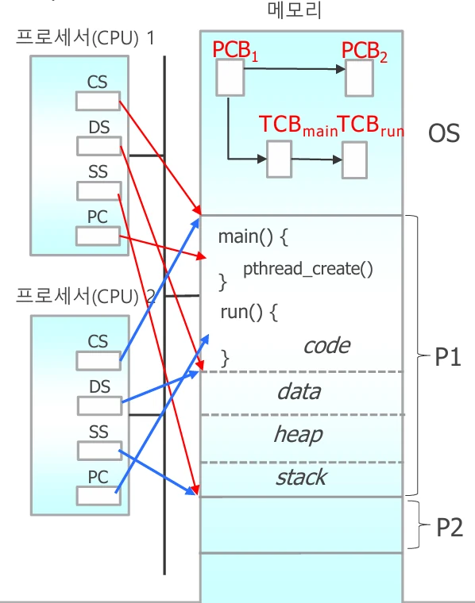
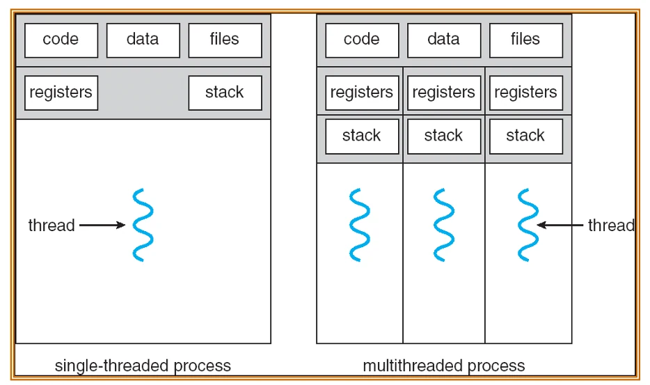
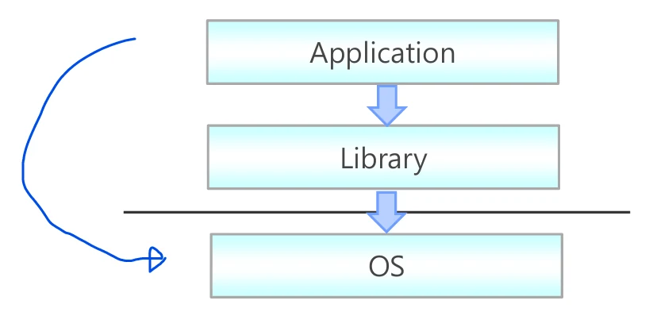

# [운영체제] 쓰레드(Thread) 란??

## 원문

https://ch010104.tistory.com/46

## 노트 유형

`concept`

## 핵심 개념과 선택 맥락

**쓰레드(Thread)**는 CPU를 사용하는 최소 실행 단위이며, 프로세스 내에서 실행되는 작업 흐름

다른 말로 Light Weight Process (LWP) 라고도 함.

## 원문 기반 개념 정리

### 1. 쓰레드란?

**쓰레드(Thread)**는 CPU를 사용하는 최소 실행 단위이며, 프로세스 내에서 실행되는 작업 흐름

다른 말로 Light Weight Process (LWP) 라고도 함.

전통적인 프로세스는 하나의 스레드만 가지고 있지만, 다중 스레드를 사용하면 동시에 여러 작업을 수행할 수 있음.

하나의 chrome 페이지를 프로세스라고 하면, 해당 chrome 페이지에서 음악 감상, 다운로드, 화면 렌더링 등의 작업이 쓰레드!!

하나의 프로세스에 속한 쓰레드들은 서로 code, data, heap 등의 메모리를 공유하지만, 각각 개별의 레지스터 집합, stack을 가짐

### 2. 프로세스와 쓰레드의 차이

### 3. 단일 쓰레드 vs 다중 쓰레드





Thread를 생성할 때마다, OS에 TCB를 생성함.

Main 함수에 Thread를 실행하면, Thread로 넘겨받은 함수가 실행되며, Main 함수도 계속 실행됨(병렬 처리 가능 -> 각각의 작업을 서로 다른 CPU에서 처리 가능)

위의 그림에선 Main 함수를 CPU 1이 pthread_create() 위치부터 실행하고, Run 함수를 CPU2에서 실행

단일 쓰레드: 프로세스 내 쓰레드 1개 (전통적인 구조)

다중 쓰레드: 프로세스 내 여러 개의 쓰레드 → 병렬 처리 가능 - 다중 쓰레드에서는 쓰레드 간에 code, data, files(heap) 은 공유하지만, 각각 개별의 registers와 stack을 가짐.

### 4. 쓰레드의 메모리 구조( 다중 쓰레드 )

쓰레드는 code, data, heap, open files를 공유

하지만 **stack, 레지스터(PC 등)**는 각자 별도로 가짐

쓰레드 생성 시 마다 **TCB(Thread Control Block)**가 생성되어 각각의 스레드를 관리

### 5. 쓰레드의 장점

빠른 응답성: 한 작업이 block되도 다른 작업은 계속 가능

자원 공유: 같은 프로세스의 메모리를 공유

경제성: 프로세스보다 생성 비용이 적음

멀티코어 활용: 여러 CPU에 나누어 실행 가능

### 6. 스레드 구현 방식



User-Level Thread (ULT) - 쓰레드 라이브러리

사용자 공간에서 라이브러리로 구현됨 (예: pthread, Java thread)

OS는 존재를 모름

라이브러리에서 쓰레드를 관리하여 응용프로그램에게 쓰레드 생성 등의 함수를 제공

예시: 1. POSIX Pthreads 2.Win32 threads 3. Java threads

Kernel-Level Thread (KLT) - 커널 쓰레드

커널이 직접 관리

OS가 시스템 호출을 통해 스레드 생성 및 관리 (예: clone() in Linux)

즉, OS가 쓰레드 생성 등의 쓰레드 관리를 위한 시스템 호출을 제공

예시: 1. Windows XP/2000 : 시스템호출 PsCreateSystemThread 2. Linux : 시스템호출 clone 3. Solaris 4.Mac OS X

어플리케이션에서 사용자 쓰레드(쓰레드 라이브러리)가 생성되면 시스템 콜에 의해 커널 영역에서 운영체제에 Clone하여 저장함

### 7. 다중 쓰레딩 모델 (Threading Models)

사용자 수준의 쓰레드 라이브러리(ULT)와 커널 쓰레드(KLT)의 매핑에 따라 3가지 쓰레딩 모델이 있음.

① One-to-One (1:1)

하나의 사용자 쓰레드 ↔ 하나의 커널 쓰레드 - pthread_create를 할 때마다, 라이브러리에 thread가 생성되고, OS 내에 clone 됨.

✅ 장점: 병렬성 확보, block 무관 - 각 쓰레드마다 커널 TCB가 있기 때문에, 하나의 쓰레드가 시스템 호출을 받아 대기 상태로 넘어가게 되면, 다른 쓰레드를 실행

❌ 단점: 커널 오버헤드 ↑, 스레드 수 제한 가능 - 모든 쓰레드마다 OS에 커널 TCB가 있어야 하기 때문에, 쓰레드의 수가 너무 많아지면 메모리 면에서 부담됨.

예: Linux, Windows, FreeBSD 등

② Many-to-One (N:1)

여러 사용자 스레드 ↔ 하나의 커널 스레드 - 요즘은 거의 사용 x

✅ 장점: 자원 효율적

❌ 단점: 하나가 block되면 전부 정지, 병렬 실행 불가 - 여러 쓰레드에 대해 하나의 TCB만 있기 때문에, 하나의 쓰레드가 시스템 호출에 의해 대기 상태로 넘어가면, 해당 TCB에 묶인 스레드들도 실행 불가

예: Green Thread, GNU Portable Threads

③ Many-to-Many (M:N)

M개의 사용자 스레드 ↔ N개의 커널 스레드(N <= M)

1:1, N:1 모델의 장점을 섞은 것!!

만약 N = M 이면, 1:1 모델과 같은 것이 아닐까?? - 거의 비슷함. 하지만, 1:1 모델보다 M:N 모델이 좀 더 유연함.

✅ 장점: 유연성 최고, 병렬성 확보, 커널 자원 효율적 사용

❌ 단점: 구현 복잡

예: Solaris 2, NetBSD

※ 커널 스레드 수와 사용자 스레드 수가 같더라도, M:N 모델은 실행 시점에 가용한 커널 스레드에 동적으로 매핑된다는 점에서 1:1 모델과는 다름!

### 8. 실전 예시: Solaris 스레드 모델

각 task(프로세스)는 서로 다른 쓰레드 모델 사용 가능

Task1: 2 user threads ↔ 1 kernel thread (N:1) + 1 user ↔ 1 kernel (1:1)

Task2: 1 user ↔ 1 kernel (1:1)

Task3: M:N 모델(M = 3, N = 2) + 1 user ↔ 1 kernel (1:1) + 1 user ↔ 1 kernel (1:1)

즉, 프로세스마다 쓰레드 모델을 자유롭게 설계 가능

위 그림과 같이, OS의 커널 쓰레드에 각각의 CPU를 매칭함.

심지어 한 프로세스 내에서도 중요한 쓰레드는 1:1, 나머지는 M:N으로 처리 가능 (하이브리드 구조)

### 9. pthread_create() 함수 구조

```text
pthread_create(&tid, &attr, run, (void *)count);
```

## 관련 글

- [[blog/OS/index|OS]]
- [[blog/OS/운영체제- CPU 스케줄링 이란|[운영체제] CPU 스케줄링 이란??]]
- [[blog/OS/운영체제- 프로세스 종료와 통신|[운영체제] 프로세스 종료와 통신]]
- [[blog/OS/운영체제- CPU 스케줄링 알고리즘 이란|[운영체제] CPU 스케줄링 알고리즘 이란??]]
