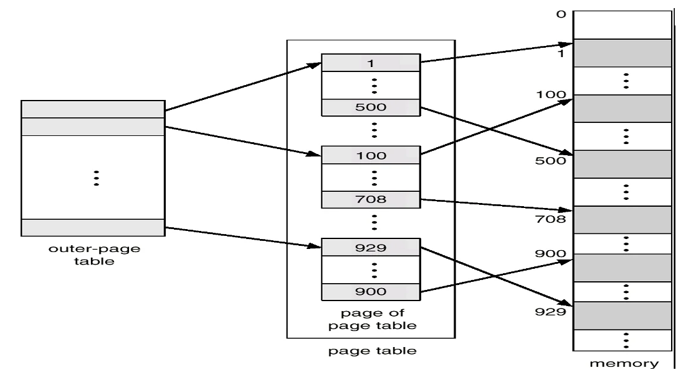
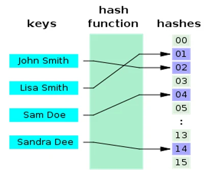
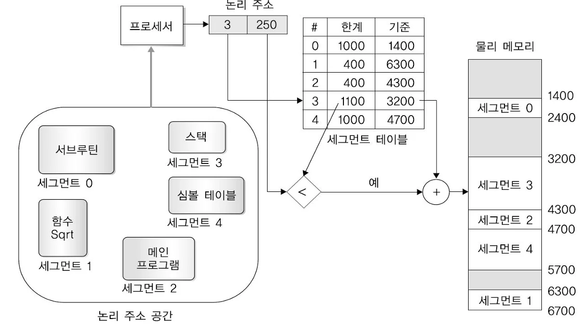

# [운영체제] 페이지 테이블 구조 란??

## 원문

https://ch010104.tistory.com/74

## 노트 유형

`concept`

## 핵심 개념과 선택 맥락

현대 컴퓨터는 32비트~64비트의 매우 큰 논리 주소 공간을 사용

각 항목 크기: 4바이트 → 전체 페이지 테이블 크기 = 4MB

## 원문 기반 개념 정리

### 1. 페이징(Paging) 기본 개념

현대 컴퓨터는 32비트~64비트의 매우 큰 논리 주소 공간을 사용

이 때 메모리를 효율적으로 관리하기 위해 페이징 기법을 사용

예시:

논리 주소 공간: 2³² (4GB)

페이지 크기: 4KB (2¹²)

페이지 수: 2²⁰ = 약 100만 개

각 항목 크기: 4바이트 → 전체 페이지 테이블 크기 = 4MB

문제점

페이지 수가 많아질수록 페이지 테이블의 크기가 매우 커짐 → 메모리 공간 낭비

### 2. 계층적 페이징(Hierarchical Paging)

1) 개념

전체 페이지 테이블을 메인 메모리에 연속으로 할당하는 대신, 페이지 테이블 자체를 페이지화하여 여러 단계로 나눔.

페이지 테이블 자체의 페이지화 내용이 들어 있는 페이지 테이블(outer-page table)도 필요함.

2) 예시: 2단계 페이징 (Two-level Paging)

32비트 주소 공간, 페이지 크기 4KB → 20비트는 페이지 번호(p), 12비트는 오프셋(d)

20비트 페이지 번호(p)를 10비트씩 두 개로 나눔 → p1(outer), p2(inner)

전체 페이지 테이블은 4MB → 4KB 단위로 나누면 1024개(2¹⁰)의 페이지

즉, 논리 주소는 아래와 같은 구조를 가짐:

```text
| 10bit p1 | 10bit p2 | 12bit d |
```

이 구조로 인해 필요한 테이블만 메모리에 올릴 수 있어 공간 절약 가능.

### 3. 해시 기반 페이지 테이블 (Hashed Page Table)

1) 개념

주소 공간이 32비트 이상으로 매우 큰 경우에 사용

페이지 번호를 해시 함수로 매핑하여 페이지 테이블의 인덱스를 계산

같은 해시 값이 나올 경우를 대비해 체이닝(chaining) 방식으로 연결 리스트를 사용

2) 장점

큰 주소 공간에서도 빠른 접근 가능

특히 희소한(sparse) 주소 공간에서 효과적

### 4. 역 페이지 테이블 (Inverted Page Table)

1) 개념

물리 메모리의 프레임 수만큼만 항목을 가짐

각 항목에는 어떤 프로세스의 어떤 페이지가 저장되어 있는지 기록

2) 특징

시스템에 하나의 페이지 테이블만 존재 → 메모리 공간 절약

페이지 테이블 탐색 시간이 오래 걸릴 수 있음 → 해시 테이블이나 **TLB(연관 레지스터)**를 통해 시간 단축

3) 예시 시스템

IBM RT, PowerPC, UltraSPARC 등

### 5. 세그먼테이션(Segmentation)

1) 개념

프로그램을 의미 있는 단위(세그먼트)로 나누는 기법

세그먼트 종류: main, 함수, 전역변수, 스택 등

각 세그먼트는 크기가 달라질 수 있음

논리 주소 =세그먼트 번호 s, 오프셋 d)

2) 세그먼트 테이블

항목: 시작 주소(base), 길이(limit), 보호 비트

MMU 레지스터:

STBR (Segment Table Base Register)

STLR (Segment Table Limit Register)

3) 장점

사용자 관점과 잘 맞는 구조

세그먼트 단위로 보호 및 공유 가능

4) 단점

외부 단편화 발생 가능 (세그먼트 크기가 다르기 때문)

### 6. 페이지화된 세그먼테이션 (Segmentation with Paging)

1) 개념

세그먼트를 다시 페이지로 나눈 구조

2) 장점

외부 단편화 해결

페이지 단위로 배치 가능 → 빠른 메모리 할당

3) 단점

페이지 단위로 인해 내부 단편화 발생 가능

### 7. 결론

## 핵심 이미지







## 관련 글

- [[blog/OS/index|OS]]
- [[blog/OS/운영체제- 기억장치의 관리란|[운영체제] 기억장치의 관리란??]]
- [[blog/OS/운영체제- 교착상태 란|[운영체제] 교착상태 란??]]
- [[blog/OS/운영체제- 임계 구역 문제 란|[운영체제] 임계 구역 문제 란??]]
