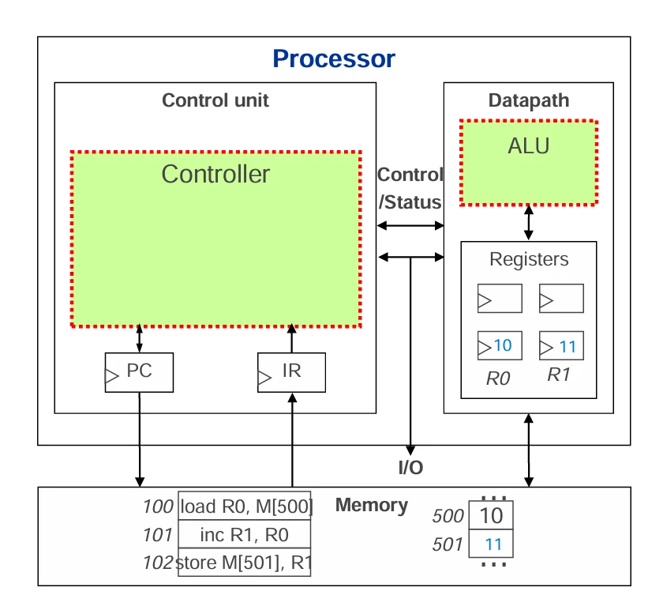

# [운영체제] 프로세서(Processor) 란?

## 원문

https://ch010104.tistory.com/9

## 노트 유형

`concept`

## 핵심 개념과 선택 맥락

**프로세서(Processor)**는 컴퓨터의 두뇌 역할을 하는 핵심 부품으로, 연산을 수행하고 명령을 제어하는 역할을 함. 다른 말로 중앙처리장치(Central Processing Unit: CPU) 라고도 함.

전원이켜지면, 메모리의 첫부분(0번지) 또는끝부분(0xffffffff) 내용을 읽어 실행함. cpu의 제품마다 첫부분을 읽을지 끝부분을 읽을지 다름!!

## 원문 기반 개념 정리

### 📌 프로세서란?

**프로세서(Processor)**는 컴퓨터의 두뇌 역할을 하는 핵심 부품으로, 연산을 수행하고 명령을 제어하는 역할을 함. 다른 말로 중앙처리장치(Central Processing Unit: CPU) 라고도 함.

전원이켜지면, 메모리의 첫부분(0번지) 또는끝부분(0xffffffff) 내용을 읽어 실행함. cpu의 제품마다 첫부분을 읽을지 끝부분을 읽을지 다름!!

### 1. 프로세서의 기본 구조

프로세서는 크게 **제어 장치(Control Unit), 연산 장치(ALU), 레지스터(Register), 버스(Bus) **로 구성됩니다.

제어 장치 (Control Unit): 명령어를 해석하고 실행을 제어 - 명령어 를해석하는명령어해석기(instruction decoder) , 제어 로직으로 구성됨 - 명령어를 읽고 실행을 위한 로직을 수행 - cpu에는 연산자와 피연산자가 있는데 control unit에서 명령어인 연산자 부분을 읽어서 처리

연산 장치 (ALU, Arithmetic Logic Unit): 덧셈, 뺄셈 같은 연산을 수행 - 데이터를 가져오는 등의 일반적인 연산의 경우 제어 장치인 control unit에서 처리하지만, 산술 연산, 논리 연산의 경우 ALU 에서 처리함 - 산술연산: 덧셈, 뺄셈, 곱셈, 쉬프트 연산 등을 수행 - 논리연산: 논리AND, OR, XOR, NOT, 보수 연산 등을 수행 - 연산 처리 후의 상태를 상태 레지스터에 저장함

레지스터 (Register): 데이터를 임시로 저장하는 초고속 메모리 - 프로세서 내에 일시적으로 데이터를 보관하고 ALU의 산술, 논리 연산을 위한 데이터 저장 장소 - cpu 안에는 수십 개의 레지스터가 있는데, 그것의 역할에 따라 종류는 분류함. - 범용레지스터(general register) : 프로그램, 데이터 처리를 위한 레지스터 - 제어레지스터(control register) : 프로그램 제어, 프로세서의 제어를 위해 사용하는 레지스터, (예: PC, SP 레지스터) - - 상태레지스터(status register) : 프로세서의 산술 연산의 결과, 동작 모드 들을 나타내는 레지스터 - 인덱스레지스터(index register) : 데이터 어드레싱, 데이터 처리를 위해 사용되는 레지스터

버스(Bus): 여러 장치들의 데이터 흐름을 연결하는 데이터 경로

또한, 프로세서는 **PC(Program Counter)**와 **IR(Instruction Register)**를 사용해 실행할 명령어를 관리함.

*PC(Program Counter)**와 **IR(Instruction Register)** 모두 control unit 안에 속해서 메모리에 접근함.

PC(Program Counter): 다음에 실행될 명령어의 주소

IR(Instruction Register): 현재 실행 중인 명령어를 저장

### 2. 프로세서의 동작 과정

프로세서는 명령어를 가져오고(페치, Fetch), 해석하고(디코드, Decode), 실행하는(Execute) 과정을 반복

### 1) 프로세서의 6가지 기본 기능

1. 메모리에서 명령어를 읽기 (Instruction Fetch)

CPU가 메모리에서 명령어를 읽어와 명령어 레지스터(IR) 에 저장.

2. 메모리에 데이터를 쓰기 (Memory Write)

연산 결과나 데이터를 CPU에서 메모리의 특정 주소에 저장.

3. 메모리에서 데이터를 읽기 (Memory Read)

CPU가 연산을 수행하기 위해 메모리에서 데이터를 가져옴.

4. I/O 장치에 데이터를 쓰기 (I/O Write)

CPU가 외부 장치(예: 디스크, 프린터)에 데이터를 전송.

5. I/O 장치에서 데이터를 읽기 (I/O Read)

CPU가 외부 장치에서 데이터를 가져옴.

6. 연산 수행 (Arithmetic/Logic Operations)

ALU(산술 논리 연산 장치)를 사용하여 덧셈, 뺄셈, 논리 연산(AND, OR 등) 을 수행

### 2) 명령어 수행 단계

CPU가 하나의 명령어를 실행하는 과정

Fetch (명령어 가져오기)

PC(Program Counter) 가 가리키는 주소에서 명령어를 메모리에서 가져와 명령어 레지스터(IR) 에 저장.

PC는 자동으로 증가하여 다음 명령어를 가리킴.

Decode (명령어 해독)

명령어의 연산 코드(opcode) 와 오퍼랜드(operand) 를 분석하여 수행할 동작을 결정.

Fetch Operands (오퍼랜드 가져오기)

실행에 필요한 데이터를 메모리 또는 레지스터에서 가져와 데이터 레지스터(DR) 에 저장.

Execute (명령어 실행)

ALU(산술 논리 연산 장치) 를 사용하여 연산 수행 (예: 덧셈, 논리 연산).

메모리에서 읽은 데이터를 가공하거나 I/O 장치와 데이터 전송.

Store Results (결과 저장)

연산 결과를 다시 레지스터 또는 메모리에 저장.

### 3) 명령어 실행 순서(예시)

프로세서의 동작 과정

PC(Program Counter) 값 참조

CPU는 PC(프로그램 카운터)에서 실행할 명령어의 메모리 주소를 확인합니다.

CPU(첫 부분부터 읽는 CPU의 경우)가 켜져 0번지부터 읽기 시작하여 PC에 0번지 저장 후 IR에서 0번지의 값을 읽어서 연산 처리 -> 그 후 PC의 값은 자동으로 1이 더해져서 1번지를 읽음 -> 반복

예: PC = 100 (100번지의 명령어 실행)

메모리에서 명령어 가져오기 (Fetch)

**IR(Instruction Register)**에 명령어를 로드합니다.

load R0, M[500] 는 어셈블리어로 110111 과 같은 기계어를 사람이 읽기 쉽도록 번역해 놓은 것!!

예: load R0, M[500] (메모리 500번지 값을 R0에 가져오기!!)

load R0, M[500]: load = 가져오는 연산자, R0 = 레지스터, M[500] = 메모리 500번지

load 연산 같은 경우는 일반 연산에 속하기 때문에 ALU가 아닌 Control Unit에서 연산을 처리함.

명령어 해석 및 실행 (Decode & Execute)

**제어 장치(Control Unit)**가 명령어를 해석하여 ALU(연산 장치) 또는 레지스터에서 연산을 수행

예: inc R1, R0 → R0의 값에 1을 더해 R1에 저장 (ALU에서 처리)

inc R1, R0: inc = 1을 더하는 연산자

결과 저장 (Store)

연산된 데이터를 다시 메모리에 저장

예: store M[501], R1 → R1 값을 메모리 501번지에 저장

** 메모리는 휘발성이기 때문에 전원이 꺼지면 데이터가 사라진다!! 이러한 메모리의 데이터는 비휘발성인 하드디스크에서 가져온다!!

### 3. 프로세서의 명령어

컴퓨터의 **프로세서(CPU)**는 명령어를 해석하고 실행하는 역할을 함. CPU가 직접 실행할 수 있는 **기계어(Machine Language)**로 변환된 명령어만 수행할 수 있다.

💡 CPU의 명령어 개수는 100~200개 정도로 한정적이며, 각각의 명령어는 특정한 기능을 수행. 크게 **데이터 처리 명령어, 데이터 이동 명령어, 실행 제어 명령어, 특수 명령어** 의 4가지 종류로 분류됨.

1) 데이터 처리 명령어

✔ 연산(Arithmetic & Logic) 관련 명령어 ✔ 산술 연산 및 논리 연산 수행 ex) 예시

add (덧셈)

subtract (뺄셈)

multiply (곱셈)

shift (비트 이동)

compare (비교 연산)

2) 데이터 이동 명령어

✔ 데이터의 위치를 변경하는 명령어 ✔ 메모리 ↔ 레지스터, 메모리 ↔ 메모리 간 데이터 이동

ex) 예시

move → 메모리에서 메모리로 이동

load → 메모리에서 레지스터로 이동

store → 레지스터에서 메모리로 이동

3) 실행 제어 명령어

✔ 프로그램 흐름을 제어하는 명령어 ✔ 기본적으로 **PC(프로그램 카운터)**는 1씩 증가하며 명령어를 순차 실행 ✔ 하지만 실행 제어 명령어를 사용하면 특정한 메모리 주소로 점프(JUMP) 가능

ex) 예시

branch → 특정 조건 없이 다른 주소로 이동

conditional branch → 특정 조건을 만족할 때만 이동

4) 특수 명령어

✔ 프로세서의 모드를 변경하거나 입출력(I/O) 관련 작업 수행 ✔ 특정한 하드웨어 제어에 사용됨

ex) 예시

out → 데이터를 외부 장치로 출력

in → 외부 장치에서 데이터를 입력

## 핵심 이미지

## 관련 글

- [[blog/OS/index|OS]]
- [[blog/OS/운영체제- 운영체제(OS, Operating System)란|[운영체제] 운영체제(OS, Operating System)란?]]
- [[blog/OS/운영체제- 프로세서(Processor)의 모드- 메모리(Memory) 란|[운영체제] 프로세서(Processor)의 모드? 메모리(Memory) 란?]]
- [[blog/OS/운영체제- 저장장치(Storage) 란- 캐싱(Cashng) 이란- 인터럽트(Interrupt) 란|[운영체제] 저장장치(Storage) 란? 캐싱(Cashng) 이란? 인터럽트(Interrupt) 란?]]
