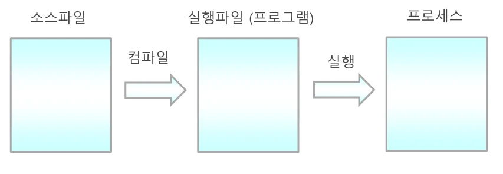
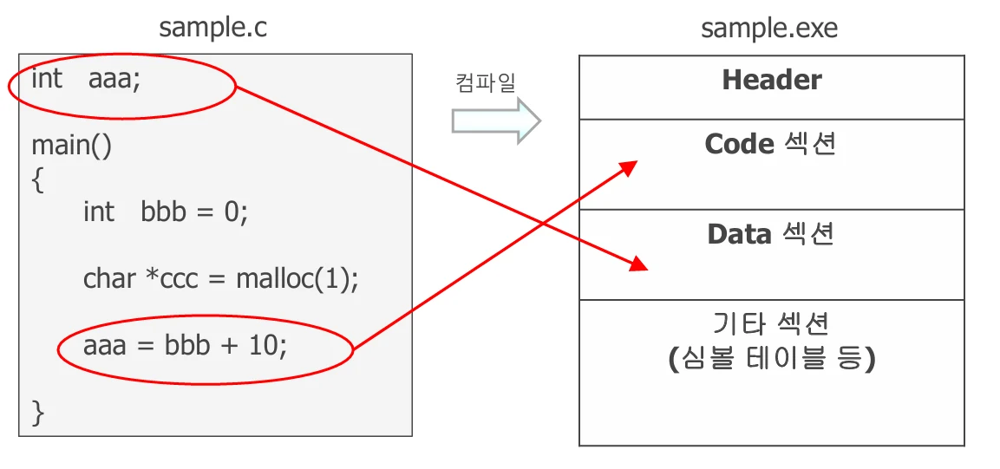
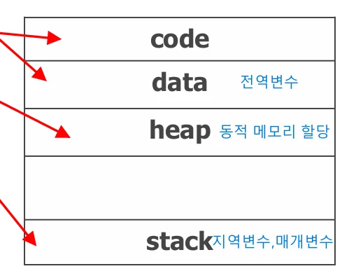

# [운영체제] 프로세스(Process) 란?

## 원문

https://ch010104.tistory.com/23

## 노트 유형

`concept`

## 핵심 개념과 선택 맥락

우리가 작성한 코드(sample.c)를 컴파일하면 **실행 파일(.exe 등)**이 생성됨

이 실행 파일이 실행되면 운영체제가 이를 메모리에 **적재(load)**하고, 프로세스로 생성

## 원문 기반 개념 정리

### 1. 프로세스란?

프로세스(Process) = 실행 중인 프로그램

우리가 작성한 코드(sample.c)를 컴파일하면 **실행 파일(.exe 등)**이 생성됨

이 실행 파일이 실행되면 운영체제가 이를 메모리에 **적재(load)**하고, 프로세스로 생성

프로세스는 단순히 코드 덩어리가 아닌, 실행을 위한 정보와 상태가 모두 포함

### 2. 실행 파일의 구조

컴파일

실행 파일의 구조

실행 후 메모리 구조 (프로세스 주소 공간) sample.c를 컴파일하면 sample.exe의 실행 파일이 생성됨!!

sample.exe를 실행하면 메모리에 만들어지는 프로세스가 생성됨.

프로세스의 구조

### 3. 프로세스의 구성 요소

프로세스의 구성 요소

프로세스의 구성 요소

메모리의 RAM 부분에 프로세스가 저장됨. CS, PC, DS, SS 등의 레지스터에 프로세스의 각각에 해당되는 주소가 저장!!

스택은 프로세스의 끝 주소를 시작 위치 값으로 가져, 높은 번지에서 낮은 번지 쪽으로 쌓임.

힙은 데이터(전역 변수) 저장 위치의 끝에서 부터 시작해서 스택과 반대로 쌓임.

### 4. PCB(Process Control Block)란?

운영체제가 프로세스를 관리하기 위해 유지하는 데이터 구조

각 프로세스가 만들어질 때 운영체제는 PCB를 생성하고, 프로세스가 종료되면 PCB를 제거

PCB의 내용

PCB 구조 예시 (C 구조체 형태)

위 그림과 같은 식으로 PCB에 정보가 저장되어 있음.

이전에 인터럽트 처리 과정에서 상태 레지스터 값, PC 값 등의 정보를 저장해놨다가 복원시에 사용한다고 했는데, 프로세스 PCB의 CPU registers에서 이러한 정보들을 저장함!!

## 핵심 이미지

## 관련 글

- [[blog/OS/index|OS]]
- [[blog/OS/운영체제- 사용자 인터페이스와 운영체제|[운영체제] 사용자 인터페이스와 운영체제]]
- [[blog/OS/운영체제- 프로세스의 상태(Process State) 란|[운영체제] 프로세스의 상태(Process State) 란?]]
- [[blog/OS/운영체제- 시스템 호출(System Call)과 운영체제|[운영체제] 시스템 호출(System Call)과 운영체제]]
