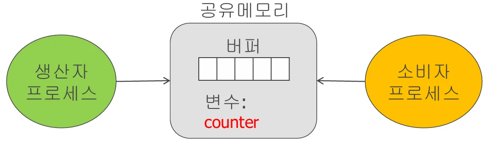

# [운영체제] 프로세스의 동기화( 생산자 - 소비자 )란?

## 원문

https://ch010104.tistory.com/61

## 노트 유형

`concept`

## 핵심 개념과 선택 맥락

동기화(Synchronization)는 병행(Concurrent) 프로세스들이 공유 자원을 사용할 때, **데이터의 일관성(Data Consistency)**을 유지하도록 접근을 순서화하는 기술

두 개 이상의 프로세스가 동시에 실행되며 같은 데이터를 공유할 때,

## 원문 기반 개념 정리

### 1. 프로세스 동기화란?

동기화(Synchronization)는 병행(Concurrent) 프로세스들이 공유 자원을 사용할 때, **데이터의 일관성(Data Consistency)**을 유지하도록 접근을 순서화하는 기술

왜 필요할까?

두 개 이상의 프로세스가 동시에 실행되며 같은 데이터를 공유할 때,

적절한 제어 없이 데이터를 동시에 변경하면, 오류나 충돌이 발생!!

### 2. 대표 예시: 생산자-소비자 문제



1) 개요

두 개의 프로세스: **생산자(Producer)**와 **소비자(Consumer)**가 존재

**공유 버퍼(Buffer)**를 통해 데이터를 주고받음

2) 버퍼 상태에 따른 동기화 필요

버퍼가 가득 차면, 생산자는 기다려야 함

버퍼가 비어 있으면, 소비자는 기다려야 함

### 3. 변수 정의 및 기본 구조

1) 생산자 프로세스

```text
while (1)
{
 /* produce an item and put in nextProduced */
 while (counter == BUFFER_SIZE)
 ;
// do nothing
 buffer [in] = nextProduced;
 in = (in + 1) % BUFFER_SIZE;
 counter++;
 }
```

> 원문 코드가 길어 이 노트에서는 앞부분만 보존했습니다. 전체는 원문에서 확인합니다.

2) 소비자 프로세스

```text
while (1)
{
 while (counter == 0)
 ;
// do nothing
 nextConsumed =  buffer[out];
 out = (out + 1) % BUFFER_SIZE;
 counter--;
 /*  consume the item in nextConsumed
 }
```

> 원문 코드가 길어 이 노트에서는 앞부분만 보존했습니다. 전체는 원문에서 확인합니다.

### 4. 데이터 일관성 문제: Race Condition

```text
counter++; // 생산자가 아이템 추가 시 counter--;
// 소비자가 아이템 제거 시, 서로 동시에 접근하면 일관성이 깨짐
// 왜냐하면 이 연산들은 실제로는 다음과 같은 기계어 수준의 여러 단계로 수행되기 때문
```

> 원문 코드가 길어 이 노트에서는 앞부분만 보존했습니다. 전체는 원문에서 확인합니다.

1) counter++ 실행 흐름

```text
register1 := counter
register1 := register1 + 1
counter := register1
```

> 원문 코드가 길어 이 노트에서는 앞부분만 보존했습니다. 전체는 원문에서 확인합니다.

2) counter-- 실행 흐름

```text
register2 := counter
register2 := register2 - 1
counter := register2
```

> 원문 코드가 길어 이 노트에서는 앞부분만 보존했습니다. 전체는 원문에서 확인합니다.

3) 문제 발생 예시 (context switch)

T0,T1 에서의 register의 변경된 값을 producer가 counter에 반영하기 전에, consumer가 counter의 값을 가져다가 사용해서 문제가 발생함.

결과적으로 counter는 5에서 6 → 4로 두 번 변했지만 실제 반영된 값은 4 → 데이터 손실 발생

## 관련 글

- [[blog/OS/index|OS]]
- [[blog/OS/운영체제- 임계 구역 문제 란|[운영체제] 임계 구역 문제 란??]]
- [[blog/OS/운영체제- CPU 스케줄링 알고리즘 이란|[운영체제] CPU 스케줄링 알고리즘 이란??]]
- [[blog/OS/운영체제- 교착상태 란|[운영체제] 교착상태 란??]]
