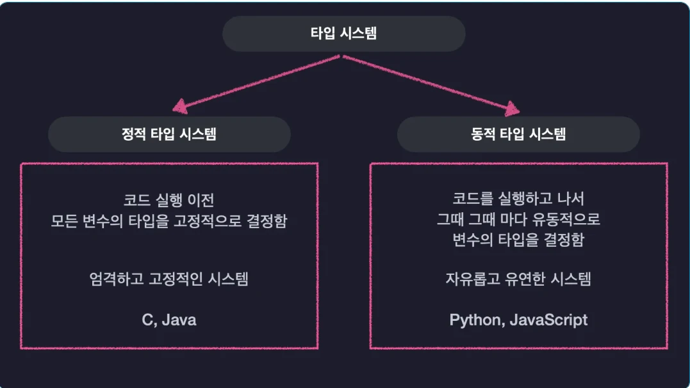
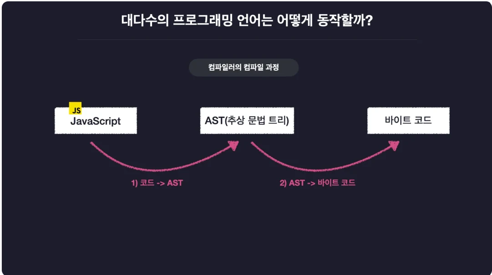

# [TypeScript] TypeScript란?? + 컴파일러 옵션 설정하기

## 원문

https://ch010104.tistory.com/103

## 노트 유형

`concept`

## 핵심 개념과 선택 맥락

대규모 프로젝트를 만들면서 자바스크립트만으로는 다음과 같은 한계를 겪게 됨.

간단한 코드에서는 문제 없지만, 규모가 커지면 예상치 못한 에러가 잦음

## 원문 기반 개념 정리

### 1. 타입스크립트가 필요한 이유

대규모 프로젝트를 만들면서 자바스크립트만으로는 다음과 같은 한계를 겪게 됨.

변수 타입 오류를 실행 중에야 알게 됨

간단한 코드에서는 문제 없지만, 규모가 커지면 예상치 못한 에러가 잦음

서비스 전체 중단 같은 치명적인 문제가 발생할 수 있음

이런 문제를 해결하기 위해 등장한 언어가 바로 타입스크립트(TypeScript) !!

### 2. 타입 시스템이란?

타입 시스템이란 프로그래밍 언어에서 사용하는 값들을 어떤 기준으로 타입으로 분류하고, 타입을 언제 어떻게 검사할지를 정의한 체계!

1) 정적 타입 시스템 vs 동적 타입 시스템

자바스크립트는 동적 타입 시스템을 채택하기 때문에 아래와 같은 문제가 발생할 수 있음

```text
// javascript
let a = "hello";
a = 123;
console.log(a.toUpperCase()); // ❌ 런타임 오류(실행은 되는데, 이 라인에 오면 그때 에러)
```

반면 Java 같은 정적 타입 언어에서는 다음과 같이 컴파일 단계에서 오류를 잡아냄

```text
// java
String a = "hello";
int b = 123;
int c = a * b; // ❌ 컴파일 에러
```

### 3. 타입스크립트의 장점: 점진적 타입 시스템

타입스크립트는 정적 타입 시스템의 안정성과, 동적 타입 시스템의 유연함을 동시에 제공하는 "점진적 타입 시스템 (Gradual Type System)"을 사용!!

```text
// typescript
const a: number = 1; // 직접 명시 가능
const b = "hello";   // 자동 추론 (b는 string 타입)
```

만약 타입 오류가 있다면, 컴파일 단계에서 에러를 발생시켜 실행되지 않도록 막음

```text
// typescript
const a: number = 123;
console.log(a.toUpperCase()); // ❌ 컴파일 에러
```

### 4. 타입스크립트는 어떻게 동작할까?

타입스크립트는 일반적인 언어와는 다르게 컴파일 시 JavaScript 코드로 변환

즉, 실행 전 타입 검사를 통과한 안전한 JavaScript 코드만 실행되므로 예기치 못한 오류를 방지할 수 있음.

### 5. 타입스크립트 실습 환경 구축

🗂 1) 폴더 구조 만들기

```text
mkdir onebite-typescript
cd onebite-typescript
mkdir section1
cd section1
```

📦 2) Node.js 패키지 초기화

```text
npm init -y
```

📚 3) @types/node 설치 (Node 기본 기능의 타입 정보)

```text
npm i @types/node
```

설치 후 node_modules/@types 폴더를 통해 Node.js 기능들의 타입 선언을 확인할 수 있음.

### 6. 타입스크립트 컴파일러 설치 및 실행

💾 1) 컴파일러 설치

```text
npm i -g typescript
```

버전 확인:

```text
tsc -v
```

📝 2) 첫 타입스크립트 파일 만들기

```text
mkdir src
touch src/index.ts
```

src/index.ts 내용:

```text
// src/index.ts
console.log("Hello TypeScript");
const a: number = 1;
```

▶ 3) 컴파일 및 실행

```text
tsc src/index.ts // ts 파일에 js 파일로 변환하여 새로 생성됨. 변환된 js 파일이 실행되지는 x
node src/index.js
```

출력 결과:

```text
Hello TypeScript
```

### 7. tsx 설치 (한 번에 실행)

```text
npm i -g tsx
tsx src/index.ts // ts 파일이 js 파일로 변환한 후, 자동으로 js 파일을 실행(js 파일로의 변환은 내부적으로 실행됨)
```

> 원문 코드가 길어 이 노트에서는 앞부분만 보존했습니다. 전체는 원문에서 확인합니다.

📌 tsx는 tsc + node를 한 번에 실행함.

### 8. tsconfig.json 설정

🧾1) 기본 생성

```text
tsc --init
```

이후 기본 옵션 제거하고 아래와 같이 설정

```text
// tsconfig.ts
{
  "compilerOptions": {
    "target": "ESNext", // 어떠한 방식으로 컴파일 할지
    "module": "esnext", // 어떠한 방식으로 모듈 컴파일 방식을 사용 할지
    "outDir": "dist", // tsc 컴파일 결과로 생성되는 js 파일을 dist 폴더에 저장
    "strict": false, // 타입스크립트가 파일을 엄격하게 검사할지 아닌지 결정
    "moduleDetection": "force", // 각 파일을 모두 전역(글로벌) 파일로 볼지(이 경우, 서로 다른 파일에 같은 이름의 변수 선언 x), 개별 파일(force)로 볼지
    "skipLibCheck": true, //타입 정의 파일의 타입 검사를 생략하는 옵션
  },
  "include": ["src"] // tsc 컴파일 할 때 src 폴더 안에 있는 모든 파일을 컴파일 해라
}
```

### 9. 주요 옵션 설명 및 실습

1) include

```text
"include": ["src"]
```

tsc 명령어로 src 폴더 전체 컴파일

2) target

```text
"target": "ES5" // 또는 "ESNext"
```

화살표 함수 변환 예시:

```text
const func = () => console.log("Hello");
```

ES5로 변환 시:

```typescript
var func = function () {
    console.log("Hello");
};
```

3) module

```text
"module": "CommonJS" // 또는 "ESNext"
```

CommonJS 사용 시:

```text
const hello = require("./hello");
```

ES 모듈 사용 시:

```text
import { hello } from "./hello";
```

4) outDir

```text
"outDir": "dist"
```

컴파일 결과 파일을 dist/ 디렉토리에 저장

5) strict

```text
"strict": true
```

엄격한 타입 검사 활성화

함수 인자의 타입 명시하지 않으면 오류 발생

```typescript
export const hello = (message) => {
  console.log("hello " + message);
};

// strict 모드에서는 오류 발생
```

6) moduleDetection

```text
"moduleDetection": "force"
```

모든 파일을 모듈로 간주하여 전역 변수 충돌 방지

### 10. 깃허브 코드 내용

https://github.com/Chaehyunli/typescript_study/tree/main/section1

## 핵심 이미지






## 관련 글

- [[blog/TYPESCRIPT/index|TYPESCRIPT]]
- [[blog/TYPESCRIPT/TypeScript- TypeScript의 다양한 타입(기본 타입, 원시 타입, 리터럴 타입 ....)|[TypeScript] TypeScript의 다양한 타입(기본 타입, 원시 타입, 리터럴 타입 ....)]]
- [[blog/TYPESCRIPT/TypeScript- TypeScript는 집합이다|[TypeScript] TypeScript는 집합이다]]
- [[blog/TYPESCRIPT/TypeScript- TypeScript의 함수와 타입|[TypeScript] TypeScript의 함수와 타입]]
