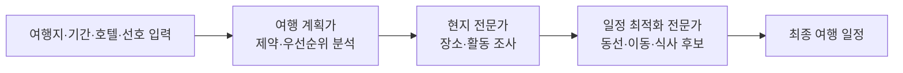

<callout icon="🤝" color="blue_bg">
	**정리 범위:** 사용자가 제공한 [CrewAI 실습 코드](https://github.com/jeong-wooseok/AIdoingai/tree/main/CrewAI_part)와 [YouTube 재생목록](https://www.youtube.com/playlist?list=PLuySsHNr_M9LqNWhSYIriJjPdJZgnhJCs)만 바탕으로 정리했다. 재생목록은 6개 영상·총 조회수 1,646회로 표시된다. 자막 API는 클라우드 IP 차단으로 원문 자막을 가져오지 못했으므로, 영상별 **제목·순서**와 GitHub의 대응 실습 코드를 교차해 정리했다.
</callout>
## 1. CrewAI란 무엇인가
제공된 실습에서 CrewAI는 여러 LLM 기반 **Agent**에게 역할·목표·배경·도구를 부여하고, **Task**로 작업을 나눈 뒤, **Crew**가 그 작업을 묶어 실행하게 하는 Python 구조다.
```plain text
입력값 → Agent별 역할 수행 → Task 결과 전달 → Crew가 실행·조율 → 최종 산출물
```
핵심 객체는 세 가지다.
<table fit-page-width="true" header-row="true">
<tr>
<td>객체</td>
<td>역할</td>
<td>제공된 코드에서의 예</td>
</tr>
<tr>
<td>`Agent`</td>
<td>누가 어떤 관점·능력으로 일하는지 정의</td>
<td>여행 계획가, 현지 전문가, 일정 최적화 전문가</td>
</tr>
<tr>
<td>`Task`</td>
<td>무엇을 하고 어떤 결과를 내야 하는지 정의</td>
<td>여행 제약 분석, 장소 추천, 일정 최적화</td>
</tr>
<tr>
<td>`Crew`</td>
<td>에이전트·태스크를 묶어 실행</td>
<td>`Crew(...).kickoff(inputs=...)`</td>
</tr>
</table>
## 2. 제공된 재생목록의 학습 흐름
재생목록은 아래 순서로 구성되어 있다.
1. [1. Intro — Crew AI로 Multi Agent 만들기](https://www.youtube.com/watch?v=QKjNmGM_LFw&list=PLuySsHNr_M9LqNWhSYIriJjPdJZgnhJCs&index=6) — 22분 47초
2. [2. 언어모델을 똑똑하게 만드는 6가지](https://www.youtube.com/watch?v=Lv2ScMY6JWA&list=PLuySsHNr_M9LqNWhSYIriJjPdJZgnhJCs&index=5) — 15분 19초
3. [3. 업무제휴 제안메일 멀티에이전트](https://www.youtube.com/watch?v=QCr2a8qmVtE&list=PLuySsHNr_M9LqNWhSYIriJjPdJZgnhJCs&index=4) — 15분 14초
4. [4. 주식 전략 Agent](https://www.youtube.com/watch?v=5Hpvhq2heRw&list=PLuySsHNr_M9LqNWhSYIriJjPdJZgnhJCs&index=3) — 24분 39초
5. [Claude 3.5 Pro 기반 여행 계획 MultiAgent](https://www.youtube.com/watch?v=nAieKeMCjSk&list=PLuySsHNr_M9LqNWhSYIriJjPdJZgnhJCs&index=2) — 10분
6. [GPT-4o mini 기반 해외여행 계획 애플리케이션](https://www.youtube.com/watch?v=cAD3hN1pzV0&list=PLuySsHNr_M9LqNWhSYIriJjPdJZgnhJCs&index=1) — 16분 49초
GitHub의 `CrewAI_part`는 이 흐름을 확장해 다음 실습을 담고 있다: 글 기획·작성·편집, 맞춤형 Agent, 업무제휴 이메일, 주식 투자 전략, 여행 일정, Streamlit 기반 여행·드라마 앱.
## 3. Agent를 설계하는 네 가지 정보
제공된 노트북의 Agent 정의는 대체로 다음 필드를 사용한다.
```python
Agent(
    role="역할 이름",
    goal="이 Agent가 달성해야 하는 결과",
    backstory="역할에 필요한 전문성·관점",
    tools=[...],
    llm=llm,
    allow_delegation=False,
    verbose=True,
)
```
- `role`: 팀 안에서의 책임 경계다. 예: `Content Planner`, `Content Writer`, `Editor`.
- `goal`: 성공 조건이다. 예: 최신 정보 기반의 콘텐츠 계획, 사실적인 글 작성, 편집 기준 준수.
- `backstory`: Agent가 어떤 전문성·관점을 유지할지 설명한다.
- `tools`: 검색·웹 스크래핑·파일 읽기·디렉터리 읽기·사용자 도구 등을 부여한다.
- `allow_delegation`: 다른 Agent에게 일을 위임할 수 있는지 설정한다. 여행 예제는 역할 간 위임을 허용한 변형과 제한한 변형을 모두 보여 준다.
## 4. Task는 ‘지시문’과 ‘완료 기준’을 함께 갖는다
제공된 코드에서 Task는 단순 프롬프트가 아니라 `description`과 `expected_output`을 함께 둔다.
```python
Task(
    description="사용자 선호도와 제약을 분석하고 여행 우선순위를 정한다.",
    expected_output="제약·선호도·우선순위가 포함된 상세 분석",
    agent=travel_planner,
)
```
이 구조가 중요한 이유는 역할 분담만으로는 결과 품질을 판정하기 어렵기 때문이다. 각 Task가 **누가**, **무엇을**, **어떤 형태로** 끝내야 하는지를 명시한다.
## 5. 가장 작은 멀티 에이전트 예제 — 기획 → 작성 → 편집
아래 예제는 제공된 `CrewAI1_intro/Create Agents to Research and Write an Article_jeong.ipynb`의 구조를 정리한 것이다. 원본은 `Content Planner`, `Content Writer`, `Editor`의 순차 작업과 `crew.kickoff(inputs={"topic": ...})` 실행을 사용한다.
```python
from crewai import Agent, Task, Crew

planner = Agent(
    role="Content Planner",
    goal="{topic}에 대한 정확하고 흥미로운 콘텐츠 계획을 만든다.",
    backstory="독자·핵심 메시지·목차를 설계하는 콘텐츠 기획자다.",
    allow_delegation=False,
    verbose=True,
)

writer = Agent(
    role="Content Writer",
    goal="기획안을 바탕으로 사실과 의견을 구분한 글을 작성한다.",
    backstory="기획 문서의 방향을 지키며 읽기 쉬운 글을 작성한다.",
    allow_delegation=False,
    verbose=True,
)

editor = Agent(
    role="Editor",
    goal="글의 문법·균형·조직의 글쓰기 기준을 검토한다.",
    backstory="주장과 의견을 점검하고 발행 가능한 Markdown으로 다듬는다.",
    allow_delegation=False,
    verbose=True,
)

plan = Task(
    description="{topic}의 독자, 핵심 포인트, 목차, 필요한 근거를 계획한다.",
    expected_output="독자 분석·목차·핵심 포인트가 담긴 콘텐츠 계획",
    agent=planner,
)

write = Task(
    description="콘텐츠 계획을 바탕으로 Markdown 초안을 작성한다.",
    expected_output="도입·본문·결론을 갖춘 Markdown 초안",
    agent=writer,
)

edit = Task(
    description="초안을 검토하고 발행 가능한 형태로 다듬는다.",
    expected_output="교정·편집된 최종 Markdown",
    agent=editor,
)

crew = Crew(
    agents=[planner, writer, editor],
    tasks=[plan, write, edit],
    verbose=2,
)

result = crew.kickoff(inputs={"topic": "멀티 에이전트 협업"})
print(result)
```
## 6. 실습 1 — 여행 일정 Agent
여행 예제는 하나의 큰 질문을 세 역할로 분해한다.

원본은 `travel_info`에 목적지·기간·도착/출발 시간·호텔·선호를 넣고 다음 세 Task를 둔다.
- 여행 계획가: 사용자 선호와 제약을 파악한다.
- 현지 전문가: 목적지의 장소·활동 목록을 만든다.
- 일정 최적화 전문가: 앞 단계 정보를 바탕으로 일자별 동선, 이동수단, 식사 후보를 구성한다.
```python
from crewai import Agent, Task, Crew

travel_planner = Agent(
    role="여행 계획가",
    goal="고객의 선호와 예산에 맞는 여행 계획을 수립한다.",
    backstory="맞춤형 여행 계획을 설계하는 전문가다.",
    tools=[search_tool],
    allow_delegation=False,
    verbose=True,
)

local_expert = Agent(
    role="도쿄 현지 전문가",
    goal="현지 문화와 추천 장소 정보를 제공한다.",
    backstory="현지 경험을 바탕으로 여행자에게 맞는 선택지를 제안한다.",
    tools=[search_tool],
    allow_delegation=False,
    verbose=True,
)

schedule_optimizer = Agent(
    role="일정 최적화 전문가",
    goal="시간·이동·선호를 반영한 일정으로 최적화한다.",
    backstory="여행 동선과 경험을 조율한다.",
    tools=[search_tool],
    allow_delegation=False,
    verbose=True,
)

crew = Crew(
    agents=[travel_planner, local_expert, schedule_optimizer],
    tasks=[analyze_task, recommend_task, schedule_task],
    verbose=1,
)

result = crew.kickoff()
```
GitHub의 업데이트 예제는 사용자가 음식·장소·활동 선호를 복수 선택하고, 세 항목의 우선순위에 가중치를 부여해 Task 설명에 넣는 방식으로 개인화를 확장한다. Streamlit 예제는 여행 정보 입력, 생성 결과 표시, 후속 질문을 하나의 앱 화면으로 묶는다.
## 7. 실습 2 — 업무제휴 이메일 Agent
`CrewAI3_업무제휴이메일Agent`는 영업 흐름을 두 Task로 나눈다.
1. **Sales Representative**가 검색·파일·지침 문서를 사용해 대상 회사의 프로필과 필요를 조사한다.
2. **Lead Sales Representative**가 그 조사 결과로 의사결정자 대상의 맞춤 제휴 이메일을 작성한다.
원본은 `DirectoryReadTool`, `FileReadTool`, `SerperDevTool`을 이용해 내부 지침과 검색 결과를 같이 활용하고, `SentimentAnalysisTool`이라는 사용자 도구 예제도 포함한다. `memory=True`를 둔 Crew도 있어, 실행 과정의 맥락 유지 방식을 보여 준다.
```python
lead_profile = Task(
    description="{lead_name}의 배경·최근 동향·잠재 필요를 조사한다. 확실한 정보만 사용한다.",
    expected_output="회사 배경, 주요 인력, 최근 동향, 맞춤 제안 방향",
    tools=[directory_read_tool, file_read_tool, search_tool],
    agent=sales_rep_agent,
)

outreach = Task(
    description="조사 보고서를 이용해 {key_decision_maker} 대상 맞춤 이메일 초안을 작성한다.",
    expected_output="개인화된 제휴 제안 이메일 초안",
    tools=[sentiment_analysis_tool, search_tool],
    agent=lead_sales_rep_agent,
)
```
## 8. 실습 3 — 주식 투자 전략 Agent
`CrewAI4_주식투자전략Agent`는 분석·전략·위험 평가의 역할 분리를 보여 준다.
- `data_analyst_agent`: 가격과 재무 데이터를 수집·분석한다.
- `trading_strategy_agent`: 분석을 바탕으로 전략을 만든다.
- `risk_management_agent`: 전략의 위험과 완화 방안을 검토한다.
원본은 `get_stock_price`, `get_financial_statement` 사용자 도구와 검색·스크래핑 도구를 사용하며, `Process.hierarchical`과 `manager_llm`을 둔 Crew로 상위 조율 방식을 보인다.
```python
from crewai import Process

financial_trading_crew = Crew(
    agents=[data_analyst_agent, trading_strategy_agent, risk_management_agent],
    tasks=[data_analysis_task, strategy_task, risk_task],
    manager_llm=manager_llm,
    process=Process.hierarchical,
    verbose=True,
)

result = financial_trading_crew.kickoff(inputs={
    "stock_selection": "TSLA",
    "risk_tolerance": "Medium",
    "trading_strategy_preference": "Monthly Trading",
})
```
이 예제는 **투자 조언·자동 매매 코드가 아니라**, 역할 분리와 계층적 Crew 실행을 설명하는 실습 구조로 읽어야 한다.
## 9. 도구와 앱 확장 예제
제공된 코드에는 다음 확장도 있다.
- 검색: `DuckDuckGoSearchRun`, `SerperDevTool`
- 웹·문서: `ScrapeWebsiteTool`, `WebsiteSearchTool`, `DirectoryReadTool`, `FileReadTool`
- 사용자 도구: 감성 분석, 가격·재무 정보 조회, 계산 함수
- UI: Streamlit으로 여행 계획·드라마 분석 화면 구성
- YouTube 활용: `VideosSearch`와 `YouTubeTranscriptApi`를 감싼 사용자 도구로 영상 검색·자막 수집 시도
즉 CrewAI는 역할을 나누는 것에서 끝나지 않고, **도구·문서·검색·UI를 Agent 작업에 연결**하는 형태로 확장된다.
## 10. 제공 코드에서 확인할 구현 포인트
- API 키는 노트북에서 `load_dotenv()`와 `os.getenv()`로 읽는다. 키를 코드나 노트에 직접 넣지 않는다.
- 예제마다 OpenAI·Anthropic·Groq·Gemini 등 서로 다른 LLM을 역할별로 지정한다. 모델을 Agent별로 다르게 배치할 수 있다는 점을 보여 준다.
- 검색이나 파일 읽기처럼 사실 근거가 필요한 Task는 도구를 명시적으로 붙이고, 결과물 형식은 `expected_output`으로 제한한다.
- 저장소는 교육용 실습 스냅샷이므로, 실제 실행 시에는 사용 중인 CrewAI·LangChain·도구 패키지 버전과 모델 식별자를 현재 환경에 맞춰 확인해야 한다.
## 11. 학습 순서 제안
1. 글 기획·작성·편집 예제로 `Agent → Task → Crew → kickoff` 흐름을 먼저 익힌다.
2. 여행 예제로 입력값·검색 도구·세 단계 결과 전달을 이해한다.
3. 업무제휴 이메일 예제로 파일·검색·사용자 도구·메모리를 연결한다.
4. 주식 전략 예제로 여러 전문 역할과 `Process.hierarchical` 조율 방식을 읽는다.
5. 마지막으로 Streamlit 예제를 통해 Crew 결과를 사용자가 입력·확인하는 앱으로 확장한다.
## 원문 출처
- [GitHub — jeong-wooseok/AIdoingai · CrewAI_part](https://github.com/jeong-wooseok/AIdoingai/tree/main/CrewAI_part)
- [YouTube — CrewAI 재생목록](https://www.youtube.com/playlist?list=PLuySsHNr_M9LqNWhSYIriJjPdJZgnhJCs)
- GitHub 확인 기준 커밋: `889d107a00109622b048cf2e3e7081fa97df6a02` (2026-05-07 KST)