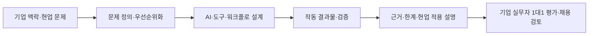

# 2026-07-24 — AX 인재전쟁 2026 | 참여 기업·출제 방식·본선 차별성

<callout icon="🏁" color="blue_bg">
	**조사 기준:** 2026년 7월 24일 KST 기준으로, 7월 18일 개최된 `AX 인재전쟁 2026`의 공식 행사 페이지, 보도, 공개 참가자 후기를 교차 확인했다. 과제의 상세 프롬프트·기업 데이터는 공개되지 않은 부분이 많아, 확인되지 않은 문제 내용은 추정하지 않았다.
</callout>
## 핵심 결론
`AX 인재전쟁`은 학력·경력보다 **AI를 이용해 모호한 현업 문제를 정의하고, 제한 시간 안에 작동 가능한 결과물로 만들고, 실무자 앞에서 근거·한계까지 방어하는 능력**을 검증한 채용형 서바이벌 해커톤이다.
총 **5,341명**이 지원했고, 약 **86대 1** 경쟁률을 거쳐 **60명**이 본선에 진출했다. 본선은 기업별 실제 업무 문제, 현장 비밀 과제, 1대1 질의응답으로 구성됐으며, 최종 우수 참가자 6명은 기업별 인터뷰·채용 절차 연계 대상이 됐다. [공감신문 보도](https://www.gokorea.kr/news/articleView.html?idxno=872616)
## 1. 행사 개요와 선발 방식
- **개최:** 2026년 7월 18일, 서울 워크모어 여의도 당산역점
- **주최:** 조코딩AX파트너스
- **공식 AI 협업사:** OpenAI
- **본선 선발:** 자체 개발·OpenAI 기술 검토를 거친 5단계 `AI 심사 에이전트`로 60명 선발
- **본선 방식:** 기업이 실제 현업 문제를 설계·출제 → 참가자가 제한 시간 안에 AI로 해결안·결과물을 작성 → 기업 실무자와 1대1 검증
- **추가 검증:** 기업 임원·실무자가 현장에서 비밀 과제를 공개했고, 답 자체뿐 아니라 문제 해석·근거·한계 인식·현업 적용성을 봤다.
[공식 행사 안내](https://hackathon.jocodingax.ai/)는 이를 `REAL PROBLEM → REAL JUDGE → REAL OUTPUT → REAL HIRING`으로 설명한다. 즉 외부 심사위원의 아이디어 경진대회가 아니라, **문제를 낸 기업이 실제로 통할지를 판단하는 채용 검증**이 핵심이다.
## 2. 직접 참여한 6개 기업과 채용 검토 범위
<table fit-page-width="true" header-row="true">
<tr>
<td>기업</td>
<td>공식 소개</td>
<td>공식 표기 채용 검토 범위</td>
</tr>
<tr>
<td>무신사</td>
<td>국내 온라인 의류 커머스</td>
<td>3명</td>
</tr>
<tr>
<td>카카오페이증권</td>
<td>증권·핀테크</td>
<td>본선 진출자 전원</td>
</tr>
<tr>
<td>채널코퍼레이션(채널톡)</td>
<td>올인원 고객 AI 플랫폼</td>
<td>30명</td>
</tr>
<tr>
<td>메디테라피</td>
<td>뷰티 예비 유니콘</td>
<td>6명</td>
</tr>
<tr>
<td>마이리얼트립</td>
<td>여행 테크 기업</td>
<td>본선 진출자 전원</td>
</tr>
<tr>
<td>삼일PwC</td>
<td>회계법인</td>
<td>5명</td>
</tr>
</table>
위 숫자는 [공식 참여 기업 페이지](https://hackathon.jocodingax.ai/)의 **‘채용 검토’ 표기**다. 이는 입사 확정 인원이 아니라, 해당 범위의 참가자를 채용 검토 대상으로 본다는 뜻이다. 대회 종료 보도는 기업별 우수 답변자 등 **최종 6명**을 별도 인터뷰·채용 절차로 연계한다고 밝혔다. [피앤피뉴스](https://www.gosiweek.com/article/1065576810334614)
## 3. 기업이 낸 문제 — 공개 범위와 확인된 사례
### 공통 형식: ‘정답 검색’이 아니라 기업별 실제 업무 문제
공식 자료가 공개한 범위에서, 6개 기업은 IT·금융·회계·패션 등 각자의 도메인에서 실제 마주한 문제를 직접 설계하고 출제했다. 본선 현장에서는 기업 실무 데이터를 다루고, 별도의 비밀 과제도 제시됐다. [공식 행사 안내](https://hackathon.jocodingax.ai/) · [공감신문 보도](https://www.gokorea.kr/news/articleView.html?idxno=872616)
다만 **무신사·마이리얼트립·메디테라피·채널코퍼레이션·카카오페이증권·삼일PwC의 본선 상세 문제 문구와 데이터는 공개 자료에서 확인되지 않았다.** 따라서 ‘어떤 모델을 만들었다’ 또는 ‘정확히 어떤 업무를 자동화했다’고 적는 것은 근거 없는 추정이 된다.
### 공개 참가 후기에서 확인된 삼일PwC 예선 문제의 형태
삼일PwC 트랙 본선 진출자가 공개한 [후기](https://blog.naver.com/unprecedented-hit/224348088352)는 예선이 **주제·데이터를 따로 주지 않고, 참여 기업의 실제 문제를 해결하는 Plugin을 만드는 과제**였다고 설명한다. 참가자는 외부 자료 조사로 문제를 정의하고, Plugin 제작까지 end-to-end로 수행해야 했다고 적었다.
이 사례가 뜻하는 바는 명확하다.
```plain text
문제·데이터를 받아 구현만 하기
        ↓
기업 맥락 리서치 → 문제 정의 → 해결 범위 설정 → Plugin/결과물 제작 → 검증·설명
```
즉 ‘AI 도구를 다룰 수 있는가’보다 **무엇을 해결해야 하는지 먼저 정하고, 그 판단을 제품 형태의 결과물로 닫는가**를 본 문제였다.
## 4. 기업별로 중요하게 본 것
아래는 [공식 행사 페이지의 출제 기업 인터뷰](https://hackathon.jocodingax.ai/)에서 각 기업이 직접 밝힌 인재상이다.
<table fit-page-width="true" header-row="true">
<tr>
<td>기업</td>
<td>한 줄 기준</td>
<td>구체적으로 본 역량</td>
</tr>
<tr>
<td>메디테라피</td>
<td>문제를 정의하고 인과관계를 꿰뚫는 사람</td>
<td>문제 정의력, 창발성</td>
</tr>
<tr>
<td>마이리얼트립</td>
<td>얼마나 집요한가</td>
<td>스스로 문제를 정하는 힘, 끝까지 해결하는 태도, 새 AI 기술을 자기 것으로 만드는 능력</td>
</tr>
<tr>
<td>무신사</td>
<td>깊은 생각을 결과로 잇는 사람</td>
<td>문제와 해결의 연결, 비즈니스 임팩트, 필요한 도구를 가리지 않는 태도</td>
</tr>
<tr>
<td>채널톡</td>
<td>도구·스펙보다 문제 푸는 법</td>
<td>왜 그렇게 푸는지의 판단, 본질 탐구, 고객 문제를 풀려는 열망</td>
</tr>
<tr>
<td>삼일PwC</td>
<td>AI로 기업 문제를 정의하고 기획하는 사람</td>
<td>기획 의도, 비정형 문제를 다루는 종합 판단, 기존 SOP에 맞춰 신뢰성 있게 답을 전달하는 관점</td>
</tr>
<tr>
<td>카카오페이증권</td>
<td>스스로 증명하는 Solver</td>
<td>문제의 논리적 분해, 해결 과정을 설계하는 힘, 정답의 근거와 사용자 신뢰를 만드는 능력</td>
</tr>
</table>
### 공통 분모
6개 기업의 표현은 다르지만 평가 항목은 네 가지로 수렴한다.
1. **문제 정의:** 주어진 요구를 그대로 구현하지 않고, 고객·업무·제약을 기준으로 풀 문제를 좁힌다.
2. **해결 과정 설계:** 모델·도구 선택보다 조사, 분해, 자동화 범위, 검증 흐름을 논리적으로 구성한다.
3. **작동하는 결과물:** 아이디어·프롬프트가 아니라 실제 기능 또는 업무 흐름으로 끝낸다.
4. **설명·신뢰:** 근거·한계·현업 적용 조건을 실무자가 납득할 수 있게 방어한다.
## 5. 본선 진출자와 수상자의 차별성 — 실제 사례
### 1위 유재민 — 마이리얼트립 과제
[피앤피뉴스 보도](https://www.gosiweek.com/article/1065576810334614)에 따르면 **유재민 씨**가 마이리얼트립 과제로 1위를 차지했다. 공개 보도는 세부 산출물을 밝히지 않았지만, 우승자는 실무진 앞에서 **문제를 어떻게 봤는지, 답변의 근거와 한계를 어떻게 설명했는지**가 핵심 검증 경험이었다고 말했다.
→ 차별점은 ‘답을 냈다’에서 멈추지 않고 **문제 관점·근거·한계를 직접 방어할 수 있는 결과물**이었다는 점이다.
### 2위 조영탁 — 삼일PwC 과제 / 3위 권상윤 — 채널톡 과제
같은 보도는 **조영탁 씨가 삼일PwC 과제로 2위**, **권상윤 씨가 채널톡 과제로 3위**를 했다고 확인한다. 두 사람의 과제 상세 구현은 공개되지 않았다. 다만 평가 현장에서는 문제 해석, 해결 방식, 근거, 한계 인식, 현업 적용 가능성이 함께 검증됐으므로, 단순 프로토타입 시연만으로 순위가 정해졌다고 볼 수 없다.
### 본선 진출 공개 사례 A — 삼일PwC 트랙 참가자 ‘공 전’
[개인 후기](https://blog.naver.com/unprecedented-hit/224348088352) 작성자는 5,341명 중 60명에 들었다고 밝히며, **주제와 데이터가 없는 상태에서 리서치부터 문제 정의, 실제 문제 해결 Plugin 제작까지** 끝낸 흐름을 설명했다. 이 후기는 댓글 21개가 확인된다.
→ 차별점: 모호한 입력을 기다리지 않고 **기업 맥락을 조사해 문제를 재구성한 뒤, end-to-end 결과물로 만들었다는 점**.
### 본선 진출 공개 사례 B — ‘스피릿의 압도적 인사이트’ 작성자
[공개 후기](https://contents.premium.naver.com/sprinsite/spr/contents/260717001254135vc) 작성자는 5,300여 명 중 60위 안에 들어 본선에 진출했다고 밝혔다. 작성자 본인 주장에 따르면 약 **8시간 43분**, AI 메시지 **26개**, 비캐시 입·출력 약 **153만 토큰**으로 코드 작성, 문서 작성, 테스트, 제출 패키지 정리까지 진행했고, 별도 멀티 에이전트는 쓰지 않았다.
중요한 것은 사용량 자체가 아니라, 작성자가 밝힌 핵심 기준이다. **무엇을 만들지·어디까지 자동화할지·어떤 기준으로 검수할지**를 정하는 일이 도구 조작보다 중요했다고 설명했다.
→ 차별점: Agent 수나 토큰 사용량이 아니라 **범위 통제·검수 기준·제출 가능한 패키지화**였다. 이 수치는 개인의 자기 보고이므로 일반 성과 기준으로 확대 해석하면 안 된다.
## 6. ‘AX 인재’로 평가받은 방식

이 대회가 보여 준 차이는 ‘AI를 썼다’가 아니다.
- **입력:** 정제된 문제 대신 기업 맥락과 불완전한 정보
- **과정:** 문제를 스스로 정의하고, AI를 어떤 역할에 쓸지 설계
- **출력:** 작동 가능한 기능·Plugin·업무 결과물
- **검증:** 실무자 Q&A에서 선택의 근거와 한계를 설명
- **판정:** 현업 적용 가능성과 채용 가능성
## 7. 최근 소식과 해석
- 대회 종료 후 공개 보도 기준으로 최종 **6명**이 참여 기업의 별도 인터뷰·채용 절차에 연계될 예정이다. 이는 **채용 확정 발표가 아니라 절차 연계**다. [피앤피뉴스](https://www.gosiweek.com/article/1065576810334614)
- 주최 측은 참가자의 과제 해결 과정, 기업 심사위원의 평가, 기업의 AX 전략과 출제 의도를 담은 숏폼·다큐멘터리 영상을 조코딩 YouTube 채널에 순차 공개할 계획이라고 밝혔다. 이 공개가 이뤄지면 현재 비공개인 기업별 상세 문제·수상 결과물의 근거가 추가될 수 있다. [피앤피뉴스](https://www.gosiweek.com/article/1065576810334614)
- 따라서 지금 단계에서는 ‘기업별 문제를 정확히 복원’하기보다, **문제 정의 → 작동 결과물 → 실무 Q&A**라는 검증 구조와 공개된 참가 사례를 보는 것이 더 정확하다.
## 원문 출처
- [AX 인재전쟁 2026 공식 페이지](https://hackathon.jocodingax.ai/) — 참여 기업, 채용 검토 범위, 기업별 인재상, 행사 방식
- [공감신문 — 5,341명 지원·60명 본선·1위 유재민](https://www.gokorea.kr/news/articleView.html?idxno=872616)
- [피앤피뉴스 — 1·2·3위 과제 기업 및 6명 채용 절차 연계](https://www.gosiweek.com/article/1065576810334614)
- [삼일PwC 트랙 본선 진출자 공개 후기](https://blog.naver.com/unprecedented-hit/224348088352) — 문제 정의부터 Plugin 제작까지의 예선 사례
- [본선 진출자 공개 후기](https://contents.premium.naver.com/sprinsite/spr/contents/260717001254135vc) — 작업·검수·패키지화 방식의 개인 사례
## 확인 한계
- 기업별 본선 세부 문제 문구·사용 데이터·수상 결과물은 공식 자료에서 공개하지 않았다.
- 개인 후기는 작성자 자기 보고이며, 공식 채점 기준·수상 이유 전체를 대체하지 않는다.
- ‘채용 검토’와 ‘별도 인터뷰 연계’는 실제 입사 확정과 다르다.

[[notion/Information/index|Information 리서치 아카이브]]
