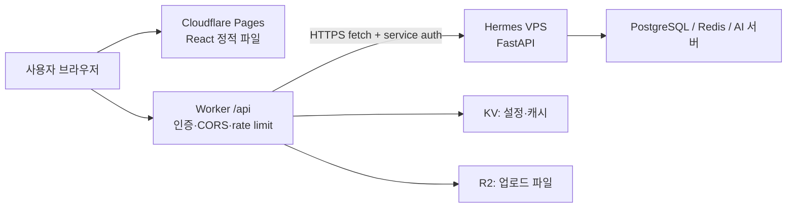
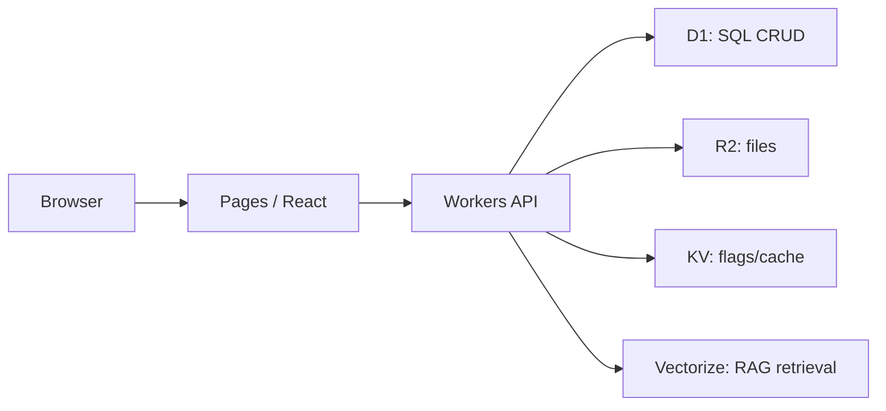

<callout icon="☁️" color="blue_bg">
	**목적**: React·FastAPI 조합을 기준으로 Cloudflare를 처음부터 선택·배포·운영하는 실전 매뉴얼입니다. Workers, Pages, KV, D1, R2, Vectorize, GitHub CI/CD와 기존 Hermes VPS·AWS의 역할 분리를 한 문서에 묶었습니다.<br>**조사 기준**: 2026-07-26 KST. 제품 동작·제약은 Cloudflare 공식 문서를 우선했으며, 비용·플랜은 수시로 바뀌므로 배포 전 공식 Pricing/Limit 페이지를 다시 확인해야 합니다.
</callout>
<table_of_contents color="blue"/>
## 0. 3분 요약
- **Cloudflare Workers**는 서버를 직접 관리하지 않고 edge 네트워크에서 요청 단위 코드를 실행하는 서버리스 런타임이다. API gateway, 인증, 리다이렉트, 작은 CRUD, 캐시 제어, 외부 API 프록시에 좋다.
- **Cloudflare Pages**는 React/Vite 같은 프런트엔드의 정적 산출물을 Git과 연결해 전역 CDN에 배포하는 서비스다. `main`은 production, PR은 preview URL로 운영하기 쉽다.
- **KV**는 전 세계 읽기 성능에 강한 key-value 저장소다. 설정, feature flag, 캐시성 응답, 선호도에 맞고, 강한 즉시 일관성이 필요한 주문·잔액·권한 원장에는 맞지 않는다.
- **Spring Boot/AI/GPU** 서버는 Workers 내부에서 그대로 실행하지 않는다. 기존 FastAPI는 기본적으로 VPS/AWS에서 운영하고 Workers가 HTTPS로 호출하는 혼합 구조가 현실적이다. 단, **Python Workers open beta의 FastAPI ASGI 지원**은 별도 호환성 PoC 뒤에만 제한적으로 검토한다.
- 처음에는 **Pages(React) + Workers(얇은 API/BFF) + 기존 FastAPI VPS**로 시작하고, 단순 데이터만 D1/R2/KV로 옮기는 점진 전환이 안전하다.
---
## 1. 먼저 잡아야 할 지도 — Cloudflare는 무엇을 대신하는가?
Cloudflare는 단일 VM을 빌려 주는 서비스만이 아니라, DNS·TLS·CDN·WAF·DDoS 방어와 edge compute·데이터 서비스를 같은 네트워크 위에 제공하는 플랫폼이다. 따라서 **"모든 백엔드를 Cloudflare로 이사"**하는 것보다, 요청 경로별로 알맞은 실행·저장 계층을 고르는 것이 핵심이다.
<table fit-page-width="true" header-row="true">
<tr color="blue_bg">
<td>계층</td>
<td>무엇을 둔다?</td>
<td>대표 Cloudflare 제품</td>
</tr>
<tr>
<td>전달·보안</td>
<td>도메인, DNS, HTTPS, CDN, WAF, rate limit</td>
<td>DNS, CDN, WAF</td>
</tr>
<tr>
<td>프런트엔드</td>
<td>React 정적 파일과 routing</td>
<td>Pages 또는 Workers Static Assets</td>
</tr>
<tr>
<td>edge API</td>
<td>인증 전처리, 요청 검증, cache, 작은 CRUD, upstream proxy</td>
<td>Workers</td>
</tr>
<tr>
<td>관계 데이터</td>
<td>사용자·게시물·권한 같은 SQL 데이터</td>
<td>D1 또는 PostgreSQL</td>
</tr>
<tr>
<td>파일</td>
<td>이미지, PDF, 업로드, 모델 입력 파일</td>
<td>R2</td>
</tr>
<tr>
<td>검색·AI</td>
<td>임베딩 유사도 검색, RAG retrieval</td>
<td>Vectorize + Workers AI/외부 LLM</td>
</tr>
<tr>
<td>무거운 실행</td>
<td>FastAPI, Spring Boot, GPU 추론, 긴 작업, 기존 DB 드라이버</td>
<td>기존 VPS 또는 AWS</td>
</tr>
</table>
## 2. 질문 1 — Workers와 KV란 무엇이며, 언제 쓰는가?
### Workers
Workers는 Cloudflare edge에서 `fetch()` 요청, cron, queue 등의 이벤트에 반응해 실행되는 서버리스 코드다. 일반적으로 TypeScript/JavaScript를 가장 자연스럽게 사용하며, HTTP 응답을 즉시 만들거나 다른 서비스로 프록시한다.
**강점**
- 사용자의 요청에 가까운 edge에서 실행되어 CDN·WAF·DNS와 한 경로로 결합된다.
- VM 패치·프로세스 재시작·autoscaling 그룹을 직접 운영하지 않는다.
- KV/D1/R2/Vectorize 같은 **binding**을 통해 자격 증명을 코드에 하드코딩하지 않고 접근할 수 있다.
**적합한 유스케이스**
- `/api/*` BFF(API for Frontend), JWT 검증, 역할별 라우팅, CORS·rate limit 전처리
- 외부 FastAPI/Spring API의 보안 프록시와 response cache
- 짧은 webhook 처리, URL shortener, feature flag, A/B routing
- D1을 이용한 작은 서비스의 CRUD API
**맞지 않는 유스케이스**
- JVM·CPython 웹 서버를 상시 프로세스로 띄우기
- GPU 추론, 무거운 native 라이브러리, 무제한 실행 시간, 대용량 in-memory state
- TCP 연결을 장시간 점유하는 전통적 서버 프로세스 모델
[Workers 공식 개요](https://developers.cloudflare.com/workers/) · [Workers 제한](https://developers.cloudflare.com/workers/platform/limits/)
### Workers KV
KV는 **전역 읽기 중심 key-value 저장소**다. Cloudflare 공식 설명대로 데이터는 소수의 중앙 저장소에 기록되고, 접근 뒤 각 데이터센터 cache에 저장된다. 같은 위치에서 반복 읽기는 빠르지만, 최초 cold read는 더 느릴 수 있다.
**좋은 예**
- feature flag: `maintenance_mode=true`
- 국가·언어별 설정, 사용자 UI 선호도, 공개 config
- API 응답 cache, A/B experiment assignment
- 읽기가 압도적으로 많고 약간 오래된 값도 허용되는 메타데이터
**피해야 할 예**
- 재고 차감, 결제 잔액, 동시 갱신이 많은 카운터, 즉시 권한 회수처럼 **강한 read-after-write 일관성**이 필요한 원장
- 관계형 join, 복잡한 조건·정렬·트랜잭션이 필요한 데이터
KV는 인증 관련 데이터를 저장할 수는 있지만, 토큰 원장·즉시 revoke처럼 일관성 요구가 높은 보안 상태는 특히 신중히 설계해야 한다. 캐시 TTL·전파 특성을 이해하지 않은 채 DB 대용으로 쓰면 오류가 생긴다.
[KV 개요](https://developers.cloudflare.com/kv/) · [KV 동작과 hot/cold read](https://developers.cloudflare.com/kv/concepts/how-kv-works/)
## 3. 질문 2 — 웹사이트와 API를 누구나 접속하게 배포할 수 있는가?
**가능하다.**
- **정적 React 웹사이트**: Pages에 배포하면 `프로젝트.pages.dev` URL이 생기고, custom domain을 연결할 수 있다.
- **Workers API**: `workers.dev` 또는 own domain route/custom domain으로 공개 HTTPS API를 만들 수 있다.
- **기존 FastAPI/Spring API**: VPS/AWS에서 실행한 뒤, Cloudflare DNS·Proxy 또는 Cloudflare Tunnel을 앞에 두어 공개할 수 있다.
공개 배포는 곧 보안·권한·비용·장애 대응까지 공개된다는 뜻이다. 최소한 HTTPS, CORS 정책, 인증, secret 분리, rate limit, 로그·오류 관측을 함께 설정해야 한다.
[Pages 개요](https://developers.cloudflare.com/pages/) · [Workers custom domains](https://developers.cloudflare.com/workers/configuration/routing/custom-domains/)
## 4. 질문 3·10 — Workers 안에서 Spring Boot/FastAPI를 실행할 수 있는가? 가벼운 FastAPI CRUD는?
### 결론
- **Spring Boot를 Workers 내부에서 직접 실행: 불가에 가깝다.** Spring Boot는 JVM과 장기 실행 웹 서버 프로세스를 전제로 한다. Workers isolate는 JVM 서버를 띄우는 환경이 아니다.
- **FastAPI를 Workers에서 실행: 공식 지원되나, Python Workers open beta다.** Cloudflare의 내장 ASGI server를 통해 `asgi.fetch(app, request, env)` 형태로 FastAPI 앱을 연결할 수 있다. 하지만 이는 Uvicorn/Gunicorn을 상시 실행하는 일반 Linux CPython 서버 모델이 아니며, 기존 production 앱을 수정 없이 이전한다고 보장할 수 없다.
- **Workers에서 Python 사용: 가능하지만 일반 CPython 서버와 다르다.** Pyodide/WASM 기반이며 native extension, OS process/thread, 지속 파일시스템·장기 worker 의존성은 별도 검증이 필요하다.
- **가벼운 FastAPI CRUD**는 Python Worker beta에서 PoC할 수 있고, Worker + D1의 JavaScript/TypeScript CRUD로도 구현할 수 있다. 반대로 기존 복잡한 FastAPI 서비스는 VPS/AWS에 유지하고 Worker가 `fetch()` gateway가 되는 편이 안전하다.
### 권장 선택
<table fit-page-width="true" header-row="true">
<tr color="blue_bg">
<td>상황</td>
<td>권장</td>
<td>이유</td>
</tr>
<tr>
<td>단순 CRUD·인증·작은 API</td>
<td>Worker + D1</td>
<td>배포·확장이 단순하고 edge binding 사용</td>
</tr>
<tr>
<td>기존 FastAPI 코드·Pydantic·Celery·무거운 라이브러리</td>
<td>VPS/AWS FastAPI 유지 + Worker proxy</td>
<td>재작성과 호환성 위험을 피함</td>
</tr>
<tr>
<td>Spring/JPA/PostgreSQL 엔터프라이즈 서비스</td>
<td>AWS/VPS Spring Boot + Cloudflare edge</td>
<td>JVM·connection pool·운영 모델을 유지</td>
</tr>
<tr>
<td>GPU/대형 AI 추론</td>
<td>GPU VPS/AWS/AI provider + Worker gateway</td>
<td>Workers는 GPU 서버 대체가 아님</td>
</tr>
</table>
[Python Workers 공식 문서](https://developers.cloudflare.com/workers/languages/python/) · [Workers fetch API](https://developers.cloudflare.com/workers/runtime-apis/fetch/)
## 5. 질문 4 — React + FastAPI의 가장 현실적인 구조
### A. 점진 전환형 — 기존 VPS가 이미 있을 때 추천

- React는 Pages가 제공한다.
- browser가 FastAPI origin을 직접 부르지 않고 같은 도메인의 `/api/*` Worker를 호출하게 하면 CORS·인증·upstream URL 노출을 한곳에서 관리하기 쉽다.
- Worker는 FastAPI에 HTTPS `fetch()`를 하되, upstream origin은 rate limit과 서비스 인증으로 보호한다.
- private origin을 인터넷에 무방비 노출하지 않고 싶다면 **Cloudflare Tunnel**을 검토한다. Tunnel은 outbound connection을 통해 private network의 origin을 Cloudflare에 연결하는 방식이다.
### B. Cloudflare-native 소형 서비스

블로그, 포트폴리오, 작은 SaaS MVP, 관리 도구처럼 API와 데이터 요구가 단순할 때 좋다. 이후 복잡한 relation·쓰기 경쟁·전문 검색·background 처리 요구가 커지면 PostgreSQL/queue/별도 backend로 분리한다.
[Cloudflare Tunnel 개요](https://developers.cloudflare.com/cloudflare-one/connections/connect-networks/) · [Workers service bindings](https://developers.cloudflare.com/workers/runtime-apis/bindings/service-bindings/)
## 6. 질문 5·6 — KV 외 데이터 제품과 D1 vs PostgreSQL
<table fit-page-width="true" header-row="true">
<tr color="blue_bg">
<td>제품</td>
<td>저장 모델</td>
<td>주 용도</td>
<td>주의점</td>
</tr>
<tr>
<td>KV</td>
<td>key-value, 읽기 cache 중심</td>
<td>config, flag, preference, cached API 결과</td>
<td>일관성·transaction DB로 쓰지 않기</td>
</tr>
<tr>
<td>D1</td>
<td>managed serverless SQL, SQLite semantics</td>
<td>작은·중간 규모의 app CRUD, tenant 격리 DB</td>
<td>PostgreSQL 문법·확장·운영 모델과 동일하지 않음</td>
</tr>
<tr>
<td>R2</td>
<td>object storage, S3-compatible API</td>
<td>이미지, PDF, 영상, user upload, backup export</td>
<td>query DB가 아니라 파일 object store</td>
</tr>
<tr>
<td>Vectorize</td>
<td>vector index + metadata filter</td>
<td>semantic search, recommendation, RAG retrieval</td>
<td>원본 문서·권한 원장은 D1/R2/Postgres에 별도 보관</td>
</tr>
<tr>
<td>Durable Objects</td>
<td>단일 instance에 연결된 상태·조정</td>
<td>실시간 방, websocket coordination, 강한 단일 객체 상태</td>
<td>일반 관계형 DB의 대체재가 아님</td>
</tr>
<tr>
<td>Queues</td>
<td>비동기 메시지</td>
<td>업로드 후 처리, email, retry, 긴 작업 분리</td>
<td>consumer의 idempotency가 필요</td>
</tr>
</table>
### D1과 PostgreSQL의 구조적 차이
<table fit-page-width="true" header-row="true">
<tr color="blue_bg">
<td>관점</td>
<td>D1</td>
<td>PostgreSQL</td>
</tr>
<tr>
<td>SQL 계열</td>
<td>SQLite SQL semantics</td>
<td>PostgreSQL dialect</td>
</tr>
<tr>
<td>운영 형태</td>
<td>Cloudflare 관리형 serverless, Worker/HTTP API</td>
<td>독립 client-server DB; self-managed 또는 RDS 등 managed</td>
</tr>
<tr>
<td>접속 방식</td>
<td>Worker binding, HTTP API, Wrangler migration</td>
<td>TCP connection, driver, connection pool, ORM</td>
</tr>
<tr>
<td>적합한 영역</td>
<td>edge app CRUD·간단한 관계 데이터</td>
<td>복잡한 transaction, 확장, 분석, 높은 쓰기 경쟁, 기존 생태계</td>
</tr>
<tr>
<td>마이그레이션</td>
<td>SQL migration을 Wrangler로 적용</td>
<td>ORM migration/Flyway/Liquibase 등 다양한 방식</td>
</tr>
</table>
D1은 "PostgreSQL을 edge로 옮긴 것"이 아니라, **SQLite 의미론을 가진 Cloudflare managed serverless SQL**이다. 기존 FastAPI + SQLAlchemy + PostgreSQL 시스템을 D1으로 바꾸려면 SQL dialect, migration, extension, concurrency 요구를 별도로 검증해야 한다.
[D1 공식 개요](https://developers.cloudflare.com/d1/) · [D1 migrations](https://developers.cloudflare.com/d1/reference/migrations/) · [R2 공식 개요](https://developers.cloudflare.com/r2/) · [Vectorize 공식 개요](https://developers.cloudflare.com/vectorize/)
## 7. 질문 7·8 — Cloudflare edge vs AWS Region vs 단독 VPS
<table fit-page-width="true" header-row="true">
<tr color="blue_bg">
<td>관점</td>
<td>Cloudflare Workers/Pages</td>
<td>AWS Region 중심</td>
<td>단독 VPS</td>
</tr>
<tr>
<td>기본 실행 위치</td>
<td>요청을 edge 네트워크에서 처리</td>
<td>선택한 Region/AZ의 compute</td>
<td>선택한 한 서버 위치</td>
</tr>
<tr>
<td>인프라 운영</td>
<td>서버·autoscaling 관리 최소화</td>
<td>서비스 선택 폭이 넓고 운영 설계 필요</td>
<td>OS·패치·백업·proxy·배포를 직접 책임</td>
</tr>
<tr>
<td>강점</td>
<td>글로벌 정적 전달, edge 보안/캐시, 빠른 small API</td>
<td>VM·컨테이너·DB·GPU 등 완전한 cloud building blocks</td>
<td>단순·예측 가능한 환경, 모든 런타임 제어</td>
</tr>
<tr>
<td>제약</td>
<td>long-running process·JVM·일반 CPython·GPU 부적합</td>
<td>서비스 수가 많고 region/network/cost 설계 필요</td>
<td>단일 장애점·확장·보안 운영 부담</td>
</tr>
<tr>
<td>추천</td>
<td>front, edge API, CDN/WAF, cache</td>
<td>Spring, FastAPI container, managed PostgreSQL, GPU</td>
<td>작은 기존 backend, 실험, 고정 워크로드</td>
</tr>
</table>
**중요한 오해 방지**: edge는 모든 요청이 자동으로 빠르다는 뜻이 아니다. Worker가 서울에서 실행되더라도, 최종 데이터가 미국 VPS/PostgreSQL에 있으면 왕복 지연은 남는다. 읽기 cache를 edge에 두거나, 데이터와 compute의 위치를 맞추는 설계가 필요하다.
AWS는 Region 안에 여러 AZ를 두는 구조로 애플리케이션 compute·데이터 계층을 배치한다. Cloudflare는 Workers/Pages 요청 처리와 보안·CDN을 edge에 가져가는 데 강하다. 둘은 경쟁만 하는 관계가 아니라, **Cloudflare를 AWS/VPS origin 앞단**으로 쓰는 조합이 흔하다.
[AWS Regions/AZ 공식 설명](https://aws.amazon.com/about-aws/global-infrastructure/regions_az/) · [Cloudflare network](https://www.cloudflare.com/network/)
## 8. 질문 9 — Pages와 Vercel: Pages가 유리한 경우, Vercel이 유리한 경우
둘 다 Git 기반 preview와 글로벌 CDN을 제공한다. 따라서 "Pages가 항상 더 좋다"는 결론은 맞지 않는다.
<table fit-page-width="true" header-row="true">
<tr color="blue_bg">
<td>선택 기준</td>
<td>Cloudflare Pages가 유리한 경우</td>
<td>Vercel이 유리한 경우</td>
</tr>
<tr>
<td>이미 쓰는 플랫폼</td>
<td>Cloudflare DNS/WAF/Workers/D1/R2/KV를 한 경로로 묶고 싶을 때</td>
<td>Next.js 중심 기능·문서·운영 흐름을 우선할 때</td>
</tr>
<tr>
<td>백엔드 결합</td>
<td>Workers binding과 Pages를 가깝게 조합할 때</td>
<td>Vercel Functions/Next server 기능을 중심으로 만들 때</td>
</tr>
<tr>
<td>프런트엔드</td>
<td>React/Vite 정적 SPA, Cloudflare edge 규칙</td>
<td>Next.js rendering·framework-aware workflow를 적극 활용할 때</td>
</tr>
<tr>
<td>판단 방법</td>
<td>Cloudflare stack을 이미 쓰면 운영 surface가 줄어든다</td>
<td>개발팀이 Next.js·Vercel 운영 경험이 있으면 생산성이 높을 수 있다</td>
</tr>
</table>
Vercel 역시 글로벌 CDN·preview·edge runtime을 제공한다. Pages의 실질적 장점은 **Cloudflare 보안/네트워크와 Workers·R2·D1·KV를 같은 계정·도메인 흐름으로 통합**하기 좋다는 점이다. 반대로 Next.js의 최신 플랫폼 기능 의존도가 높다면 Vercel을 먼저 비교해야 한다.
[Pages Git integration](https://developers.cloudflare.com/pages/configuration/git-integration/) · [Vercel CDN 개요](https://vercel.com/docs/cdn)
## 9. 질문 11 — 서버리스의 정확한 뜻과 VPS 통신
**Serverless는 서버가 없다는 뜻이 아니다.** 서버 provisioning, instance lifecycle, scaling, 일부 capacity 운영을 플랫폼이 맡고 개발자는 요청/이벤트 핸들러와 설정에 집중하는 실행 모델이다.
- VPS: 내가 OS·Docker·systemd·Nginx·autoscaling·patch를 관리한다.
- Serverless Worker: 내가 handler·binding·secret·limit·observability를 관리하고, 서버 instance 배치는 플랫폼이 맡는다.
- DB는 여전히 존재하며, serverless는 데이터 모델·보안·backups를 없애지 않는다.
**Worker ↔ VPS 통신 기본**: Worker에서 `fetch("https://api-origin.example.com/...")`로 HTTPS 호출한다. 이때 upstream에는 서비스 간 인증, timeout/retry, request ID, rate limit, strict CORS를 적용한다. private VPS를 origin으로 안전하게 노출하려면 Cloudflare Tunnel을 사용할 수 있다. DB 포트·관리 포트를 browser 또는 공개 Worker에 직접 열지 않는다.
## 10. 질문 12 — 컴파일 언어·인터프리터 언어와 WASM
- **TypeScript/JavaScript**: Workers의 기본적인 선택이다. TypeScript는 build 때 JavaScript로 변환되어 Workers runtime에서 실행된다.
- **Rust/C/C++/Go 등**: 일부 로직을 WebAssembly(WASM) 모듈로 컴파일해 Worker에서 호출할 수 있다. 단, 일반 OS process, 임의 filesystem, fork/thread, 모든 native library가 그대로 되는 것은 아니다. WASM runtime 제약에 맞게 설계해야 한다.
- **Python**: Python Workers는 Pyodide 기반으로 실행된다. 따라서 일반 Linux CPython, `pip install`한 모든 native dependency, FastAPI ASGI server를 그대로 옮기는 방식이 아니다.
- **Java/Kotlin**: Spring Boot는 JVM 실행을 전제로 하므로 Workers 안에서 실행하는 모델이 아니다. AWS ECS/EKS/Lambda container 또는 VPS가 더 자연스럽다.
결론적으로 WASM은 "모든 언어 서버를 Worker에 이식"하는 만능 포맷이 아니라, 런타임 제약을 수용한 계산 모듈을 edge에서 실행하는 방법이다.
## 11. 따라 하기 — 첫 React + Worker + VPS FastAPI 배포
### 준비물
- Cloudflare 계정, GitHub 계정, React/Vite repository
- FastAPI가 실행될 VPS 또는 AWS compute
- custom domain은 선택 사항이다. 처음에는 `pages.dev`, `workers.dev`에서 검증하고 나중에 도메인을 붙여도 된다.
### Step 1. Cloudflare 가입·도메인
1. [Cloudflare Dashboard](https://dash.cloudflare.com/sign-up)에서 계정을 만든다.
2. own domain이 있다면 **Add a domain/website**를 선택하고 registrar의 nameserver를 Cloudflare가 안내한 값으로 바꾼다.
3. DNS가 전파된 뒤 `app.example.com`, `api.example.com` 등 필요한 DNS·custom domain을 설정한다.
4. 이미 운영 중인 도메인이라면 DNS record와 proxy 상태를 변경하기 전, 현재 origin·메일 DNS·redirect를 백업한다.
### Step 2. React를 Pages에 연결
1. Dashboard → **Workers & Pages** → **Create application** → **Pages** → **Connect to Git**.
2. GitHub repository를 연결하고 production branch를 `main`으로 지정한다.
3. Vite React 기준 build command는 보통 `npm run build`, output directory는 보통 `dist`다. 실제 repository의 `package.json`을 우선한다.
4. 첫 배포 후 `*.pages.dev` URL에서 동작을 확인한다.
5. PR을 하나 만들고 preview deployment URL에서 UI·API 연결을 검증한다.
6. 모든 것이 맞으면 custom domain을 연결한다.
### Step 3. Worker API 만들기
```bash
npm create cloudflare@latest edge-api
cd edge-api
npm run dev
# 로컬 검증 뒤
npx wrangler deploy
```
`wrangler.jsonc`의 핵심 구조는 다음과 같다. ID나 실제 secret 값은 source control에 넣지 않는다.
```json
{
  "$schema": "node_modules/wrangler/config-schema.json",
  "name": "edge-api",
  "main": "src/index.ts",
  "compatibility_date": "2026-07-26",
  "kv_namespaces": [{ "binding": "APP_KV", "id": "<namespace-id>" }],
  "d1_databases": [{ "binding": "DB", "database_name": "app-db", "database_id": "<database-id>" }],
  "r2_buckets": [{ "binding": "FILES", "bucket_name": "app-files" }]
}
```
### Step 4. Worker를 FastAPI gateway로 사용
```typescript
export interface Env {
  API_ORIGIN: string; // 예: https://api-origin.example.com
  INTERNAL_API_TOKEN: string; // Cloudflare Secret으로만 설정
}

export default {
  async fetch(request: Request, env: Env): Promise<Response> {
    const url = new URL(request.url);

    if (url.pathname === "/api/health") {
      return Response.json({ ok: true, edge: true });
    }
    if (!url.pathname.startsWith("/api/")) {
      return new Response("Not found", { status: 404 });
    }

    const upstream = new URL(url.pathname + url.search, env.API_ORIGIN);
    const headers = new Headers(request.headers);
    headers.set("X-Edge-Service-Token", env.INTERNAL_API_TOKEN);
    headers.delete("host");

    return fetch(new Request(upstream, {
      method: request.method,
      headers,
      body: request.body,
      redirect: "manual"
    }));
  }
};
```
이 예시는 구조 설명용이다. production에서는 user JWT 검증, upstream token 검증, allowlist된 path/method, timeout·error mapping, rate limit, observability를 추가한다.
### Step 5. KV·D1·R2는 필요한 때만 추가
- cache/flag/preference → KV namespace와 binding
- `users`, `posts`, simple CRUD → D1 database와 migration
- 이미지/PDF upload → R2 bucket과 presigned upload 또는 Worker upload endpoint
- semantic retrieval → 문서 원본은 R2, metadata/권한은 D1/Postgres, embedding index는 Vectorize
## 12. GitHub CI/CD — 가장 안전한 기본 흐름
### Pages: Git integration을 우선
Pages는 GitHub repository를 연결하면 push/PR에 따라 build와 deployment를 만들 수 있다. `main`을 production branch로 정하고, feature branch/PR은 preview로 검증한다. **Pages 환경 변수는 preview와 production을 분리**한다.
### Workers: 테스트 + Wrangler deploy
1. GitHub Actions에서 lint/test/build를 먼저 실행한다.
2. `main` push에서만 production deploy를 실행한다.
3. PR은 preview 또는 non-production Worker environment로 배포한다.
4. Cloudflare API token·account ID는 GitHub Actions secret 또는 OIDC 기반 권한 모델로 관리하고, repository 파일에 넣지 않는다.
```yaml
name: Worker CI
on:
  pull_request:
  push:
    branches: [main]

jobs:
  test:
    runs-on: ubuntu-latest
    steps:
      - uses: actions/checkout@v4
      - uses: actions/setup-node@v4
        with: { node-version: 22, cache: npm }
      - run: npm ci
      - run: npm run test --if-present
      - run: npm run build --if-present

  deploy-production:
    needs: test
    if: github.ref == 'refs/heads/main' && github.event_name == 'push'
    runs-on: ubuntu-latest
    permissions:
      contents: read
    steps:
      - uses: actions/checkout@v4
      - uses: cloudflare/wrangler-action@v3
        with:
          apiToken: ${{ secrets.CLOUDFLARE_API_TOKEN }}
          accountId: ${{ secrets.CLOUDFLARE_ACCOUNT_ID }}
          command: deploy
```
**Secret 규칙**
- `.dev.vars`, `.env`, Cloudflare API token, DB password, model API key는 Git commit/Notion/Discord에 기록하지 않는다.
- Worker runtime secret은 `wrangler secret put NAME` 또는 Dashboard secret 설정을 사용한다.
- GitHub deploy credential는 최소 권한·환경 분리·주기적 rotate를 적용한다.
[Pages GitHub integration](https://developers.cloudflare.com/pages/configuration/git-integration/github-integration/) · [Workers secrets](https://developers.cloudflare.com/workers/configuration/secrets/) · [Wrangler GitHub Action](https://github.com/cloudflare/wrangler-action)
## 13. 운영·보안 체크리스트
- [ ] `main` production / PR preview / staging environment를 분리했다.
- [ ] API key·password·token이 commit, frontend bundle, client localStorage, Notion 문서에 없다.
- [ ] Worker가 FastAPI origin을 부를 때 서비스 인증과 path/method allowlist를 적용했다.
- [ ] backend 관리 포트와 PostgreSQL 포트를 public internet에 직접 노출하지 않았다.
- [ ] CORS는 허용할 origin·method·header만 명시했다.
- [ ] 로그인·upload·비싼 AI endpoint에 rate limit과 비용 상한을 고려했다.
- [ ] D1 migration은 production 전에 preview/staging에서 테스트했고 rollback/backup 절차를 준비했다.
- [ ] R2 upload는 파일 크기·MIME type·private/public bucket 정책을 분리했다.
- [ ] Logs, Analytics, error alerts, request ID를 확인할 운영 경로가 있다.
- [ ] Cloudflare plan과 각 제품 limit·egress·request·storage 가격을 배포 직전에 확인했다.
## 14. 나의 현재 VPS 기준 추천 로드맵
1. **1단계 — 위험 없는 프런트 전환**: React 정적 front만 Pages에 Git 연동 배포한다. 기존 FastAPI/VPS는 건드리지 않는다.
2. **2단계 — Worker를 얇은 BFF로**: `/api/health`, 인증 전처리, response cache처럼 위험이 낮은 endpoint부터 Worker를 둔다.
3. **3단계 — KV/R2 도입**: feature flag·public config는 KV, 업로드 파일은 R2로 분리한다. PostgreSQL의 핵심 원장을 바로 KV/D1으로 옮기지 않는다.
4. **4단계 — D1 검증**: 새로 만드는 작은 CRUD 또는 독립 기능에서만 D1 migration·동시 쓰기·backup을 검증한다.
5. **5단계 — AI/RAG 분리**: embedding retrieval이 필요하면 Vectorize를 평가하되, GPU/복잡한 Python pipeline은 VPS/AWS에 유지하고 Worker는 gateway·auth·streaming 담당으로 둔다.
> **한 줄 의사결정**: Cloudflare는 기존 VPS를 버리는 도구가 아니라, 프런트 배포·보안·edge API·전역 전달을 강화하는 앞단이다. 장기 프로세스·FastAPI/Spring·GPU·복잡한 PostgreSQL은 VPS 또는 AWS에서 계속 운영하는 혼합형이 현재 가장 안전하다.
## 15. 공식 원문·추가 학습 링크
- [Cloudflare Workers](https://developers.cloudflare.com/workers/)
- [Cloudflare Pages](https://developers.cloudflare.com/pages/)
- [Workers KV](https://developers.cloudflare.com/kv/)
- [KV consistency / caching model](https://developers.cloudflare.com/kv/concepts/how-kv-works/)
- [Cloudflare D1](https://developers.cloudflare.com/d1/)
- [Cloudflare R2](https://developers.cloudflare.com/r2/)
- [Cloudflare Vectorize](https://developers.cloudflare.com/vectorize/)
- [Cloudflare Tunnel / connect networks](https://developers.cloudflare.com/cloudflare-one/connections/connect-networks/)
- [Workers Python](https://developers.cloudflare.com/workers/languages/python/)
- [Pages GitHub integration](https://developers.cloudflare.com/pages/configuration/git-integration/github-integration/)
- [AWS Regions and Availability Zones](https://aws.amazon.com/about-aws/global-infrastructure/regions_az/)
- [Vercel CDN overview](https://vercel.com/docs/cdn)
## 16. 구현 전 반드시 확인할 공식 제약 — 추가 검증
- **KV**: eventually consistent다. 다른 위치에서는 cache expiry 때문에 **60초 이상** 이전 값 또는 key 없음이 보일 수 있고, 같은 key의 write는 초당 1회 제한이다. 결제·재고·즉시 revoke 원장에는 쓰지 않는다.
- **D1**: database 하나는 기본적으로 single-threaded 처리 특성이 있다. Global Read Replication은 비동기이므로 최신 read가 필요한 흐름에서는 Sessions API와 `first-primary` 전략을 검토한다. 각 database의 최대 크기·query 한도도 배포 전 확인한다.
- **R2**: Worker/S3 API의 객체 write/delete/list는 강한 글로벌 일관성을 가지지만, public custom domain의 CDN cache는 별도다. 교체·삭제 직후 public URL의 오래된 cache를 고려해 TTL 또는 purge를 설계한다.
- **Vectorize**: `insert`/`upsert`/`delete`는 비동기 mutation이며 vector가 검색되기까지 일반적으로 수 초가 걸린다. 원문은 R2, 권한·메타데이터는 D1/Postgres처럼 분리한다.
- **Pages 배포 방식 선택**: Git integration 프로젝트와 Direct Upload 프로젝트는 서로 전환할 수 없다. 일반 React 프로젝트에는 Git integration을 먼저 선택한다.
- **Preview는 공개될 수 있다**: preview URL에 실제 개인정보·production secret을 연결하지 않는다. 민감한 preview는 Cloudflare Access로 보호한다.
[KV limits](https://developers.cloudflare.com/kv/platform/limits/) · [D1 FAQ](https://developers.cloudflare.com/d1/reference/faq/) · [D1 read replication](https://developers.cloudflare.com/d1/best-practices/read-replication/) · [R2 consistency](https://developers.cloudflare.com/r2/reference/consistency/) · [Vectorize client API](https://developers.cloudflare.com/vectorize/reference/client-api/) · [FastAPI on Python Workers](https://developers.cloudflare.com/workers/languages/python/packages/fastapi/) · [Pages Direct Upload constraint](https://developers.cloudflare.com/pages/get-started/direct-upload/)