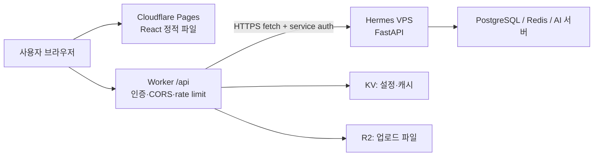
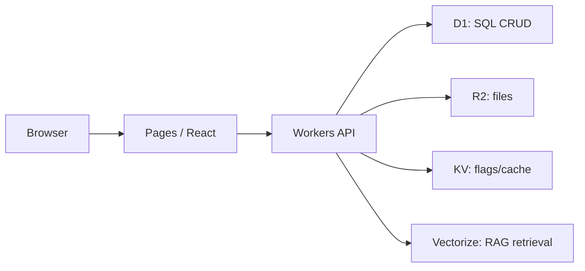

# 2026-07-26 — Cloudflare 실전 가이드 — Workers·Pages·KV·D1·VPS·AWS·CI/CD

[[notion/Information/index|Information 리서치 아카이브]]

[[entities/projects/masil]]의 React·FastAPI 분리 구조와 직접 관련된 배포·운영 선택지다.

<callout icon="☁️" color="blue_bg">
	**목적**: React·FastAPI 조합을 기준으로 Cloudflare를 처음부터 선택·배포·운영하는 실전 매뉴얼입니다. Workers, Pages, KV, D1, R2, Vectorize, GitHub CI/CD와 기존 Hermes VPS·AWS의 역할 분리를 한 문서에 묶었습니다.<br>**조사 기준**: 2026-07-26 KST. 제품 동작·제약은 Cloudflare 공식 문서를 우선했으며, 비용·플랜은 수시로 바뀌므로 배포 전 공식 Pricing/Limit 페이지를 다시 확인해야 합니다.
</callout>

## 0. 3분 요약

- **Cloudflare Workers**는 서버를 직접 관리하지 않고 edge 네트워크에서 요청 단위 코드를 실행하는 서버리스 런타임이다. API gateway, 인증, 리다이렉트, 작은 CRUD, 캐시 제어, 외부 API 프록시에 좋다.
- **Cloudflare Pages**는 React/Vite 같은 프런트엔드의 정적 산출물을 Git과 연결해 전역 CDN에 배포하는 서비스다. `main`은 production, PR은 preview URL로 운영하기 쉽다.
- **KV**는 전 세계 읽기 성능에 강한 key-value 저장소다. 설정, feature flag, 캐시성 응답, 선호도에 맞고, 강한 즉시 일관성이 필요한 주문·잔액·권한 원장에는 맞지 않는다.
- **Spring Boot/AI/GPU** 서버는 Workers 내부에서 그대로 실행하지 않는다. 기존 FastAPI는 기본적으로 VPS/AWS에서 운영하고 Workers가 HTTPS로 호출하는 혼합 구조가 현실적이다. 단, **Python Workers open beta의 FastAPI ASGI 지원**은 별도 호환성 PoC 뒤에만 제한적으로 검토한다.
- 처음에는 **Pages(React) + Workers(얇은 API/BFF) + 기존 FastAPI VPS**로 시작하고, 단순 데이터만 D1/R2/KV로 옮기는 점진 전환이 안전하다.

## 1. Cloudflare가 맡는 계층

Cloudflare는 단일 VM을 빌려 주는 서비스만이 아니라 DNS·TLS·CDN·WAF·DDoS 방어와 edge compute·데이터 서비스를 같은 네트워크 위에 제공한다. 따라서 모든 백엔드를 옮기기보다 요청 경로별 실행·저장 계층을 고른다.

| 계층 | 무엇을 둔다? | 대표 Cloudflare 제품 |
| --- | --- | --- |
| 전달·보안 | 도메인, DNS, HTTPS, CDN, WAF, rate limit | DNS, CDN, WAF |
| 프런트엔드 | React 정적 파일과 routing | Pages 또는 Workers Static Assets |
| edge API | 인증 전처리, 요청 검증, cache, 작은 CRUD, upstream proxy | Workers |
| 관계 데이터 | 사용자·게시물·권한 같은 SQL 데이터 | D1 또는 PostgreSQL |
| 파일 | 이미지, PDF, 업로드, 모델 입력 파일 | R2 |
| 검색·AI | 임베딩 유사도 검색, RAG retrieval | Vectorize + Workers AI/외부 LLM |
| 무거운 실행 | FastAPI, Spring Boot, GPU 추론, 긴 작업, 기존 DB 드라이버 | 기존 VPS 또는 AWS |

## 2. Workers와 KV

### Workers

Workers는 Cloudflare edge에서 `fetch()` 요청, cron, queue 등의 이벤트에 반응해 실행되는 서버리스 코드다. 일반적으로 TypeScript/JavaScript를 가장 자연스럽게 사용하며, HTTP 응답을 즉시 만들거나 다른 서비스로 프록시한다.

**적합한 경우**
- `/api/*` BFF(API for Frontend), JWT 검증, 역할별 라우팅, CORS·rate limit 전처리
- 외부 FastAPI/Spring API의 보안 프록시와 response cache
- 짧은 webhook 처리, URL shortener, feature flag, A/B routing
- D1을 이용한 작은 서비스의 CRUD API

**맞지 않는 경우**
- JVM·CPython 웹 서버를 상시 프로세스로 띄우기
- GPU 추론, 무거운 native 라이브러리, 무제한 실행 시간, 대용량 in-memory state
- TCP 연결을 장시간 점유하는 전통적 서버 프로세스 모델

### Workers KV

KV는 **전역 읽기 중심 key-value 저장소**다. 데이터는 중앙 저장소에 기록되고 접근 뒤 각 데이터센터 cache에 저장된다. 같은 위치에서 반복 읽기는 빠르지만 최초 cold read는 더 느릴 수 있다.

**좋은 예:** feature flag, 국가·언어별 설정, 사용자 UI 선호도, 공개 config, API 응답 cache, A/B assignment.

**피해야 할 예:** 재고 차감, 결제 잔액, 동시 갱신이 많은 카운터, 즉시 권한 회수처럼 **강한 read-after-write 일관성**이 필요한 원장, 관계형 join·복잡한 조건·정렬·트랜잭션이 필요한 데이터.

## 3. 공개 배포와 보안

- **정적 React 웹사이트**: Pages 배포 후 `프로젝트.pages.dev` URL 또는 custom domain을 쓴다.
- **Workers API**: `workers.dev` 또는 own domain route/custom domain으로 공개 HTTPS API를 만든다.
- **기존 FastAPI/Spring API**: VPS/AWS에서 실행한 뒤 Cloudflare DNS·Proxy 또는 Cloudflare Tunnel을 앞에 둔다.

공개 배포에는 HTTPS, 좁은 CORS 정책, 인증, secret 분리, rate limit, 로그·오류 관측을 함께 설정해야 한다.

## 4. Spring Boot·FastAPI를 Workers에서 다루는 법

- **Spring Boot를 Workers 내부에서 직접 실행**: JVM과 장기 실행 웹 서버를 전제로 하므로 Workers isolate에 맞지 않는다.
- **FastAPI를 Workers에서 실행**: 공식 지원은 있으나 Python Workers open beta다. 내장 ASGI server의 `asgi.fetch(app, request, env)`로 연결할 수 있지만, 일반 Linux CPython/Uvicorn 서버를 그대로 옮기는 모델은 아니다.
- **가벼운 CRUD**: Python Worker beta에서 PoC하거나 Worker + D1의 TypeScript/JavaScript CRUD로 구현할 수 있다.
- **기존 복잡한 FastAPI**: VPS/AWS에 유지하고 Worker가 `fetch()` gateway가 되는 편이 안전하다.

| 상황 | 권장 | 이유 |
| --- | --- | --- |
| 단순 CRUD·인증·작은 API | Worker + D1 | 배포·확장이 단순하고 edge binding 사용 |
| 기존 FastAPI·Pydantic·Celery·무거운 라이브러리 | VPS/AWS FastAPI + Worker proxy | 재작성과 호환성 위험을 피함 |
| Spring/JPA/PostgreSQL 서비스 | AWS/VPS Spring Boot + Cloudflare edge | JVM·connection pool·운영 모델 유지 |
| GPU/대형 AI 추론 | GPU VPS/AWS/AI provider + Worker gateway | Workers는 GPU 서버 대체가 아님 |

## 5. React + FastAPI 권장 구조

### 점진 전환형



browser가 FastAPI origin을 직접 부르지 않고 같은 도메인의 `/api/*` Worker를 호출하게 하면 CORS·인증·upstream URL 노출을 한곳에서 관리하기 쉽다. Worker는 FastAPI에 HTTPS `fetch()`를 하고, upstream origin에는 rate limit·서비스 인증을 둔다. private origin 보호에는 Cloudflare Tunnel을 검토한다.

### Cloudflare-native 소형 서비스



블로그, 포트폴리오, 작은 SaaS MVP, 관리 도구처럼 API와 데이터 요구가 단순할 때 적합하다. 복잡한 relation·쓰기 경쟁·전문 검색·background 처리 요구가 커지면 PostgreSQL/queue/별도 backend로 분리한다.

## 6. KV 외 데이터 제품과 D1·PostgreSQL

| 제품 | 저장 모델 | 주 용도 | 주의점 |
| --- | --- | --- | --- |
| KV | key-value, 읽기 cache 중심 | config, flag, preference, cached API 결과 | 일관성·transaction DB로 쓰지 않기 |
| D1 | managed serverless SQL, SQLite semantics | 작은·중간 규모 app CRUD, tenant 격리 DB | PostgreSQL 문법·확장·운영 모델과 같지 않음 |
| R2 | object storage, S3-compatible API | 이미지, PDF, 영상, user upload, backup export | query DB가 아님 |
| Vectorize | vector index + metadata filter | semantic search, recommendation, RAG retrieval | 원본 문서·권한 원장은 별도 보관 |
| Durable Objects | 단일 instance 상태·조정 | 실시간 방, websocket coordination | 일반 관계형 DB 대체재가 아님 |
| Queues | 비동기 메시지 | 업로드 후 처리, email, retry, 긴 작업 분리 | consumer idempotency 필요 |

D1은 “PostgreSQL을 edge로 옮긴 것”이 아니라 **SQLite 의미론을 가진 Cloudflare managed serverless SQL**이다. 기존 FastAPI + SQLAlchemy + PostgreSQL을 D1으로 바꾸기 전 SQL dialect, migration, extension, concurrency 요구를 검증한다.

## 7. Cloudflare edge·AWS Region·단독 VPS 비교

| 관점 | Cloudflare Workers/Pages | AWS Region 중심 | 단독 VPS |
| --- | --- | --- | --- |
| 기본 실행 위치 | edge 네트워크 | 선택 Region/AZ | 한 서버 위치 |
| 인프라 운영 | 서버·autoscaling 관리 최소화 | 서비스 선택 폭이 넓고 운영 설계 필요 | OS·패치·백업·proxy·배포 직접 책임 |
| 강점 | 글로벌 정적 전달, edge 보안/캐시, 빠른 small API | VM·컨테이너·DB·GPU 등 building blocks | 단순·예측 가능한 환경, 런타임 제어 |
| 제약 | long-running process·JVM·일반 CPython·GPU 부적합 | region/network/cost 설계 필요 | 단일 장애점·확장·보안 운영 부담 |

edge가 모든 요청을 자동으로 빠르게 하지는 않는다. Worker가 서울에서 실행돼도 최종 데이터가 미국 VPS/PostgreSQL에 있으면 왕복 지연은 남는다. 읽기 cache를 edge에 두거나 데이터와 compute 위치를 맞춰야 한다.

## 8. Pages와 Vercel

Pages는 Cloudflare DNS/WAF/Workers/D1/R2/KV를 한 경로로 묶고, React/Vite 정적 SPA와 edge 규칙을 사용할 때 유리하다. Vercel은 Next.js의 최신 rendering·server 기능과 Vercel 운영 흐름을 중심으로 쓸 때 우선 비교한다. 어느 쪽도 항상 더 낫지는 않으며 기존 플랫폼과 팀의 운영 경험을 함께 판단한다.

## 9. Worker를 FastAPI gateway로 두는 예시

```typescript
export interface Env {
  API_ORIGIN: string;
  INTERNAL_API_TOKEN: string;
}

export default {
  async fetch(request: Request, env: Env): Promise<Response> {
    const url = new URL(request.url);
    if (url.pathname === "/api/health") {
      return Response.json({ ok: true, edge: true });
    }
    if (!url.pathname.startsWith("/api/")) {
      return new Response("Not found", { status: 404 });
    }

    const upstream = new URL(url.pathname + url.search, env.API_ORIGIN);
    const headers = new Headers(request.headers);
    headers.set("X-Edge-Service-Token", env.INTERNAL_API_TOKEN);
    headers.delete("host");
    return fetch(new Request(upstream, {
      method: request.method, headers, body: request.body, redirect: "manual"
    }));
  }
};
```

이는 구조 설명용이다. production에는 user JWT 검증, upstream token 검증, allowlist된 path/method, timeout·error mapping, rate limit, observability를 추가한다.

## 10. GitHub CI/CD와 secret 관리

- **Pages**: Git integration을 우선 사용한다. `main`을 production branch, PR을 preview로 두고 preview와 production 환경 변수를 분리한다.
- **Workers**: GitHub Actions에서 lint/test/build를 먼저 하고, `main` push에서만 production deploy한다. PR은 preview 또는 non-production environment로 배포한다.
- Cloudflare API token·account ID는 GitHub Actions secret 또는 OIDC 권한 모델을 사용한다.
- `.dev.vars`, `.env`, Cloudflare API token, DB password, model API key는 Git commit·Notion 문서·Discord에 기록하지 않는다. Worker secret은 `wrangler secret put NAME` 또는 Dashboard secret으로 설정한다.

## 11. 운영·보안 체크리스트

- [ ] `main` production / PR preview / staging을 분리했다.
- [ ] API key·password·token이 commit, frontend bundle, client localStorage, Notion 문서에 없다.
- [ ] Worker → FastAPI 호출에 서비스 인증과 path/method allowlist를 적용했다.
- [ ] backend 관리 포트와 PostgreSQL 포트를 public internet에 직접 노출하지 않았다.
- [ ] CORS는 허용할 origin·method·header만 명시했다.
- [ ] 로그인·upload·비싼 AI endpoint에 rate limit과 비용 상한을 고려했다.
- [ ] D1 migration은 production 전에 preview/staging에서 테스트했고 rollback/backup 절차를 준비했다.
- [ ] R2 upload의 파일 크기·MIME type·private/public bucket 정책을 분리했다.
- [ ] Logs, Analytics, error alerts, request ID를 확인할 운영 경로가 있다.

## 12. 현재 VPS 기준 로드맵

1. **위험 없는 프런트 전환**: React 정적 front만 Pages에 Git 연동 배포하고 기존 FastAPI/VPS는 건드리지 않는다.
2. **얇은 BFF**: `/api/health`, 인증 전처리, response cache처럼 위험이 낮은 endpoint부터 Worker를 둔다.
3. **KV/R2 도입**: feature flag·public config는 KV, 업로드 파일은 R2로 분리한다. PostgreSQL 핵심 원장을 바로 KV/D1으로 옮기지 않는다.
4. **D1 검증**: 새 작은 CRUD 또는 독립 기능에서만 D1 migration·동시 쓰기·backup을 검증한다.
5. **AI/RAG 분리**: retrieval이 필요하면 Vectorize를 평가하되 GPU/복잡한 Python pipeline은 VPS/AWS에 유지하고 Worker는 gateway·auth·streaming을 담당한다.

> **한 줄 의사결정**: Cloudflare는 기존 VPS를 버리는 도구가 아니라 프런트 배포·보안·edge API·전역 전달을 강화하는 앞단이다. 장기 프로세스·FastAPI/Spring·GPU·복잡한 PostgreSQL은 VPS 또는 AWS에서 계속 운영하는 혼합형이 현재 가장 안전하다.

## 13. 구현 전 확인할 제약

- **KV**: eventually consistent다. 다른 위치에는 cache expiry 때문에 60초 이상 이전 값 또는 key 없음이 보일 수 있고 같은 key write는 초당 1회 제한이다.
- **D1**: database 하나는 기본적으로 single-threaded 처리 특성이 있다. Global Read Replication은 비동기이므로 최신 read가 필요한 흐름에서는 Sessions API와 `first-primary` 전략을 검토한다.
- **R2**: Worker/S3 API의 객체 write/delete/list는 강한 글로벌 일관성을 가지지만 public custom domain의 CDN cache는 별도다.
- **Vectorize**: `insert`/`upsert`/`delete`는 비동기 mutation이며 검색 가능해지기까지 일반적으로 수 초가 걸린다.
- **Pages**: Git integration 프로젝트와 Direct Upload 프로젝트는 서로 전환할 수 없다. 일반 React 프로젝트는 Git integration을 먼저 선택한다.
- **Preview**: 공개될 수 있으므로 실제 개인정보·production secret을 연결하지 않는다. 민감한 preview는 Cloudflare Access로 보호한다.

## 공식 원문·추가 학습 링크

- [Cloudflare Workers](https://developers.cloudflare.com/workers/)
- [Cloudflare Pages](https://developers.cloudflare.com/pages/)
- [Workers KV](https://developers.cloudflare.com/kv/)
- [Cloudflare D1](https://developers.cloudflare.com/d1/)
- [Cloudflare R2](https://developers.cloudflare.com/r2/)
- [Cloudflare Vectorize](https://developers.cloudflare.com/vectorize/)
- [Cloudflare Tunnel](https://developers.cloudflare.com/cloudflare-one/connections/connect-networks/)
- [Workers Python](https://developers.cloudflare.com/workers/languages/python/)
- [Pages GitHub integration](https://developers.cloudflare.com/pages/configuration/git-integration/github-integration/)
- [AWS Regions and Availability Zones](https://aws.amazon.com/about-aws/global-infrastructure/regions_az/)
- [Vercel CDN overview](https://vercel.com/docs/cdn)
