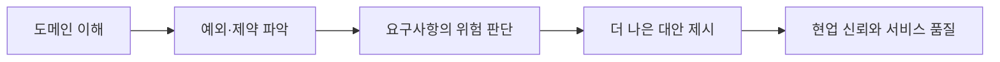

<callout icon="⚠️" color="yellow_bg">
	이 문서는 **현직자 1:1 커피챗을 정리한 원문**을 바탕으로 작성했다. 특정 회사나 증권업계 전체의 공식 정책·공통 현황으로 일반화하지 않으며, 원문의 개인 견해와 경험을 중심으로 읽어야 한다.
</callout>
## 원문
- [증권사 AX, 지금 실제로 어떻게 굴러가고 있나 — 현직자 커피챗 정리](https://app.notion.com/p/3b28e4e11b2580d0b38ef929bc63623a)
- 원문 성격: 증권사 AX 담당 현직자의 개인 경험·견해를 바탕으로 한 커피챗 기록
## 한눈에 보는 결론
증권사 AX의 핵심 난제는 “좋은 LLM을 고르는 일” 하나가 아니다. 장기간 누적된 레거시, 보안·컴플라이언스, GPU·인프라 제약, 복잡한 업무 규칙, 그리고 현업의 **암묵지**가 동시에 얽혀 있다.
원문이 강조하는 가장 중요한 변화는 다음과 같다.
> AX 시대의 개발자는 코드를 만드는 사람을 넘어, **업무 맥락을 빠르게 이해하고 언어로 구조화해 더 나은 해결책을 제안하는 사람**이 되어야 한다.
## 1. 왜 증권사는 지금 AX를 추진하는가
### 리테일 경쟁의 다음 단계
원문은 리테일 증권 시장에서 UI/UX 경쟁이 이미 큰 영향을 미쳤다고 본다.
- 기존 강자들은 완성도 높은 UX를 바탕으로 수익 기반을 만들었다.
- 후발 서비스들은 기존 고객을 단순히 나누는 데 그치지 않고, 더 쉬운 경험을 통해 새로운 사용자층을 만들었다.
이 환경에서 AX는 고객 화면을 조금 개선하는 과제가 아니라, **거대한 내부 시스템과 업무 처리 방식을 어떻게 전환할 것인가**의 문제로 이어진다.
### 레거시가 AX의 출발점인 이유
증권사 시스템에는 수십 년간 축적된 코드·업무 규칙·예외 처리·연계 구조가 남아 있다. 이를 사람의 손으로 하나씩 해석하고 개선하는 방식은 비용과 시간이 너무 크다. AI는 다음 역할을 기대받을 수 있다.
- 오래된 코드와 문서의 탐색·요약·설명 지원
- 반복 업무와 개발 작업의 보조
- 업무 규칙·데이터 흐름의 탐색 보조
- 신규 시스템 설계와 구현의 생산성 향상
다만 이는 “AI가 레거시를 자동 전환한다”는 의미는 아니다. 원문에서도 실제 전환의 난이도와 업무 맥락의 중요성이 강조된다.
## 2. 내부 LLM과 외부 LLM — 성능보다 경계 설정의 문제
증권사에서 LLM을 도입할 때 핵심 질문은 모델 성능만이 아니라 **어떤 정보와 작업을 외부로 보낼 수 있는가**다.
<table fit-page-width="true" header-row="true">
<tr color="blue_bg">
<td>구분</td>
<td>원문에서 언급한 장점·제약</td>
<td>실무 판단의 핵심</td>
</tr>
<tr>
<td>외부 LLM</td>
<td>성능 측면의 장점이 있으나, GPU 자원·수요 예측·보안 경계 문제가 있다.</td>
<td>반출 가능 데이터와 허용 작업을 명확히 정의해야 한다.</td>
</tr>
<tr>
<td>사내 LLM</td>
<td>소스코드 등 민감 정보 보호에 적합하지만, 모델·인프라·운영 역량이 필요하다.</td>
<td>보안과 성능, 비용, 운영 가능성의 균형이 필요하다.</td>
</tr>
<tr>
<td>혼합 활용</td>
<td>SQL 등 제한된 작업에는 외부 LLM을 활용하는 사례가 언급된다.</td>
<td>데이터 등급별로 모델·도구·접근 권한을 분리한다.</td>
</tr>
</table>
### 원문에서 드러난 실무적 포인트
- 소스코드 반출은 원칙적으로 어렵다.
- 컴플라이언스 경계 안에서 활용도를 최대화하려는 접근이 필요하다.
- 기존 시스템을 외부로 빼는 것과, 신규 시스템을 외부에서 처음부터 만드는 것은 판단 조건이 다를 수 있다.
따라서 AX 아키텍처는 “내부 모델 vs 외부 모델”의 이분법보다, **데이터·업무·모델·권한의 경계를 설계하는 문제**로 이해하는 편이 적절하다.
## 3. AX의 진짜 병목 — 암묵지의 명시화
원문의 핵심 통찰은 “AI는 알려준 만큼만 한다”는 문장에 담겨 있다.
### 기존 개발과 AX 개발의 차이
기존 개발에서는 개발자가 업무 맥락을 머릿속에 가지고 있고, 그 판단을 코드로 녹여내는 방식이 가능했다. 하지만 AI를 활용하려면 모델과 협업자에게 다음을 설명 가능한 형태로 전달해야 한다.
- 업무의 목적과 성공 기준
- 용어의 의미와 데이터 정의
- 정상 흐름과 예외 처리
- 규제·보안·권한 조건
- 사용자·운영자·기획자의 맥락
즉, 코드 작성 능력만으로는 충분하지 않고 **업무 지식을 구조화해 전달하는 능력**이 중요해진다.
### 실무에서 필요한 산출물
암묵지를 명시화하려면 다음과 같은 산출물이 필요하다.
- 용어집과 데이터 사전
- 업무 프로세스·상태 전이·예외 케이스 문서
- 정책·규제·권한 규칙의 체크리스트
- 요구사항의 배경과 우선순위
- AI가 참조할 수 있는 검증된 지식 기반
이런 기반이 부족하면 LLM은 그럴듯한 답을 낼 수는 있어도, 금융 업무에 필요한 정확한 판단을 안정적으로 재현하기 어렵다.
## 4. 증권업에서 기대하는 개발자 역량
원문은 대형 증권사가 개발자를 평가할 때 순수 기술력만 보지 않는다고 설명한다. 중요한 것은 기술을 바탕으로 **더 나은 업무 해법을 제안할 수 있는가**다.
### 평가 관점
- 업무와 비즈니스를 얼마나 빨리 이해하는가
- 사용자의 요구사항이 적절한지 판단할 수 있는가
- 요구를 그대로 구현하는 것을 넘어, 더 나은 방향을 선제적으로 제시하는가
- 전산적 제약과 운영 현실을 고려해 실현 가능한 대안을 설계하는가
### AX 맥락에서의 의미
개발자는 “요구사항을 받는 사람”에서 “문제 정의와 해법 설계에 참여하는 사람”으로 역할이 확장된다. 이때 중요한 것은 말을 많이 하는 것이 아니라, 도메인·데이터·규제·시스템 제약을 근거로 제안의 타당성을 설명하는 능력이다.
## 5. 조직과 기술 스택의 현실
원문이 언급하는 조직의 분위기는, 차세대 프로젝트와 함께 사내 LLM 기반 PoC를 여러 개 시도하는 방향이다. 리더가 시도에 열려 있는 문화는 PoC를 만들기 좋은 조건이지만, PoC가 실제 운영 시스템이 되려면 보안·성능·운영·책임 체계까지 넘어야 한다.
### 기술적 특징
- 코어 시스템은 C 기반 비중이 높다고 언급된다.
- C 내부에서 SQL을 활용하는 프록시 구조가 존재한다.
- Java 전환 시도는 있으나 현실적 장벽이 있다.
- AI Agent는 GLM, Claude 계열을 참고해 사내 활용 형태를 검토하는 시도가 언급된다.
이 내용은 특정 조직의 경험을 반영한 것이므로 업계 전체 기술 스택의 일반론으로 단정하면 안 된다. 다만 지원자 관점에서는 **현대적 웹 스택만으로 금융 IT를 상상하면 안 되며, 레거시·데이터·연계·운영을 함께 이해해야 한다**는 시사점이 있다.
## 6. 도메인 지식은 제안의 질을 바꾼다
원문은 랩어카운트처럼 범위가 아주 크지 않은 도메인도 A부터 Z까지 깊게 이해하기 어렵다고 말한다. 예를 들어 계약 해지처럼 겉보기에는 단순한 업무도 수많은 예외 조건을 가질 수 있다.
이 점은 다음 연결을 보여준다.

도메인 깊이가 얕으면 개발자는 요청을 구현할 수는 있어도, 요청의 문제점이나 더 나은 해결책을 제안하기 어렵다. AX에서는 이 차이가 더 커진다. AI에게 전달할 업무 맥락 자체가 도메인 이해에서 나오기 때문이다.
## 7. 커리어 관점에서 남는 조언
원문은 현실적인 취업 환경과 함께, 학벌 외에도 기본기를 꾸준히 쌓고 필요한 일을 피하지 않는 태도를 강조한다. 특히 개발 직무의 범위가 넓어지는 상황에서 다음과 같은 방향을 시사한다.
- 개발 기본기와 프로젝트 경험을 계속 축적한다.
- 도메인 지식과 개발 지식을 함께 확보한다.
- 개발자와 협업할 수 있는 비개발 도메인 역량도 경쟁력이 될 수 있다.
- 억지로 유행 기술만 좇기보다, 오래 파고들 수 있는 분야와 실제 문제를 찾는다.
이는 “개발만 잘하면 된다”는 관점보다, **개발 지식을 기반으로 특정 산업의 문제를 풀 수 있는 사람**이 되는 전략에 가깝다.
## 8. 실무·취업 준비 체크리스트
### AX·금융 IT를 이해하기 위해
- [ ] 금융 도메인 용어와 주요 업무 흐름을 학습한다.
- [ ] 요구사항을 기능 목록이 아니라 사용자·업무 규칙·예외 조건까지 포함해 작성해 본다.
- [ ] 레거시 연계, 데이터 정합성, 권한·보안 문제를 프로젝트 설계에 포함한다.
- [ ] LLM에 전달할 컨텍스트를 문서화하고, 답변을 검증하는 흐름을 설계한다.
### 포트폴리오에서 보여줄 수 있는 역량
- [ ] 문제 정의와 사용자·현업 맥락
- [ ] 정책·상태 전이·예외 처리의 명시화
- [ ] 기술 선택의 근거와 제약 사항
- [ ] AI 적용 범위와 데이터·보안 경계
- [ ] 결과뿐 아니라 검증·한계·운영 방안
## 최종 정리
이 커피챗의 메시지는 명확하다. 증권사 AX에서 경쟁력이 되는 사람은 AI 도구를 단순히 잘 쓰는 사람이 아니라, **복잡한 업무의 맥락과 제약을 이해하고 그것을 언어·문서·구조로 바꿔 AI와 조직이 함께 활용할 수 있게 만드는 사람**이다.
AI 성능과 GPU 자원은 시간이 지나며 개선될 수 있다. 반면 도메인을 이해하고, 예외를 발견하고, 요구사항을 더 나은 문제 정의로 바꾸는 능력은 자동으로 생기지 않는다. 그래서 금융 IT·AX를 준비할 때는 기술 스택 학습과 함께 업무 이해·문서화·제안 역량을 의도적으로 훈련해야 한다.
> 출처: 사용자 제공 Notion 원문. 원문의 커피챗 경험·개인 견해를 구조화해 정리했으며, ‘실무에서 필요한 산출물’, ‘실무·취업 준비 체크리스트’는 원문 내용을 바탕으로 확장한 해석이다.