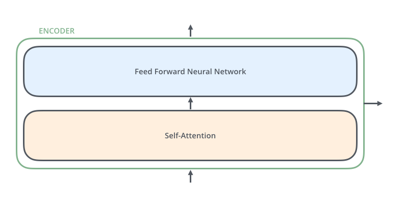
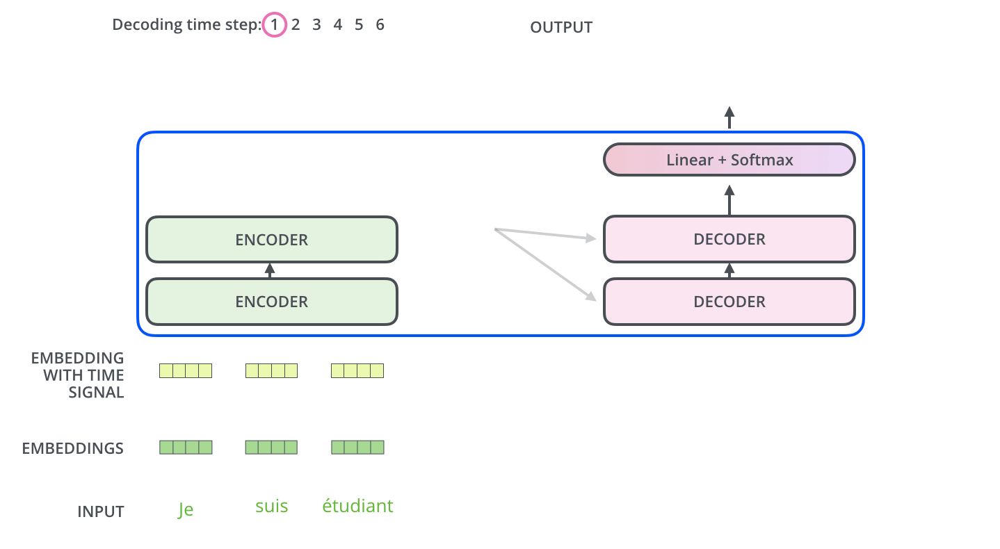

# [7/21] 참고 — The Illustrated Transformer

## 원문·이미지 출처
- [The Illustrated Transformer — Jay Alammar](https://jalammar.github.io/illustrated-transformer/)
- 원문 도식 저작자: **Jay Alammar**
- 이 노트에 포함한 핵심 도식 캡처: **CC BY-NC-SA 4.0** 조건 및 출처 표기 아래 학습 목적 보관

> 이 글은 Transformer를 단계별 시각 자료로 설명하는 입문·복습용 해설이다. 원문도 “직관적 단순화”를 표방하므로, 구현 세부·최신 변형은 [[notion/SKALA/7-21 LLM과 Transformer 아키텍처_Day1/7-21 참고 — Positional Encoding|Positional Encoding]], [[notion/SKALA/7-21 LLM과 Transformer 아키텍처_Day1/7-21 참고 — Multi-Head Attention|Multi-Head Attention]], 그리고 원 논문으로 교차 확인한다.

## 1. Transformer를 먼저 하나의 입력→출력 모델로 보기
기계번역을 예로 들면 Transformer는 한 언어의 입력 문장을 받아 다른 언어의 문장을 생성한다. 핵심 구조는 **encoder–decoder**다.


- **Encoder**: 입력 토큰을 여러 층에서 처리해 문맥화된 표현으로 만든다.
- **Decoder**: 지금까지 생성한 출력과 encoder 표현을 함께 참고해 다음 토큰을 예측한다.
- 원 논문은 encoder·decoder를 각각 6층 쌓지만, 6은 고정 법칙이 아니라 하나의 아키텍처 선택이다.

## 2. Encoder 블록: 토큰 간 관계와 위치별 변환
각 encoder 층은 두 핵심 sub-layer로 구성된다.

1. **Self-Attention**: 현재 토큰을 인코딩할 때 다른 입력 토큰을 참고한다.
2. **Position-wise Feed-Forward Network**: 각 위치에 동일한 FFN을 독립 적용해 비선형 특징 변환을 한다.



최하위 encoder에는 token embedding이 들어간다. 그 위 encoder들은 바로 아래 층의 출력을 입력으로 받는다. FFN은 위치별로 독립 실행할 수 있지만, self-attention에서는 토큰들이 서로 정보를 참조하므로 위치 간 의존성이 생긴다.

## 3. Self-Attention: 한 단어를 문맥으로 다시 표현하기
Self-Attention은 토큰마다 “문장 안의 어느 토큰을 얼마나 참고할까?”를 계산한다. 대명사 `it`이 무엇을 가리키는지 알아내는 상황처럼, 토큰 자체의 사전적 형태만으로는 부족한 정보를 주변 문맥으로 보완한다.


### Q, K, V 만들기
입력 행렬 `X`에서 세 가지 표현을 만든다.

```python
Q = X @ W_Q  # Query: 무엇을 찾는가
K = X @ W_K  # Key: 어떤 기준으로 참조되는가
V = X @ W_V  # Value: 실제로 전달할 정보
```

### Scaled Dot-Product Attention

$$
Attention(Q,K,V) = softmax\left(\frac{QK^T}{\sqrt{d_k}}\right)V
$$

1. `QKᵀ`로 Query와 Key의 관련성 점수를 만든다.
2. `√d_k`로 나눠 차원이 커질수록 내적값이 과도해지는 현상을 완화한다.
3. Softmax로 한 Query가 각 Key를 참고하는 비중을 정규화한다.
4. 그 비중으로 Value를 가중합해 문맥이 반영된 새 표현을 얻는다.


Attention 가중치는 모델이 사용하는 관계 점수이며, 사람이 이해하는 인과적 설명이나 단일한 중요도와 동일하다고 단정해서는 안 된다.

## 4. Multi-Head Attention: 서로 다른 표현 공간에서 함께 보기
한 개 head의 attention은 한 투영 공간에서 토큰 관계를 본다. Multi-Head Attention은 여러 set의 `W_Q`, `W_K`, `W_V`로 여러 head를 병렬 계산한다.

$$
head_i = Attention(QW_i^Q, KW_i^K, VW_i^V)
$$

$$
MultiHead(Q,K,V) = Concat(head_1,\ldots,head_h)W^O
$$


각 head는 문법·의미·장거리 지시 같은 서로 다른 패턴을 포착할 수 있는 표현 용량을 만든다. head별 의미를 사람이 항상 하나씩 명명할 수 있는 것은 아니며, 학습 결과는 데이터·층·입력에 따라 달라진다. Concat 뒤 `W_O`는 분산된 head 출력을 `d_model` 공간으로 통합해 다음 sub-layer가 받게 한다.

## 5. Positional Encoding: 병렬 처리에 순서 단서 넣기
Self-Attention은 입력 토큰을 한꺼번에 처리하므로 위치를 자동으로 알지 못한다. Transformer는 token embedding에 positional encoding을 더한다.


원 논문의 사인·코사인 위치 인코딩은 위치와 차원마다 서로 다른 주기를 사용한다. 값 범위가 제한되고, 학습에 없던 더 긴 길이도 계산할 수 있다는 장점이 있다. 최신 Transformer는 학습형 absolute position embedding·relative position bias·RoPE 등 다른 방식도 사용한다.

```text
X = token embedding + positional encoding
Q = XW_Q, K = XW_K, V = XW_V
```

따라서 위치 정보는 attention의 결과에 나중에 붙는 메타데이터가 아니라, Q/K/V를 만들기 전부터 포함되는 입력 단서다.

## 6. Residual Connection과 Layer Normalization
각 Self-Attention·FFN sub-layer에는 residual connection이 둘러지고 그 뒤 LayerNorm이 적용된다.

$$
output = LayerNorm(x + Sublayer(x))
$$


- **Residual connection**: 원래 입력 정보를 보존하고 깊은 층으로의 gradient 흐름을 돕는다.
- **LayerNorm**: 토큰 표현의 분포를 정규화해 학습을 안정화한다.

## 7. Decoder: 미래 토큰을 보지 않고 생성하기
Decoder는 encoder의 K·V를 참고하는 encoder–decoder attention을 가진다. 또한 decoder self-attention에는 **mask**가 있어 현재 위치가 미래 출력 토큰을 보지 못한다.



```text
이전까지 생성한 토큰
→ embedding + positional encoding
→ masked self-attention
→ encoder–decoder attention
→ FFN
→ linear + softmax
→ 다음 토큰 확률분포
```

학습 때는 정답 시퀀스를 이용해 모든 위치의 loss를 병렬 계산할 수 있다. 반면 추론 때는 방금 생성한 토큰을 다음 단계 입력으로 넣으며 종료 토큰까지 반복한다.

## 핵심 흐름 한 번에 연결하기
```text
입력 토큰
→ embedding + positional encoding
→ encoder stack
  ├─ multi-head self-attention
  └─ feed-forward (+ residual / layer norm)
→ decoder stack
  ├─ masked self-attention
  ├─ encoder–decoder attention
  └─ feed-forward (+ residual / layer norm)
→ linear + softmax
→ 다음 토큰 생성
```

## 복습 질문
- [ ] Encoder self-attention과 decoder masked self-attention의 차이를 설명할 수 있는가?
- [ ] `QKᵀ` 뒤 scale·softmax·Value 가중합의 목적을 순서대로 설명할 수 있는가?
- [ ] Multi-Head Attention에서 여러 head와 `W_O`가 필요한 이유를 설명할 수 있는가?
- [ ] Positional Encoding·residual connection·LayerNorm이 각각 해결하는 문제를 구분할 수 있는가?

## 연결 노트
- [[notion/SKALA/7-21 LLM과 Transformer 아키텍처_Day1/7-21 참고 — Positional Encoding]]
- [[notion/SKALA/7-21 LLM과 Transformer 아키텍처_Day1/7-21 참고 — Multi-Head Attention]]
- [Notion Day1 핵심 정리](https://app.notion.com/p/3a41d84bf68e8163bfa0d4f8af36e3d5)
- [Attention Is All You Need](https://arxiv.org/abs/1706.03762)

## 공개 게시물

- [[blog/STUDYING/STUDYING- 5 - 2. The Illustrated Transformer|공개 블로그 글]]
