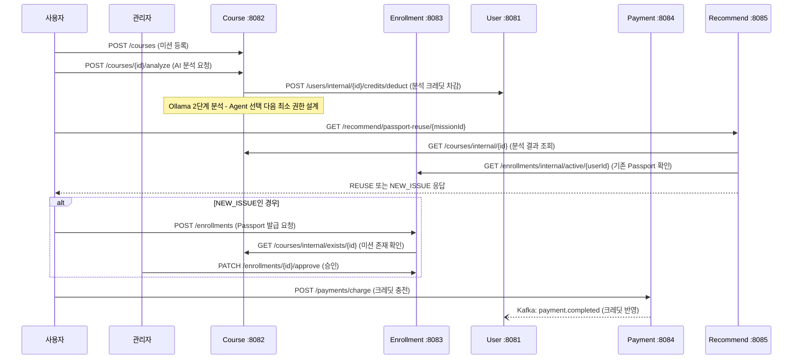

# [8/26] Agile 방법론 및 MSA 개발_개인 서브 노트

[[notion/SKALA/index|SKALA 학습 노트]]

> 원문: [Notion 페이지](https://app.notion.com/p/3c81d84bf68e80e0bf55fa1654595ac5)
>
> 원문의 임시 서명 이미지 URL은 보존하지 않았으며, 안정적으로 확인 가능한 텍스트·코드·표를 유지했다. 개인 이름은 역할로 대체했다.

### 프로젝트 개요: AgentPass
"AI에게 일을 맡기되, 필요한 권한만 허용한다." 판교캠퍼스 7반 3조(PO PO, SM SM(나), Dev 개발자·개발자)가 이틀간 만든 서비스다. 사용자가 자연어로 업무를 설명하면 AI가 적합한 Agent와 최소 권한을 설계하고, 관리자가 승인하면 그 요청 건에 대해서만 개별 권한(AgentPass)이 발급된다.
시작점이 된 문제는 두 가지였다. 첫째, 업무를 시키는 사용자는 권한 전문가가 아니라서 이 Agent에게 어디까지 권한을 줘야 하는지 스스로 판단하기 어렵다. 그러다 보니 권한을 너무 좁게 주거나(과소) 너무 넓게 주는(과도) 일이 반복된다. 둘째, 승인하는 관리자 쪽도 문제였다. 자연어로 들어온 요청을 승인할 때 담당자마다 판단 기준이 달라서 같은 요청이 어떤 날은 통과되고 어떤 날은 막혔다.
이 서비스를 이틀 만에 만들 수 있었던 건 밑바닥부터 짠 게 아니라, 기존에 쓰던 강의 플랫폼(수강신청 서비스)의 코드를 완전히 다른 도메인으로 갈아끼웠기 때문이다. 이 갈아끼우는 과정 자체가 Sprint1의 핵심이었다.
---
### 1. Agile 적용
기존 코드의 도메인 자체를 통째로 바꾸는 작업이라, 처음부터 완벽한 설계를 하기보다는 짧게 짧게 만들고 확인하면서 방향을 잡아가는 쪽이 맞다고 판단했다. 그래서 Waterfall처럼 설계를 다 끝내고 시작하지 않고, Sprint 단위로 끊어서 매번 실제로 동작하는 걸 확인하며 진행했다.
역할은 이론처럼 나뉘었다. PO이 PO로 우선순위와 요구사항을 정리하고, 나가 SM으로 진행을 관리하고, 개발자과 개발자가 개발을 맡았다. 다만 표준 Scrum과 다르게 손본 부분들이 있다.
Daily Scrum을 하루 한 번 15분이 아니라, 50분 집중 작업 뒤에 5분 스크럼을 넣는 사이클을 하루에 4번 반복했다. 실습 시간이 짧아서 표준 주기 그대로는 안 맞았고, Timebox라는 원칙만 유지한 채 주기 자체를 우리 상황에 맞게 줄인 셈이다. Sprint Review도 형식적으로 하지 않고, "결제가 일어나면 Kafka를 거쳐 크레딧에 반영되고 화면 잔액까지 바뀌는가"처럼 실제로 눈으로 확인 가능한 기준을 세워서 검증했다.
백로그도 Backlog 01\~04로 큼직하게 나누고, 그 안의 세부 작업은 TSK 단위 티켓으로 쪼개서 보드로 관리했다. Sprint1에서만 TSK-1부터 TSK-15까지 처리했는데, 예를 들면 이런 것들이다.
- 권한 없는 사용자가 대시보드에 들어오면 로그인 페이지로 자동으로 넘어가게 고친 것
- 관리자 화면과 일반 사용자 화면의 레이아웃이 서로 다르게 보이던 걸 맞춘 것
- 데이터가 없을 때 테이블에 뜨는 표시 형식이 관리자용과 사용자용이 서로 달라서 통일한 것
이런 자잘한 티켓들이 쌓여서 Sprint 하나가 완성됐다는 걸 보드를 보면서 체감했다.
---
### 2. Sprint 진행 상세
| 구분 | Sprint 1 | Sprint 2 |
| --- | --- | --- |
| 목표 | 전체 서비스 흐름과 데이터 구조 확립 | AI 분석과 권한 추천 고도화 |
| 도메인 전환 | Course → Mission, Enrollment → Passport | 변환된 도메인을 AI 분석에 활용 |
| 사용자 구조 | User/Admin 역할 분리 | 역할별 분석·검토 정보 제공 |
| 핵심 흐름 | 미션 생성, Passport 요청·승인 구조 | Agent 및 최소 권한 자동 추천 |
| 크레딧 | User에 credit 필드 추가 | AI 분석 비용 정책과 연결 가능 |
| 결제 | 결제 완료 → Kafka → 크레딧 반영 | 분석 기능 사용량 확장 기반 |
| 추천 | 기본 데이터와 상태 구조 준비 | 기존 ACTIVE Passport 재사용 추천 |
#### Sprint 1: 16:00 \~ 20:00, 50분 작업 + 5분 스크럼 x 4
| 시간 | 작업 | 5분 스크럼 |
| --- | --- | --- |
| 16\:00-16\:50 | 주제·도메인 범위 확정 (Course → 미션, Enrollment → Passport) | 범위 고정, 용어 합의 |
| 16\:55-17\:45 | Course·Enrollment 전환 (Entity·DTO·상태·API 수정) | 프론트·백 계약 점검 |
| 17\:50-18\:40 | User·Admin + credit (역할별 화면, [User.credit](http://User.credit) 반영) | 결제 연동 우선순위 조정 |
| 18\:45-19\:35 | Payment 연동 (POST /charge, Kafka, GET /balance) | 잔여 이슈, DoD 확인 |
| 19\:40-20\:00 | Sprint Review: 결제 → Payment.completed → [User.credit](http://User.credit) → 화면 잔액까지 E2E 확인 |  |
여기서 바뀐 게 단순히 이름만이 아니었다. 기존 Course/Enrollment 엔티티의 필드와 상태값을 그대로 재활용하면서, 의미만 미션과 Passport 발급으로 바꿨다.
| 기존 | 전환 후 | 세부 내용 |
| --- | --- | --- |
| Course | Mission (업무 요청) | title, description, category + usagePeriod, dataSensitivity 필드. 상태: CREATED → ANALYZING → ANALYZED/FAILED |
| Enrollment | Passport 발급 요청 | agentCode, permissions, excludedPermission, riskLevel, summary 필드. 상태: READY_FOR_APPROVAL → ACTIVE/REJECTED/EXPIRED |
| User (Student/Instructor) | 업무 사용자 / 관리자 | User Entity에 credit 필드 추가. 관리자 전용 대기·전체·상세·승인·반려 API와 화면 분리 |
| 프론트엔드 | User/Admin 실제 업무 화면 | 미션 생성·목록·상세, Passport 목록·상세, Admin Console을 각 서비스 API와 연결 |
#### Sprint 2: 09:00 \~ 14:00, 50분 작업 x 3 + 35분 x 1
| 시간 | 작업 | 리뷰 |
| --- | --- | --- |
| 09\:00-09\:50 | Agent 정책·AI 계약 정의 (4개 Agent YAML 카탈로그, 권한·위험·응답 Schema) | 역할 경계, 정책 누락 점검 |
| 09\:55-10\:45 | 2단계 LLM 분석 구현 (Agent 선택 → 최소 권한, Ollama·JSON Schema 연결) | Prompt·검증 규칙 교차 리뷰 |
| 10\:50-11\:40 | 다중 Agent·재사용 연결 (Course·Enrollment 계약 수정, 권한·유효기간 충족 판정) | 서비스 간 DTO·DB 점검 |
| 11\:45-12\:20 | UI 고도화·회귀 QA (권한 Slider, 재사용 안내, Mock·실 API 경계 확인) |  |
| 13\:40-14\:00 | 통합 QA: Course AI 3개 + Enrollment 5개 테스트 통과, 실 API 연동 잔여 항목 분리 |  |
Sprint2에서 인상 깊었던 건 AI 분석을 한 번에 끝내지 않고 두 단계로 쪼갠 부분이다. 1차로 어떤 Agent를 쓸지 고르고, 2차로 그 Agent에 필요한 최소 권한만 고르게 했다. 한 번에 다 시키면 프롬프트가 복잡해지고 결과 검증도 어려워지는데, 단계를 나누니까 각 단계의 출력을 JSON Schema로 강제하고 자동 검증하기가 훨씬 쉬웠다.
#### Mock 계약으로 Sprint1과 Sprint2를 병렬로 진행했다
Sprint1 시점엔 아직 AI 분석 로직(Ollama 연동)이 없었다. 그런데 Enrollment는 Course의 분석 결과를 받아서 Passport를 만드는 로직을 Sprint1 안에 같이 완성해야 했다. 그래서 Course의 analyze 응답 형태부터 먼저 정해두고, 실제 Ollama를 부르는 대신 그 형태에 맞는 고정값을 돌려주는 상태로 개발을 진행했다.
이 덕분에 Sprint1에서 Course 쪽(AI 분석 화면과 로직 준비)과 Enrollment 쪽(Passport 발급·승인 로직)이 서로 끝나기를 기다리지 않고 동시에 개발할 수 있었다. Enrollment 입장에서는 Course가 Mock을 돌려주든 실제 LLM을 불러서 돌려주든 상관없이, 정해둔 JSON 모양만 그대로 들어오면 됐다.
Sprint2에서 이 Mock을 실제 Ollama 2단계 호출로 바꿨다. Agent를 고르고 최소 권한을 고르는 로직이 Course 내부에 새로 들어갔지만, 밖으로 나가는 응답 모양은 Sprint1과 똑같이 유지했다. 그 결과 Enrollment 쪽 코드는 한 줄도 안 건드렸다.
| 구분 | Sprint 1 (Mock) | Sprint 2 (실제 연동) |
| --- | --- | --- |
| Course 내부 구현 | 고정된 JSON 반환, Ollama 미호출 | Ollama 2단계 호출 (Agent 선택 다음 최소 권한) |
| 외부 응답 형태 | agentList, riskLevel, summary | agentList, riskLevel, summary (동일) |
| Enrollment 쪽 변경 | 없음 | 없음 |
이게 Agile과 MSA가 같이 작동한 지점이라고 생각한다. Sprint를 병렬로 굴린 건 Agile 쪽 운영 방식이었고, 그 병렬 작업이 실제로 가능했던 건 서비스 경계에서 응답 형태(계약)만 고정해두면 그 안의 구현은 독립적으로 바꿀 수 있다는 MSA 원칙 덕분이었다. 모놀리식이었다면 AI 분석 로직과 Passport 발급 로직이 같은 코드베이스에 있었을 테니, AI 로직이 끝날 때까지 Passport 쪽도 손을 못 댔을 가능성이 크다.
---
### 3. MSA 구조
서비스는 5개로 나눴다. 각자 자기 도메인만 책임지고, 서로는 API로만 통신한다.
| 서비스 | 포트 | 담당 도메인 |
| --- | --- | --- |
| User | 8081 | 사용자 정보, 크레딧 |
| Course (Mission) | 8082 | 미션 등록, AI 권한 분석 |
| Enrollment (Passport) | 8083 | Passport 발급, 승인 |
| Payment | 8084 | 결제, 크레딧 충전 |
| Recommend | 8085 | 기존 Passport 재사용 판단 |
각 서비스가 언제 서로를 호출하고, 어느 부분이 동기(REST)고 어느 부분이 비동기(Kafka)인지 정리하면 이렇다.

이 흐름에서 역할 분리가 명확히 드러난다. Course(8082)는 미션 등록과 AI 분석만 담당하고 크레딧 차감은 반드시 User(8081)에게 요청한다. Recommend(8085)는 자체 데이터가 거의 없고 Course와 Enrollment에서 읽어온 정보만으로 판단하는 순수 조회용 서비스에 가깝다. 결제만 유일하게 Kafka를 통해 비동기로 처리되는데, 결제와 크레딧 반영이 같은 트랜잭션으로 묶이지 않아도 되기 때문이다.
Enrollment가 Passport를 발급하려면 먼저 그 미션이 실제로 존재하는지 확인해야 하는데, 이걸 Course의 DB를 직접 조회하는 게 아니라 `/internal/exists/{id}`라는 내부 API를 호출하는 식으로 처리했다. 서비스 경계를 지키느라 조금 돌아가는 것 같아도, 이게 각 서비스를 독립적으로 바꿀 수 있게 해주는 부분이었다.
---
### 4. API 명세 (기존 vs 신규)
강의 플랫폼 코드에서 그대로 가져온 API도 있고, AgentPass를 위해 새로 만든 API도 있다.
| 서비스 | ENDPOINT | 역할 | 구분 |
| --- | --- | --- | --- |
| User | GET /api/users/me | 로그인 사용자 조회 | 기존 |
| User | GET /api/users/internal/\{id\} | 사용자 크레딧 조회 | 기존 |
| User | POST /api/users/internal/\{id\}/credits/deduct | AI 분석 크레딧 차감 | 신규 |
| Course | GET /api/courses/my | 내 미션 목록 조회 | 기존 |
| Course | POST /api/courses/\{id\}/analyze | AI가 Agent·권한 설계 | 신규 |
| Course | GET /api/courses/internal/exists/\{id\} | 미션 존재 여부 확인 (내부용) | 신규 |
| Course | GET /api/courses/internal/\{id\} | 미션 분석 결과 내부 조회 | 신규 |
| Enrollment | POST /api/enrollments | Passport 발급 요청 | 기존 구조 재사용 |
| Enrollment | PATCH /api/enrollments/\{id\}/approve | Passport 승인 | 기존 구조 재사용 |
| Enrollment | GET /api/enrollments/internal/active/\{userId\} | ACTIVE Passport 후보 조회 | 신규 |
| Payment | GET /api/payments/balance | 현재 크레딧 조회 | 신규 |
| Payment | POST /api/payments/charge | 크레딧 충전 | 신규 |
| Payment | GET /api/payments/\{id\} | 결제 단건 조회 | 기존 |
| Recommend | GET /api/recommend/passport-reuse/\{missionId\} | 기존 Passport 재사용 판단 | 신규 (서비스 자체가 신규) |
몇 가지는 커밋 단위로도 기억에 남는다. Course 분석 API는 실행되기 전에 먼저 사용자 크레딧 120을 차감하도록 나중에 추가됐고(커밋 99d4bdd), 분석 한 번에 Ollama를 두 번 호출한다는 것도 그때 명확해졌다(b2d2529). Recommend의 재사용 판단도 처음엔 mock으로 붙여놨다가, 나중에 Course·Enrollment 실제 API를 호출하도록 바꿨다.
---
### 느낀 점
#### 독립 배포가 장점만은 아니라는 걸 직접 겪었다
MSA의 "서비스가 독립적으로 배포된다"는 말을 들을 땐 장점으로만 다가왔는데, 크레딧 기능을 넣으면서 겪은 문제는 오히려 이 독립성 자체가 가져온 위험이었다. 앱 코드와 DB 스키마가 같은 배포 단위로 묶여있지 않다 보니, "새 코드는 배포됐는데 스키마는 아직 예전 상태"인 시간대가 실제로 생겼다.
#### API 계약이 문서로 안 정해져 있으면 서비스 경계가 무의미해진다
서비스 간에는 API로만 통신해야 한다는 원칙은 지켰다고 생각했는데, 그 API가 래퍼를 쓰는지 안 쓰는지, 필드 이름이 뭔지가 문서로 정해져 있지 않으니까 서비스마다 서로 다른 방식으로 짜여 있었다. 원칙은 지켰는데 원칙 안의 디테일을 안 맞춰서 결국 문제가 생긴 셈이라, "API로만 통신한다"는 것도 계약을 명확히 고정해둬야 의미가 있다는 걸 알았다.
#### 독립 배포는 신구 버전이 동시에 떠 있을 수 있다는 뜻이기도 하다
User에 새 엔드포인트가 생겼는데 Course가 아직 그걸 모르는 구버전이면 404가 나고, 반대로 User가 롤백되면 신버전 Course 쪽에서 404가 난다. 서비스마다 따로 배포되니까 이런 조합이 실제로 일어날 수 있다는 걸 처음 체감했다. 모놀리식이었으면 애초에 존재하지 않았을 문제다.
#### 결국 "모놀리식이었다면 한 줄로 끝났을 일"이라는 공통점
두 트러블슈팅 사례를 정리하고 보니, 모놀리식이었으면 ALTER TABLE 한 번이나 메서드 호출 하나로 끝났을 일이 MSA에서는 마이그레이션 순서, 설정 키 통일, Contract Test 같은 별도 장치가 필요한 일이 됐다는 공통점이 있었다. MSA가 주는 자유도만큼 그 자유도를 관리하는 비용도 같이 따라온다는 걸 이론이 아니라 코드로 겪었다.
### 트러블슈팅
#### 사례 1: 크레딧 기능을 넣으면서 스키마 배포가 꼬였다
users에 credit 컬럼, payments에 credit_amount 컬럼을 추가하고, payments.course_id를 NOT NULL에서 NULL 허용으로 풀어야 했다. 문제는 user·payment 서비스가 ddl-auto: update 방식이라 스키마를 앱이 알아서 맞춰줄 거라 생각했다는 것. update는 컬럼 추가만 해주지, NOT NULL을 NULL로 완화하는 제약 변경은 안 해준다.
그 결과 마이그레이션을 안 돌린 환경에서 크레딧 충전 결제(course_id가 null인 결제)를 저장하려는 순간 제약 위반 에러가 났다. 이미 있던 payments row들은 credit_amount가 계속 NULL로 남았고, payment.completed 이벤트에 새로 붙은 필드를 구버전 소비자가 못 읽으면 강의 결제까지 크레딧으로 잘못 적립되는 문제도 같이 있었다.
마이그레이션 스크립트를 ddl-auto에 맡기지 않고 릴리스 산출물로 따로 관리하기로 했다. "일단 nullable로 열어두기 → 데이터 채우기 → 나중에 제약 걸기" 순서로 나누고, 완료 조건에 "마이그레이션 실행 + 기존 데이터 검증"을 넣었다. 메시지 스키마가 바뀔 땐 소비자 쪽을 먼저 배포하기로 정했다.
#### 사례 2: 서비스 경계를 옮긴 뒤 REST 호출이 곳곳에서 어긋났다
크레딧 잔액의 소유권을 Enrollment에서 User로 옮기면서 Course와 Payment가 각각 REST로 User를 호출하게 바뀌었는데, 실제로 붙여보니 한 번에 되는 게 없었다.
서비스마다 User 주소를 가리키는 설정 키 이름이 달랐다. 하나는 service.user-service.url, 하나는 services.user-service-url. 키가 안 맞으면 예외 없이 기본값([localhost](http://localhost))으로 빠지고, Docker 컨테이너 안에서 [localhost](http://localhost)는 자기 자신이라 연결이 거부됐다. Enrollment는 아예 Payment 주소를 코드에 하드코딩해둬서 설정 파일을 고쳐도 반영이 안 됐다. User의 내부 API는 어떤 건 응답 래퍼를 쓰고 어떤 건 안 썼다. 필드 이름도 조회는 credit, 차감은 balance로 서로 달라서, 다 같은 방식일 거라 가정하고 짠 코드에서 null 예외가 났다. 서비스별로 독립 배포되다 보니 한쪽은 새 API를 알고 다른 쪽은 모르는 버전 불일치까지 겹쳤다.
지금까지 설정 키 일부는 맞췄고, 남은 건 하드코딩 주소를 설정값으로 빼기, 설정 키 이름 통일하기, 내부 API에 래퍼 유무·필드 이름을 고정하는 Contract Test 붙이기다. 내부 API가 바뀔 땐 호출하는 쪽을 먼저 업데이트하기로 했다.
